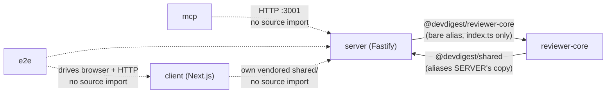

# The graph — internal edges vs external packages, and this repo's real one

## 1. Two different kinds of "depends on"

This repo is **five independent packages, no workspace** (root `CLAUDE.md`) — `client/`,
`server/`, `reviewer-core/`, `e2e/`, `mcp/`, each with its own `package.json` and lockfile.
That one fact is why "dependency" means two different things here, and a report that
conflates them is the single most common way this skill's output goes wrong (its own eval
checks for exactly this):

- **External** — an npm package from `dependencies`/`devDependencies`, resolved through that
  package's own `node_modules`. Ordinary size/version/audit questions apply.
- **Internal** — one package of this repo reading another package's **TypeScript source
  directly**, at build/type-check time, through a `tsconfig.json` path alias. There is no
  `workspace:*` here — never describe an internal edge that way, this repo isn't a monorepo
  and doesn't use pnpm/npm workspaces at all.

Never call these the same kind of dependency in a report. An internal edge can't be
`npm audit`ed, can't be updated with `pnpm up`, and breaks differently — a type mismatch at
compile time, not a version resolution at install time.

## 2. Finding the internal edges: read `tsconfig.json`, don't guess

Every internal edge in this repo is a `compilerOptions.paths` entry. `bash
scripts/dependency-checker/collect.sh` returns each package's `tsconfigPaths` verbatim —
read it as the source of truth, the way `pr-self-review`'s `routing.md` treats `scope.sh` as
the executable copy of its own routing table.

Two shapes matter:

- **A bare alias** (`"@devdigest/reviewer-core": ["../reviewer-core/src/index.ts"]`) resolves
  to exactly one file — the target's declared public entry point. An import through it can't
  reach anything the target didn't choose to export from that file.
- **A wildcard alias** (`"@devdigest/reviewer-core/*": ["../reviewer-core/src/*"]`) resolves
  to *any* file under the target's `src/`. It exists so a deep import is *possible* — whether
  one is actually *used* is a separate grep, and that grep is what decides whether the edge
  is clean or a `P0` (`severity.md` §P0).

## 3. This repo's actual graph, measured



Solid arrows are real internal (source-level) edges — the ones `tsconfig.json` grants.
Dashed arrows are packages that relate only at **runtime** (HTTP, a driven browser) and
share **no** TypeScript source — `mcp/README.md`/`mcp/package.json`'s own description says it
plainly: "Another HTTP client of the API on :3001: no database, no import from server/src."
Never draw a dashed relationship as a solid one — that overstates what actually couples the
two packages, and understates it the other way: a dashed edge still means "changing this API
shape breaks that package," which belongs in the report even though it isn't an internal
edge.

**The one edge worth narrating, not just drawing:** `reviewer-core` aliases `server`'s copy of
`vendor/shared/`, not its own — `../server/src/vendor/shared/index.ts`, verbatim from its
`tsconfig.json`. `server`'s copy is the de-facto source of truth for the whole repo *because*
`reviewer-core` reaches into it directly, which is exactly what root `CLAUDE.md` says: "making
it the de-facto source of truth." A report that draws `reviewer-core → shared` without saying
*which* copy is incomplete — there are two on disk (§below) and this edge is why one of them
matters more.

## 4. The vendored-twice pattern is not duplication — it's the design

`server/src/vendor/shared/` and `client/src/vendor/shared/` are two on-disk copies of the same
contracts, and a naive dependency scan sees two directories with overlapping filenames and
calls it duplication. It isn't: this repo isn't a monorepo, so there is no workspace package
either side could depend on instead, and copying the contracts into each package that needs
them is the deliberate alternative. `pr-self-review`'s own Track A runs a `vendor` gate
specifically because type-checking can't see the two copies drift on its own — each package
only ever compiles against its own copy.

**What to report instead:** whether the two copies currently agree.

```sh
diff -r server/src/vendor/shared client/src/vendor/shared
```

Empty output is an `Info` finding ("the two vendored copies agree, checked <date>"). Any
output is the real `P0`/`P1` — a contract that has already drifted, silently, because nothing
short of this diff would catch it. Never report "two copies exist" as the finding; that's the
architecture working as designed, not a defect in it.

## 5. What this skill does not draw

Module structure *inside* one package — whether a route belongs in `service.ts` or
`repository.ts`, which ring a new file sits in — is `onion-architecture` (backend) and
`frontend-architecture` (frontend)'s question, not this skill's. This skill's graph stops at
the package boundary; it never expands into a single package's internal module graph. If
that's what's wanted, `pnpm exec depcruise src --config -T mermaid --collapse 2` (documented
in `server/.dependency-cruiser.cjs`) already draws it.
