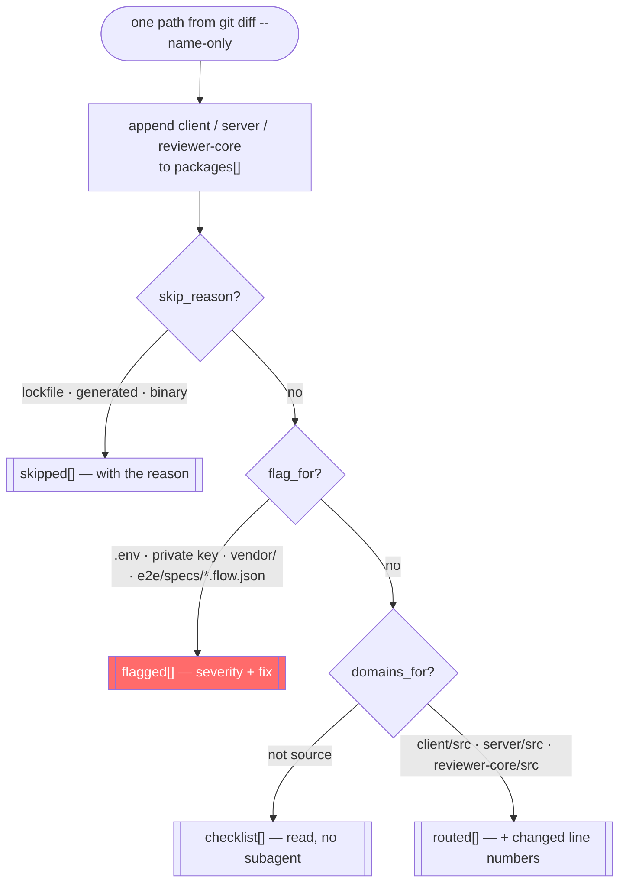
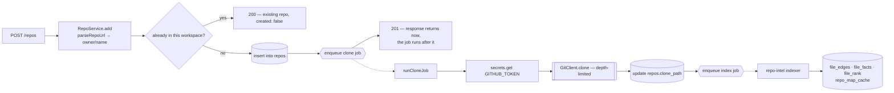
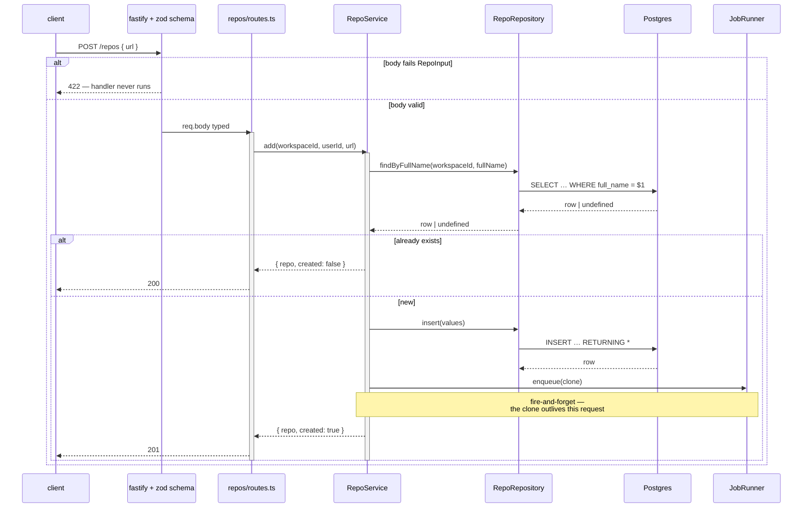
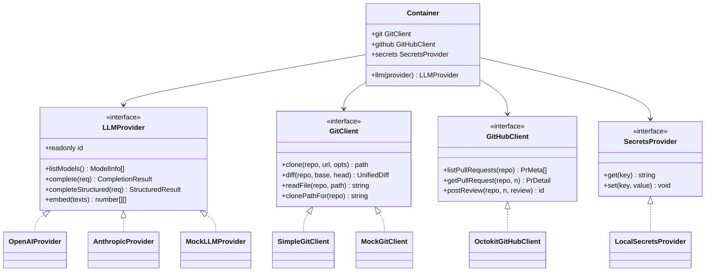
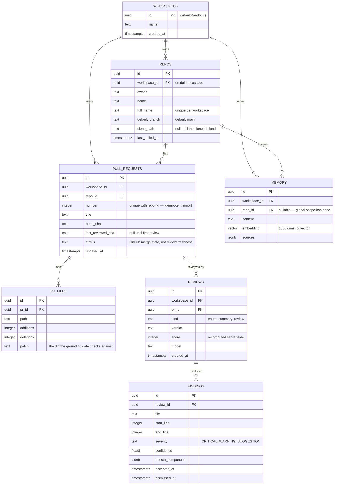
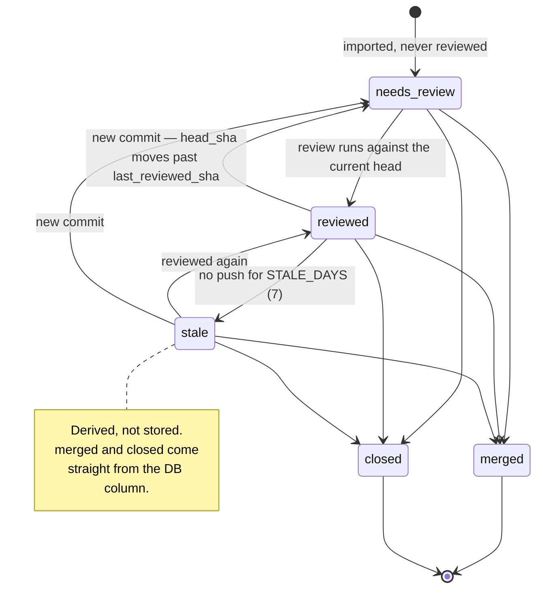
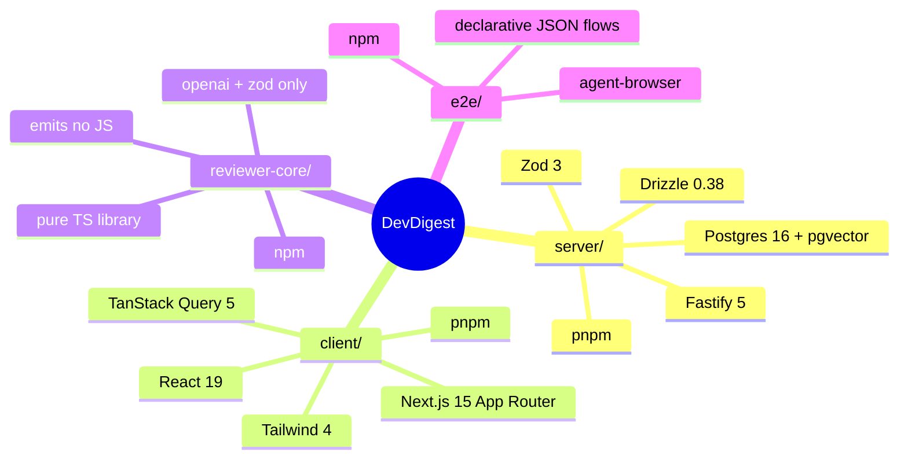

# Mermaid Diagram Examples

Ready-to-use templates, one per diagram type, in the order the Decision Guide in
[`SKILL.md`](SKILL.md) introduces them. Every subject is real code in this repository —
Postgres 16 + pgvector, Fastify 5, Drizzle, Next.js 15 — so a template is a head start, not
something to translate off another stack first.

Each one names the file it was drawn from. When the code moves, re-read that file before
reusing the diagram.

---

## 1. Flowchart — how `scope.sh` classifies one changed path

From `scripts/pr-self-review/scope.sh:190-245`. A branching process with four terminal
buckets, which is exactly what a flowchart is for.

**Why the package is appended first.** The two `continue`s below it exit the loop body, so a
path counted after them would contribute nothing — the bug the comment at `:192-204` records.
A flowchart earns its place when the *order* of steps is the point.

---

## 2. Flowchart — a repository from URL to searchable index

From `server/src/modules/repos/service.ts:86-106` (`add`) and `:51-79` (`runCloneJob`).
Two background jobs chained by `enqueue`, which no sequence diagram would show as clearly.

Dashed edges mean "hands off to a job", not "calls". The response at `F` is already on the
wire while `G` runs.

---

## 3. Sequence Diagram — `POST /repos` through the rings

From `server/src/modules/repos/{routes,service,repository}.ts`. The canonical
`routes → service → repository` shape, with validation ahead of the handler.

`docs/architecture.md:56-75` diagrams the *review* request; this is the shorter one to copy
when the flow is a plain write.

**Note the ring discipline:** the route never talks to `D`. `no-db-from-routes` in
`server/.dependency-cruiser.cjs` fails CI on a diagram that would be honest about doing so.

---

## 4. Class Diagram — ports and their adapters

From `server/src/vendor/shared/adapters.ts` (the interfaces) and `server/src/adapters/**`
(the implementations). Use a class diagram for the *shape* of a boundary — not for tables,
which is what §5 is for.

`Container` points at the **interfaces**, never at the boxes on the right. A diagram with an
arrow from `Container` to `SimpleGitClient` is drawing a violation of `no-service-to-adapter-impl`.
Every port on the left has a mock: that is the rule, not a testing convenience.

---

## 5. ER Diagram — the review tables

From `server/src/db/schema/{core,repos,pulls,reviews,knowledge}.ts`. Column types are the
Postgres ones the migration actually creates, so the diagram can be checked against
`\d+ pull_requests` rather than believed.

Every table carries `workspace_id` because tenancy is resolved at the route and every query
filters on it. Drawing it once per table is noise; drawing it never hides the rule.

---

## 6. State Diagram — review freshness for one PR

From `server/src/modules/pulls/status.ts:129-144` (`deriveReviewStatus`). The DB column holds
GitHub's merge state; three of these five are **derived on read** and are not stored anywhere.

---

## 7. Mindmap — the four packages

From `AGENTS.md` § *Stack*. A mindmap is for a hierarchy with no edges worth naming; the
moment the arrows mean something, use §1 or §3 instead.

---

## What has no template here, and why

**Gantt** and **pie** are in the Decision Guide but have no template in this file. Neither has
a real subject in this repository: there is no dated schedule to chart, and no measured
distribution to slice. Inventing plausible numbers for a diagram is the same failure as
seeding fake rows to make a screen look fuller — the picture reads as evidence and is not.

Syntax for both is in [`SKILL.md`](SKILL.md); bring your own real numbers.
