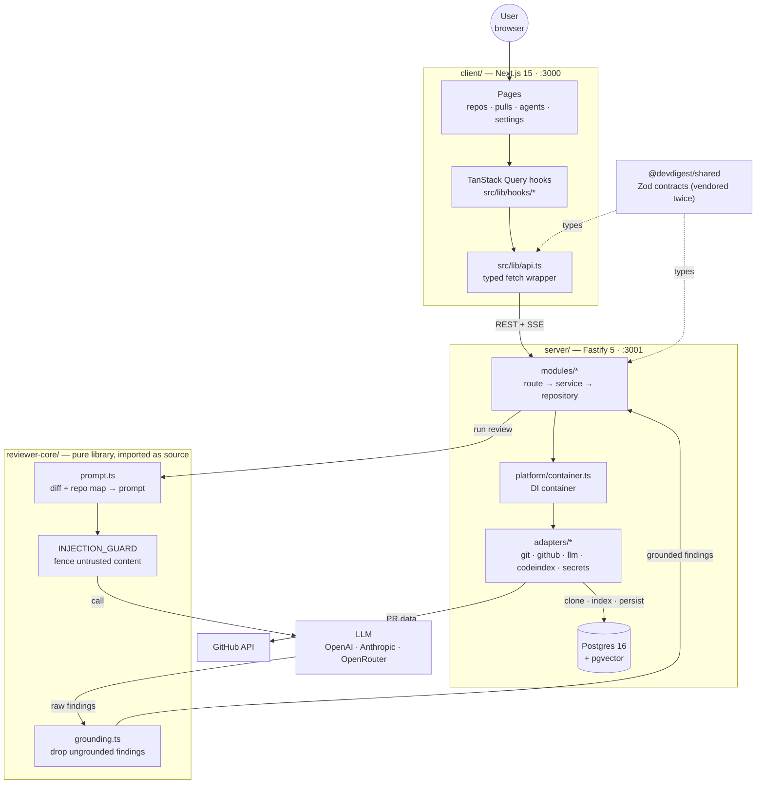
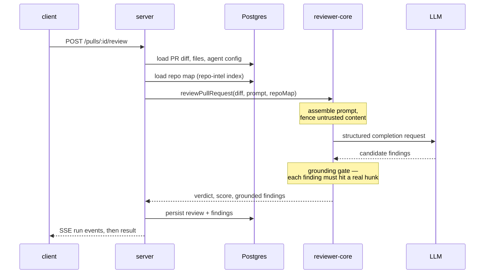

# Architecture

How the packages talk to each other, and how a review is produced end to end.

For the conventions that govern editing each package, read its `AGENTS.md` (start at
[`../AGENTS.md`](../AGENTS.md)). This file explains the *shape* of the system; it is not
a place for rules.

## Package topology

`reviewer-core` is **not** a service. The server imports its TypeScript source directly
through a tsconfig path alias, so the "run review" edge above is a function call, not a
network hop.

## A review request, step by step

The grounding gate is the load-bearing part: a finding that references a line the diff
does not contain is dropped before it is ever persisted. `FULL_FILE_KINDS` in
`reviewer-core/src/grounding.ts` carves out the kinds that legitimately are not
line-anchored (`secret_leak`, `lethal_trifecta`, `phantom`, `hook`).

The model's self-reported score is discarded and recomputed server-side — see
[`../server/README.md`](../server/README.md).

## Where review context comes from

Adding a repository triggers a clone into `server/clones/` (git-ignored runtime data),
then `server/src/modules/repo-intel` indexes symbols and the import graph into
`file_edges`, `file_facts`, `file_rank` and `repo_map_cache`. That index is the "repo
map" the prompt is built from, and it is what the **Indexed** badge in the UI reflects.

The same index feeds `modules/conventions`, which reads the repo's configs and its
highest-ranked files, asks one cheap model for the house rules they follow, and then
verifies every quote against the clone before storing it. Accepted candidates are
merged into a skill on the Conventions screen and saved through `POST /skills`, so
what starts as an observation about the codebase ends up in the review prompt through
the same slot every other skill uses.
