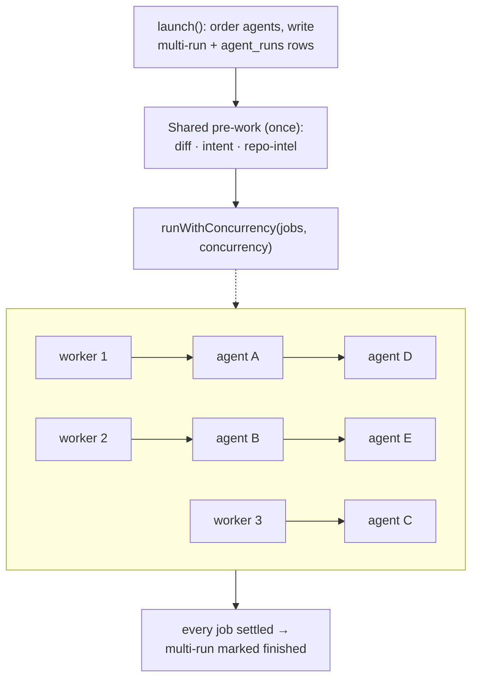

# Multi-agent review

A single-agent review runs one agent against one PR. A multi-agent run does the
same PR against several agents at once, streams each into its own column, and
adds one thing a single run has no use for: a place to see where the agents
disagree. This note explains what changed to make that possible and what the
fan-out actually costs and buys, in wall-clock time, measured against real
runs.

It assumes the single-run review already makes sense — see
[`architecture.md`](architecture.md) for the diff → prompt → engine → persisted
review path both share.

## What one launch does

`MultiRunService.launch` (`server/src/modules/reviews/multi-run-service.ts:162`)
is the entry point. Given a PR and a set of agents, it:

1. Orders the agents once, before anything is persisted: `createdAt asc, then
   name asc` — the same order `AgentsRepository.list` already returns
   (`multi-run-service.ts:175-181`). This is the one order every surface reads
   back: the stored `position`, the columns, the tabs and the conflict takes
   all agree with each other because none of them re-derives it.
2. Writes the multi-run row and one `agent_runs` row per agent, in that order,
   in a single transaction (`multi-run-service.ts:183-198`).
3. Fires the fan-out without waiting for it — the request returns the run ids
   the client subscribes to, and each run persists as it finishes
   (`multi-run-service.ts:206-214`).

## The fan-out mechanism

Everything below `launch` runs through the same `ReviewRunExecutor.executeRuns`
a single-agent review already used
(`server/src/modules/reviews/run-executor.ts:118-249`); a multi-run is not a
parallel code path bolted alongside it, it is the same one called with more
jobs and a wider door.

**Shared pre-work runs once for the whole set, not once per agent.** Loading
the PR diff, deriving its intent, and building the repo-intel context all
happen before any agent's job starts (`run-executor.ts:169-227`), and the
result is handed to every job as one `BatchContext`. Three agents no longer
mean three identical diff loads and three identical intent derivations — one
`RunLogger` fans the same pre-work log lines out to every run's Live Log
(`run-executor.ts:130-134`). A pre-work failure fails every queued run through
`failAll`, with the same reason, rather than leaving the pool to pick off jobs
that were doomed before they started (`run-executor.ts:181-233`).

**The door is a bounded worker pool, not `Promise.all`.**
`runWithConcurrency` (`server/src/modules/reviews/helpers.ts:404-422`) walks a
shared cursor across `N` workers; each worker pulls the next item and moves on
when it settles. The limit comes from one call site each:

- A single-agent review — the PR page's review button and `POST
  /reviews/diff` — passes no `concurrency`, which defaults to `1`
  (`run-executor.ts:150-152`). One job, one worker: the pre-existing
  single-run path is unchanged by any of this.
- `MultiRunService.launch` passes `DEFAULT_MULTI_RUN_CONCURRENCY`
  (`multi-run-service.ts:190`), a single constant in the vendored contract
  (`server/src/vendor/shared/contracts/platform.ts:417`) currently `3`. The
  number is also stored on the multi-run row and is what the results page
  prints, so a run made under a different ceiling is never redescribed by
  today's default.

**A per-agent failure stays inside its own job.** `runJob` owns its own
`try`/`catch` around one agent's claim-and-run (`multi-run-service.ts:210-260`
onward); a rejection there does not stop the pool from draining the rest.
Cancellation is checked at the same point: a queued row can lose its claim
between being enqueued and a worker reaching it, and `startAgentRun` returning
false means "run anyway" is exactly what would bill for an agent nobody
wanted.

## Where agents disagree

`buildConflicts` (`server/src/modules/reviews/conflicts.ts:169`) is a pure
function over one multi-run's findings — no model call, no I/O, no clock. For
each file, it groups findings from runs that reached `done` into positions:
two findings are `related` when they sit on the same file, their line ranges
intersect, and either their category matches or their titles are similar
enough (Jaccard ≥ `DEFAULT_TITLE_SIMILARITY`, `conflicts.ts:19-23`). Grouping
is done per file by union-find (`componentsWithinFile`,
`conflicts.ts:143-166`), which turns what would be a quadratic scan over every
finding into a quadratic scan over each file's findings only.

Every connected component becomes one position, including a position only one
agent touched — a single `SUGGESTION` next to four silent agents is shown
rather than dropped, deliberately (`conflicts.ts:225-236`). Within a position,
the take shown as the "winner" is picked by a fixed total order: severity
first, then confidence, then earliest line, then finding id
(`heavier`/`heaviestOf`, `conflicts.ts:120-132`). A run that never reached
`done` contributes no findings to any position, so its column reads
`not_reviewed` instead of silently agreeing or disagreeing.

## The client: two densities over one column list

Everything under
`client/src/app/repos/[repoId]/multi-agent/` is colocated: a landing view, a
two-step `configure/` flow (pick a PR, then pick agents), and the run view
itself under `[multiRunId]/`.

`MultiRunView.tsx` computes one array of columns —
`liveColumns(serverColumns, streams)`
(`.../[multiRunId]/_components/MultiRunView/MultiRunView.tsx:113-116`,
`helpers.ts:127`) — merging the server-read state with what the run's SSE
streams have said since. That one array feeds both densities that read the
`?view` URL param: `ColumnsView` (side-by-side) and `TabsView` (one agent at a
time), plus the disagreement section under either
(`MultiRunView.tsx:244-256`). Neither density derives its own copy of run
state, so a column's status cannot read differently depending on which one is
open.

The page opens live SSE streams for only the non-terminal runs, up to four at
once, and does not poll: a terminal state comes back through the same
`refetch` the stream's `onRunClosed` triggers
(`MultiRunView.tsx:79-107`).

## What the fan-out bought, measured

The numbers below are pulled from the dev database, joining every
`multi_agent_runs` row that has a `finished_at` to its `agent_runs`.
*Sequential* is the sum of each run's own `duration_ms` — what running the
same agents one after another would have cost. *Wall* is the observed
`finished_at - ran_at` for the multi-run as a whole. Every run below used
`concurrency = 3`, the current default.

| agents | runs | median speedup | min | max | wall total | sequential total |
|---|---|---|---|---|---|---|
| 1 | 1 | 0.85× | — | — | 39 s | 33 s |
| 3 | 3 | 2.16× | 1.49× | 2.36× | 321 s | 608 s |
| 5 | 15 | 2.37× | 1.67× | 2.64× | 2455 s | 5609 s |

Three qualifications this table needs to be read honestly:

- **The one-agent row reads below 1.0×, and that is not a defect.** With one
  agent there is nothing to overlap, and the wall-clock figure still includes
  the shared pre-work step that no agent's own `duration_ms` counts — about
  six seconds of it in this sample. The comparison only means something from
  two agents up; one agent is the floor it starts from.
- **At five agents under a concurrency of three, the fan-out is two waves**
  (three agents, then two), so the ceiling is roughly 2.5× if every agent took
  the same time. The observed 2.37× median sits close to that ceiling — it is
  the pool working close to as well as it can at this width, not an
  open-ended win that keeps climbing with more agents.
- **"Sequential" here is inferred, not observed.** There is no
  `concurrency = 1` multi-run in this data to compare against directly. The
  inference holds because the pre-work is shared and each agent's own
  duration is measured independently of the others, but it is a computed
  number, not a second stopwatch run.

Across the eighteen runs of two agents or more, wall-clock totalled 2776 s
against 6217 s summed sequentially — about 57 minutes saved in this sample.
