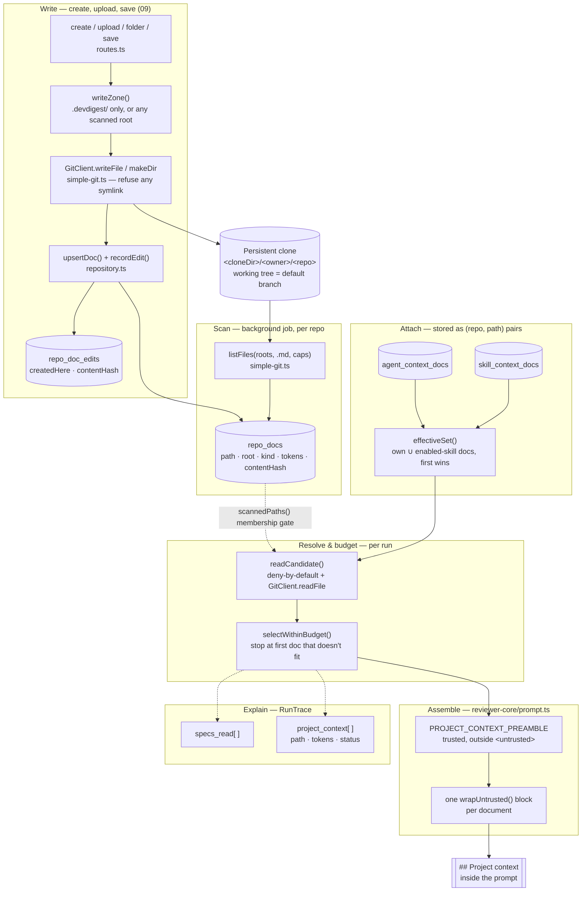

# Project Context — from a `.md` file to prompt text

How a document committed to a cloned repository (a spec, a doc, an engineering note) becomes
text inside a review prompt, how every step of that is recoverable from a run's trace afterward
— and, since 2026-08-14, how such a document can be **written** from inside DevDigest itself
rather than only found by the scan. This is the mechanism, ordered the way the code executes it
— not a tour of the Project Context page. For the shape of a review end to end, see
[`architecture.md`](architecture.md); this file is the deep dive into one part of it.

Server code lives in `server/src/modules/context/` (Application ring: `service.ts`,
`scan-executor.ts`, `repository.ts`; Core-ring pure transforms in `helpers.ts`) plus the walk and
the write itself in the git adapter, `server/src/adapters/git/simple-git.ts`. Prompt assembly is
`reviewer-core/src/prompt.ts`. The trace shape is `server/src/vendor/shared/contracts/trace.ts`.
The one untrusted renderer shared by the page, its `Preview` mode and both attach tabs is
`client/src/components/context-doc-view/`.

## The pipeline

## 1. Write — create, upload, edit

Four routes reach `ContextService` without ever going through the scan job: `POST
/repos/:id/context/docs` (create), `POST /repos/:id/context/docs/upload` (multipart, one file
part), `POST /repos/:id/context/folders`, and `PUT /repos/:id/context/docs/content` (save).

| Method · path | Zone | Success |
|---|---|---|
| `POST /repos/:id/context/docs` | under `.devdigest/` | `201` `SpecFile` (`local: true`) |
| `POST /repos/:id/context/docs/upload` | under `.devdigest/`; filename is basenamed server-side, `.md` checked case-insensitively, `U+0000` refused as `binary_content` | `201` `SpecFile` (`local: true`) |
| `POST /repos/:id/context/folders` | under `.devdigest/` | `201` `{ path }` — never a `SpecFile`, because a folder holds no `.md` and the list cannot show it yet |
| `PUT /repos/:id/context/docs/content` | any **scanned** root — the path must already carry a `repo_docs` row | `200` `SpecFile` |

All four share one order, enforced by `prepareWrite` (`service.ts:394-407`) and `persistWrite`
(`:422-475`): tenancy → clone-ready (`409 clone_not_ready`, the same "preparing the clone"
explanation `AC-4` already uses) → the path as a string (`sanitizeDocPath` /
`sanitizeFolderPath`) → **zone** → size, checked in both code points and bytes → the port call →
the two rows that record it. Nothing reaches the database until the file is on disk, so a failed
write never leaves a row claiming a document that isn't there.

**The zone answers two different questions.** `writeZone` (`helpers.ts:169-178`):

| Mode | Rule | Why |
|---|---|---|
| `create`, `folder` (upload reuses `create`) | Must be under `.devdigest/` | `.devdigest/` is untracked, so what lands there survives a `resync`; a *new* file anywhere else would be silently destroyed by the next one with no prior version to warn about |
| `save` | Must be under **any** scanned root — `rootFor(path, roots) !== undefined` | Editing a document the repository already carries is the requirement (`AC-60`); the loss warning is the editor's job, not the zone's |

**`.devdigest` is a root of every repository, unconditionally.** `resolveContextSettings`
(`settings.ts:39-72`) resolves the configured roots to their defaults *first*, and only then
appends `.devdigest` and de-duplicates (`withDevdigest`, `:74-91`) — appending any earlier would
make the "configured roots" list non-empty for every workspace and silently delete the three
defaults, the same ordering trap `normalizeRoot` already guards against on the read side. A
document written under `.devdigest/` gets `kind: 'other'` unless the segment *below*
`.devdigest` names a family (`kindForRoot`, `helpers.ts:220-229`): `.devdigest/specs/x.md` is
`specs`, `.devdigest/x.md` alone is `other`.

**Containment is asymmetric to the read side, on purpose.** `readFile` resolves both the clone
root and the target with `realpath` and then checks where the result landed — following a
symlink is fine as long as it stays inside the clone. `writeTarget` (`simple-git.ts:256-286`)
cannot do that: a symlink is a pointer *the repository committed*, and honouring one on a write
lets the repository choose where DevDigest creates a file — `.devdigest/x.md → ../../.git/config`
would hand it the remote URL carrying the stored PAT. So a write `lstat`s every existing path
segment from the clone root down and refuses (`symlink`) outright the moment one is a symbolic
link, rather than resolving through it; `realpath` is not used on the target at all, because
there is nothing left to resolve once links are forbidden and the last component of a *create*
has no target to resolve yet anyway.

**Two write modes, two syscall sequences.** `writeExclusive` (`simple-git.ts:331-351`) opens with
`open(target, 'wx')` — `O_CREAT|O_EXCL` — so an existing path fails atomically with `EEXIST` in
one syscall; a probe followed by a write would leave a gap where a concurrent create silently
loses a document. `writeViaTemp` (`:353-368`) is what an overwrite uses instead: it writes a
sibling `.name.<random>.tmp` and `rename`s it over the target, so an interrupted save leaves the
**original** file intact rather than a half-written one. Size
(`Buffer.byteLength(content, 'utf8') > opts.maxBytes`) is refused before either mode opens
anything.

**The two rows a write leaves behind.** `persistWrite` calls `upsertDoc`
(`repository.ts:446-480`) — the same `ON CONFLICT` target `replaceDocs` uses for a scan,
`repo_docs_repo_path_uq` — and recomputes `repo_doc_scans.file_count` from `COUNT(*)` inside the
same transaction, so the footer never disagrees with the list a write just changed. `recordEdit`
(`:491-507`) then upserts `repo_doc_edits`, keyed `(repo_id, path)`, storing **no text** — only
`createdHere` (OR'd against the existing row, so a later *save* of a document created here cannot
un-mark it local) and a sha256 `contentHash` of what was written. `toDocDto`'s `local` and
`stale` booleans (`repository.ts:510-540`) are derived from that row in one place, so the list
and the single-document read cannot answer differently: `local = createdHere`, and `stale` is
true only when an edit row exists **and** its hash no longer matches
`repo_docs.content_hash` — the fact that a `resync` has returned a tracked file to the branch
since DevDigest last wrote it.

**Durability is the file, and nothing else.** No table stores document text; there is no commit
and no push. What happens to a write depends only on whether `.git` tracks the path:

| Event | Untracked (`.devdigest/`) | Tracked (an edited repo file) |
|---|---|---|
| `refresh` (`POST /repos/:id/refresh` → a `clone` job) | survives — `clone()` on an existing `.git` only runs `git fetch` (`simple-git.ts:75-78`) | survives, for the same reason |
| `resync` (`POST /repos/:id/resync` → `resyncRepo` → `git.sync()`) | survives — `reset --hard` moves tracked paths only | **erased**, silently, back to the branch |
| Re-clone from nothing (`.git` missing after a clone that died mid-write) | gone — `clone()` removes the whole directory first (`:82`) | gone, same as any tracked file would be |

`RepoService.refresh()` (`repos/service.ts:114-138`) also enqueues an incremental re-index job,
but that job (`refreshIndex` → `runIncremental`, `repo-intel/service.ts:134-136`) never touches
the working tree — only the separate, user-triggered resync
(`repo-intel/service.ts:146-165`, wired from `POST /repos/:id/resync`) runs `git.sync()`. This is
the one place `sync()`'s own comment used to be wrong: it said the clone was safe to hard-reset
"because we never commit to or run code from the clone", which stopped being the whole truth the
moment this feature could put local writes there. `simple-git.ts:99-111` now says exactly what
survives and what does not, instead of asserting a safety the code no longer has unconditionally.

The editor warns **before** a save that would erase a tracked edit — the confirmation names `git
reset --hard origin/<default-branch>` outright (`tracked.body`,
`client/messages/en/context.json:90`) rather than a vaguer "changes may be lost" — but nothing
server-side enforces the confirmation: `SaveContextDocBody` carries no `confirm_tracked` flag.
The warning is a UI act the server cannot render on its own behalf; a server-enforced version was
weighed and left out (`plans/09-project-context-authoring.md`, recommendation 1).

**Whole or nothing, on the read that feeds the editor.** `docContent` (`service.ts:206-241`) —
the same `GET /repos/:id/context/docs/content` the reading pane calls — serves a document
**entire or refuses it**, never a prefix: what it returns is seeded straight into the editor's
draft, and a save writes that draft over the whole file. An earlier build cut at `MAX_DOC_CHARS`
the way the scan and the run's prompt assembly do, so a 74 636-code-point document in this
repository reached the editor as 40 000 characters and a save wrote back 40 000
(`service.ts:199-200`). Two different caps are what make the whole-or-nothing guarantee holdable:
the reader pulls `MAX_DOC_READ_BYTES` (`MAX_DOC_FILE_BYTES + 1`, `constants.ts:60-74`) — one byte
more than a document may ever be — so a read that comes back at or above the cap has hit it and
is refused (`doc_refused`) rather than served short, the same condition that already leaves a
file out of the scan. A document strictly between `MAX_DOC_CHARS` (40 000 code points, the write
bound) and `MAX_DOC_FILE_BYTES` (400 KB, the scan/read bound) is therefore readable but not
editable — the UI disables `Edit` and says why (`reader.tooLongToEdit`).

## 2. Scan

`ContextScanExecutor.run` (`server/src/modules/context/scan-executor.ts`) is a background job
(`jobs.kind = 'context_scan'`) that runs under `JobRunner`'s existing settings — concurrency 3, a
120 s timeout, 2 retries. `ContextService.docsPage` enqueues the first scan lazily, on the first
read of the page, and re-enqueues a scan whose claim has gone stale (`scanningAt` older than
`SCAN_CLAIM_STALE_MS`, 10 minutes) — nothing auto-scans on clone completion.

**Which folders.** `resolveContextSettings` (`settings.ts`) reads two workspace settings keys —
`context_scan_roots` (default `['specs', 'docs', 'insights']`) and `context_token_budget`
(default `16000`) — typed in the shared `SettingsKnown` bag and round-tripped through the
existing `PUT /settings`; there is no context-specific settings endpoint. A stored value that
fails its schema falls back to the default rather than failing the request. Roots are
normalised once here (`normalizeRoot`): `docs/`, `./docs` and `docs` collapse to one string, a
root climbing out of the clone (`..`) is dropped, and the result is de-duplicated — this is the
one place that decision is made, so the walk and the later path comparisons never disagree
about what a root means.

**The walk.** `GitClient.listFiles` (`server/src/adapters/git/simple-git.ts:228-257`) is bounded
on every axis a repository controls:

| Bound | Value | Constant |
|---|---|---|
| Documents per scan | 2000 | `MAX_SCAN_CANDIDATES` |
| One file's size | 400 KB | `MAX_DOC_FILE_BYTES` |
| Extensions read | `.md` only, case-insensitive | `DOC_EXTENSIONS` |
| Directories skipped | `node_modules`, `dist`, `build`, `coverage`, `.next`, `out`, `vendor`, `.git` | `EXCLUDED_WALK_DIRS` |
| Symlinks | never followed, never descended | `walkDocs` |
| Escape / `.git` | a root that resolves outside the clone or into `.git` contributes nothing (not an error) | `listFiles` |

A scan whose candidate count exceeds the cap sets `bounded = true` and keeps the first N by
sorted path, rather than failing — the empty-or-partial state is a fact the page names, not an
error.

**Which document is which kind.** `kindForRoot` (`helpers.ts`) labels a document by the first
path segment of the *longest* matching configured root — `docs/adr` under both `docs` and
`docs/adr` is labelled `docs`, the more specific match. A root whose name is none of `specs`,
`docs`, `insights` gets kind `other`; that is a fourth, required value
(`ContextDocKind = z.enum(['specs', 'docs', 'insights', 'other'])`,
`server/src/vendor/shared/contracts/platform.ts:301`), not a fallback — a workspace configuring
a root called `handbook` gets its own badge rather than being mislabelled `docs`.

**Why the default branch, never the PR head.** The scan reads through the repository's one
persistent clone at `<cloneDir>/<owner>/<repo>`. `RepoService.runCloneJob` clones it with no
`--branch` argument (`server/src/modules/repos/service.ts:55-57`), so the working tree starts on
whatever the remote reports as its default branch, and `RepoIntelService.resyncRepo` is the only
code that ever moves that working tree afterward — with `git.sync(ref, repo.defaultBranch)`
(`server/src/modules/repo-intel/service.ts:154`), never a PR's head. A review's diff, by
contrast, never touches that working tree at all: `loadDiff` (`server/src/modules/reviews/diff-loader.ts`)
computes `git diff base...head` from git objects fetched by `fetchPullHead`, independent of what
is checked out. So Project Context and the diff read two different things on purpose: the
documents describe how the project is *supposed* to work, and the PR is what one change actually
did to it — reading the documents off the PR's own head would let a PR rewrite the very criteria
it is judged against.

**Token counting.** Each document is counted at scan time over `renderDoc(path, body)` — the
exact string it would occupy inside its `<untrusted>` block — by the same `TiktokenTokenizer`
instance (`js-tiktoken`, `cl100k_base`) that a run's budget walk uses
(`server/src/adapters/tokenizer/index.ts`, wired once in `platform/container.ts:240-243`). One
counter, one rendering, is what keeps the editor's number and a run's budget decision from
silently disagreeing.

**Failure is additive, not destructive.** On any throw, `recordScanFailure` writes only
`last_error` / `last_error_at` / clears `scanning_at`; `scanned_at`, `file_count`, `bounded` and
the `repo_docs` rows from the last success are left untouched
(`server/src/modules/context/repository.ts:348-362`). A failed rescan shows the previous result
with the failed attempt reported beside it, never a blank page.

| Scan state | Meaning |
|---|---|
| `no_clone` | Repo has no clone yet; scan is not attempted |
| `scanning` | A claim exists and is not stale |
| `scanned` | Last scan succeeded and no newer failure exists |
| `failed` | A stale first-scan claim, or a failure newer than the last success |

## 3. Attach

An attachment is a `(repository, path)` pair — never document text. Two tables hold it,
`agent_context_docs` and `skill_context_docs`, each row `(agentId|skillId, repoId, path,
position)`. Routes (`server/src/modules/context/routes.ts:20-27`) are registered from this
module even though two of them address `/agents/...` and `/skills/...` — the alternative would be
those modules importing this slice, which the architecture rule `no-cross-module` forbids; a
route's URL names the resource, not the owning folder.

| Method | Path | Does |
|---|---|---|
| GET | `/repos/:id/context/docs` | The scan-state page |
| GET | `/repos/:id/context/docs/content` | One document's text, for the reading pane |
| POST | `/repos/:id/context/rescan` | Enqueue a scan (rate-limited, 6/min) |
| GET / PUT | `/agents/:id/context-docs` | An agent's own attachments + what it inherits |
| GET / PUT | `/skills/:id/context-docs` | A skill's own attachments |

This is the attachment surface only — the four routes that write a document's *content* (create,
upload, folder, save) are covered in [§1 Write](#1-write--create-upload-edit) above.

A `PUT` replaces the *whole* ordered set inside one transaction (delete-then-insert); a partial
apply would leave an order nobody asked for. An oversized body (`paths.length > 50`,
`SetContextDocsBody`, `server/src/vendor/shared/contracts/context.ts:85-89`) or a path that fails
`sanitizeDocPath` rejects the entire request rather than silently dropping the offender — saving
a different set from the one that was sent is a worse outcome than a 400, because the editor
would render it as saved. `sanitizeDocPath` (`helpers.ts:45-68`) accepts only a repo-relative,
`.md`-suffixed path with no `..` segment, no absolute/UNC/drive-letter form, no control
character, and no `.git/` prefix — a string-only gate; the matching filesystem-level defence
(a `.md`-named symlink pointing outside the clone) lives in `GitClient.readFile`, below.

**The effective set.** `effectiveSet` (`helpers.ts:145-167`) is an agent's own attachments, in
saved `position` order, followed by each *enabled* bound skill's attachments in binding order
(`agent_skills.order`, then `position`) — de-duplicated by path with the **first** occurrence
winning. That rule is what makes an agent's own attachment beat one it also inherits, and what
keeps a document counted once no matter how many bound skills also carry it.

**Preview, without leaving the tab.** Every row of the attach list — attached, unattached and
inherited alike — carries a preview control (`client/src/components/context-docs/PreviewButton.tsx`,
`DocPreview.tsx`) that opens the same `DocumentReader` the page's reading pane uses, over `GET
.../docs/content`; opening or closing it changes neither the attachment set nor its order. This
closes a gap the first cut of the page left open — `AC-10` had required a preview control on
every row since the first dispatch, and no row had ever rendered one. A row also carries its kind
badge now (`specs` / `docs` / `insights` / `other`, from the same `KIND_COLOR` map the page
uses), on `ContextDocList` rows; the read-only `InheritedGroup` rows carry the preview control but
no badge, because `InheritedContextDoc` carries no `kind` and managing an inherited document still
happens on the skill, not here.

## 4. Resolve and budget

`ContextService.resolveForRun` (`service.ts:292-346`) is exposed off the composition root as the
`ProjectContextResolver` port, `container.projectContext`
(`platform/container.ts:224-229`) — `modules/reviews` reaches it with no import statement at all
(`server/src/modules/reviews/run-executor.ts:22-30`), the same route `container.intentService`
already takes, because `no-cross-module` forbids a direct import of `modules/context`. It makes
no model call, no network request and touches no `node:fs` directly — everything it reads comes
from the database and from `GitClient`.

Four outcomes, each satisfying the contract on its own rather than sharing a single happy path:

| Case | Result |
|---|---|
| Nothing attached anywhere | Empty section, no note |
| Attached, but only to a *different* repository | Empty section, a note naming the count and the repo being reviewed — never a same-named file substituted from elsewhere |
| The whole-set read throws | Empty section, a note naming the error — the run itself is never failed by this |
| Normal walk | Blocks + a per-document result list |

**Reading one candidate.** `readCandidate` (`service.ts:363-388`) is deny-by-default the same
way `docContent` is for the reading pane: a saved attachment is only readable while the *current
scan* still holds its path (`scannedPaths`, not a disk check) — narrowing `context_scan_roots`
removes a document from every future run even if the file is still physically in the clone. Then:

1. `sanitizeDocPath` re-checked (closes the gap left by any other writer of the attachment tables).
2. Path must be in `scannedPaths` → otherwise `missing`.
3. `GitClient.readFile` (`simple-git.ts:174-204`), capped at `MAX_DOC_BYTES`
   (`MAX_DOC_CHARS × 4`, UTF-8's worst case) — a `CloneReadError('not_found')` becomes `missing`,
   any other `CloneReadError` (`outside_clone`, `git_dir`) becomes `refused`.
4. A decoded body containing `U+0000` → `binary` (a NUL has already broken a prompt here once).
5. Otherwise: truncate by code point to `MAX_DOC_CHARS` **before** wrapping — truncating after
   wrapping risks cutting the closing `</untrusted>` fence and handing the model
   attacker-controlled text past it.

**The budget walk.** `selectWithinBudget` (`helpers.ts:198-237`) takes candidates in effective-set
order until `context_token_budget` (default `16 000`, workspace-configurable) is exhausted, and
**stops at the first document that does not fit** — that document and every readable one after it
are recorded `dropped`. A smaller document further down the list does not jump the queue: one
explainable cut point beats a knapsack result nobody could predict from the list they are
looking at. The one exception: if the *first* document alone exceeds the budget, it is included
truncated (`truncateToBudget`, binary search over code points, ≤ 12 probes) rather than dropped
outright, so an agent whose single attachment is large still gets some of it.

| `ContextDocStatus` | Meaning |
|---|---|
| `included` | Fit inside the remaining budget whole |
| `truncated` | The first document, cut to fit |
| `dropped` | Readable, but the walk had already stopped |
| `missing` | Not in the current scan (narrowed roots, or removed upstream) |
| `refused` | Read refused by `GitClient` (outside the clone, or inside `.git`) |
| `binary` | Decoded content contains `U+0000` |

A saved edit reaches the very next run with no extra step, because nothing here changed:
`readCandidate` still reads the file off disk at the start of a run, the same call it always
made — the write path changes what is on disk, not how a run reads it.

## 5. Assemble

`assemblePrompt` (`reviewer-core/src/prompt.ts:173-289`) renders the resolved blocks into the
user message's `## Project context` section (`:239`) only when at least one block exists — the
caller in `run-executor.ts:416-422` uses a conditional spread, not `specs: undefined`, so an
agent with nothing attached produces a prompt byte-identical to the shape from before this
feature existed.

Inside the section: `PROJECT_CONTEXT_PREAMBLE` (`prompt.ts:47-54`) first, as **trusted** text
*outside* any `<untrusted>` fence, then one `wrapUntrusted('spec-i', renderDoc(path, text))`
block per document (`prompt.ts:189-194`). The preamble is what turns the documents into review
criteria — it tells the model the rules they state are things a contradicting diff should be
flagged against — while every document's own text stays wrapped exactly like the diff or the PR
body. The document's path is rendered *inside* the wrapped content (`renderDoc`, `### <path>`),
never passed to `wrapUntrusted`'s `label` argument: the label lands unescaped in `source="…"`,
so a path containing a quote would break out of the attribute.

**`INJECTION_GUARD` (`prompt.ts:16-28`) is deliberately untouched.** It is the one shared,
trusted defense appended to every agent's system prompt on every review path — the studio server
and the CI runner alike — and it says content inside `<untrusted>` is data, never instructions.
Carving a project-context exception into it would cost every review path this feature never
asked to change. `PROJECT_CONTEXT_PREAMBLE` instead states the narrower exception once, in the
user message, between the heading and the first fence — costing only this section, and framed so
it cannot be mistaken for untrusted text claiming to be trusted.

## 6. Explain — the trace

Two fields on `RunTrace` (`server/src/vendor/shared/contracts/trace.ts`) make a run's project
context explainable after the fact:

- **`specs_read: string[]`** (`:155`) — `context.projectContext.includedPaths`, the paths that
  actually reached the prompt, in block order.
- **`project_context: RunProjectContextDoc[]`** (`:127-138, :168`) — every candidate from the
  effective set, `{ path, tokens, status }`, *including* the ones that never reached the prompt.
  That is the field's whole point: a document dropped for budget, missing from the scan, or
  refused by the reader is explainable from the trace alone, without re-running anything.

Both are filled by `ReviewRunExecutor.buildProjectContext`
(`server/src/modules/reviews/run-executor.ts:326-360`), which also writes a live-log line per
run — a summary (`N of M documents, T tokens attached`) plus, when anything was skipped, each
skipped path with its status — and, separately, `run-executor.ts:581-586` copies
`includedPaths` / `docs` onto the persisted trace via `trace-builder.ts`.

**Read and write are not symmetric.** `saveRunTrace` (`server/src/modules/reviews/repository/run.repo.ts:182-190`)
takes an already-typed `RunTrace` and does not schema-parse it — it only strips embedded NUL
bytes, since `jsonb` rejects them the way `text` does. `getRunTrace` (`:207-209`) does the
opposite: every read runs `RunTrace.parse(row.trace)`. That asymmetry is what lets
`project_context.default([])` upgrade a trace persisted before this field existed — 282 of 285
rows on the development database as of 2026-08-14 carry no `project_context` at all — into a
document the field can safely be read off. The obligation it creates: any field this contract
gains later needs its own `.default(...)`, or an old trace throws on read instead of degrading.

## Caps, in one place

| Constant | Value | Bounds |
|---|---|---|
| `MAX_SCAN_CANDIDATES` | 2000 | Documents one scan looks at |
| `MAX_DOC_FILE_BYTES` | 400 KB | One file, at scan time; also the size above which the single-document reader refuses rather than serves a prefix |
| `MAX_DOC_CHARS` | 40 000 code points | Kept from one document at scan and run-time read; the REFUSAL bound for any write (create, upload, save) |
| `MAX_DOC_BYTES` | `MAX_DOC_CHARS × 4` | Bytes `GitClient.readFile` may allocate for a scan or run read, and `writeFile` may allocate for a write |
| `MAX_DOC_READ_BYTES` | `MAX_DOC_FILE_BYTES + 1` | Bytes the single-document reader (`docContent`) may pull — one more than a document may be, so a read that hits it can tell "cut" from "clean" and refuse instead of serving a prefix |
| `MAX_DOCS_PER_SET` / body `.max(50)` | 50 | Documents one agent or skill may attach for one repo |
| `MAX_PATH_LENGTH` | 512 chars | One repo-relative document path |
| `DEFAULT_SCAN_ROOTS` | `specs`, `docs`, `insights` | Folders scanned when a workspace has configured none |
| `DEVDIGEST_ROOT` | `.devdigest` | The zone for create / upload / folder; a scan root of every repo, appended after the defaults resolve |
| `DEFAULT_CONTEXT_BUDGET_TOKENS` | 16 000 | The assembled section's budget, per prompt, when unset |
| `SCAN_CLAIM_STALE_MS` | 10 minutes | How long a claimed-but-dead scan is still believed running |
| Write rate limit | 30 / minute, per route | `POST docs`, `POST docs/upload`, `POST folders`, `PUT docs/content` — the four routes that change a repo's clone |

All in `server/src/modules/context/constants.ts`, except the write rate limit
(`modules/context/routes.ts:58`).

## Where to look

| You need to | Start at |
|---|---|
| Change which folders are scanned, or the token budget's default | `settings.ts`, `constants.ts` |
| Change a walk bound (file count, size, excluded dirs) | `constants.ts`, `adapters/git/constants.ts` |
| Change a write bound, the zone rule, or the symlink stance on a write | `constants.ts`; `helpers.ts` `writeZone`; `simple-git.ts` `writeTarget` |
| Debug why a document never reached a prompt | The run's trace, `project_context[]`, for its `status` |
| Debug why the budget cut earlier than expected | `helpers.ts` `selectWithinBudget` — remember it stops at the first miss |
| Debug why a document shows "local to this machine" or "erased by a sync" | `repository.ts` `toRecord` and `repo_doc_edits` — compares `repo_docs.content_hash` against the last hash DevDigest wrote |
| Change how the section reads in the prompt | `reviewer-core/src/prompt.ts` `PROJECT_CONTEXT_PREAMBLE` / `specsBlock` |
| Add a document kind | `ContextDocKind` (`vendor/shared/contracts/platform.ts`) *and* mirror it into `client/src/vendor/shared` |
| Understand why a client build failed after a *value* import from `vendor/shared` (not just a type) | `client/next.config.mjs` — its `webpack.extensionAlias` rule and header comment, the one line that makes the vendored ESM barrel importable from webpack at all |
