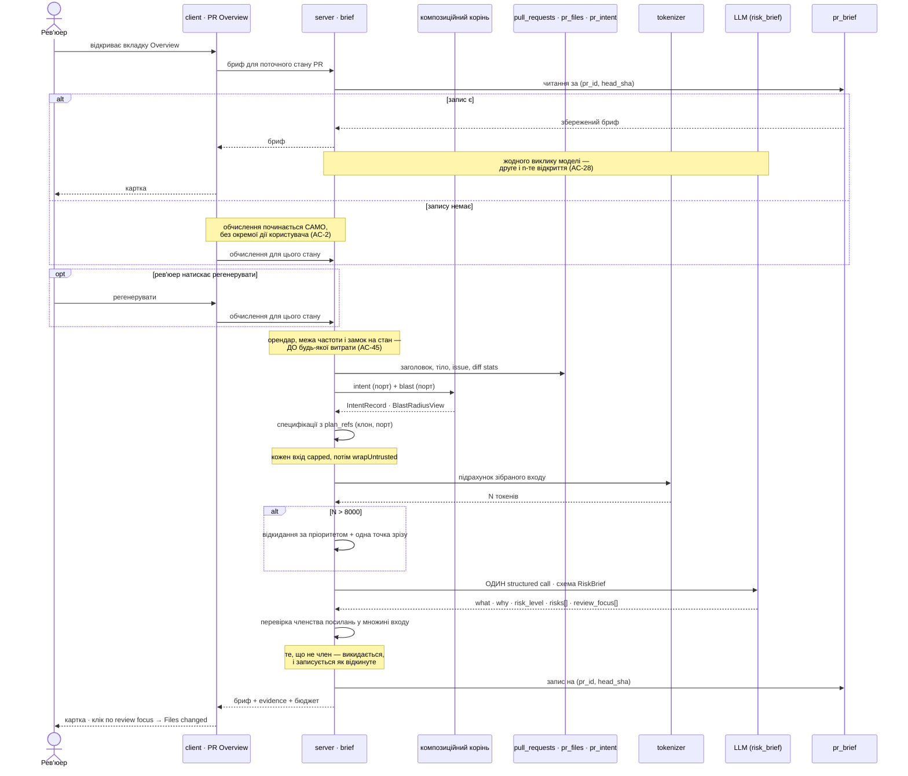

# Spec: PR Why + Risk Brief

**Spec ID:** SPEC-02
**Status:** approved
**Created:** 2026-08-16
**Supersedes:** _Немає._
**Modules:** server, client

## Problem and user

Користувач — інженер, який відкрив **чужий** PR і має його прочитати. На вкладці Overview він уже
бачить дві картки: `IntentCard` (намір, in/out of scope, risk areas) і `BlastRadiusCard` (змінені
символи, їхні виклики, endpoints — `OverviewTab.tsx:22-31`). Обидві правдиві й обидві відповідають
на різні питання, і жодна не відповідає на те, з яким людина прийшла: **з чого починати читати**.

Скласти ці дві відповіді докупи сьогодні мусить сам читач. Intent каже «рефакторинг клієнта
черг», blast каже «12 символів, 40 викликів, 3 endpoints» — а рішення «спершу подивись
`retry.ts`, бо там змінилася семантика повтору, і `worker.ts`, бо він єдиний, хто це викликає»
читач ухвалює сам, кожного разу, і на чужому коді ухвалює його погано. Наслідок: або PR читають
згори вниз по файлах, у порядку, який задав git, або не читають узагалі і апрувлять.

Чого сьогодні бракує саме як даних: немає жодного об'єкта, що поєднує намір із радіусом впливу і
називає **пріоритет**. `pr_brief` (`server/src/db/schema/reviews.ts:71`) — це порожня таблиця з
двох колонок; `PrBrief` (`contracts/brief.ts:154`) — композит із попередніх уроків, що складає
`intent`, `blast`, `risks`, `history` і не має жодного споживача на клієнті; `brief.json` уже
несе `block.risks`, `noRisks`, `unavailable` і `unavailableHint`, які не читає жоден компонент.
Скафолдинг є, відповіді немає.

## Goals / Non-goals

**G1.** Одна картка на вкладці Overview, що за ~20 секунд відповідає: **що** змінює цей PR,
**навіщо**, і **наскільки** ризиковано.
**G2.** Ризики, кожен прив'язаний до реального файлу або endpoint із вхідних даних — і жодного,
прив'язаного до вигаданого.
**G3.** Review focus — впорядкований перелік того, що читати першим, клікабельний до місця в
цьому ж застосунку.
**G4.** Рівно один структурований виклик моделі на один стан PR, **без тіл diff-хунків** у вході.
**G5.** Кеш на конкретний стан PR: повторне відкриття того самого стану не платить; окрема
кнопка платить свідомо.
**G6.** Вхід виклику вкладається в погоджений бюджет **8 000 токенів** за названим лічильником, і
те, що в нього не влізло, видно, а не зникає мовчки.
**G7.** _(Why Timeline — окремий обсяг, див. розділ нижче.)_ Історія брифів по станах PR, щоб було
видно, як змінювався намір.

**Non-goals** — межі для планувальника, не побажання:

**N1.** Другий виклик моделі. Зокрема бриф **не** запускає `POST /pulls/:id/blast/summary`: той
маршрут — окремий платний абзац, і `BlastRadiusView.summary` лишається `null`, доки його не
попросили окремо.
**N2.** Тіла хунків і патчів. `pr_files.patch` на шляху обчислення брифу не читається взагалі.
**N3.** Семантичний добір специфікацій — embeddings, pgvector, чанкінг. `specs/SPEC-01`, N1 і N2,
відклали це і ця фіча їх не скасовує.
**N4.** Бриф — не рев'ю. Він не створює `findings`, не пише в `reviews`, не запускає `agent_runs`
і не змінює `pull_requests.status`. _(Перевірено після відповіді на Q-3, бо автоматичне обчислення
робить цю межу тоншою, ніж вона була: відкриття сторінки тепер витрачає гроші, і спокуса
«раз уже платимо — хай заразом і рев'ю запустить» стає реальною. Межа лишається там, де стояла.
Що змінилося натомість — це одна властивість, яку спека зобов'язана назвати вголос: **читання
сторінки PR більше не безкоштовне**. Маршрут, що віддає бриф, може зробити платний виклик, і це
навмисно, а не недогляд; звідси AC-45 і межа частоти.)_
**N5.** git-why. `contracts/why.ts` `WhyTimeline` (blame по `file`+`line`, дравер на клавішу `w`)
ця фіча не будує і не чіпає — див. D3.
**N6.** Зміна `PrBrief` у `contracts/brief.ts`. Композит лишається таким, як є — див. D2.
**N7.** Будь-який виклик до GitHub. Усе, що бриф читає, уже лежить у БД або в клоні.
**N8.** `mcp/` і `e2e/`. Ані інструмента MCP, ані браузерного сценарію ця фіча не додає.

## Decisions and alternatives

**D1 — Ім'я контракту: `RiskBrief` / `RiskBriefRecord`, у тому самому `contracts/brief.ts`.**
Замовлена форма — `Brief { what, why, risk_level, risks[], review_focus[] }` — не випливає з
наявного `PrBrief { intent, blast, risks, history }`, тож потрібне власне ім'я. Голе `Brief`
непридатне: `vendor/shared/index.ts` — це дванадцять рядків `export *`, і два зіркові експорти
одного імені дають `TS2308` у файлі, якого повідомлення про помилку не називає
(`INSIGHTS.md:1495-1513`). Перевірено грепом: `RiskBrief`, `RiskBriefRecord`,
`RiskBriefTimeline`, `ReviewFocus`, `RiskLevel` у `contracts/` не зайняті. Форма пари дзеркалить
наявний прецедент: `Intent` — пласка схема, яку заповнює модель, `IntentRecord` —
`Intent.extend({...})` з усім, що ми про неї знаємо (`brief.ts:16-52`).

Розташування — **всередині `contracts/brief.ts`, а не в новому файлі**. Причина механічна:
`risks[]` перевикористовує наявні `Risk` і `RiskSeverity` (`brief.ts:85-100`), а в одному файлі
подвійного зіркового експорту не буває за побудовою. Окремий `contracts/pr-brief.ts` довелося б
або дублювати `Risk`, або імпортувати його через барель — саме та конфігурація, що вже коштувала
одного `TS2308`. Ім'я «Risk Brief» до того ж не вигадане тут: воно вже стоїть у реєстрі
(`contracts/platform.ts:59-64`, `label: 'Risk Brief'`).

**D2 — `PrBrief` лишається недоторканим.** Спокуса «переписати мертвий композит під нову форму»
відкинута: `PrBrief` реекспортується в `client/src/lib/types.ts:53` і перевіряється
round-trip-тестом у `server/test/contracts.test.ts`, а `AGENTS.md` прямо каже, що
over-provisioned схема — це scaffolding наступних уроків, а не сміття. Ціна рішення чесна: у
`brief.ts` тепер живуть **два** брифи, споріднені лише назвою файлу. Тому `RiskBrief` несе
коментар, що розводить їх, — рівно так, як `contracts/blast.ts:6-21` уже розводить свій
`BlastRadiusView` від `brief.ts`-івського `BlastRadius`.

**D3 — «Why Timeline» у коді зветься `RiskBriefTimeline`, а в UI — «Brief history».** Ім'я
`WhyTimeline` зайняте зовсім іншою річчю: `contracts/why.ts` описує ланцюг комітів, що сформували
**один рядок одного файлу** (`GET /pulls/:id/why?file&line`, blame, дравер на `w`). Збіг назв тут
не косметичний — обидві речі стоять на сторінці одного PR, обидві звуться «історія», і плутанина
коштувала б читачеві не секунди. До того ж `client/messages/en/brief.json` уже тримає блок
`why.*` із заголовком `"git-why"` — тобто слово «why» на цій сторінці вже роздане. Відкинуто:
`BriefHistory` (плутається з наявним `PrHistory` — попередні змерджені PR, `brief.ts:113`) і
`PrWhyTimeline` (та сама колізія з префіксом).

**D4 — Ключ стану PR — `head_sha`.** `pull_requests.head_sha` (`schema/pulls.ts:20`) уже виконує
цю роль в іншому місці: `pulls/status.ts:140` вважає PR таким, що потребує рев'ю, саме за
`lastReviewedSha !== headSha`. Відкинуто: `updated_at` (рухається від коментарів і міток, тобто
інвалідував би кеш без жодної зміни коду) і хеш від набору змінених файлів (той самий набір
файлів при іншому вмісті — інший PR).

**Наслідок, який спека зобов'язана назвати:** `pr_intent` ключа стану **не має** — його первинний
ключ це `pr_id`, а `computed_at` перезаписується на кожній деривації
(`intent/repository.ts:71-76`). Тому бриф, закешований на `head_sha` B, може нести intent,
похідний від стану A, і зовні це не видно ніяк. Звідси AC-24 і AC-25: запис брифу несе
`computed_at` того intent, з якого зібраний, а картка каже, коли той передує поточному коміту.

**D5 — Blast бриф читає через композиційний корінь, і читає **ту саму** відповідь, що показує
картка.** `no-cross-module` (dependency-cruiser, `tsPreCompilationDeps: true`) забороняє
`modules/brief` імпортувати `modules/blast` — включно з `import type`
(`modules/blast/types.ts:4-22`). Шлях уже протоптаний: `container.intentService` віддає
`IntentDeriver` без жодного імпорту зі слайса (`modules/intent/types.ts:22-38`,
`platform/container.ts:211`), і blast потребує рівно такого самого порту, якого в контейнері поки
немає. Відкинуто: бриф тягне `container.repoIntel` напряму, як це робить сам blast. Тоді картка й
бриф рахували б радіус двома шляхами з двома наборами cap'ів, і читач бачив би на одному екрані
«12 символів» у картці і «9 символів» у брифі — розбіжність, яку ніхто не зміг би пояснити.

**D6 — «Blast summary» у вході брифу — це детерміновані факти, а не абзац від моделі.**
Формулювання замовника («blast summary із модуля blast») читається двояко, і одне з прочитань
суперечить іншій його ж вимозі: `BlastRadiusView.summary` — це `null` до окремого платного
виклику (`contracts/blast.ts`, «nothing here is persisted»), тож «взяти summary» означало б
другий виклик моделі. Вимога «**один** структурований виклик» це закриває. Бриф отримує
`status`, `changed_files`, `symbols` (з викликами й endpoints), `totals`, `link_sha` і
`index_matches_head` — і сам є тим викликом, що з них робить прозу.

**D7 — «Релевантні специфікації» — це `IntentRecord.plan_refs`.** Поле вже існує і вже означає
рівно це: «Repo-relative paths of the plan/spec files that were read» (`brief.ts:46-47`), і
заповнює його intent-деривація детерміновано, з тіла PR і клону, без моделі. Тобто «релевантні»
означає «ті, що цей PR сам на себе послався», а не «ті, що на них схожі».

**Підтверджено людиною 2026-08-16 (Q-1), і причина арифметична, а не смакова.** Специфікаціям
лишається залишок бюджету ≈**2 650 токенів** (розкладка в `## Non-functional requirements`), а
`specs/SPEC-01-project-context.md` сам по собі важить **20 601 токен** за лічильником Project
Context. Тобто перший же документ, дібраний за перетином шляхів, з'їдає весь залишок і приходить
**обрізаним** — а обрізана специфікація гірша за жодну, бо виглядає як повна: модель прочитає
половину інваріантів і не дізнається, що друга половина існувала. `plan_refs` натомість дає
документи, які автор PR **назвав сам**, тобто ті, обрізання яких хоч комусь помітне.

Відкинуто: добір за змістом (N3 і `SPEC-01` N1, які лишаються чинними); добір за перетином шляхів
зі зміненими файлами — окрім арифметики вище, він дає документи тієї самої **теки**, а не тієї
самої теми, і на монорепозиторії вертає `docs/` цілком. Ціна рішення: PR без посилання на план не
отримує жодної специфікації, і `evidence` брифу це показує.

**D8 — Одиниця бюджету зафіксована явно, бо «8 000 токенів» саме по собі нічого не означає.**
Рахується **зібраний вхід виклику цілком** — системне повідомлення плюс користувацьке, разом з
обгортками `<untrusted …>` і заголовками секцій, тобто рівно ті рядки, які підуть у провайдера як
вхід. Лічильник — `container.tokenizer`, тобто `js-tiktoken` з енкодингом `cl100k_base`
(`adapters/tokenizer/index.ts:34`). Рахується **до** виклику, а не після.

Три речі, які через це доводиться сказати вголос:

- **Це не `tokens_in` від провайдера.** Провайдер додає до входу JSON-схему структурованого
  виводу і власне службове кодування, тож його число буде більшим, і бюджет міряється **не** ним.
  Обидва числа записуються поруч саме тому, що вони різні: перше — те, чим ми керуємо, друге —
  те, за що платимо.
- **`cl100k_base` — не енкодинг усіх моделей.** Дефолт фічі — `openai` / `gpt-4.1`
  (`contracts/platform.ts:59-64`), для якого це близько; для моделі іншого провайдера це
  наближення. Бюджет свідомо визначено проти **нашого** лічильника, бо він єдиний доступний до
  виклику й однаковий для всіх провайдерів.
- **Лічильник уміє мовчки деградувати.** Якщо BPE-ранги не завантажилися, `TiktokenTokenizer`
  ставить `broken = true` і **до кінця життя процесу** повертає `ceil(chars / 4)`, не повторюючи
  спроби (`tokenizer/index.ts:31-41`). На коді і шляхах ця евристика **недорахо́вує**, тобто
  «7 800» від неї може бути 9 000 справжніх. Рішення людини 2026-08-16 (Q-2): **запасу не
  вводимо** — відсоток, узятий зі стелі, був би такою самою вигадкою, як число, яке він мав би
  захищати. Натомість деградацію робимо **гучною і вимірюваною**: AC-44 вимагає сигналу в лозі,
  AC-19 — трьох чисел у записі. Запас, якщо він знадобиться, ставиться з різниці між нашим
  підрахунком і `tokens_in`, зібраної на реальних брифах.

**D9 — При перевищенні бюджету входи відкидаються у зворотному порядку пріоритету, з одною
точкою зрізу.** Порядок від найважливішого: (1) diff stats, (2) intent, (3) blast facts,
(4) заголовок і тіло PR, (5) пов'язаний issue, (6) специфікації. Специфікації — єдиний вхід без
власної жорсткої стелі, тож саме вони еластичні. Механіка та сама, що вже працює в
`modules/context/helpers.ts:307-346`: обхід зупиняється на першому вході, що не влазить, усе після
нього — `dropped`, а перший, що сам більший за залишок, включається обрізаним. Відкинуто:
пропорційне стискання всіх входів (результат не передбачить ніхто, хто дивиться на список) і
відмова обчислювати бриф при перевищенні (бриф без специфікацій кращий за відсутній бриф).

**D10 — Посилання перевіряються після виклику, і це НЕ гейт заземлення рев'ю.** `groundFindings`
(`reviewer-core/src/grounding.ts`) звіряє знахідку з рядком дифу — а бриф дифу в модель не
передає (N2), тож той гейт тут не застосовний за побудовою. Замість нього — власна детермінована
перевірка: кожен `file_ref` ризику і кожне посилання review focus має бути членом множини, зібраної
з входу (шляхи `pr_files`, шляхи й endpoints із `BlastRadiusView`, шляхи `plan_refs`). Те, що не
член, викидається, а не показується. Це найсильніший контроль фічі: структурований вивід обмежує
**форму** відповіді, а членство в множині — її **зміст**.

**D11 — `risk_level` — це три значення наявного `RiskSeverity` (`high` | `medium` | `low`).**
Четвертого рівня немає: `Risk.severity` уже цим переліком, і бриф із `risk_level: critical` над
ризиками, найгірший з яких `high`, читався б як помилка. Відкинуто: числовий скор — його ніхто не
може ані пояснити, ані відтворити.

**D12 — Модель береться з наявного `FeatureModelId` `risk_brief`.** Реєстр уже несе цей запис із
`label: 'Risk Brief'` і дефолтом `openai` / `gpt-4.1` (`contracts/platform.ts:59-64`), і екран
Settings уже вміє його редагувати. Нового id фіча не заводить. Ціна: цей самий id уже
перевикористовує blast для свого абзацу (`modules/blast/service.ts:8-12`), тож воркспейс, що
переставить `risk_brief` на дешеву модель заради абзацу, переставить і бриф.

**Рішення людини 2026-08-16 (Q-4): один id, і розведення свідомо відкладене.** Розводити на два
заради **невиміряної** різниці в ціні означає розширити спільний контракт `Settings` і екран
налаштувань наосліп — і це та сама причина, з якої blast свого id не заводив. Умова, за якої це
переглядають, названа й перевірювана: AC-19 і AC-34 дають фактичну вартість обох споживачів
`risk_brief`, і коли з цих даних видно, що бриф і абзац blast систематично хочуть різних моделей,
рішення ухвалюють із чисел, а не з припущення. До того — один id.

**D13 — Регенерація на тому самому `head_sha` замінює запис цього стану.** Інакше таймлайн
наповнюється повторами одного стану і перестає показувати те, для чого існує, — зміну наміру між
станами. Друга спроба на тому самому коміті — це виправлення поганої відповіді, а не нова подія в
історії PR.

**D14 — Клік по review focus веде у вкладку Files changed цього застосунку, одним записом в
URL.** Прецедент і граблі вже записані: `SmartDiffViewer` так стрибає до знахідки, і
`client/INSIGHTS.md:585-607` пояснює, чому це має бути **один** `setParams`, а не три виклики
`setParam` — три `router.replace` гоняться, виграє останній. Відкинуто: посилання на GitHub як
основна дія — воно виводить читача із застосунку в той момент, коли ми щойно сказали йому, що
читати тут.

## User stories

**US-1.** Як інженер, що відкрив чужий PR, я хочу за двадцять секунд знати, що він змінює і
навіщо, щоб не реконструювати це з дифу.
**US-2.** Як інженер, я хочу бачити рівень ризику одним значенням, щоб вирішити, скільки часу
цьому PR дати.
**US-3.** Як інженер, я хочу бачити конкретні ризики з посиланнями на реальні файли, щоб перевірити
кожен, а не повірити на слово.
**US-4.** Як інженер, я хочу натиснути на пункт review focus і опинитися на цьому файлі в дифі,
щоб почати читати з правильного місця.
**US-5.** Як людина, що платить за виклики, я хочу, щоб повторне відкриття того самого PR нічого
не коштувало, а перерахунок був окремою свідомою дією.
**US-6.** Як людина, що читає бриф, я хочу знати, на чому він стоїть і чого в ньому немає, щоб не
вважати повним те, що зібрано з половини входів.
**US-7.** _(Why Timeline.)_ Як інженер, що повертається до PR, який рухався тиждень, я хочу
бачити, як змінювався його намір і ризик, щоб зрозуміти, що переглядати наново.

## Acceptance criteria (EARS)

_Номери — стабільні ідентифікатори, присвоєні в порядку появи, а не в порядку читання. AC-41…AC-43
дописані після другого проходу по коду і стоять там, куди належать за змістом, зберігши свої
номери._

### Картка на сторінці PR

**AC-1.** **КОЛИ** користувач відкриває вкладку Overview для PR, у якого є бриф поточного
`head_sha`, система повинна (shall) показати картку брифу серед наявних карток Overview із
`what`, `why`, бейджем `risk_level`, переліком ризиків і переліком review focus.

**AC-2.** **КОЛИ** користувач відкриває стан PR, для якого брифу в кеші немає, система повинна
(shall) обчислити бриф одразу і показати результат — без окремої дії від користувача; та сама дія
доступна явно кнопкою регенерації. _(Рішення людини 2026-08-16, відповідь на Q-3. Критерій
замовника каже «**повторне** відкриття того самого стану PR читає кеш без нового LLM-виклику», а
слово «повторне» передбачає, що перше відкриття щось обчислило: інакше критерій задовольняється
тим, що ми не обчислюємо ніколи, і продемонструвати його неможливо. Це також знімає суперечність
зі скафолдингом `brief.json` `unavailableHint: "Run a review or open the PR to compute it."`, який
уже описував саме цю поведінку.)_

**AC-3.** **ЯКЩО** запит або обчислення брифу не вдалися, **ТОДІ** система повинна (shall)
показати причину на картці і лишити дію обчислення доступною — вимкненою лише власною мутацією,
що зараз виконується, і нічим іншим. _(Пара невдачі до AC-2. Кнопка, вимкнена станом, з якого
вона виводить, — це вже записана помилка: `client/INSIGHTS.md:297-311`.)_

**AC-4.** Бейдж `risk_level` повинен (shall) нести рівно одне з трьох значень `RiskSeverity` і
бути читабельним без кольору — тобто нести текст рівня, а не лише колірний стан.

**AC-5.** **КОЛИ** користувач активує пункт review focus, що називає файл зі складу змінених
файлів PR, система повинна (shall) перевести його до цього файлу у вкладці Files changed **одним**
записом у URL. _(Один `setParams` із записом, а не кілька `setParam` — `client/INSIGHTS.md:585-592`.)_

**AC-6.** **ЯКЩО** пункт review focus називає файл, якого немає серед змінених файлів PR, **ТОДІ**
система повинна (shall) показати його як текст без дії, а не як контрол, що на натискання не
відповідає. _(Пара невдачі до AC-5.)_

**AC-7.** **ПОКИ** триває обчислення брифу, система повинна (shall) показувати стан виконання на
картці і не подавати результат попереднього стану PR як поточний.

**AC-8.** Кожен рядок, що прийшов від моделі — `what`, `why`, заголовок і пояснення ризику, пункт
review focus — повинен (shall) бути відрендерений як текст: без інтерпретації markdown і без
виконання вбудованого HTML. _(Модель переказує тіло PR і тіло issue, тобто може повернути назовні
рівно те, що в неї вклали.)_

### Ризики

**AC-9.** Кожен показаний ризик повинен (shall) нести рівень, заголовок, пояснення і принаймні
одне посилання на файл або endpoint.

**AC-10.** **ЯКЩО** у ризику після перевірки посилань (AC-13) не лишилося жодного посилання,
**ТОДІ** система повинна (shall) не показувати цей ризик і записати факт відкидання.

**AC-11.** **ЯКЩО** після перевірки не лишилося жодного ризику, **ТОДІ** картка повинна (shall)
сказати це прямо разом із показаним `risk_level`, а не показати порожню секцію.

**AC-12.** Ризики повинні (shall) бути показані у порядку спадання рівня, а в межах одного рівня
— у порядку, який повернула модель.

### Заземлення посилань

**AC-13.** Кожен `file_ref` ризику і кожне посилання пункту review focus повинні (shall) бути
членом множини дозволених посилань, зібраної **з входу цього ж виклику**: шляхи змінених файлів
PR, шляхи і endpoints із відповіді blast, шляхи специфікацій.

**AC-14.** **ЯКЩО** модель повернула посилання поза цією множиною, **ТОДІ** система повинна
(shall) відкинути це посилання, зберегти його в записі брифу як відкинуте і не показати його на
картці в жодному вигляді. _(Пара невдачі до AC-13.)_

**AC-15.** **ЯКЩО** посилання проходить перевірку членства, але при побудові URL його шлях містить
сегмент `..`, керуючий символ або схему, **ТОДІ** система повинна (shall) показати його як текст,
а не як посилання. _(Членство в множині не робить рядок безпечним для URL: `client/INSIGHTS.md:135`
і `:365` описують обидва обходи — крапкові сегменти й керуючий символ, що переживає `.trim()`.)_

### Виклик моделі й бюджет

**AC-16.** **КОЛИ** система обчислює бриф, вона повинна (shall) зробити рівно **одне** звернення
`completeStructured` за схемою `RiskBrief` — і жодного іншого звернення до моделі, зокрема не
запускати ані деривацію intent, ані `POST /pulls/:id/blast/summary`.

**AC-41.** **ЯКЩО** модель повернула відповідь, що не проходить схему, **ТОДІ** система повинна
(shall) зробити не більш ніж **одну** спробу ремонту і при її невдачі відповісти помилкою, не
роблячи третьої. _(Пара невдачі до AC-16, і вона не косметична: усі три адаптери реалізують
`completeStructured` як цикл із `maxRetries ?? 2`, тобто **до трьох** звернень за замовчуванням,
і кожна наступна спроба **дописує** до `messages` попередню відповідь моделі разом із текстом
помилки. Тобто вхід другої спроби більший за вхід першої, і бюджет AC-19 його вже не описує.
Прецедент числа — `INTENT_MAX_RETRIES = 1` (`modules/intent/constants.ts`), і причина там
записана: провайдерські ретраї, таймаут і цикл ремонту множаться.)_

**AC-17.** Вхід виклику не повинен (shall not) містити жодного тіла хунка чи патча: `pr_files.patch`
на шляху обчислення брифу не читається.

**AC-18.** **КОЛИ** система збирає вхід виклику, вона повинна (shall) порахувати **перший**
зібраний вхід цілком — системне повідомлення разом із користувацьким — лічильником
`container.tokenizer` **до** виклику і переконатися, що результат не перевищує **8 000**.
_(Саме перший: якщо спрацює спроба ремонту схеми (AC-41), провайдер додасть до `messages`
попередню відповідь і текст помилки, і вхід другої спроби буде більшим. Бюджет описує те, що ми
зібрали, а не те, у що воно виросте після невдалого парсингу.)_

**AC-44.** **ЯКЩО** `container.tokenizer` відповів евристикою деградації замість енкодера,
**ТОДІ** система повинна (shall) сказати це вголос — записом у лозі рівня попередження на додачу
до поля в записі брифу (AC-19), — а не лише в даних, які ніхто не читає, доки не запідозрив.
_(Пара невдачі до AC-18. Деградація сьогодні абсолютно тиха і **незворотна в межах процесу**:
`TiktokenTokenizer.count` після одного збою ставить `broken = true` і до кінця життя процесу
повертає `ceil(chars / 4)`, не повторюючи спроби і не сигналізуючи нікуди
(`adapters/tokenizer/index.ts:31-41`). Тобто один невдалий старт робить кожен наступний бриф
поміряним іншою лінійкою, і без цього критерію дізнатися про це можна лише порівнявши AC-19 із
`tokens_in` заднім числом.)_

**AC-19.** Запис брифу повинен (shall) нести порахований розмір першого входу, ідентифікатор
лічильника, що його порахував (справжній енкодер чи евристика деградації), кількість фактичних
спроб і окремо `tokens_in`, повернений провайдером, — числа, жодне з яких не заміняє інше.
_(`tokens_in` приходить із `usage` відповіді провайдера через `result.tokensIn`, тобто вже
підсумовує все, що ми не контролюємо: JSON-схему структурованого виводу і спробу ремонту, якщо
вона була. Розбіжність між ним і нашим числом — це і є та величина, яку Q-2 просить виміряти
перед тим, як призначати запас.)_

**AC-20.** **ЯКЩО** зібраний вхід перевищує 8 000, **ТОДІ** система повинна (shall) відкидати
входи у зворотному порядку пріоритету (D9), обрізати вхід у точці зрізу, записати статус кожного
входу і лише після цього викликати модель. _(Пара невдачі до AC-18.)_

**AC-21.** **ЯКЩО** для PR немає жодного `IntentRecord`, **ТОДІ** система повинна (shall) зібрати
бриф без нього, записати цю відсутність у `evidence` і **не** запускати деривацію intent.

**AC-22.** **ЯКЩО** відповідь blast має статус, відмінний від `full`, **ТОДІ** система повинна
(shall) зібрати бриф із того, що є, і записати цей статус у `evidence`, а не відмовитися
обчислювати.

**AC-23.** Кожен вхід, керований ззовні — заголовок PR, тіло PR, пов'язаний issue, повідомлення
комітів, шляхи файлів, текст специфікацій — повинен (shall) бути обгорнутий `wrapUntrusted` зі
своєю міткою, і кожна межа обсягу застосована **до** обгортання, а не після. _(Дослівно той самий
порядок, що в `modules/intent/helpers.ts:153,164-199`: обрізання після обгортання ріже саму
обгортку.)_

### Свіжість входів

**AC-24.** Запис брифу повинен (shall) нести `computed_at` того `IntentRecord`, з якого його
зібрано, і `link_sha` та `index_matches_head` тієї відповіді blast, з якої його зібрано.

**AC-25.** **ЯКЩО** `computed_at` використаного intent передує даті коміту поточного `head_sha`,
**ТОДІ** картка повинна (shall) показати, що намір походить із попереднього стану PR, і не подавати
`why` як опис поточних змін без цієї позначки.

**AC-26.** **ЯКЩО** `index_matches_head` хибне, **ТОДІ** картка повинна (shall) показати, що
ризики спираються на індекс коміту `link_sha`, а не на head PR.

**AC-27.** **ЯКЩО** `link_sha` порожній, **ТОДІ** система повинна (shall) показати посилання на
файл як текст і **не** будувати його проти `head_sha`. _(Null тут означає «не будувати посилання»,
а не «взяти head»: `INSIGHTS.md:418-441` — посилання відкрилося, файл існував, рядок існував, і це
був коментар.)_

### Кеш і регенерація

**AC-28.** **КОЛИ** користувач відкриває PR, для чийого поточного `head_sha` запис уже існує,
система повинна (shall) віддати збережений бриф і зробити **нуль** викликів моделі — тобто друге
й будь-яке наступне відкриття того самого стану не платить нічого, скільки б їх не було.
_(Це головний критерій замовника, і після відповіді на Q-3 він справді щось стереже: перше
відкриття стану платить (AC-2), тож «нуль викликів» тут — це вимірювана різниця між першим
відкриттям і другим, а не тавтологія «ми не обчислюємо ніколи».)_

**AC-29.** **КОЛИ** `head_sha` PR змінився, система повинна (shall) обчислити бриф нового стану
за AC-2, не видаляючи й не перезаписуючи запису попереднього стану.

**AC-30.** **КОЛИ** користувач натискає регенерацію, система повинна (shall) обчислити бриф
наново для поточного `head_sha` і замінити ним попередній запис **цього самого** стану.

**AC-31.** **ЯКЩО** PR, названий у запиті, належить іншому воркспейсу, **ТОДІ** система повинна
(shall) відмовити **до** виклику моделі, тим самим кодом, що й для неіснуючого PR. _(Порядок
«перевірка орендаря перед витратою» — `modules/intent/routes.ts:46-50`, і відповідь має не
розрізняти чужий PR від відсутнього.)_

**AC-32.** **ЯКЩО** частота запитів на регенерацію перевищує налаштовану межу, **ТОДІ** система
повинна (shall) відмовити з відповіддю про перевищення межі і не зробити виклику.

**AC-42.** **ЯКЩО** для `risk_brief` немає доступного ключа провайдера, **ТОДІ** картка повинна
(shall) сказати, що модель для цієї фічі не налаштована, і вказати, де її обрати, — а не показати
загальну помилку обчислення. _(Це не гіпотетичний стан і не рідкісний: `risk_brief` дефолтить на
`openai`/`gpt-4.1`, і на встановленні без ключа OpenAI сусідній `POST /pulls/:id/blast/summary`
уже відповідає `500 config_error: OPENAI_API_KEY is not configured` доти, доки воркспейс не
обере модель — `server/INSIGHTS.md:1204-1211`. Бриф успадкує рівно цю поведінку разом із
`FeatureModelId`, тож це стан «з коробки», а не край.)_

**AC-45.** **ЯКЩО** обчислення для цього самого `head_sha` уже виконується, **ТОДІ** система
повинна (shall) не починати другого і віддати всім читачам, що чекають, результат того, яке вже
виконується. _(Пара невдачі до AC-2, і вона з'явилася разом із ним: доки обчислення запускала лише
кнопка, подвійна оплата була вибором того, хто натиснув двічі. Автоматичне обчислення при
відкритті цього вибору не має — дві вкладки, два колеги або перезавантаження сторінки за секунду
до відповіді дають два платні виклики над однаковим входом, і жоден із них не є діям користувача.)_

**AC-43.** Обчислення брифу повинно (shall) завершитися — успіхом або помилкою — у межах
названого таймауту, не покладаючись на дефолт провайдера. _(Дефолт тут не нейтральний:
`OpenRouterProvider` живе в `reviewer-core` і `platform/resilience.ts` не використовує взагалі —
у нього власний стеловий годинник на **десять хвилин** на один структурований виклик, з усіма
ретраями всередині. Виклик брифу синхронний і людина стоїть перед кнопкою, тож десять хвилин
очікування — це не деградація, це відсутність вимоги.)_

### Прозорість

**AC-33.** Картка повинна (shall) показувати, з чого бриф зібрано і чого в ньому немає: які входи
увійшли, які були обрізані й які відкинуті за бюджетом.

**AC-34.** Запис брифу повинен (shall) нести провайдера, модель, `head_sha`, час обчислення і
вартість виклику — тими самими полями, якими їх уже несе `pr_intent`.

### Why Timeline — окремий обсяг

_Цей блок описує G7 і US-7. Він відокремлений навмисно: без нього AC-1…AC-34 складають робочу
фічу, а він без них не існує. Рекомендацію щодо його відокремлення в окремий реліз див. у звіті
диспатчу — рішення за людиною._

**AC-35.** **КОЛИ** для PR існує бриф більш ніж для одного `head_sha`, система повинна (shall)
показати їх як історію в хронологічному порядку, з `risk_level` і `what` кожного стану.

**AC-36.** Історія повинна (shall) позначати переходи, на яких `risk_level` змінився, — саме вони
відповідають на питання «що змінилося в намірі».

**AC-37.** **ЯКЩО** серед комітів PR є такі, для чиїх станів брифу не обчислювали, **ТОДІ**
система повинна (shall) сказати, що історія неповна і скільки станів у ній немає, а не подати
наявні записи як повну хронологію. _(Історія розріджена за побудовою, і після відповіді на Q-3
причина розрідженості інша, ніж у першій редакції: запис з'являється там, де стан **відкривали**,
а не там, де натискали кнопку. Коміти, запушені пачкою між двома відкриттями сторінки, брифу не
мають і мати не будуть — жоден шлях їх не наздоганяє заднім числом.)_

**AC-38.** **ЯКЩО** `head_sha` запису історії більше не належить гілці PR (force-push, rebase),
**ТОДІ** система повинна (shall) показати цей запис із позначкою, що такого стану на гілці вже
немає, а не приховати його.

**AC-39.** **ЯКЩО** кількість збережених станів для одного PR досягла межі, **ТОДІ** система
повинна (shall) видалити найстаріший запис і показати, що історія обрізана знизу.

**AC-40.** Історія повинна (shall) бути підписана в UI ім'ям, що не містить слова «Why»:
`git-why` вже займає це слово на цій самій сторінці (`brief.json` → `why.title: "git-why"`).

## Traceability

| AC | Служить | Спостережуване | Джерело вимоги |
|---|---|---|---|
| AC-1 | G1, US-1 | Картка з `what`, `why`, бейджем і двома переліками серед карток Overview | вимога замовника («`PrBriefCard` показує рівень ризику й клікабельний список review focus»); `OverviewTab.tsx:22-31` |
| AC-2 | G1, G5, US-1 | Перше відкриття стану: рівно один виклик і новий запис у `pr_brief` без дії користувача | рішення людини 2026-08-16 (Q-3); `brief.json` `unavailableHint` |
| AC-3 | G1 | Помилка на картці, кнопка активна при `isPending === false` | `client/INSIGHTS.md:297-311`; пара невдачі до AC-2 |
| AC-4 | G1, US-2 | Текст рівня в бейджі, не лише колірний стан | вимога замовника («показує рівень ризику»); рівень, поданий лише кольором, недоступний частині читачів |
| AC-5 | G3, US-4 | Один `router.replace`; файл видно у вкладці Files changed | вимога замовника («клікабельний»); `client/INSIGHTS.md:585-592`; `SmartDiffViewer.tsx:74-84` |
| AC-6 | G3 | Текст без контролу для файлу поза складом PR | пара невдачі до AC-5 |
| AC-7 | G1 | Стан виконання; бриф попереднього стану не подано як поточний | наслідок AC-29 |
| AC-8 | G1 | `` з тіла PR видно як текст у переказі моделі | stored XSS: вивід моделі — це переказ недовіреного входу і зберігається в БД |
| AC-9 | G2, US-3 | Рядок ризику з рівнем, заголовком, поясненням і посиланням | вимога замовника («ризики посилаються на файли з blast map»); `Risk` (`brief.ts:88-95`) |
| AC-10 | G2 | Ризик без валідних посилань відсутній на картці, присутній у записі як відкинутий | наслідок AC-13 |
| AC-11 | G2 | Явний текст замість порожньої секції; `risk_level` показано | `brief.json` `noRisks` (ключ уже існує, споживача не має) |
| AC-12 | G1, US-2 | Порядок рядків: `high` перед `medium` перед `low` | наслідок G1 (двадцять секунд — це перші три рядки) |
| AC-13 | G2, US-3 | Кожне показане посилання є членом множини, зібраної з входу | **AC замовника** («посилаються лише на реальні файли або endpoints із вхідних даних») |
| AC-14 | G2 | Вигадане посилання відсутнє на екрані, присутнє в записі як відкинуте | пара невдачі до AC-13 |
| AC-15 | G2 | Шлях із `..` або керуючим символом показано текстом | `client/INSIGHTS.md:135`, `:365` |
| AC-16 | G4 | Рівно одне звернення `completeStructured` на обчислення; жодного звернення до intent-деривації чи `/blast/summary` | **вимога замовника** («**Один** структурований виклик»); `blast/service.ts:151-179` |
| AC-41 | G4, G6 | Не більш ніж дві спроби; кількість спроб у записі | пара невдачі до AC-16; `modules/intent/constants.ts` (`INTENT_MAX_RETRIES = 1`); цикл `maxRetries ?? 2` у трьох адаптерах |
| AC-42 | G1 | Текст «модель не налаштована» з дорогою до Settings замість `500` | `server/INSIGHTS.md:1204-1211`; `contracts/platform.ts:59-64` |
| AC-43 | G5 | Обчислення завершується в межах названого числа, не за десять хвилин | `reviewer-core/src/llm/openrouter.ts` (власний дедлайн 600 000 мс, поза `platform/resilience.ts`) |
| AC-44 | G6, US-6 | Рядок попередження в лозі обчислення, коли відповіла евристика | рішення людини 2026-08-16 (Q-2); `adapters/tokenizer/index.ts:31-41` (`broken = true` назавжди) |
| AC-45 | G5 | Дві вкладки на одному `head_sha` дають один виклик і одну відповідь | пара невдачі до AC-2; наслідок рішення Q-3 |
| AC-17 | G4 | `pr_files.patch` не читається на цьому шляху; у вході немає рядка, що починається з `+`/`-` | **вимога замовника** («тіла diff hunks у модель не передаються») |
| AC-18 | G6 | Пораховане число першого входу ≤ 8 000 перед викликом | **AC замовника** («вхід не перевищує бюджету»); `adapters/tokenizer/index.ts:18-42` |
| AC-19 | G6, US-6 | Чотири числа в записі: наш підрахунок, ідентифікатор лічильника, кількість спроб, `tokens_in` провайдера | D8; `tokenizer/index.ts:32-40` (тиха деградація); `intent/service.ts:103-118` (звідки береться `tokensIn`) |
| AC-20 | G6, US-6 | Статус кожного входу в записі; сумарний вхід ≤ 8 000 | пара невдачі до AC-18; `modules/context/helpers.ts:307-346` |
| AC-21 | G4 | Бриф обчислено, `evidence` називає відсутній intent, викликів моделі — один | наслідок N1 і D5 |
| AC-22 | G4, US-6 | Бриф обчислено при `status: partial`/`degraded`, статус у `evidence` | `contracts/blast.ts` `BlastIndexStatus` |
| AC-23 | G4 | Кожен зовнішній вхід усередині `<untrusted …>`; обрізання не ріже обгортку | `modules/intent/helpers.ts:153,164-199`; ін'єкція в промт через тіло PR |
| AC-24 | G1, US-6 | `computed_at` intent і `link_sha`/`index_matches_head` blast у записі брифу | D4; `intent/repository.ts:71-76`; `contracts/blast.ts` |
| AC-25 | G1, US-6 | Позначка про намір із попереднього стану на картці | наслідок D4 (`pr_intent` не має ключа стану) |
| AC-26 | G2, US-6 | Позначка про індекс `link_sha` на картці | `blast.json` `staleIndex` (ключ уже існує) |
| AC-27 | G2 | Шлях текстом, жодного посилання, зібраного проти `head_sha` | `INSIGHTS.md:418-441` |
| AC-28 | G5, US-5 | Друге і n-те відкриття того самого `head_sha`: нуль викликів, при одному на першому (AC-2) | **AC замовника** («**повторне** відкриття читає кеш без нового LLM-виклику») |
| AC-29 | G5 | Після зміни `head_sha` — нове обчислення; запис попереднього стану не змінений і не видалений | D4; `pulls/status.ts:140` |
| AC-30 | G5, US-5 | Один запис на `head_sha` після двох регенерацій поспіль | D13 |
| AC-31 | G5 | Той самий код відповіді для чужого і для неіснуючого PR; виклику не було | `modules/intent/routes.ts:46-50` (той самий порядок «орендар до витрати»); IDOR |
| AC-32 | G5 | Відмова на перевищенні межі; жодного виклику | `modules/intent/routes.ts:41-43`; єдиний маршрут фічі, що витрачає гроші |
| AC-33 | G6, US-6 | Перелік входів зі станами на картці | наслідок AC-20 |
| AC-34 | G5, US-6 | Провайдер, модель, `head_sha`, час і вартість у записі | форма `pr_intent` (`schema/reviews.ts:63-68`) |
| AC-35 | G7, US-7 | Два і більше станів у хронологічному порядку | вимога замовника (окремий розділ) |
| AC-36 | G7, US-7 | Позначений перехід там, де `risk_level` змінився | вимога замовника («видно, як змінювався намір») |
| AC-37 | G7, US-6 | Текст про неповноту з числом станів без брифу | наслідок AC-2 (запис з'являється там, де стан відкривали) |
| AC-38 | G7 | Запис із позначкою «стану немає на гілці» після force-push | `schema/pulls.ts:57-66` (`pr_commits` — єдине джерело складу гілки) |
| AC-39 | G7 | Найстаріший запис видалено, позначка про обрізання показана | NFR (межа станів на PR) |
| AC-40 | G7 | Підпис історії без слова «Why» | D3; `brief.json` `why.title` |

## Edge cases

| Випадок | Очікувана поведінка |
|---|---|
| PR без тіла, без issue, без плану — лише заголовок і файли | Бриф обчислюється. `what` спирається на diff stats і blast, `why` чесно каже, що обґрунтування в PR немає, `evidence` перелічує відсутні входи (AC-21, AC-33). Порожній `why` — це відповідь, а не збій. |
| Intent є, але похідний від стану, якого вже немає | Бриф збирається з нього, картка це позначає (AC-25). Автоматичної редеривації немає — це був би другий платний виклик (N1), а кнопка `Recompute` уже стоїть на `IntentCard`. |
| Індекс repo-intel відстає від head PR | `index_matches_head === false` (AC-26); посилання будуються від `link_sha`, не від head (AC-27). Це та сама пастка, що вже коштувала одного неправильного посилання на коментар замість виклику. |
| Репозиторій не проіндексовано взагалі | `status: degraded`, `link_sha === null`. Бриф обчислюється зі шляхів `pr_files` (AC-22), ризики можуть посилатися лише на файли, не на endpoints, посилання — текстом (AC-27). |
| Модель повернула `review_focus` із файлом, якого немає в PR | Пункт лишається як текст без дії (AC-6). Не помилка: файл міг бути в множині дозволених через blast (сусід, не змінений файл), і назвати його доречно — вести до нього в дифі нікуди. |
| Модель повернула шлях, якого в множині немає взагалі | Викидається (AC-14). Це головний випадок галюцинації і єдиний, який видно в записі, але не на екрані. |
| Модель переказала інструкцію з тіла PR у поле `why` | Текст показується як текст (AC-8) і жодної дії не запускає — структурований вивід не має поля, яким можна щось запустити. Це залишковий ризик, а не усунений: `wrapUntrusted` знижує ймовірність, а не скасовує її. |
| Специфікація з `plan_refs` зникла з клону | Пропускається; `evidence` це називає. Прикріплення не існує — `plan_refs` перераховуються разом з intent. |
| Клон відстає від default-гілки | Бриф прочитає **ту** версію специфікації, що лежить у клоні, і за вмістом це може бути щось геть інше. Стан досяжний і був реальним: до виправлення `RepoService.refresh` 2026-08-16 Refresh робив `fetch` без переміщення робочого дерева, і клон відставав на 91 комміт — тобто документа, названого в `plan_refs`, у ньому могло не бути взагалі. Бриф цього не діагностує і не має: свіжість клону належить repo-intel, а не цій фічі. Наслідок для читача — рядок «Специфікації» в `## Inputs` відтворюваний лише в межах одного клону. |
| Один вхід сам більший за 8 000 | Досяжно лише для специфікацій. Він включається обрізаним, як перший у своєму порядку (D9), решта — `dropped`. |
| Лічильник деградував до евристики | Бриф обчислюється, число і ідентифікатор лічильника записуються (AC-19), і деградація кричить у лозі (AC-44). Спека **не** стверджує, що в цьому режимі 8 000 витримано у провайдерських токенах, і запасу не вводить (рішення Q-2). Деградація незворотна в межах процесу, тож перший такий бриф — сигнал про всі наступні, а не про себе. |
| Перша відповідь моделі не пройшла схему | Одна спроба ремонту, потім помилка (AC-41). Вхід другої спроби більший за перший і бюджетом AC-18 не описаний — це названо, а не приховано. Записується кількість фактичних спроб, тож «дорогий бриф» відрізняється від звичайного числом, а не здогадом. |
| Воркспейс не обрав модель, а ключа OpenAI на машині немає | Стан «модель не налаштована» з дорогою до Settings (AC-42), а не `500`. Це стан за замовчуванням на будь-якому встановленні без ключа OpenAI, бо `risk_brief` дефолтить саме туди — сусідній `/blast/summary` уже так падає. |
| `risk_brief` вказує на OpenRouter | Виклик іде тим самим `completeStructured` (це єдиний метод, який `OpenRouterProvider` реалізує — `complete` він кидає), але під власним дедлайном у десять хвилин. AC-43 вимагає власного годинника саме через це. |
| Двоє відкрили той самий PR і натиснули регенерацію одночасно | Один запис на `head_sha` (AC-30). Хто виграв — не визначено і не має значення: обидва обчислювали з того самого входу. Явна регенерація — це вибір того, хто натиснув, тож подвійна оплата тут припустима; **автоматичний шлях так не робить** (AC-45). |
| Дві вкладки відкрили той самий новий стан одночасно | Один виклик, обидві отримують його результат (AC-45). Це головна ціна автоматичного обчислення і єдине місце, де вона стає видимою: доки платила кнопка, подвійний виклик був чиїмось рішенням, тепер він був би нічиїм. |
| Хтось запушив десять комітів між двома відкриттями сторінки | Бриф отримає лише останній стан — той, що відкрили. Дев'яти проміжних у таймлайні не буде і не з'явиться: заднім числом їх ніхто не наздоганяє (AC-37). |
| Бриф обчислено, поки PR оновився | Запис лягає на `head_sha`, з яким його починали. Наступне відкриття бачить новий head і показує порожній стан (AC-29). Брифа «з двох станів» не існує. |
| PR закрито або змерджено | Бриф і історія лишаються читабельними. Обчислення нового не забороняється — читати змерджений PR теж доводиться. |
| `risk_level` високий, а ризиків жодного після перевірки | Показується рівень і явний текст (AC-11). Розбіжність видно, і це правильно: рівень від моделі, ризики — після нашої перевірки, і саме ця пара показує, скільки вона відкинула. |
| Force-push переписав усі коміти PR | Записи історії лишаються, кожен із позначкою (AC-38). Видаляти їх означало б стерти єдиний слід того, що PR колись збирався робити щось інше. |
| PR на 400 файлів | Diff stats обрізаються за наявними межами (`MAX_FILE_PATHS = 40`), решта — числом. Blast має власні cap'и вище за течією. Ані бюджет, ані час відповіді від розміру PR не залежать лінійно. |
| Воркспейс переставив `risk_brief` на дешеву модель заради blast-абзацу | Бриф піде тією ж моделлю. Це прийнята ціна D12 і предмет Q-4. |

## Module interactions

**client → server (HTTP).** Одна поверхня, дзеркало наявної пари intent
(`modules/intent/routes.ts:26,41`): читання кешованого брифу для поточного стану PR, і окреме
обчислення, що витрачає гроші. Форма відповіді читання — запис або «ще немає», де «ще немає» —
порожній стан, а не помилка; чужий PR — та сама відмова, що й неіснуючий (AC-31). Клієнтський
паттерн уже усталений і на intent, і на blast: query за ключем PR, мутація пише результат назад у
той самий ключ через `setQueryData`, без інвалідації (`lib/hooks/core.ts:141-156`,
`lib/hooks/blast.ts:16-46`).

**server: композиційний корінь → intent і blast.** Це головне обмеження реалізації, і воно не
стилістичне. `no-cross-module` у `.dependency-cruiser.cjs` стоїть із `tsPreCompilationDeps: true`
і без `dependencyTypesNot`, тобто ловить і `import type` теж (`modules/blast/types.ts:4-22`).
Intent уже доступний як порт: `container.intentService` типу `IntentDeriver`
(`platform/container.ts:211`, `modules/intent/types.ts:75-98`). **Blast такого порту не має** — у
контейнері є `repoIntel`, але не `blastService`. Тобто композиційний корінь має віддати відповідь
blast так само, як віддає intent, і `contracts/blast.ts` `BlastRadiusView` — та форма, у якій вона
має перетнути межу, бо вона вже контрактна і вже несе `link_sha` та `index_matches_head`.
Володіє формою `blast`; бриф її читає і не розширює.

**server → tokenizer.** `container.tokenizer` уже існує як порт із перевизначенням у тестах
(`platform/container.ts:240-243`, `ContainerOverrides.tokenizer`) — саме це робить бюджет
перевірюваним герметичним тестом із лічильником `s => s.length`, як уже зроблено для бюджету
проєктного контексту.

**server → LLM.** `completeStructured`, не `complete`, і це не стильовий вибір: `LLMProvider`
оголошує обидва, а `OpenRouterProvider` реалізує лише перший і на другому кидає
(`modules/blast/service.ts:160-167` записує рівно цю поломку — вона проявилася тільки тоді, коли
воркспейс переставив `risk_brief` на OpenRouter). Модель і провайдер резолвляться через
`resolveFeatureModel(container, workspaceId, 'risk_brief')`
(`modules/_shared/feature-models.ts:66-72`), бо `modules/brief` не має права імпортувати
`modules/settings`. Ключі — лише через `SecretsProvider`, ніколи через `AppConfig` чи
`process.env`.

**server → clone (порт).** Специфікації з `plan_refs` читаються `GitClient.readFile` з байтовою
межею — тим самим шляхом, яким їх уже читає intent, з тими самими відмовами на вихід за корінь
клону і на `.git/`.

**Контракт і його дзеркало.** `RiskBrief`, `RiskBriefRecord` і `RiskBriefTimeline` додаються в
`server/src/vendor/shared/contracts/brief.ts` — і **та сама зміна дзеркалиться** в
`client/src/vendor/shared/contracts/brief.ts`. Типізація дрейфу не побачить: кожен пакет
компілюється проти власної копії, і ловить це лише гейт `shared-sync`. `INSIGHTS.md:935-945`
додає четвертий крок, про який тут легко забути: фікстура в тесті клієнта, анотована типом
контракту, перестає компілюватися, і бачить це **тільки** перевірка типів клієнтського пакета — не гейт дзеркал і не тести клієнта,
які проходять із фікстурою, вже відхиленою компілятором.

**i18n.** `client/messages/en/brief.json` уже несе `block.risks`, `noRisks`, `unavailable`,
`unavailableHint` і `overlap` — ключі без жодного споживача. Вони належать цій фічі і мають бути
використані, а не продубльовані поруч. Нових ключів фіча потребує щонайменше для `what`, `why`,
`risk_level` і review focus. Блок `why.*` у цьому ж файлі належить git-why і **не** береться (D3).

**Поверхня, якої фіча не отримує.** Ані інструмента MCP, ані сценарію `e2e/specs/*.flow.json`
(N8). Це названо тут, бо `mcp/` уже віддає рев'ю і знахідки, і бриф виглядає як природний
наступний інструмент — але його там не буде, доки цього не попросять.

## Non-functional requirements

| Вісь | Число |
|---|---|
| **Бюджет входу виклику** | **8 000 токенів** на зібраний вхід (системне + користувацьке повідомлення разом з обгортками), рахований `container.tokenizer` (`js-tiktoken`, `cl100k_base`) **до** виклику. Це не `tokens_in` провайдера і не міряється ним (D8). |
| **Розподіл бюджету по входах** | Стелі в кодових точках, і чому вони в 8 000 вкладаються (оцінка ≈4 кодові точки на токен): заголовок PR 300 (≈75 т.), тіло PR 4 000 (≈1 000 т.), issue 300+2 000 (≈575 т.), intent ≤2 000 (≈500 т.), diff stats ≤40 шляхів × ≤400 (≈800 т. з числами), blast ≤15 символів × ≤5 викликів + ≤10 endpoints (≈2 000 т.), системний промт ≈400 т. Підлога ≈ **5 350 т.**, тобто специфікаціям лишається ≈2 650 т. ≈ 10 600 кодових точок — **менше**, ніж 3 × 6 000, які дозволяє intent, і саме тому специфікації еластичні (D9), а не мають власну стелю. |
| **Тіла хунків** | **0 байтів.** `pr_files.patch` не читається (N2, AC-17). |
| **Кількість викликів моделі** | **1** звернення `completeStructured` на обчислення, з не більш ніж **однією** спробою ремонту схеми всередині (AC-41). **0** на будь-яке читання кешу. |
| **Вартість виклику** | При дефолті `openai` / `gpt-4.1` (`contracts/platform.ts:59-64`) і повному бюджеті — до 8 000 вхідних токенів плюс вихід брифу (≈800 токенів); спрацьована спроба ремонту додає до цього ще один вхід, більший за перший. **Кепа на вартість одного виклику в цьому репозиторії немає ніде** — це стан справ, а не пропуск фічі (`modules/reviews/diff-review.ts:29-34` фіксує його прямим текстом). Тому обмежувачів рівно три, і всі непрямі: межа частоти нижче, бюджет входу, і те, що обчислення завжди явне (AC-2). |
| **Межа частоти** | **20** обчислень за хвилину на воркспейс, **обома шляхами разом** — автоматичним (AC-2) і кнопкою. Число інше, ніж стала конвенція «одна платна дія людини» (6/хв: `intent/routes.ts:43`, `blast/routes.ts:26`, `conventions/routes.ts:24`), і причина в тому, що після відповіді на Q-3 у цієї витрати **два тригери, і один із них не є натисканням**. Шістка розмірена під палець; рев'юер, що проглядає список і відкриває шість різних PR за хвилину, — це нормальне читання, а не зловживання, і 6/хв відмовляла б йому в брифі саме тоді, коли він працює. Двадцятка накриває це з запасом і водночас лишає найгірший випадок обмеженим і порахованим: 20 × 8 000 = **160 000 вхідних токенів за хвилину** на воркспейс. Ширші 10/хв на `POST /pulls/:id/review` сюди не переносяться з іншої причини: той маршрут віддає роботу фоновим раннерам, а цей тримає з'єднання. Друге, що тримає це число чесним, — AC-45: одночасні відкриття одного стану не множаться, тож двадцятка — це двадцять **різних** станів, а не двадцять вкладок. |
| **Таймаут і повтор виклику** | **45 000 мс** явним годинником і **одна** спроба ремонту схеми — за прецедентом `INTENT_TIMEOUT_MS` / `INTENT_MAX_RETRIES` (`modules/intent/constants.ts`). Обидва числа мусять бути названі, бо жоден дефолт тут не годиться: нативні адаптери мають `DEFAULT_TIMEOUT = 60_000` і `platform/resilience.ts` з `retries = 3`, а `OpenRouterProvider` не використовує `resilience.ts` узагалі — у нього SDK-таймаут 90 с, 2 SDK-ретраї і власний дедлайн **600 000 мс** на весь виклик. Причина, чому їх не можна перемножувати, уже записана: рев'ю простояло `running` понад пів години саме на добутку цих трьох. |
| **Поведінка без моделі** | Бриф не існує. Це єдина фіча тут, чий результат цілком походить від моделі, тож детермінованої деградації в неї немає — є порожній стан (AC-2) і помилка з доступною кнопкою (AC-3). Детерміновані **входи** при цьому лишаються видимими: Intent і Blast картки поруч працюють без брифу. |
| **Час відповіді читання кешу** | p95 **< 150 мс**: одне читання за первинним ключем плюс перевірка орендаря. |
| **Час обчислення** | Домінує виклик моделі. Збірка входу — p95 **< 400 мс** (усе локальне: БД, клон, лічильник), і від розміру PR лінійно не залежить, бо кожен вхід capped. |
| **Незавершена фонова задача** | _Не застосовно, і це рішення, а не пропуск._ Обчислення синхронне в межах запиту, як у intent, і через `platform/jobs.ts` не проходить. Через `JobRunner` сьогодні йдуть рівно три речі — клон, індексація і сканування контексту; прогони рев'ю теж не йдуть, у них власний executor. Аргумент проти черги тут той самий, який `context/service.ts:130-134` записує про неї: це in-process `p-queue`, що «recovers nothing on boot», тож задача, обірвана рестартом, лишила б рядок `running` назавжди. Платний виклик, за який хтось стоїть і чекає, у таку чергу класти нема сенсу. |
| **Станів історії на один PR** | не більше **20**. Двадцять станів — це PR, який рухався тижнями; двадцять перший витісняє найстаріший (AC-39). |
| **Що лишається в БД** | Назавжди — по одному запису на кожен `(pr_id, head_sha)`, у якому обчислювали: сам бриф, `evidence`, статуси входів, відкинуті посилання, три числа бюджету, провайдер, модель, вартість, час. **Тексту специфікацій, тіла PR і тіла issue в записі немає** — лише шляхи й позначки, що вони увійшли. Видаляється разом із PR (`on delete cascade`, як уже в `pr_brief`). |
| **Що НЕ лишається** | Зібраний текст промта. На відміну від прогону рев'ю, бриф трейсу не веде, тож повний вхід виклику ніде не зберігається — реконструювати його можна лише з тих самих входів. Це навмисна межа: вхід містить тіло issue і текст специфікацій, і зберігати їх удруге заради прозорості дорожче, ніж вони варті. |

## Inputs

| Вхід | Звідки фізично | Стеля | Відтворюваний |
|---|---|---|---|
| Заголовок PR | `pull_requests.title` | 300 кодових точок | так, доки PR не оновлено |
| Тіло PR | `pull_requests.body` | 4 000 кодових точок | так, доки PR не оновлено |
| Пов'язаний issue | `pull_requests.linked_issue` (jsonb, **уже закешовано** — записує `GET /pulls/:id`, тож виклику до GitHub тут немає) | 300 + 2 000 кодових точок | так |
| Intent | `container.intentService.get()` → `pr_intent` | 4 поля схеми + 3 масиви | **частково**: рядок у БД перезаписується на кожній деривації, ключа стану не має (D4) |
| Diff stats | `pull_requests.additions` / `deletions` / `files_count` + `pr_files.path` / `additions` / `deletions` | 40 шляхів × 400 кодових точок | так, для того самого `head_sha` |
| Blast facts | композиційний корінь → `BlastRadiusView` | 15 символів × 5 викликів + 10 endpoints | **ні**: походить від індексу, що оновлюється за власним розкладом; ідентичність фіксують `link_sha` і `index_matches_head` |
| Специфікації | `IntentRecord.plan_refs` → `GitClient.readFile` з клону default-гілки | залишок бюджету (D9) | так, доки клон не пересинхронізовано |
| Системний промт | шаблон під `server/src/prompts/` | фіксований | так |
| Провайдер і модель | `resolveFeatureModel(…, 'risk_brief')` → налаштування воркспейсу, інакше реєстр | — | так |
| Ключ провайдера | `SecretsProvider` (`~/.devdigest/secrets.json`, 0600) — **ніколи** `AppConfig` чи `process.env` | — | — |
| Відповідь моделі | виклик `completeStructured` | схема `RiskBrief` | **ні** — недетермінована за побудовою |

## Untrusted inputs

| Вхід | Хто ним керує | Що система зобов'язана зробити |
|---|---|---|
| Заголовок і тіло PR | автор PR; на публічному репозиторії — будь-хто | обрізати за стелею **до** обгортання, обгорнути `wrapUntrusted('pr-title'/'pr-body', …)` під спільним `INJECTION_GUARD` (AC-23); ніколи не виконувати як інструкцію |
| Тіло і заголовок пов'язаного issue | той самий автор або сторонній коментатор | те саме; це найдовший зовнішній вхід після специфікацій і найдешевший для атакувальника |
| Повідомлення комітів і шляхи змінених файлів | автор PR | обрізати кожен рядок окремо (кількість capped SQL-лімітом, довжина — ні), обгорнути одним блоком |
| Текст специфікацій із клону | автор репозиторію, а через змерджений PR — будь-хто з правом коміту | читати через порт із байтовою межею; обгорнути; шлях несеться **всередині** обгорнутого вмісту, не в її мітці |
| Шлях специфікації з `plan_refs` | тіло PR (звідки intent їх вилучив) | правила repo-відносного шляху вже застосовані при деривації intent; повторний резолв проти кореня клону і відмова на `.git/` — на боці порту читання, бо рядок цього зробити не може |
| **Відповідь моделі: `file_refs` і посилання review focus** | модель, а через промт — той, хто написав тіло PR | перевірка членства в множині, зібраній з входу (AC-13); те, що не член, — викидається (AC-14); окремо, вже після членства, — правила побудови URL: без `..`, без керуючих символів, без схеми (AC-15) |
| **Відповідь моделі: `what`, `why`, заголовки й пояснення** | модель | рендерити як текст: без markdown, без вбудованого HTML (AC-8). Це переказ тіла PR і тіла issue, тобто той самий недовірений вміст, що зайшов, — і структурований вивід форму гарантує, а вміст рядка ні |
| `pr_id` у маршруті | клієнт | резолвити PR через воркспейс викликача **до** будь-якої витрати; чужий PR і неіснуючий PR відповідають однаково (AC-31) |
| Частота запитів на обчислення | клієнт | межа частоти на маршруті обчислення (AC-32); це єдиний маршрут фічі, що витрачає гроші |

**Залишковий ризик, названий прямо.** `wrapUntrusted` і `INJECTION_GUARD` знижують імовірність
того, що інструкція з тіла PR перевизначить роль моделі, і не скасовують її. Що робить цю
поверхню вужчою за поверхню рев'ю: вивід структурований (модель не має поля, яким можна щось
запустити), посилання перевіряються детерміновано після виклику (AC-13), а сам бриф нічого не
запускає — він не створює знахідок, не змінює статусу PR і не має інструментів. Найгірший
досяжний наслідок успішної ін'єкції — переконливо неправдивий текст у `what`/`why`, показаний як
текст. Це прийнята ціна, а не усунений ризик.

## Sources

Прочитано, пишучи цю специфікацію:

- **Промт диспатчу** — дослівні вимоги замовника, три названі ним критерії приймання, вимога
  зафіксувати одиницю бюджету, і дев'ять фактів репозиторію, які він уже встановив. Кожен із
  дев'яти перевірено проти коду, і жоден не спростовано.
- `AGENTS.md`, `server/AGENTS.md`, `client/AGENTS.md` — конвенції, вендорування, `SecretsProvider`.
- `specs/README.md`, `server/specs/README.md`, `client/specs/README.md` — реєстри й межа
  «repo-wide проти module».
- `specs/SPEC-01-project-context.md` — сусідня спека; звідки взято форму бюджетного обходу,
  прецедент недовіреного блоку в промті і межі N1/N2, що забороняють семантичний добір.
- `server/src/db/schema/reviews.ts:48-76` — `pr_intent` (форма запису) і `pr_brief` (дві колонки).
- `server/src/db/schema/pulls.ts:5-66` — `head_sha`, `linked_issue`, `pr_files`, `pr_commits`.
- `server/src/vendor/shared/contracts/brief.ts` — `Intent`/`IntentRecord`, `Risk`/`RiskSeverity`,
  `PrHistory`, `PrBrief`.
- `server/src/vendor/shared/contracts/blast.ts` — `BlastRadiusView`, `head_sha`/`link_sha`/
  `index_matches_head`, `BlastSummaryResponse`.
- `server/src/vendor/shared/contracts/why.ts` — `WhyTimeline` (git-blame), джерело колізії D3.
- `server/src/vendor/shared/contracts/platform.ts:14-83` — `FEATURE_MODELS`, запис `risk_brief`.
- `server/src/modules/intent/{routes,types,helpers,constants,repository}.ts` — форма пари
  GET/POST, порт `IntentDeriver`, `wrapUntrusted` з cap'ами до обгортання, усі межі входів,
  таймаут і одна спроба ремонту.
- `server/src/modules/blast/types.ts` — чому `no-cross-module` ловить `import type`.
- `server/src/modules/blast/service.ts:8-12,160-167` — перевикористання `risk_brief` і чому
  `completeStructured`, а не `complete`.
- `server/src/modules/context/helpers.ts:280-377` — `selectWithinBudget` і `truncateToBudget`.
- `server/src/modules/_shared/feature-models.ts` — `resolveFeatureModel`, `SettingsReader`.
- `server/src/adapters/tokenizer/index.ts` — увесь файл; енкодинг і тиха деградація.
- `server/src/platform/container.ts` (вибірково) — `git`, `prompts`, `repoIntel`, `intentService`,
  `tokenizer`, `llm`; і відсутність порту blast.
- `server/src/platform/prompt.ts`, `server/src/prompts/` — реекспорт `wrapUntrusted`, наявні
  шаблони системних промтів.
- `server/src/modules/pulls/status.ts:133-140` — прецедент «стан PR = `head_sha`».
- `server/src/modules/smart-diff/routes.ts` — прецедент маршруту без POST і чому.
- `reviewer-core/README.md` — місце гейта заземлення в конвеєрі; підстава D10.
- `INSIGHTS.md` — вибірково, за іменниками фічі: `:418-441` (два SHA), `:935-969` (дзеркалення
  контракту в чотири файли; скафолдинг уроку існує заздалегідь), `:1495-1513` (TS2308 у барелі).
- `client/INSIGHTS.md` — вибірково: `:135`, `:365` (URL і недовірений рядок), `:297-311`
  (кнопка повтору), `:313-332` (поле контракту без споживача), `:585-607` (один запис в URL).
- `docs/architecture.md:85-…`, `server/README.md` (мапа маршрутів), `plans/README.md` — щоб
  переконатися, що плану на цю фічу ще немає.
- `server/src/adapters/llm/{openai,anthropic}.ts`, `reviewer-core/src/llm/openrouter.ts`,
  `server/src/platform/resilience.ts` — цикл ремонту схеми (`maxRetries ?? 2`, з дописуванням у
  `messages`), `DEFAULT_TIMEOUT = 60_000`, дефолти `resilience` (`retries = 3`, 250/8000 мс) і
  той факт, що `OpenRouterProvider` їх не використовує, маючи власний дедлайн 600 000 мс.
- `server/src/adapters/llm/pricing.ts`, `server/src/platform/price-book.ts`,
  `server/src/modules/reviews/diff-review.ts:29-34` — звідки береться `costUsd` і що кепа на
  вартість одного виклику в репозиторії немає ніде.
- `server/src/platform/jobs.ts`, `server/src/modules/context/service.ts:130-134` — `p-queue`,
  що не переживає рестарт, і три єдині види задач, які через нього йдуть.
- `server/INSIGHTS.md:1204-1211` — `risk_brief` дефолтить на OpenAI, і без ключа сусідній
  маршрут відповідає `500 config_error`.
- `reviewer-core/src/review/run.ts:225`, `reviewer-core/src/grounding.ts` — `groundFindings`
  викликається рівно в одному місці, і це не цей шлях.

Два звіти `researcher` — поверхні клієнта на сторінці PR і серверна частина виклику. Обидва
повернули `path:line`, і кожне твердження, що з них увійшло сюди, стоїть у тексті зі своїм
посиланням; сирі звіти в спеку не переносилися.

**Чого прочитати не вдалося:** жодного джерела не було передано посиланням або файлом, який не
відкрився. `WebSearch`/`WebFetch` цьому агентові недоступні, тож нічого зовнішнього тут не
перевірялося і на нього не спирається жодне твердження.

**Прогалина, яку спека закрила рішенням, а не джерелом:** дизайну картки не передано. Форма
`PrBriefCard` тут описана вимогами до вмісту й поведінки (AC-1…AC-8), а не до макета; розкладка
успадковує наявний ряд карток Overview.

## Open questions

_Немає._

Чотири питання першої редакції людина закрила 2026-08-16, до планування. Відповіді не лежать тут
окремим списком — кожна вбудована туди, де на неї спирається рішення, щоб планувальник не мусив
читати два документи:

| Питання | Відповідь | Куди пішла |
|---|---|---|
| Q-1 · ширина добору специфікацій | лише `plan_refs` | D7, з арифметикою: залишок ≈2 650 токенів проти 20 601 у самого `SPEC-01` |
| Q-2 · запас при деградованому лічильнику | запасу немає; деградація стає гучною | D8 і **AC-44**; число ставиться пізніше з даних AC-19 |
| Q-3 · автоматичне обчислення чи лише кнопка | автоматично при **першому** відкритті стану | **AC-2**, переписані AC-28/AC-29/AC-37, нові **AC-45**, межа частоти, уточнений N4 |
| Q-4 · розводити `risk_brief` на два id | один id, розведення відкладене з названою умовою | D12 |

Одна річ, яку ці відповіді змінили в самій формі фічі, і вона варта того, щоб стояти окремо:
**читання сторінки PR перестало бути безкоштовним**. До відповіді на Q-3 усе, що витрачало гроші,
починалося з натискання. Тепер перше відкриття стану PR — теж витрата, і три речі в цій спеці
існують рівно тому: AC-45 (одночасні відкриття не множаться), межа в 20/хв замість конвенційних 6,
і абзац у N4, що тримає межу «бриф — не рев'ю» саме там, де вона стояла.
