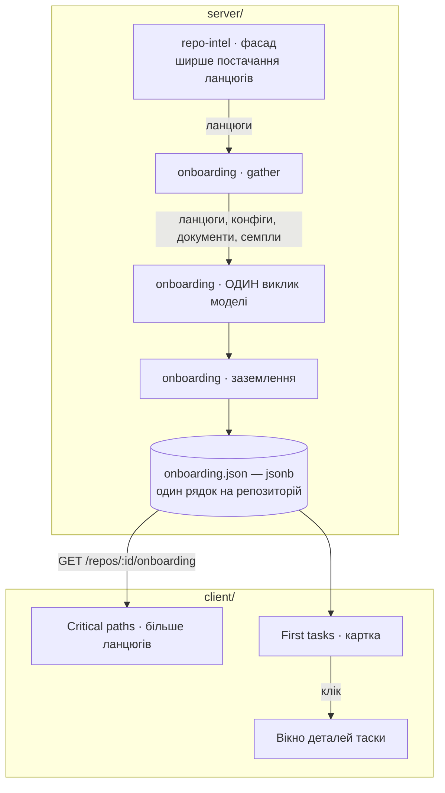

# Spec: Onboarding Tour — depth

**Spec ID:** SPEC-04
**Status:** approved
**Created:** 2026-08-18
**Approved:** 2026-08-18 — 57 активних критеріїв і D1…D23, після закриття Q-1…Q-11.
**Amended:** 2026-08-18 — відповіді людини на Q-1…Q-7. Дописано D11…D19 і AC-58…AC-72; **переписано**
AC-26, AC-28, AC-37, AC-41, AC-42, а також N2 і D3, бо відповідь на Q-5 їх прямо скасувала. Додано
Q-8 і Q-9. **Спека не схвалена:** це відповіді на питання, а не приймання документа, і критеріїв у
ньому тепер 72, а не 57.
**Виправлено 2026-08-18, того ж дня:** приклад до формули D11 міряв не те, що міряє сама формула —
897 файлів із диска замість `files_indexed` = 656 з індексу. Виправлено п'ять місць (бюджет 27 411,
не 28 700). З розбору розриву випливла **друга названа вада сигналу** і **Q-10** про калібрування
рампи. Формула не змінена.
**Доповнено 2026-08-18, третій раунд:** відповіді людини на Q-8, Q-9 і Q-10 записані як D20, D21 і
D22. D20 **скасовує N7, переписує AC-38** і додає другий шматок до `**Supersedes:**`, бо
mermaid-діаграму замінює детермінована мапа; ціна заміни названа числом, і з неї постало **Q-11**.
D22 змінює знаменник рампи з 5 000 на 2 000, тож **перераховано** D2, D11, D13, AC-41, Edge cases і
NFR: цей репозиторій дістає **32 528** замість 27 411, семпли перестають різатися взагалі, а
годинник на ньому лишається в наявних 180 000.
**Розвернуто 2026-08-18, четвертий раунд (Q-11):** **третю частину — мапу одиниць — знято цілком.**
Спека тепер про **дві** речі. D20 скасовано, mermaid-діаграма лишається чинною, другий шматок із
`**Supersedes:**` прибрано. Знято G5, US-3, AC-26…AC-38, AC-51, AC-69, D6, D7, D9, D14, D17, D20;
номери **не перевикористано** — знятe названо поіменно в `## Acceptance criteria`. Увесь хід
рішення і його підстава — **D23**. Зняття N7 SPEC-03 (фасад `repo-intel`) до мапи не мало
стосунку і **лишається чинним** — воно належить ширшим критичним шляхам (D4). Відкритих питань
немає.
**Supersedes:** `specs/SPEC-03-onboarding-tour.md` **N7 частково** — заборону розширювати фасад
`repo-intel` знято (D4). Доктрина D21 тієї ж спеки — «жодного числа від моделі» — **лишається
чинною** і тут підтверджена (N4, AC-16).

_Редакція 2026-08-18 мала другий шматок — скасування всього, що стосується mermaid-діаграми (D12,
AC-11, AC-12, AC-13, AC-71, AC-77, AC-80 SPEC-03), — і його **знято разом із мапою одиниць**.
Діаграма лишається чинною без змін. Підстава — D23._
**Modules:** server, client

## Problem and user

Користувач той самий, що і в SPEC-03: розробник, який уперше відкрив незнайомий репозиторій.
Фіча для нього вже працює — п'ять секцій, заземлення, ~$0.005 і ~1 хв 45 с на тур. Тобто це не
спека про відсутню функцію, а спека про **глибину відповіді**, і кожна з трьох її частин має
зміряну причину, а не враження.

**Перше. Картка таски каже, що робити, і не каже, як.** Контракт `OnboardingTask` — це рівно
чотири поля: `title`, `path`, `why`, `complexity`
(`server/src/vendor/shared/contracts/knowledge.ts:147-153`). Новачок дістає назву зміни, один
файл і одне речення, чому це добра перша задача. Питання «з чого почати всередині цього файлу»,
«чого ще це торкнеться» і «як я зрозумію, що зробив» лишаються без відповіді — а це саме ті
питання, задля яких людина клікає.

Додаткова обставина, яку фіча вже про себе знає: чотири не-архітектурні `body` переказують
структуровані поля поруч із собою, тому секція перших тасок свою прозу взагалі не малює
(`client/src/app/repos/[repoId]/onboarding/_components/OnboardingTourView/_components/FirstTasksSection/FirstTasksSection.tsx:10-18`).
Тобто місця, куди подробиця могла б лягти сама, у контракті немає — і вікно, що перекаже картку,
відтворить рівно той самий дефект.

**Друге. Критичних шляхів один, і ріже не тур.** Стелі туру — `MAX_FLOWS = 4`,
`MAX_FLOW_STEPS = 6` (`server/src/modules/onboarding/constants.ts`) — не досягаються. Ріже
постачання: `getCriticalPaths` сіє ланцюги з `CRITICAL_PATH_ROOTS = 5` найранговіших файлів і
йде `BFS_DEPTH = 2` хопи (`server/src/modules/repo-intel/service.ts:718,725,745`,
`server/src/modules/repo-intel/constants.ts:59`), а ланцюги коротші за два файли відкидає
(`service.ts:734`). Верхня межа назавжди — **5 ланцюгів по 3 файли**, і фактично менше: блок
`critical_paths` на цьому репозиторії зважив **60 токенів** проти 7 077 у документів
(`server/INSIGHTS.md`, «The last input of a budget walk is all-or-nothing…»), тобто на вхід
пішов один-два ланцюги.

Індекс при цьому не бідний: 2 123 символи, 25 404 посилання, 656 ранжованих файлів. Дані є,
фасад їх не віддає.

**Причина, ймовірно, глибша за стелю, і спека зобов'язана це назвати.** Ранг винагороджує те, що
його багато хто імпортує; обхід іде **від імпортера до імпортованого**. Тобто коренями стають
файли, які самі імпортують мало — контракти, токени, дрібні хелпери, — і ланцюг від такого кореня
вмирає на першому кроці й вилітає за `chain.length < 2`. Підняття стелі з 5 до 20 без зміни
сіяння підніме кількість кандидатів, але не обов'язково кількість ланцюгів. Тому вимоги нижче
сформульовані **про результат постачання** (AC-17…AC-19), а не про значення двох констант:
підняти число — це гіпотеза, а не рішення, і критерій має ловити випадок, коли гіпотеза не
спрацювала.

**Третє — знято.** Замовлення мало третю частину: клікабельний перелік частин системи під
«Architecture overview», із вікном, що показує зв'язки. Її специфікували, зміряли ціну і **за
результатом виміру не будують узагалі**. Увесь хід і підстава — **D23**; тут досить сказати, що
секція архітектури лишається такою, якою її зробила SPEC-03: проза плюс mermaid-діаграма з
неклікабельними вузлами (D12 SPEC-03).

**Спільна межа обох частин — бюджет входу, і він уже вичерпаний.** 23 481 із 24 000. Тому кожна з
двох частин має в цій спеці названу ціну в токенах (D2), а результат — перевірюваний критерій на
числах (AC-41, AC-42).

_Редакція 2026-08-18:_ **сама ця межа рухається.** Людина ухвалила, що бюджет перестає бути сталою
і стає функцією розміру репозиторію (D11). Це не скасовує обліку — воно робить його двоступеневим:
скільки коштує додаток, і скільки бюджету репозиторій отримав. Для цього репозиторію нова формула
дає **32 528** замість 24 000, і **витісняється нуль** — приріст бюджету (+9 047) більший за приріст
запиту, ще й з таким запасом, що семпли перестають різатися взагалі (D2, переписаний).

**І тут же — четверте, чого замовлення не називало, але що робить решту неперевірюваною.** Зміряно
2026-08-18: `MAX_DOC_CHARS` = 4 000, різ із кінця; перша згадка `scripts/dev.sh` у `README.md`
цього репозиторію стоїть на символі **4 484**, тобто **за різом**, а в `AGENTS.md` — на 879, тобто
в межах. Найкорисніший для новачка рядок доходить до моделі лише тому, що його випадково має
другий файл. Репозиторій, що описує свій bootstrap тільки в довгому README, не отримає його
взагалі — мовчки, з зеленими воротами.

Це **четвертий випадок одного класу** в цій фічі: `repo_map` був недосяжний у кожній генерації,
`project_docs` жодного разу не входив, змінні середовища зрізалися мовчки, тепер це. Спільний
корінь — **вхід обмежують у кількох незалежних місцях, і жодне з них не звітує, що саме воно
приховало.** `inputs[]` сьогодні каже «7 of 7 documents, 2 shortened» — а «2 shortened» читач не
може перетворити на «мапа API сервера не дійшла».

Спека ставиться до цього так, як велить різниця між дефектом і вимогою. **Сам зріз документа —
дефект наявної фічі, і його виправлення в обсяг цієї спеки не входить** (N12). Але SPEC-04
**витісняє** семпл-файл і **додає** нові обмежені поверхні, тож вона зобов'язана не додати
четвертої мовчазної стелі — і зобов'язана зробити власне витіснення іменованим, а не лише
порахованим (G6, AC-54, AC-55). Чи має різницю «цього немає» проти «це є, але не влізло» бачити
**читач туру**, а не лише той, хто відкрив запис, — Q-7.

## Goals / Non-goals

**G1.** Клік на картку першої таски відкриває вікно, у якому є **що робити крок за кроком, де саме,
чого це торкнеться і за чим видно, що зроблено** — набір фактів, якого на картці немає.
**G2.** Поглиблення не купується другим викликом моделі: усе, що показує вікно, згенеровано в тому
самому єдиному виклику, а клік коштує нуль.
**G3.** Критичних шляхів на екрані стає істотно більше і вони довші — з того самого індексу, без
нового входу і без переіндексації.
**G4.** Постачання ланцюгів перестає бути зашитою стелею чужого модуля: його можна змінити, не
змінюючи форми жодного запиту і не зачепивши жодного іншого споживача.
**G5.** ~~Детермінований перелік одиниць системи під «Architecture overview».~~ **Знято 2026-08-18
за відповіддю на Q-11** — підстава в D23. Номер не перевикористовується.
**G6.** Кожне з трьох розширень має названу ціну у вхідному бюджеті й назване витіснення, і обидва
видно в збереженому записі — **іменовано, а не лише порахованим**: запис каже, який саме семпл
випав і який саме документ обрізано, бо «одним менше» не перетворюється на «мапа API не дійшла».
**G7.** Жодна нова поверхня не послаблює заземлення, недовірене рендерення і заборону чисел від
моделі, які SPEC-03 зробила властивістю фічі.
**G8.** _(Додано 2026-08-18, відповідь на Q-5.)_ Бюджет входу перестає бути сталою і стає функцією
розміру репозиторію — з названим сигналом, названими межами, названою формулою і **годинником, що
росте разом із ним**, бо таймаут коштує оплаченої генерації, а не лише часу.

**Non-goals** — межі для планувальника, не побажання:

**N1.** **Другий виклик моделі, зокрема виклик на клік.** Підтверджує N3 SPEC-03 і додає причину,
якої там не було: клік, що коштує грошей, — це рівно те, що D9 SPEC-03 відмовився робити з
відкриттям сторінки. Ціна рішення названа в D1.

**N2.** ~~Підняття `ONBOARDING_TOKEN_BUDGET` понад 24 000.~~ **Скасовано 2026-08-18 відповіддю на
Q-5.** Бюджет стає функцією розміру репозиторію в межах 24 000…50 000 (D11), годинник росте разом
із ним (D12). Межа, що лишається на місці: **більший бюджет не піднімає жодної стелі вибірки**
(D13, AC-67) — він вміщує те, що пайплайн уже просить, і не купує двадцять першого семпла.
Рядок лишено закресленим, а не видалено, бо на нього посилаються D2 і D3.

**N3.** **Будь-яка зміна того, що індексується.** Ані нового екстрактора, ані розширення
`SUPPORTED_EXT`, ані переіндексації. Фіча читає індекс, який уже є, і його форму не змінює.
Наслідок, який лишається чинним: репозиторій поза TS/JS і далі отримує чесну відмову (D19
SPEC-03).

**N4.** **Числа від моделі.** Доктрина D7/D21 SPEC-03 не переглядається. Кожне число на новій
поверхні рахує код (AC-30), а проза лишається без кількостей (AC-16).

**N5.** **Шоста секція.** Ця фіча поглиблює наявні секції і жодної не додає. Перелік із п'яти
закритий, і причина, з якої він закритий, не змінилася (`knowledge.ts:28-47`). _(До 2026-08-18 цей
рядок казав те саме про мапу одиниць, яка мала жити всередині `architecture`; мапу знято — D23.)_

**N6.** **Редагування, створення issue, призначення виконавця.** AC-36 SPEC-03 стоїть: секція
перших тасок нічого не створює і нікуди не надсилає. Вікно деталей — теж.

**N7.** **Клікабельні вузли mermaid-діаграми.** D12 SPEC-03 не переглядається: вузли лишаються
підписами, а не посиланнями, бо частина з них — поняття, а не файли.

_Історія цього рядка варта одного речення, бо вона пояснює, чому спека взагалі говорить про
діаграму._ 2026-08-18 його скасували на користь детермінованої мапи, яка мала діаграму замістити;
того ж дня вимір показав ціну заміни, і рішення розвернули. Рядок чинний у первісному вигляді —
підстава в D23.

**N8.** **`mcp/` і `e2e/`.** Ані інструмента, ані нового браузерного сценарію ця фіча не додає.

**N9.** **Scrollspy у бічній рейці та підтримка `./scripts/dev.sh` у секції «Як запустити».**
Будуються паралельно й окремо; ця спека їх не описує і планувальник їх не планує.

**N10.** **Історія турів і публічне посилання.** N2 і N11 SPEC-03 стоять без змін.

**N11.** **Нові маршрути API.** Усе нове їде наявними двома
(`server/src/vendor/shared/contracts/onboarding-api.ts:6-8`), і це вимога (AC-53), а не збіг:
новий маршрут — це нова межа частоти, нова перевірка доступу і нова поверхня для IDOR.

**N12.** **Виправлення самого зрізу документів — це дефект наявної фічі, а не обсяг цієї спеки.**
`MAX_DOC_CHARS` = 4 000 і різ із кінця ховають `scripts/dev.sh` у `README.md` цього репозиторію
(символ 4 484 проти стелі 4 000), і фіча тут працює з запасом в один файл — рятує лише `AGENTS.md`.
Це справжня вада, і вона названа тут, щоб не загубитися: правильні відповіді на неї — розумніший
зріз (тримати розділи, а не перші 4 000 символів), окрема блокова стеля документів, або підняття
числа — усі три є **зміною наявної поведінки**, і жодна з них не є поглибленням туру. Іде в
бэклог. Ця спека відповідає лише за те, щоб **не додати четвертої мовчазної стелі** і щоб те, що
вона витісняє сама, було названо поіменно (AC-54, AC-55).

_Оновлено 2026-08-18:_ у цього дефекту тепер є названий власник і тригер. Відповідь людини на Q-9
(D21) відправляє надлишок бюджету саме на `MAX_DOC_CHARS` — тобто **одне рішення закриває дві
речі**, і це найсильніший аргумент за нього. N12 лишається поза обсягом **цієї** спеки, але
перестає бути безхазяйним рядком у бэклозі.

## Decisions and alternatives

### D1 — Деталі таски генеруються наперед, у тому самому єдиному виклику

Рішення: модель пише кроки, пояснення і рядок перевірки **разом з усім іншим**, вони зберігаються
в записі, і клік лише відкриває те, що вже лежить.

**Відкинуто: другий виклик на вимогу, коли людина клікнула.** Аргумент за нього справжній —
платити тільки за те, що відкрили. Проти нього три речі, і перша вирішальна.

_Ціна одного кліку — це весь вхід ще раз._ Щоб описати таску в термінах цього репозиторію, другий
виклик мусить бачити те саме: скелет, конфіги, ланцюги, документи, семпли. Це **23 481 токен на
клік** проти приблизно 200 токенів інструкцій **один раз на генерування**. Вигода «платимо лише за
відкрите» зникає на другому кліку.

_Клік, що коштує грошей, уже заборонений в іншому місці цієї фічі._ D9 SPEC-03 відмовився
рахувати тур на відкритті сторінки саме тому, що «кожен, хто випадково клікнув пункт меню,
витратив гроші воркспейсу». Картка таски клікається легше за пункт меню.

_Клік, що чекає модель, — це погана взаємодія._ Вікно, яке відкривається за 20-60 секунд, читач
закриє раніше, ніж воно наповниться.

**Ціна ухваленого рішення, названа чесно.** Кожне генерування платить за деталі тасок, яких ніхто
не відкриє. Порядок величини: приблизно 150-200 вихідних токенів на таску, українською — тобто
щільніше кодується і коштує більше за латиницю (`constants.ts`, `ONBOARDING_TIMEOUT_MS`). На 12
збережених тасок це порядку 3-4 тисяч додаткових вихідних токенів; у грошах на дефолтній дешевій
моделі це одиниці десятих цента при поточних ~$0.005 за тур, тобто не проблема.

**Проблема — годинник, і вона справжня.** Виклик має 180 000 мс
(`ONBOARDING_TIMEOUT_MS`), а поточне генерування триває ~105 000. Додаткові 3-4 тисячі вихідних
токенів можуть з'їсти половину запасу. Тому спека вимагає двох речей замість здогаду: запис має
нести тривалість виклику (AC-43), а кількість тасок, що несуть деталі, названа числом.

_Закрито 2026-08-18:_ людина обрала **шість** тасок (D15), що знімає більшу частину цього ризику, а
годинник окремо став функцією бюджету (D12) — бо після відповіді на Q-5 на нього тисне вже не тільки
вихід, а й вхід.

### D2 — Ціна кожного розширення названа в токенах, і вона виведена з виміру, а не з відчуття

Вимір 2026-08-18 на `server/clones/Holubinka/dev-digest` (`server/INSIGHTS.md`, «The last input of
a budget walk is all-or-nothing unless it is offered item by item», і запис в «Open Questions» того
ж файлу):

| Складова входу | Токенів |
|---|---|
| системний промт + каркас повідомлення | 2 192 _(виведено як 23 481 мінус сума блоків)_ |
| `repo_map` | 1 514 |
| `package_configs` | 753 |
| `critical_paths` | **60** |
| `project_docs` | 7 077 _(7 із 7 документів)_ |
| `file_samples` | 11 885 _(13 із 19 файлів)_ |
| **разом пораховано** | **23 481** із 24 000 — вільно **519** |

Звідси ціна кожної з двох частин:

| Розширення | Куди лягає в бюджеті | Оцінка | Що витісняє |
|---|---|---|---|
| **Деталі таски** | системний промт — нові інструкції про кроки, пояснення і перевірку | **+150…300** | нічого, доки вкладається у вільні 519 |
| **Більше критичних шляхів** | блок `critical_paths` | **60 → близько 1 000**, тобто **+900…1 100** | **рівно один семпл-файл** (13 → 12) |
| **Іменоване витіснення** (AC-54, AC-55) | нікуди — це поле запису, не блок промта | **0** | нічого |
| **разом** | | **+1 050…1 400** | див. нижче |

_Знята третя частина суму не рухає, і це перевірено, а не припущено: мапа одиниць коштувала **0
токенів входу** — вона рахувалася кодом і в промт не йшла, — тож `150…300 + 900…1 100` дає ті самі
`+1 050…1 400`. Уся арифметика D11 і D22 лишається чинною без перерахунку._

**Витіснення — переписано 2026-08-18, бо бюджет більше не стала.** Ціна додатків не змінилася:
вони коштують ті самі +1 050…1 400 токенів. Змінилося те, з чого їх платять.

| Сценарій | Бюджет | Вільно до додатків | Що витісняється |
|---|---|---|---|
| **Як було написано** — стала 24 000 | 24 000 | 519 | один семпл-файл (13 → 12 із 19) |
| **Нижня межа формули** — репозиторій без індексу чи зовсім малий | 24 000 | 519 | один семпл-файл; підлога навмисне дорівнює числу, на якому фіча доведено працює |
| **Цей репозиторій** — `files_indexed` = **656** | **32 528** | **+9 047** проти поточних 23 481 | **нічого; семпли перестають різатися взагалі** (13 → 19 із 19, ще й ≈2 000 токенів запасу) |
| **Верхня межа** — `files_indexed` ≥ 2 000 | **50 000** | ≈26 500 | нічого: 50 000 ≈ повний запит усіх входів за поточних стель (D11) |

Тобто відповідь на «що витісняється» тепер має два кінці, і обидва названі: **на підлозі — один
семпл-файл, на всьому іншому діапазоні — нічого.** Критерій, що це ловить, переписано двічі: з «не
менше 12 із 19» на «не менше 13», а після D22 — на **«не менше 18 із 19»** (AC-41), бо з крутішою
рампою йдеться вже не про відсутність регресії, а про те, що різати перестає зовсім.

Арифметика ланцюгів, щоб число не було з повітря: 60 токенів блоку — це заголовок і недовірена
обгортка (близько 20) плюс один-два ланцюги. Ланцюг із п'яти шляхів завдовжки як у цьому
репозиторії — близько 50 токенів. Двадцять таких ланцюгів — близько 1 000.

Семпл-файл коштує в середньому 914 токенів (11 885 на 13 файлів), тож при **сталому** бюджеті
дефіцит у 530-880 токенів після вільних 519 забрав би **один** файл із хвоста, а не два. За змінного
бюджету (D11 у редакції D22) цей дефіцит не виникає взагалі, і AC-41 тому вимагає **не менше 18 із
19** — тобто повного вміщення, а не керованої втрати.

Рядок `project_docs` не має зрушити взагалі (AC-42): документи стоять **вище** семплів після
рішення людини 2026-08-18, тож обхід ріже хвіст семплів, не документи.

### D3 — ~~Бюджет входу лишається 24 000~~ · переглянуто 2026-08-18

Перша редакція лишала бюджет сталою і відкидала його підняття двома аргументами: «це зміна для всіх
репозиторіїв заради одного» і «ми не знаємо, чи хвостові семпли щось важать». **Відповідь на Q-5
знімає перший і лишає другий.**

Перший аргумент знято тим, що бюджет більше не однаковий для всіх: він стає функцією розміру, тож
малий репозиторій нічого не переплачує (D11). Другий аргумент **не знято** — він переїхав у D13 і
став вимогою (AC-67) та новим питанням (Q-9): більший бюджет вміщує те, що пайплайн уже просить, і
не має права купувати нових стель, доки ніхто не зміряв, що більше матеріалу дає кращий тур.

Що з першої редакції лишається чинним без змін: **годинник — це справжня ціна, а не гроші.** Тепер
це не аргумент проти бюджету, а вимога в парі з ним (D12, AC-62…AC-65).

### D4 — Розширення `repo-intel` — **та сама фіча**, а не окрема

Людина спитала прямо, і відповідь спирається на факт, а не на смак: **`getCriticalPaths` і
`getTopFilesByRank` мають рівно одного виробничого споживача — `onboarding`**
(`server/src/modules/onboarding/gather-executor.ts:95,97`; жоден інший модуль їх не викликає).

З цього випливає все інше:

- Відвантажене окремо, розширення фасаду **не змінює нічого спостережуваного**. Його не можна ні
  прийняти, ні відхилити самостійно, тобто воно не є фічею — воно є робочим пакетом цієї.
- Ризик для чужих споживачів **нульовий**, бо їх немає. Це рівно та обставина, якої не було, коли
  D21 SPEC-03 відмовлявся чіпати чужий модуль; вона й перевертає рішення, а не зміна смаку.
- Вартість — теж нульова: обидва читання (`getEdges` без `LIMIT`, `getRankedPaths(repoId, 100_000)`)
  виконуються однаково незалежно від стелі, бо стеля — це зріз у пам'яті **після** того, як граф і
  ранг уже завантажені (`repository.ts:432-437,471-481`; `service.ts:707,718`). Підняти її з 5 до
  20 не змінює форми жодного запиту. Звідси AC-25.

**Що при цьому НЕ переглядається.** D21 SPEC-03 мав дві половини: «фасад чужий, не чіпаємо» і
«число від моделі — не доказ». Перша знята. Друга стоїть і в цій спеці підтверджена двічі (N4,
AC-30, AC-33). Спека каже це вголос, бо спека, що переглядає рішення мовчки, читається як спека,
що його не помітила.

**Наслідок для меж модулів, який планувальник мусить знати:** `modules/onboarding/**` не має права
називати `modules/repo-intel/**` — заборонено `no-cross-module`, і контракт фасаду тому переписаний
структурно в `server/src/modules/onboarding/generation-types.ts:56-63`. Розширення фасаду — це
зміна у двох місцях, які не бачать одне одного.

### D5 — Вимога сформульована про результат постачання, а не про два числа

Спокуслива форма вимоги — «підняти `CRITICAL_PATH_ROOTS` до 20 і `BFS_DEPTH` до 4». Спека цього не
пише, і причина в `## Problem and user`: сіяння коренями за рангом працює проти напрямку обходу, і
двадцять коренів, кожен із яких нічого не імпортує, дадуть двадцять відкинутих ланцюгів довжиною 1.

Тому критерії говорять про те, що видно: скільки різних ланцюгів подано на вхід (AC-17), яка
найбільша дозволена довжина (AC-18), що ланцюги не повторюють один одного (AC-19) і що обидва
числа лежать у записі (AC-20). Як саме добирати корені — рішення реалізації, і воно має право бути
іншим, ніж «те саме, але з більшим числом».

**Відкинуто: лишити стелю і просто показувати більше з того, що є.** Показувати нічого: постачання
й є межею, і `MAX_FLOWS = 4` вже стоїть **нижче** за неї свідомо
(`onboarding/constants.ts`, коментар до `MAX_FLOWS`). Звідси AC-22: стеля показу не має права
знову стати вужчою за постачання.

### D6, D7 — ~~мапа рахується кодом~~ · ~~мапа зберігається в записі~~ · знято 2026-08-18

Обидва рішення стосувалися мапи одиниць і зникли разом із нею (D23). Номери не
перевикористовуються.

**Одне з них лишає по собі наслідок, який пережив мапу і лишається чинним:** кожне нове поле
контракту дістає порожній `.default()`, бо запис лежить у `jsonb` і парситься на читанні. Поле без
дефолту перетворює кожен раніше збережений тур на `null` — тобто на «нічого немає, натисніть
Generate» — про тур, який у базі цілий і вже оплачений (`contracts/knowledge.ts`, коментар до
`OnboardingDraft`; `server/INSIGHTS.md`). Це стосується полів деталей таски так само, як стосувалося
мапи. Звідси AC-46.

### D8 — Стан «що відкрито» живе в URL

Вікно деталей таски — це стан, яким діляться: «подивись на оцю таску» має бути посиланням. Правило
вже сформульоване як принцип фронтенду цього репозиторію — стан, яким можна поділитися, живе в URL,
а не в `useState` — і D14 SPEC-03 уже застосував його до активної секції. Звідси AC-12, і звідси ж
безкоштовний наслідок: `Share link` (AC-82 SPEC-03) копіює URL як є, тож поділитися конкретною
таскою нічого додатково не коштує.

### D9 — ~~Означення «одиниці» мапи~~ · знято 2026-08-18 разом із мапою

Рішення стосувалося того, що вважати одиницею — пакет, теку чи файл з ендпоінтами. Мапи немає, тож
питання не стоїть. Таблиця трьох кандидатів і те, чим кожен з них поганий, збережені в **D23** —
вони є частиною доказу, чому мапу зрештою не будують. Номер не перевикористовується.

### D10 — Команда всередині кроку таски проходить те саме заземлення, що й секція запуску

Крок «переконайся, що воно працює» майже завжди хоче назвати команду, і це найгостріша точка вікна
з тієї самої причини, з якої D18 SPEC-03 назвав секцію запуску найгострішою секцією фічі:
**результат читач копіює й виконує**. Вигадана команда помиляється дією, а не текстом, і `pnpm` у
npm-проєкті створює другий лок-файл раніше, ніж людина помічає.

Тому рішення: крок має право назвати команду **лише** ту, що вже пройшла заземлення секції «Як
запустити» для свого пакета (AC-7); усе інше з кроку вирізається і лічиться в наявний
`unknown_script` (AC-8). Механізм не новий — новою є лише поверхня, на яку він поширюється.

**Відкинуто: заборонити команди в кроках узагалі.** Простіше і безпечніше, але забирає з вікна
відповідь на «як я зрозумію, що зробив», тобто рівно те, задля чого воно існує.

### Рішення за відповідями людини, 2026-08-18

_Сім питань першої редакції закриті: Q-1, Q-3, Q-4, Q-5 і Q-6 відповіла людина, дефолти Q-2 і Q-7
прийнято як є. Нижче кожне як рішення з автором. Таблиця відкритих питань їх більше не тримає —
питання, що лишилося в ній після відповіді, читається як невирішене._

**D11 — Бюджет входу є функцією `files_indexed`, лінійною, від 24 000 до 50 000.** _(Людина, Q-5.)_

_Сигнал._ `files_indexed` уже лежить у `IndexState` і вже стамплений у запис туру як
`OnboardingIndexState.files_indexed`. Нового вимірювання не потрібно, і спека його не заводить.

_Формула, у редакції D22 від 2026-08-18._
`бюджет = 24 000 + 26 000 × min(files_indexed, 2 000) / 2 000`.

Перша редакція ділила на `MAX_INDEXED_FILES` = 5 000. Замінено — підстава і числа в D22.

_Підлога 24 000, а не 20 000, і це свідоме відхилення від названого числа._ Вказівки було дві —
«близько 20 000» і «не опускай нижче за те, на чому фіча доведено працює», — і вони розходяться:
**цей репозиторій витрачає 23 481 токен**, тож підлога 20 000 була б регресією рівно на тому
репозиторії, на якому фічу демонструють. 24 000 задовольняє обидві вказівки: це «близько 20 000» і
водночас єдине число, за яким є зелений прогін.

_Стеля 50 000 виведена, а не обрана._ Це повний запит усіх входів за поточних стель:

| Вхід | Максимум за поточних стель | Звідки число |
|---|---|---|
| системний промт + каркас | 2 192 | вимір 2026-08-18 |
| `repo_map` | 1 514 | обмежений `REPO_MAP_TOKEN_BUDGET` = 1 500 |
| `package_configs` | ≈2 000 | вимір 753 на 5 пакетів, лінійно до 12 |
| `critical_paths` | ≈1 000 | 20 ланцюгів по 5 шляхів (AC-17, AC-18) |
| `project_docs` | 14 000 | (`MAX_PACKAGES` 12 + 2) × `MAX_DOC_CHARS` 4 000 / 4 |
| `file_samples` | 30 000 | `SAMPLE_FILE_COUNT` 20 × `MAX_FILE_CHARS` 6 000 / 4 |
| **разом** | **≈50 700** | |

Тобто **вище 50 000 купувати нічого**: за поточних констант пайплайн більше просто не просить. Це
робить AC-67 описом факту, а не додатковим обмеженням.

_Відкинуто: два рівні («малий → 20 000, великий → 50 000»)._ Формулювати простіше, поводиться
гірше: репозиторій на `N+1` файлі платив би у 2,5 раза більше за репозиторій на `N`, і ніхто,
поклавши два тури поруч, не побачив би різниці, яка це виправдовує. Лінійна функція обриву не має.

_Названа вада обраного сигналу, бо вона справжня._ Бюджет просять **пакети**, а не файли:
`project_docs` і `package_configs` ростуть із кількістю пакетів; `file_samples` просить свої 30 000
практично незалежно від розміру репозиторію, бо це двадцять файлів по 6 000 символів усюди, де такі
файли є; `repo_map` і `critical_paths` обмежені зверху. Тобто **малий монорепо з дванадцятьма
пакетами формула недофінансує, а великий однопакетний — перефінансує.** Прийнято попри це:
деградація тут м'яка — обхід ріже хвіст семплів і каже про це в `inputs[]`, а не падає, — а друга
вісь подвоїла б те, що доведеться пояснювати кожному, хто побачить у записі незрозуміле число.
Випадок винесено в `## Edge cases`, а не сховано.

_Друга вада того самого роду, знайдена при звірці числа: **`files_indexed` систематично занижує
розмір репозиторію.**_ Він рахує не файли репозиторію, а файли, які **обхід індексера взяв у
роботу** — шість розширень `SUPPORTED_EXT` і вісім імен тек у `EXCLUDED_DIRS` (`node_modules`,
`dist`, `build`, `coverage`, `.next`, `out`, `vendor`, `.git`). На цьому репозиторії це ховає **87
вендорованих файлів із 743**, тобто 12 %, і ховає їх мовчки: `files_skipped` рахує лише те, що
відкинули за розміром чи стелею, а тека, викинута за іменем, кандидатом не стає взагалі — тому
`files_skipped` = 0 при розриві в сотні файлів.

Узагальнено: **репозиторій, у якому багато не-TS/JS або багато вендорованого коду, виглядає меншим,
ніж він є, і отримує менший бюджет, ніж просять його документи й конфіги.** Це та сама вада, що й
перша, з іншого боку: сигнал міряє проіндексований код, а бюджет просять документи та конфіги, яких
індекс не бачить **узагалі** — `SUPPORTED_EXT` не містить ані `.md`, ані `.json`, ані `.yml` (D16
SPEC-03).

Прийнято, і ось що робить це прийнятним, а не недоглядом. **Патологічний випадок уже відмовлено:**
репозиторій поза TS/JS не отримує туру взагалі (D19 і AC-73 SPEC-03), тож «Python-монорепо з
підлоговим бюджетом» до генерування не доходить. Лишається **змішаний** репозиторій — TS-фронтенд на
Go- чи Ruby-беку, — який індексується наполовину й наполовину фінансується. Він деградує так само
м'яко і так само видимо, і це записано в `## Edge cases`.

_Чого в цьому розриві **немає**, і це треба сказати, щоб наступний читач не «полагодив» правильне._
Із 241 файла різниці **154 — не вада сигналу, а його правильна семантика**: клон стоїть на комміті
`2f8b7e1`, а гілка пішла далі. Індекс описує репозиторій **на тому комміті, з якого його зібрано**, і
D6 SPEC-03 зробив саме це ключем усієї фічі — `lastIndexedSha`, а не `head_sha`. Сигнал, прочитаний
з індексу, успадковує цю властивість і має її успадковувати. Назвати це дефектом означало б
перевернути схвалене рішення.

_І одне чесне визнання про калібрування, яке з правильного числа стало видним — і вже закрите._
Перша редакція ділила на `MAX_INDEXED_FILES` = 5 000, і тоді цей репозиторій, стоячи на 13 % тієї
стелі, діставав 27 411 при повному запиті ≈30 500: **навіть «правильний» бюджет не фінансував
повністю той репозиторій, на якому фічу показують.** Рампу переглянуто в D22 — знаменник тепер
2 000, і цей репозиторій дістає 32 528, тобто запит покривається із запасом.

**D12 — Годинник виклику росте разом із бюджетом; 300 000 мс на верхній межі виведено, а не
обрано.** _(Наслідок Q-5, ухвалений тут.)_

Поточна пара — **105 000 мс на 23 481 токен**, тобто 4,47 мс на токен входу, якщо припустити, що
час росте з входом. За цим припущенням 50 000 токенів дають **близько 223 500 мс**, і наявні
180 000 їх не вміщують: тур падав би за таймаутом саме на тих репозиторіях, заради яких бюджет
піднімали, а кожне падіння — це **оплачена і викинута генерація**, бо провайдеру вже заплачено.

300 000 мс лишають 34 % запасу над цією оцінкою. Оцінка свідомо песимістична: час ділиться на
prefill входу і decode виходу, а довжина виходу обмежена стелями контракту, а не розміром входу —
тобто реальне зростання сублінійне. Спека бере песимістичну межу, бо ціна помилки несиметрична:
зайва хвилина очікування коштує хвилини, а таймаут коштує генерації. Верхня межа годинника — теж
300 000 мс (AC-64): п'ять хвилин уже на межі того, що можна називати кнопкою.

**D13 — Більший бюджет не піднімає жодної стелі вибірки, і гіпотеза «більше матеріалу — кращий тур»
лишається неперевіреною.** _(Наслідок Q-5.)_

Бюджет 50 000 повертає семпли з тринадцяти до всіх двадцяти. Але **які саме файли повертаються —
має значення, і воно не на користь гіпотези**: відбір іде за рангом, а ранг винагороджує «мене
багато хто імпортує». Файли з чотирнадцятого по двадцятий — за побудовою **найменш центральні з
двадцяти**, і саме серед них барелі й дрібні хелпери, від яких `MIN_FILE_CHARS` уже відмовляється.

Тому спека не постулює, що більше — краще. Вона вимагає, щоб бюджет і сигнал розміру лежали в
записі (AC-60), і тим робить питання відповідним на вимір: той самий репозиторій, згенерований
двічі за різних бюджетів, дає два записи, які кладуться поруч. Що робити з більшим бюджетом, якщо
вимір скаже «нічого не змінилося», — Q-9.

**D14 — ~~Одиниця мапи — пакет~~ · знято 2026-08-18 разом із мапою.** Вимір, який це рішення дало —
шість вузлів, два ребра, три вузли без зв'язків — не втрачено: він став доказом у **D23** і саме
він розвернув усю третю частину.

**D15 — Шість тасок, кожна з деталями.** _(Людина, Q-4.)_ Знімає ризик годинника, названий у D1:
шість тасок — це порядку 1 000-1 500 додаткових вихідних токенів замість трьох-чотирьох тисяч.

Наслідок для наявного екрана, який спека зобов'язана назвати: сторінка показує шість тасок без
розкриття, а зберігає дванадцять — тож після цього рішення **керування «показати ще N» не
намалюється ніколи** (AC-72). Це не побічний ефект, а видима зміна наявної поведінки: три-чотири
таски, що лежали під розкриттям, зникають із продукту.

**D16 — «used by N routes» не повертаємо.** _(Людина, Q-3.)_ Рядок критичного шляху лишається шлях
плюс опис. Розбіжність із макетом, яку SPEC-03 закрила в D7/D21, лишається закритою — і тепер уже
не тому, що фасад чужий (цю причину D4 зняв), а тому, що людина обрала цього не будувати. Загальне
правило далі стережуть AC-30 і AC-33.

**D17 — ~~Вікно одиниці показує лише ребра імпорту~~ · знято 2026-08-18 разом із мапою** (D23).

**D18 — Різницю «цього немає» проти «це є, але не влізло» бачить запис, а не читач туру.**
_(Дефолт Q-7, прийнятий людиною.)_ AC-54 і AC-55 роблять її видимою тому, хто відкрив запис. Ціна
названа чесно: **читач туру далі не має способу дізнатися, що секція бідна через стелю, а не через
репозиторій** — а це рівно те непорозуміння, яке N12 описує на прикладі `scripts/dev.sh`. Прийнято
як свідомий борг, а не як розв'язання.

**D19 — Макета не буде; форму обирає реалізатор.** _(Людина, Q-6.)_ І це рішення **підвищує вимоги
до критеріїв, а не знижує їх.**

`specs/README.md` тримає ціну мовчазної відповіді на це питання: 111 перевірених пунктів і п'ять
прогонів рев'ю по тому фіча мала неправильну форму, і зловила це лише людина, що подивилася на
екран. Тепер картинки не буде **ні в кого** — отже єдине, проти чого можна звірити результат, це
текст цієї спеки.

Тому AC-68…AC-71 дописані саме сюди: вони називають, які факти кожна з трьох поверхонь **мусить**
нести, і забороняють поле, якого немає в контракті. Це не розкладка — це те, що робить «неправильну
форму» помітною без картинки: екран, на якому бракує рядка перевірки або з'явилося поле нізвідки,
суперечить критерію, а не смаку.

Чого ці критерії **не** ловлять, і це треба знати наперед: порядок блоків на екрані, щільність,
типографіку і те, чи вікно є модальним, шухлядою чи розгортанням на місці. Якщо результат виявиться
незручним, а всі 72 критерії — виконаними, це буде правильна робота за неповною специфікацією, і
переробка коштуватиме як переробка.

**D20 — ~~Детермінована мапа пакетів заміщає mermaid-діаграму~~ · скасовано того ж дня в D23.**
_(Людина, Q-8, 2026-08-18; розвернуто людиною ж, Q-11, 2026-08-18.)_ Блок збережено цілком, бо він
**і є доказом**, на якому ґрунтується D23: ціну заміни зміряли вже після того, як заміну ухвалили.

_Що стоїть на екрані сьогодні._ Діаграма цього репозиторію несе **шість** ребер, і кожне з названим
механізмом: `e2e → client` (HTTP :3100), `client → server` (HTTP :3001), `mcp → server` (HTTP :3001),
`server → reviewer-core` (аліас tsconfig), `reviewer-core → LLM` (`LLMProvider`), `server → Postgres`
(Drizzle ORM).

_Що стане на її місце._ Мапа за імпортами дає **два** ребра. І, що гірше за сам розрив, вони
майже не перетинаються з тими шістьма:

| Ребро діаграми | Чи відтворює мапа | Чому |
|---|---|---|
| `server → reviewer-core` | **так** | справжній імпорт; 19 входжень `@devdigest/reviewer-core` |
| `client → server` | ні | це HTTP, а HTTP не є імпортом |
| `mcp → server` | ні | те саме |
| `e2e → client` | ні | живе в `scripts/e2e.sh`, а `.sh` не входить у `SUPPORTED_EXT` — індекс цього файлу не читає взагалі |
| `reviewer-core → LLM` | **ніколи** | LLM не є пакетом; у мапі пакетів для нього немає вузла |
| `server → Postgres` | **ніколи** | те саме |
| _(мапа додає)_ `reviewer-core → server` | — | аліас `@devdigest/shared` веде в серверну копію; на діаграмі цього ребра немає |

Тобто **із шести пояснювальних ребер мапа відтворює одне** і додає одне, якого на діаграмі не було.
Плюс зникає те, чого граф імпортів не несе за побудовою: **підписи механізму**. У мапи пакетів
рівно один тип зв'язку — «імпортує»; сказати «HTTP :3001», «Drizzle ORM» чи «`LLMProvider`» вона не
може ніде і ніколи.

_Друга половина правди, і вона переживає саме рішення._ Ті шість ребер **написала модель, і їх ніхто
не перевіряв**. Саме тому D12 SPEC-03 заборонив їх клікати: «частина вузлів — поняття, а не файли».
Тож обмін був не «шість правдивих на два правдиві», а **шість правдоподібних неперевірених на два
доведені**. Це твердження лишається чинним незалежно від того, як розв'язали питання, і записане
тут із числом саме тому, що колись повернеться: **діаграма туру не заземлена, і жодна редакція цієї
спеки цього не змінила.**

Три з шести пакетів (`client`, `e2e`, `mcp`) після заміни показували б вікно «зв'язків немає» — і це
було б **правда про граф імпортів і водночас неправда про систему**, бо ці три пакети спілкуються з
`server` щохвилини, просто по HTTP.

**Саме це формулювання і розвернуло рішення** — див. D23.

**D21 — Надлишок бюджету йде на `MAX_DOC_CHARS`, а не на повернення семплів.** _(Людина, Q-9,
2026-08-18.)_ Умова спрацювання та сама, що назвав D13: якщо вимір покаже, що повернуті семпли туру
не покращили.

**Одне рішення закриває дві речі, і це найсильніший аргумент за нього.** `MAX_DOC_CHARS` = 4 000 із
різом із кінця — це рівно дефект N12: у `README.md` цього репозиторію перша згадка `scripts/dev.sh`
стоїть на символі **4 484**, тобто за різом, і рятує ситуацію лише те, що `AGENTS.md` має її на 879.
Підняття стелі документа не «витрачає надлишок» — воно **лікує названу ваду фічі**, яку перша
редакція відправила в бэклог без власника.

Числа, щоб рішення переглядалося з них: стеля **5 000** символів уже вміщує ту згадку. Для цього
репозиторію це 7 документів по ≈1 250 токенів замість ≈1 000, тобто **+1 673 токени** — і після
D22 вони вкладаються у власний запас бюджету (≈2 000), тобто **не коштують жодного семпла**. Вище
5 000 — окреме рішення з окремим виміром.

**D22 — Рампа бюджету досягає стелі на 2 000 проіндексованих файлах, а не на 5 000.** _(Людина,
Q-10, 2026-08-18.)_ Знаменник формули D11 відв'язується від `MAX_INDEXED_FILES`.

_Підстава, і вона з власного виміру цієї ж спеки:_ **запит насичується раніше, ніж індекс доходить
своєї стелі.** Повний запит усіх входів за поточних стель — ≈50 700 (таблиця в D11), і його
досягає репозиторій задовго до 5 000 проіндексованих файлів: документи впираються в
`MAX_PACKAGES`, семпли — у `SAMPLE_FILE_COUNT`, скелет і ланцюги обмежені зверху. Прив'язка до
`MAX_INDEXED_FILES` була чистою — «бюджет на стелі рівно тоді, коли індекс на своїй», — але вона
калібрувала рампу на межу **іншої величини**, ніж та, що росте.

_Що це міняє для цього репозиторію._ 24 000 + 26 000 × 656/2 000 = **32 528** замість 27 411.
Доступне семплам: 32 528 − (2 192 + 1 514 + 753 + 1 000 + 7 077) = **19 992** проти їхнього повного
запиту 17 964 — тобто **всі 19 семплів вміщуються, із запасом близько 2 000 токенів**. Витіснення
зникає не «майже», а повністю, і саме тому AC-41 переписано з «не менше 13» на «не менше 18».

_Час — і тут новий знаменник дає приємний побічний результат._ 32 528 × 4,47 мс/токен ≈ **145 400
мс**, тобто **всередині наявних 180 000**: на цьому репозиторії годинник піднімати не треба взагалі.
Піднімати його треба на верхній межі — 50 000 токенів це ≈223 500 мс, і саме там працює AC-63.
Тобто зростання годинника перестає бути змінами «для всіх» і стає тим, чим має бути: поведінкою на
краю діапазону.

_Гроші._ 32 528 / 23 481 × $0.0053 ≈ **$0.0073** для цього репозиторію. Стеля $0.02 при 50 000
лишається чинною (AC-66) і не зрушила.

**D23 — Мапу одиниць не будуємо взагалі; mermaid-діаграма лишається.** _(Людина, Q-11,
2026-08-18.)_ Це третє й остаточне рішення про третю частину фічі, і спека записує **весь хід**, а
не саму лише відповідь — інакше наступний читач побачить відсутність мапи й не знатиме, що її
розглядали, специфікували і зміряли.

| Коли | Рішення | Чим обґрунтоване |
|---|---|---|
| 2026-08-18, замовлення | Мапа є: клікабельний перелік частин системи з вікном зв'язків | прохання людини; формулювання визнано нечітким, тому винесене в Q-1 і Q-2 замість вигадування |
| 2026-08-18, Q-1 | Одиниця — **пакет**, не тека | людина; здешевлює реалізацію, бо перелік пакетів фіча вже будує (D14) |
| 2026-08-18, Q-8 | Мапа **заміщає** діаграму | людина; дві поверхні про одне на одному екрані виглядали надлишковими |
| 2026-08-18, Q-11 | **Мапи немає; діаграма лишається** | людина, побачивши вимір ціни заміни (D20) |

**Підстава останнього рішення — три числа, і всі три з власного виміру цієї спеки:**

1. **Одне ребро з шести.** Діаграма несе шість зв'язків із названим механізмом; мапа за імпортами
   відтворює `server → reviewer-core` і більше нічого. `client → server`, `mcp → server` і
   `e2e → client` — це HTTP, а HTTP не є імпортом; `server → Postgres` і `reviewer-core → LLM` не
   досяжні **ніколи**, бо це не пакети і вузлів для них у мапі пакетів не існує.
2. **Три вузли з шести без жодного зв'язку.** `client`, `e2e` і `mcp` показали б «зв'язків немає» —
   правду про граф імпортів і неправду про систему.
3. **Стеля збагачення — три з шести, і без підписів механізму.** Перевірено, а не припущено:
   `paths` із tsconfig дають рівно ті самі два ребра, що й імпорти; міжпакетних залежностей у
   `package.json` немає жодної; HTTP доводиться лише ланцюжком, який у цьому ж репозиторії
   помиляється — `server/.env.example` оголошує і `API_PORT=3001`, і `WEB_PORT=3000`, тож правило
   «порт належить тому, чий конфіг його оголошує» віддало б серверу порт клієнта.

**Що це коштує, названо чесно:** потреба, з якої третя частина починалася, лишається незакритою.
Новачок і далі не може клікнути в частину системи й побачити її зв'язки, а вузли діаграми і далі
неклікабельні (N7). Спека не вдає, що потреби не було — вона стверджує, що **наявний індекс не
містить матеріалу, щоб відповісти на неї чесно**, і що поверхня, яка відповідає на чверть питання,
гірша за її відсутність, бо виглядає як відповідь.

**Що з цього лишається чинним і після скасування** — те, що варте запису найбільше: **шість ребер
діаграми написала модель, і ніхто їх не перевіряв.** Діаграма туру не заземлена; D12 SPEC-03 саме
тому заборонив клікати її вузли. Цей аргумент колись повернеться — і коли повернеться, він уже
записаний тут із числом, а не виводитиметься заново.

**Наслідки скасування, кожен із яких — повернення до стану SPEC-03:** D12, AC-11, AC-12, AC-13,
AC-71, AC-77 і AC-80 SPEC-03 **не скасовані**; `MAX_DIAGRAM_CHARS` **не** мертва константа; поле
`OnboardingSection.diagram` лишається живим; `client/src/components/mermaid-diagram` і залежність
`mermaid` лишаються на місці зі своїм споживачем.

**Чого скасування НЕ торкається, і це треба сказати вголос:** зняття **N7 SPEC-03** — дозволу
розширити фасад `repo-intel` — належить **ширшим критичним шляхам**, а не мапі. `getCriticalPaths`
і `getTopFilesByRank` мають рівно одного споживача, і саме вони ріжуть другу частину фічі (D4).
Воно лишається чинним.

## User stories

**US-1.** Як новачок, що обрав першу таску, я хочу дістати покроковий план — що робити, де і за чим
видно результат, — щоб почати працювати, а не почати шукати.
**US-2.** Як новачок, я хочу побачити не один критичний шлях, а стільки, скільки їх у системі є,
щоб зрозуміти, як вона рухається, а не як рухається один її кут.
**US-3.** ~~Як новачок, я хочу побачити перелік частин цієї системи і клікнути в кожну.~~ **Знято
2026-08-18 разом із мапою одиниць** (D23).
**US-4.** Як людина, що платить за виклики, я хочу бачити, у скільки токенів обійшлося поглиблення
і що воно витіснило, щоб переглядати рішення з чисел, а не з вражень.
**US-5.** Як людина, що читає тур, я хочу, щоб нові поверхні тримали ту саму планку: шляхи існують,
команди перевірені, числа пораховані, текст моделі ніколи не виконується.

## Acceptance criteria (EARS)

### Вікно деталей таски

**AC-1.** **КОЛИ** користувач активує картку першої таски, система повинна (shall) показати вікно
з деталями саме цієї таски.

**AC-2.** Вікно деталей повинно (shall) нести впорядкований перелік кроків, у якому кожен крок —
одна дія.

**AC-3.** Вікно деталей повинно (shall) нести пояснення, чого ця зміна торкнеться в цьому
репозиторії. _(Твердження, якого на картці немає; картка вже несе назву, шлях, `why` і бейдж.)_

**AC-4.** Вікно деталей повинно (shall) нести рядок перевірки: за чим видно, що таску зроблено.

**AC-5.** **ЯКЩО** крок називає шлях, **ТОДІ** система повинна (shall) показати його посиланням
лише тоді, коли цей шлях пройшов ту саму перевірку існування, що й решта шляхів туру.

**AC-6.** **ЯКЩО** шлях у кроці перевірки не пройшов, **ТОДІ** система повинна (shall) лишити крок
простим текстом без посилання і залічити претензію в наявний лічильник `unknown_path`.
_(Пара невдачі до AC-5.)_

**AC-7.** **ЯКЩО** крок називає команду, **ТОДІ** ця команда повинна (shall) бути однією з тих, що
вже пройшли заземлення секції «Як запустити» для свого пакета.

**AC-8.** **ЯКЩО** команда кроку такої перевірки не пройшла, **ТОДІ** система повинна (shall)
прибрати команду з кроку і залічити її в наявний лічильник `unknown_script`.
_(Пара невдачі до AC-7.)_

**AC-9.** **ЯКЩО** таска не несе жодного кроку, **ТОДІ** її картка не повинна (shall not)
пропонувати відкриття вікна.

**AC-10.** Система повинна (shall) згенерувати деталі кожної таски, яку зберігає, у тому самому
єдиному виклику моделі.

**AC-11.** Відкриття вікна деталей не повинно (shall not) робити жодного виклику моделі.

**AC-12.** **КОЛИ** користувач відкрив вікно деталей таски, система повинна (shall) відобразити
відкриту таску в URL так, щоб відкриття цього URL наново відкрило те саме вікно.

**AC-13.** **ПОКИ** вікно деталей таски відкрите, система повинна (shall) тримати фокус клавіатури
всередині нього.

**AC-14.** **КОЛИ** вікно деталей таски закривається, система повинна (shall) повернути фокус на
елемент, з якого його відкрили.

**AC-15.** Вікно деталей таски повинно (shall) закриватися клавішею Esc.

**AC-16.** Кроки, пояснення і рядок перевірки не повинні (shall not) містити кількісних тверджень
про репозиторій. _(Доктрина AC-43 SPEC-03, поширена на нову поверхню.)_

### Критичні шляхи

**AC-17.** **КОЛИ** тур генерується для репозиторію, індекс якого містить щонайменше 600
ранжованих файлів, система повинна (shall) подати на вхід моделі не менше 20 різних ланцюгів.
_(Цей репозиторій — 656 ранжованих файлів, 25 404 посилання.)_

**AC-18.** Постачання ланцюгів не повинно (shall not) обмежувати довжину одного ланцюга числом,
меншим за 5 файлів.

**AC-19.** Жоден поданий ланцюг не повинен (shall not) бути префіксом іншого поданого ланцюга.

**AC-20.** Запис генерування повинен (shall) нести кількість поданих ланцюгів і довжину найдовшого
з них. _(Пара до AC-17: коли граф дає менше, ніж AC-17 вимагає, фактичне число все одно в записі —
і саме з нього видно, що гіпотеза D5 не спрацювала.)_

**AC-21.** Секція критичних шляхів повинна (shall) показати кожен flow, що пройшов заземлення,
доки їх не більше за стелю показу.

**AC-22.** Стеля показаних flows не повинна (shall not) бути меншою за кількість ланцюгів, поданих
на вхід.

**AC-23.** **ЯКЩО** крок flow називає шлях, якого немає в поданих ланцюгах, **ТОДІ** система
повинна (shall) відкинути цей крок і залічити його. _(Розширене постачання не послаблює перевірку
належності.)_

**AC-24.** Блок ланцюгів повинен (shall) подаватися бюджетному обходу по одному ланцюгу.
_(Інакше блок, що не влізе, зникає цілком: обхід ріже лише перший кандидат, `server/INSIGHTS.md`,
«The last input of a budget walk is all-or-nothing unless it is offered item by item».)_

**AC-25.** Розширення постачання ланцюгів не повинно (shall not) додати жодного запиту до бази.

### Знято 2026-08-18 разом із мапою одиниць — AC-26…AC-38

_Ці тринадцять критеріїв описували третю частину фічі: перелік пакетів під «Architecture overview»,
вікно зв'язків, детермінованість, зберігання в записі, стелю показу і заміну діаграми. Частину
знято за відповіддю людини на Q-11; підстава і весь хід рішення — **D23**._

**Номери не перевикористовуються** і не переходять до інших вимог: AC-26, AC-27, AC-28, AC-29,
AC-30, AC-31, AC-32, AC-33, AC-34, AC-35, AC-36, AC-37 і AC-38 лишаються порожніми назавжди. Так
само знято **AC-51** і **AC-69**.

**AC-38 варте окремого рядка,** бо в проміжній редакції воно вимагало **прибрати** mermaid-діаграму.
Ця вимога скасована: діаграма лишається чинною, її вузли лишаються неклікабельними (N7), і жодне
рішення SPEC-03 про неї не переглянуто.

### Бюджет, ціна і вимірюваність

**AC-39.** _(Переписано 2026-08-18 за відповіддю на Q-5.)_ Зібраний вхід повинен (shall) вкладатися
в **обчислений для цього репозиторію** бюджет, порахований `container.tokenizer`. _(Стала 24 000
стає підлогою функції, а не єдиним значенням — D11.)_

**AC-40.** Запис генерування повинен (shall) нести кількість токенів системного промта окремо від
кількості токенів блоків.

**AC-41.** _(Переписано двічі 2026-08-18: спершу «не менше 13» за змінного бюджету, потім «не менше
18» після D22.)_ **КОЛИ** тур генерується для клону `Holubinka/dev-digest`, рядок `file_samples`
повинен (shall) показати не менше **18** із 19 файлів. _(Вимір до цієї фічі — 13 із 19. Виведення
дає всі 19: доступне семплам 19 992 проти їхнього запиту 17 964. Критерій лишає один файл
слабини, щоб похибка в оцінці блоку ланцюгів не читалася як провал.)_

**AC-42.** **КОЛИ** тур генерується для того самого клону, рядок `project_docs` повинен (shall)
показати 7 із 7 документів. _(Вимір до цієї фічі — 7 із 7; документи стоять вище семплів, тож
обхід ріже хвіст семплів.)_

**AC-43.** Запис генерування повинен (shall) нести тривалість виклику моделі в мілісекундах.

**AC-44.** _(Переписано 2026-08-18 за відповіддю на Q-5.)_ Генерування повинно (shall) вкладатися в
годинник, обчислений для застосованого бюджету. _(Перша редакція вимагала вкластися в наявні
180 000 мс «без підняття»; за змінного бюджету це неможливо і скасовано — D12, AC-62.)_

**AC-45.** **ЯКЩО** виклик не встиг у свій годинник, **ТОДІ** система повинна (shall) лишити
попередній тур недоторканим. _(Пара невдачі до AC-44; підтверджує AC-60 SPEC-03 на новому
навантаженні.)_

**AC-46.** Кожне нове поле контракту повинне (shall) мати порожній default, щоб тури, збережені до
цієї фічі, і далі парсились на читанні.

### Заземлення і недовірений вміст на нових поверхнях

**AC-47.** Кожен новий однорядковий рядок, що прийшов від моделі, повинен (shall) бути обрізаний
тією самою межею довжини, що й наявні однорядкові поля.

**AC-48.** Жоден новий рядок, що прийшов від моделі, не повинен (shall not) рендеритися як HTML.

**AC-49.** Жодна нова поверхня не повинна (shall not) пропонувати виконати те, що показує.
_(Підтверджує AC-22 і N5 SPEC-03: DevDigest показує команди і ніколи їх не запускає.)_

**AC-50.** **ЯКЩО** в тексті кроку трапляється рядок, схожий на шлях, але не заземлений, **ТОДІ**
система повинна (shall) лишити його простим текстом.

**AC-51.** ~~Мапа одиниць не лічиться серед відкинутих претензій моделі.~~ **Знято 2026-08-18**
разом із мапою (D23). Номер не перевикористовується.

**AC-52.** **ЯКЩО** репозиторію із запитаним ідентифікатором немає або він належить іншому
воркспейсу, **ТОДІ** вікно деталей таски не повинно (shall not) розкрити ані шляху, ані назви
таски, ані кроку. _(IDOR; підтверджує AC-9 SPEC-03 на новій поверхні.)_

**AC-53.** Ця фіча не повинна (shall not) додати жодного маршруту API.

### Іменоване витіснення

**AC-54.** Запис генерування повинен (shall) назвати, які саме елементи входу не увійшли, для
кожного входу, що подається поелементно. _(Сьогодні `detail` каже «13 of 19 files» — скільки, і не
каже, які. Після AC-41 фіча свідомо витісняє ще один файл, і «12 of 19» без імені не дає ні
приймальнику, ні наступному виміру нічого.)_

**AC-55.** **ЯКЩО** документ дійшов до моделі обрізаним, **ТОДІ** запис повинен (shall) назвати,
який саме документ обрізано. _(Сьогодні це «2 shortened» — число, з якого не випливає, що зникла
`## API map` серверного README. Зміряно 2026-08-18: `README.md` тримає першу згадку
`scripts/dev.sh` на символі 4 484 при стелі 4 000.)_

### Другі половини розділених критеріїв і пропущені пари

**AC-56.** Розширення постачання ланцюгів не повинно (shall not) змінити форму жодного наявного
запиту до бази. _(Друга половина AC-25: стеля — це зріз у пам'яті вже після того, як граф і ранг
завантажені, тож ширше постачання не має права стати ширшим читанням.)_

**AC-57.** **ЯКЩО** URL називає таску, якої в збереженому турі немає, **ТОДІ** система повинна
(shall) показати тур без вікна і без помилки. _(Пара невдачі до AC-12: посилання на таску переживає
регенерування, а тур — ні; D8 SPEC-03 каже, що попереднього туру після регенерування немає ніде.)_

### Змінний бюджет входу _(за відповіддю на Q-5, 2026-08-18)_

**AC-58.** Бюджет входу повинен (shall) обчислюватися з кількості проіндексованих файлів
репозиторію. _(Сигнал уже є: `files_indexed` в `IndexState` і в `OnboardingIndexState`.)_

**AC-59.** Обчислений бюджет повинен (shall) лежати в межах від 24 000 до 50 000 токенів
включно.

**AC-60.** Запис генерування повинен (shall) нести застосований бюджет і кількість проіндексованих
файлів, з якої його обчислено. _(Без цих двох чисел ані формулу, ані гіпотезу D13 нема з чого
переглядати.)_

**AC-61.** Обчислений бюджет повинен (shall) зростати монотонно з кількістю проіндексованих файлів.
_(Два рівні відкинуто в D11: репозиторій на один файл більший не має платити у 2,5 раза більше.)_

**AC-62.** Годинник виклику моделі повинен (shall) зростати разом з обчисленим бюджетом.

**AC-63.** При найбільшому бюджеті годинник виклику повинен (shall) бути не меншим за 300 000 мс.
_(Виведено: 105 000 мс на 23 481 токен — 4,47 мс/токен; 50 000 токенів дають ≈223 500 мс, і наявні
180 000 їх не вміщують.)_

**AC-64.** Годинник виклику не повинен (shall not) перевищувати 300 000 мс.

**AC-65.** **ЯКЩО** генерування не встигло в годинник, **ТОДІ** запис невдачі повинен (shall) нести
застосований бюджет і зміряну тривалість. _(Пара невдачі до AC-62. Таймаут тут коштує **оплаченої
генерації**, не лише часу, тож верхню межу переглядають із цих двох чисел.)_

**AC-66.** Вартість одного генерування при найбільшому бюджеті не повинна (shall not) перевищувати
$0.02. _(Поточна — близько $0.0053 при 23 481 токені; за пропорцією 50 000 дають ≈$0.0113. Межа
частоти 6/хв (AC-61 SPEC-03) робить найгірший випадок ≤$0.12 за хвилину.)_

**AC-67.** _(Уточнено 2026-08-18 за відповіддю на Q-9.)_ Обчислений бюджет не повинен (shall not)
змінювати жодної стелі вибірки **в обсязі цієї спеки** — ані кількості семплів, ані стелі на файл,
ані стелі на документ. _(Він вміщує те, що пайплайн уже просить. Куди піде надлишок, якщо вимір
покаже, що повернуті семпли туру не покращили, вже вирішено — `MAX_DOC_CHARS`, D21, — але це окрема
зміна з власним тригером, а не наслідок цієї.)_

### Щільність вимог до поверхонь без макета _(за відповіддю на Q-6, 2026-08-18)_

**AC-68.** Вікно деталей таски повинно (shall) нести назву таски, її шлях, мітку складності,
покроковий перелік, пояснення і рядок перевірки.

**AC-69.** ~~Вікно одиниці несе назву пакета, його шлях і два переліки зв'язків.~~ **Знято
2026-08-18** разом із мапою (D23). Номер не перевикористовується.

**AC-70.** Вікно деталей таски не повинно (shall not) показувати поля, якого немає в контракті туру.
_(Форму обирає реалізатор — отже єдине, проти чого звіряється результат, це контракт і ці
критерії.)_

**AC-71.** Вікно деталей таски повинно (shall) мати доступну програмам читання з екрана назву, яка
називає таску, а не тип елемента.

**AC-72.** _(За відповіддю на Q-4.)_ Кількість збережених тасок повинна (shall) дорівнювати
кількості, яку сторінка показує без розкриття. _(Наслідок, який спека зобов'язана назвати: після
цього рішення керування «показати ще N» не намалюється ніколи, і три-чотири таски, що лежали під
розкриттям, зникають із продукту — D15.)_

## Traceability

| AC | Служить | Спостережуване | Джерело вимоги |
|---|---|---|---|
| AC-1 | G1 · US-1 | Вікно на екрані після активації картки | промпт диспатчу |
| AC-2 | G1 · US-1 | Пронумеровані кроки у вікні; масив кроків у тілі `GET /repos/:id/onboarding` | промпт диспатчу |
| AC-3 | G1 · US-1 | Абзац пояснення у вікні; поле в тілі відповіді | промпт диспатчу |
| AC-4 | G1 · US-1 | Рядок перевірки у вікні; поле в тілі відповіді | промпт диспатчу |
| AC-5 | G7 · US-5 | Крок із посиланням проти кроку без нього | `knowledge.ts:110-114` (`verified_paths`) |
| AC-6 | G7 · US-5 | `dropped.unknown_path` у збереженому записі | `knowledge.ts:262-275` |
| AC-7 | G7 · US-5 | Команда у кроці збігається з командою блоку пакета | SPEC-03 D18, AC-23, AC-25 |
| AC-8 | G7 · US-5 | `dropped.unknown_script` у записі | `knowledge.ts:260` |
| AC-9 | G1 · US-1 | Картка без керування відкриттям | промпт диспатчу |
| AC-10 | G2 · US-4 | `attempts` і кількість викликів у лозі генерування; деталі присутні в записі | SPEC-03 AC-45 |
| AC-11 | G2 · US-4 | Нуль запитів до провайдера при відкритті вікна | SPEC-03 AC-46 |
| AC-12 | G1 · US-1 | Рядок адреси після кліку; повторне відкриття URL | SPEC-03 D14, AC-5 |
| AC-13 | G1 · US-1 | Порядок табуляції всередині вікна | доступність; `client/src/app/skills/_components/CreateSkillModal/` як наявний прецедент вікна |
| AC-14 | G1 · US-1 | Активний елемент після закриття | доступність |
| AC-15 | G1 · US-1 | Вікно закрите після Esc | доступність |
| AC-16 | G7 · US-5 | Текст кроків без кількостей | SPEC-03 AC-43; `prompts/onboarding.system.md`, «# Numbers» |
| AC-17 | G3 · US-2 | Кількість ланцюгів у записі; `inputs[].critical_paths.tokens` | промпт диспатчу; `service.ts:718,745` |
| AC-18 | G3 · US-2 | Довжина найдовшого ланцюга в записі | `constants.ts:59` (`BFS_DEPTH`) |
| AC-19 | G3 · US-2 | Перелік поданих ланцюгів у записі | `service.ts:735-739` |
| AC-20 | G6 · US-4 | Два числа в збереженому записі | D5 |
| AC-21 | G3 · US-2 | Кількість рядків секції критичних шляхів на екрані | промпт диспатчу |
| AC-22 | G3 · US-2 | Стеля показу проти кількості поданих ланцюгів | `onboarding/constants.ts`, `MAX_FLOWS` |
| AC-23 | G7 · US-5 | Лічильник відкинутих кроків у записі | SPEC-03 AC-14 |
| AC-24 | G6 · US-4 | `inputs[].critical_paths.detail` у формі «N of M» | `server/INSIGHTS.md` |
| AC-25 | G4 | Кількість SQL-запитів на генерування | `repository.ts:432-437,471-481` |
| AC-56 | G4 | Текст наявних запитів до `file_edges` і `file_rank` | `service.ts:707,718` |
| AC-57 | G1 · US-1 | Сторінка на URL, що називає зниклу таску | D8 SPEC-03 |
| AC-58 | G8 · US-4 | Застосований бюджет у записі проти `files_indexed` | людина, Q-5, 2026-08-18 |
| AC-59 | G8 · US-4 | Застосований бюджет у записі | людина, Q-5 |
| AC-60 | G6 · G8 · US-4 | Два числа в записі | D11, D13 |
| AC-61 | G8 | Бюджети двох репозиторіїв різного розміру | D11 |
| AC-62 | G8 · US-4 | Годинник проти бюджету в записі | D12 |
| AC-63 | G8 · US-4 | Значення годинника при верхній межі | вимір: 105 000 мс на 23 481 токен |
| AC-64 | G8 · US-4 | Значення годинника | D12 |
| AC-65 | G8 · US-4 | Запис невдалої генерації | D12 |
| AC-66 | G6 · US-4 | `cost_usd` у записі | вимір ~$0.0053; AC-61 SPEC-03 про 6/хв |
| AC-67 | G6 · G8 | Значення стель вибірки до і після | D13 |
| AC-68 | G1 · US-1 | Склад вікна деталей на екрані | людина, Q-6 — макета не буде |
| AC-69 | — | **знято 2026-08-18 разом із мапою одиниць (D23)** | — |
| AC-70 | G7 | Поля на екрані проти полів контракту | D19 |
| AC-71 | G1 · US-1 | Доступна назва вікна деталей | D19, доступність |
| AC-72 | G1 · US-1 | Кількість збережених тасок проти показаних | людина, Q-4 |
| AC-26…AC-38 | — | **знято 2026-08-18 разом із мапою одиниць (D23)**; номери не перевикористовуються | — |
| AC-39 | G6 · US-4 | `input_tokens_counted` проти `budget` у записі | SPEC-03 AC-47 |
| AC-40 | G6 · US-4 | Два окремі числа в записі | D2 |
| AC-41 | G6 · US-4 | `inputs[].file_samples.detail` | `server/INSIGHTS.md`, вимір 2026-08-18 |
| AC-42 | G6 · US-4 | `inputs[].project_docs.detail` | `server/INSIGHTS.md`, вимір 2026-08-18 |
| AC-43 | G6 · US-4 | Поле тривалості в записі | D1 |
| AC-44 | G2 · US-4 | Тривалість проти `ONBOARDING_TIMEOUT_MS` | `onboarding/constants.ts` |
| AC-45 | G2 | Попередній тур у базі після невдалого генерування | SPEC-03 AC-60 |
| AC-46 | G1 · US-4 | Парсинг раніше збережених рядків `onboarding.json` | `server/INSIGHTS.md`, «a jsonb column is untyped input» |
| AC-47 | G7 · US-5 | Довжина полів у збереженому записі | `onboarding/constants.ts`, `MAX_LINE_CHARS` |
| AC-48 | G7 · US-5 | HTML-теґ із відповіді моделі на екрані | SPEC-03 AC-68 |
| AC-49 | G7 · US-5 | Відсутність керування «виконати» на нових поверхнях | SPEC-03 N5, AC-22 |
| AC-50 | G7 · US-5 | Рядок, схожий на шлях, як текст | SPEC-03 AC-39 |
| AC-51 | — | **знято 2026-08-18 разом із мапою одиниць (D23)** | — |
| AC-52 | G7 · US-5 | Відповідь на чужий `repoId` | SPEC-03 AC-9 |
| AC-53 | G6 | Перелік маршрутів модуля | `contracts/onboarding-api.ts:6-8` |
| AC-54 | G6 · US-4 | Імена невключених елементів у `inputs[]` збереженого запису | доповнення диспатчу 2026-08-18 |
| AC-55 | G6 · US-4 | Ім'я обрізаного документа в `inputs[]` | вимір: `README.md` символ 4 484 проти `MAX_DOC_CHARS` 4 000 |

Кожна ціль має щонайменше один критерій; кожен критерій має ціль або історію.

## Edge cases

| Випадок | Очікувана поведінка |
|---|---|
| Тур, збережений до цієї фічі | Читається цілком, без деталей тасок, без помилки і без вимоги генерувати наново (AC-46). **Це не рідкісний випадок, а стан кожного наявного рядка в таблиці на день релізу.** |
| Модель повернула таску без кроків | Картка лишається, керування відкриттям не пропонується (AC-9). Порожнє вікно гірше за відсутнє. |
| Модель повернула кроки з вигаданим шляхом | Крок лишається текстом, шлях не стає посиланням, лічильник рухається (AC-5, AC-6). Крок не вирізається: інструкція «додай перевірку в обробник помилок» корисна й без клікабельного шляху. |
| Модель написала в кроці `npm install` у pnpm-пакеті | Команда з кроку зникає, лічиться в `unknown_script` (AC-7, AC-8). **Найімовірніша помилка нової поверхні**, з тієї самої причини, з якої D18 SPEC-03 назвав її найімовірнішою для секції запуску. |
| Граф імпортів порожній | Ланцюгів нема, секції поводяться як зараз (AC-18 SPEC-03 стоїть). |
| Репозиторій поза TS/JS | Незмінно: відмова з третьою причиною (D19 SPEC-03). |
| Ланцюгів менше, ніж вимагає AC-17, попри підняте постачання | Дефект постачання, а не туру: гіпотеза D5 не спрацювала, і саме це AC-17 і AC-20 роблять видимим. Стеля показу підлаштовується під постачання, а не навпаки (AC-22). |
| Пакет, який нікого не імпортує і якого ніхто не імпортує | Більше не є випадком цієї фічі: мапу знято (D23). Записано тут, бо саме цей стан — три з шести пакетів на цьому репозиторії — і став підставою її зняти. |
| Блок ланцюгів виріс і не влазить | Ріжеться хвіст ланцюгів, а не блок цілком (AC-24). Без цього критерію вирісши блок повторив би дефект `project_docs`, який коштував фічі всіх документів на кожному прогоні. |
| Виклик із деталями не встиг у 180 000 мс | Попередній тур цілий, нічого не збережено (AC-45), тривалість у лозі (AC-43) — тобто число, з якого переглядають Q-4. |
| Один і той самий шлях повторений у двадцяти кроках | Заземлення за належністю не є межею на кількість (`server/INSIGHTS.md`, «Grounding by membership is not a bound on the answer»), тож стеля на кількість кроків потрібна окремо. Її число — робота планувальника; вимога — що вона є. |
| Клік у таску на вузькому екрані | Вікно лишається доступним із клавіатури (AC-13…AC-15). Форма — за реалізатором, макета немає (Q-6). |
| **Малий монорепо: 400 файлів, 12 пакетів** | Формула у редакції D22 дає йому **29 200**, а запит — 14 000 документів плюс до 30 000 семплів. Усе ще недофінансований, хоч і менше, ніж при старому знаменнику: сигнал рахує файли, а бюджет просять пакети. Деградує м'яко — обхід ріже хвіст семплів і каже про це в `inputs[]` (AC-54). **Названа вада обраного сигналу, не недогляд** (D11); друга вісь відкинута свідомо. |
| **Змішаний репозиторій: TS-фронтенд на Go- або Ruby-беку** | Індексується лише TS-половина, тож `files_indexed` називає репозиторій удвічі меншим, ніж він є, і бюджет виходить меншим за запит його документів і конфігів. **Друга названа вада сигналу** (D11), не недогляд. Патологічна версія цього випадку — репозиторій зовсім поза TS/JS — до генерування не доходить узагалі (AC-73 SPEC-03), тож лишається саме змішаний. Деградує м'яко і видимо: хвіст семплів і рядок в `inputs[]` (AC-54). |
| **Репозиторій з великим вендорованим деревом** | `EXCLUDED_DIRS` містить `vendor`, тож ці файли не стають кандидатами й **не потрапляють навіть у `files_skipped`** — на цьому репозиторії так ховається 87 файлів із 743. Розрив між «файлів у репо» і `files_indexed` тому не є помилкою вимірювання і не має «виправлятися» звіркою з диском. |
| **Індекс відстає від гілки** | Нормальний стан, а не крайній: на день написання клон стояв на `2f8b7e1`, а гілка мала на 154 файли більше. Бюджет рахується з того, що індекс **бачив**, і це та сама властивість, якою D6 SPEC-03 обрав `lastIndexedSha` замість `head_sha`. Застарілість видно в шапці (AC-56 SPEC-03) і вона нічого не запускає. |
| **Великий однопакетний репозиторій: 2 000+ файлів, 1 пакет** | Дістає стелю 50 000, а просить порядку 35 000 — переплата без наслідків, бо бюджет є межею, а не замовленням: пайплайн витрачає стільки, скільки має входів. Годинник тут уже потрібен піднятий (AC-63), навіть якщо вхід стелі не сягне. |
| Репозиторій без індексу | Бюджет обчислюється з `files_indexed` = 0, тобто дорівнює підлозі 24 000 — але генерування однаково відмовлене (AC-63 SPEC-03), тож число ні на що не впливає. Підлога тут не поведінка, а відсутність спецвипадку. |
| Генерування на верхній межі бюджету не встигло за 300 000 мс | Попередній тур цілий (AC-45), у записі невдачі — бюджет і тривалість (AC-65). **Це найдорожчий збій фічі:** провайдеру вже заплачено, і саме тому годинник росте разом із бюджетом, а не лишається на 180 000. |
| Пакет, який нікого не імпортує і якого ніхто не імпортує | Вікно каже «зв'язків немає» (AC-31). **На цьому репозиторії таких три з шести** — `client`, `e2e`, `mcp`, — і це не крайній випадок, а більшість (D14). |
| Репозиторій, чий bootstrap описано лише наприкінці довгого `README.md` | Модель цього рядка не бачить: `.sh` не входить ані в семпли, ані в конфіги, а документ обрізано з кінця. Тур мовчки не покаже найкориснішої команди. **Це дефект наявної фічі (N12), не поведінка, яку ця спека визначає** — але запис зобов'язаний назвати, який саме документ обрізано (AC-55), щоб наступний, хто це зустріне, побачив причину, а не порожнє місце. |

## Module interactions

Пакети: **server** (модулі `onboarding` і `repo-intel`, вендорований контракт) і **client**
(сторінка туру). `reviewer-core`, `mcp` і `e2e` не зачеплені.

Контракти, що перетинають межу, і хто володіє їхньою формою:

- **`server/src/vendor/shared/contracts/knowledge.ts`** — форма туру. Володіє нею серверна копія;
  клієнтська є її дзеркалом. Зміна, не віддзеркалена в `client/src/vendor/shared/`, не ламає
  жодного тайпчеку — кожен пакет компілюється проти власної копії — і ловиться лише гейтом
  `shared-sync`.
- **`server/src/vendor/shared/contracts/onboarding-api.ts`** — те, чим відповідають два наявні
  маршрути. Нових маршрутів немає (AC-53), тобто межа частоти, перевірка доступу і форма помилок
  лишаються тими, які SPEC-03 уже зафіксувала (AC-9, AC-61 тієї спеки).
- **Фасад `repo-intel`** — межа всередині `server/`, і вона жорсткіша, ніж виглядає:
  `modules/onboarding/**` **не має права називати** `modules/repo-intel/**`
  (`no-cross-module`), тому контракт переписаний структурно в
  `server/src/modules/onboarding/generation-types.ts:56-63`. Розширення фасаду — це узгоджена
  зміна у двох місцях, які одне одного не бачать; тест, що тримає числа поруч, у цій фічі вже є
  прецедентом (`server/test/onboarding-gather.test.ts` про `REPO_MAP_TOKEN_BUDGET`).
- **`client/messages/en/*.json`** — усі нові підписи інтерфейсу англійською, вміст туру
  українською. Межа проходить по джерелу рядка, як у D20 SPEC-03, і нове вікно її не рухає.

## Non-functional requirements

| Вісь | Число | Чому |
|---|---|---|
| Обсяг входу | **функція від `files_indexed`: 24 000…50 000** | D11; підлога = число, на якому фіча доведено працює, стеля = повний запит усіх входів за поточних стель (≈50 700) |
| Обсяг входу для цього репозиторію | **32 528** при `files_indexed` = 656 | Формула D11 у редакції D22; 656 прочитано з живого `IndexState`, не з диска |
| Тривалість для цього репозиторію | **≈145 400 мс**, тобто в наявних 180 000 | 32 528 × 4,47 мс/токен; годинник тут піднімати не треба — D22 |
| Вартість для цього репозиторію | **≈$0.0073** | 32 528 / 23 481 × $0.0053 |
| Вільний запас на день написання | **519** токенів із 24 000 | Вимір 2026-08-18, `server/INSIGHTS.md` |
| Ціна двох частин у вхідному бюджеті | **+1 050…1 400** токенів | D2; знята третя частина коштувала 0 і суми не рухає |
| Витіснення | **на підлозі — один семпл-файл; на решті діапазону — нічого** | D2, переписаний |
| Семпли після фічі | **не менше 18 із 19** на цьому клоні | AC-41; виведення дає всі 19 |
| Документи після фічі | **7 із 7** на цьому клоні | AC-42 |
| Ланцюгів подано | **не менше 20** на індексі з ≥600 ранжованих файлів | AC-17 |
| Довжина ланцюга | **до 5** файлів | AC-18 |
| Таймаут виклику | **функція бюджету: 180 000…300 000 мс** | D12; 4,47 мс/токен × 50 000 ≈ 223 500 мс, 300 000 лишають 34 % запасу. AC-62…AC-64 |
| Ремонт схеми | **1** спроба, без змін | `ONBOARDING_MAX_RETRIES` |
| Тасок із деталями | **6**, кожна з деталями | D15; замість дванадцяти — заради годинника, не заради грошей |
| Вартість одного генерування | **не більше $0.02** при найбільшому бюджеті | Поточне ~$0.0053 при 23 481 токені; за пропорцією 50 000 → ≈$0.0113. AC-66 |
| Вартість за хвилину в найгіршому випадку | **≤$0.12** | Межа частоти 6/хв, AC-61 SPEC-03 |
| Виклики моделі на відкриття сторінки та на клік | **0** | AC-11; SPEC-03 AC-46 |
| Запитів до БД на генерування | **без приросту** проти поточного | AC-25 |
| Розмір збереженого запису | **не більше 256 KB** на репозиторій | Один рядок `jsonb` на репозиторій; деталі шести тасок додають одиниці кілобайт, і запис читається цілком на кожен `GET` |
| Незавершена фонова задача | **не застосовно** | Генерування синхронне в межах маршруту, як у SPEC-03; ця фіча черг не додає |
| Поведінка без налаштованої моделі | **не змінюється** | Тур пише лише генерування; немає моделі — немає запису, а отже немає й деталей. Стан «модель не налаштована» лишається тим, що описав AC-63 SPEC-03 |
| Що лишається в БД після регенерування | **попередній запис замінено** | D8 SPEC-03; історії немає |

## Inputs

| Вхід | Звідки фізично | Відтворюваний |
|---|---|---|
| Ланцюги критичних шляхів | `file_edges` + `file_rank` через фасад `repo-intel` | Так — детермінований запит і детермінований відбір для того самого стану індексу |
| Скелет репозиторію, конфіги, документи, семпли | Без змін проти SPEC-03: `getRepoMap` і `GitClient` | Так, доки клон і індекс не зрушили |
| Кроки, пояснення і рядок перевірки таски | Відповідь моделі на єдиний виклик | **Ні** — це генерований текст; відтворюваним є лише те, що з нього пережило заземлення |
| Раніше збережений тур | Колонка `json` таблиці `onboarding`, парситься на читанні | Так |

## Untrusted inputs

| Вхід | Що система зобов'язана з ним зробити |
|---|---|
| **Кроки, пояснення, рядок перевірки** — текст моделі поверх імпортованого репозиторію | Обрізати за наявною межею довжини (AC-47); рендерити тим самим недовіреним шляхом, без HTML (AC-48); не виконувати і не пропонувати виконати (AC-49) |
| **Шлях у кроці** | Санітизувати як repo-відносний і довести існування в клоні перед тим, як зробити посиланням (AC-5); інакше лишити текстом (AC-6, AC-50). Абсолютний шлях, `..`, довший за наявну межу — не шлях |
| **Команда в кроці** | Приймати лише ту, що вже пройшла заземлення секції запуску для свого пакета (AC-7); інакше вирізати (AC-8). Це найдовший ланцюг «чужий текст → дія людини» у фічі: рядок з чужого репозиторію, переказаний моделлю, скопійований у шелл |
| **Вміст репозиторію, що вже входить у промт** | Без змін: усе їде всередині недовіреної обгортки, обхід за бюджетом не має права зрізати саму обгортку (AC-79 SPEC-03), а довірений вступний рядок стоїть перед першим фенсом і ніколи всередині |
| **`repoId` у запиті** | Резолвити в межах воркспейсу; відсутній і чужий — одна й та сама відповідь (AC-52) |

Найгостріша вимога тут — про команду, і вона не гігієнічна: **проміптова ін'єкція в цьому продукті
не фігура мови.** Вміст репозиторію потрапляє в промт моделі, а результат людина копіює й виконує.
Заземлення після виклику — єдине, що стоїть між рядком у чужому `README` і командою на машині
читача; інструкція в системному промті знижує ймовірність і не гарантує нічого (D15 SPEC-03).

## Sources

Прочитано:

- `specs/SPEC-03-onboarding-tour.md` — уся, включно з D1…D24, AC-1…AC-94, `## Edge cases`,
  `## Module interactions`, `## Non-functional requirements`.
- `specs/assets/SPEC-03-onboarding-tour.png` — макет наявної сторінки, відкритий і роздивлений.
- `specs/README.md`, `AGENTS.md` (корінь).
- `server/src/vendor/shared/contracts/knowledge.ts` — увесь онбординговий блок.
- `server/src/vendor/shared/contracts/onboarding-api.ts` — маршрути, відмови, форма запису.
- `server/src/modules/onboarding/` — `constants.ts`, `prompt.ts`, `gather-executor.ts`,
  `generate-executor.ts` (бюджетний обхід і `inputRow`).
- `server/src/prompts/onboarding.system.md`.
- `server/src/modules/repo-intel/` — `service.ts` (`getCriticalPaths`, `getTopFilesByRank`),
  `types.ts`, `constants.ts`.
- `server/INSIGHTS.md` — записи про бюджетний обхід, `project_docs` проти `file_samples`,
  `jsonb` і парсинг на читанні, «Grounding by membership is not a bound on the answer», і розділ
  «Open Questions» про блокову стелю документів.
- `client/src/app/repos/[repoId]/onboarding/` — `FirstTasksSection`, `constants.ts`,
  `client/messages/en/onboarding.json`.
- Звіт `researcher` про read-модель `repo-intel` і покриття фасадом — з нього походять твердження
  про таблиці, `file_facts`, вартість читань і те, що `onboarding` є єдиним виробничим споживачем
  обох методів.

**Прочитати не вдалося — і це найважливіший рядок цього розділу:**

- **Макета не існує.** Він не «не дійшов» — його немає, і це сказано в дорученні прямо. Наслідок
  для читача цієї спеки: **форма вікна деталей таски тут не описана.** Описано, які факти воно
  мусить нести і як поводитися; як воно виглядає — вирішує реалізатор (D19). Тобто будь-яка
  розкладка, що задовольняє критерії, є відповідною до спеки, а не до задуму.
- Живої бази даних не читано: числа 2 123 / 25 404 / 656 і 23 481 / 7 077 / 11 885 походять із
  доручення і з `server/INSIGHTS.md`, не з власного запиту.
- Не перевірено виміром, скільки ланцюгів реально дасть підняте постачання на цьому індексі. Саме
  тому AC-17 і AC-20 сформульовані як вимога і як число в записі, а не як припущення в прозі.
**Виміри редакції 2026-08-18, зроблені самостійно.** Сигнал розміру — `files_indexed` = **656**,
прочитано з живого `IndexState` (`files_skipped` = 0), звідки бюджет за формулою D11 у редакції
D22 = **32 528** (за першим знаменником 5 000 було б 27 411).

_Перша редакція цього рядка називала 897 і була помилковою двічі_ — число бралося з диска, а не з
індексу. Розрив 897 → 656 розкладено обходом клону і він пояснений повністю, без залишку:

| Крок | Файлів | Що саме |
|---|---|---|
| TS/JS у робочому дереві, як рахувала перша редакція | 897 | без виключення `vendor` |
| мінус вендоровані копії | −87 | `EXCLUDED_DIRS` містить `vendor` (`repo-intel/constants.ts`) |
| = робоче дерево за справжнім фільтром | 810 | |
| мінус те, чого немає в комміті, з якого будувався індекс | −154 | клон стоїть на `2f8b7e1`, гілка пішла далі: 107 відстежуваних файлів змінено чи додано, 48 незакомічених |
| = **обхід клону за справжнім фільтром** | **656** | **збігається з `files_indexed` точно** |

**Виміри для Q-11 — чи доводяться інші види ребер детерміновано:** `paths` із tsconfig дають ті
самі два ребра, що й імпорти (`server/tsconfig.json` → `../reviewer-core/src`,
`reviewer-core/tsconfig.json` → `../server/src/vendor/shared`), тобто нічого не додають; `mcp` і
`e2e` не мають `paths` узагалі. Міжпакетних залежностей у жодному `package.json` **нема**. Сліди
HTTP у коді є — `mcp/src/config.ts:16` (`http://localhost:3001`), `client/.env.example`
(`NEXT_PUBLIC_API_BASE=http://localhost:3001`), `server/.env.example` (`API_PORT=3001`), — але там же
`WEB_PORT=3000`, тобто сервер оголошує й порт клієнта.

Міжпакетні імпорти: `@devdigest/reviewer-core` — **19** входжень,
`@devdigest/api` — **1**, тобто package-графа тут два ребра; `@devdigest/shared` (239) і
`@devdigest/ui` (126) — вендоровані копії всередині пакетів, а не ребра між ними.

Один вимір із доповнення диспатчу **перевірено самостійно і він підтвердився точно**: у `README.md`
(8 822 символи) перша згадка `scripts/dev.sh` стоїть на символі **4 484**, у `AGENTS.md` (8 870) —
на **879**. При `MAX_DOC_CHARS` = 4 000 і різі з кінця перший файл цього рядка моделі не віддає.

## Open questions

_Немає._

_Усі одинадцять питань закриті 2026-08-18 і живуть тепер як D11…D23 у
`## Decisions and alternatives`. У цій таблиці їх немає навмисне: питання, що лишилося в ній після
відповіді, читається як невирішене._

_Останнє з них, Q-11, варте одного речення історії. Його поставили **після** того, як на Q-8 уже
відповіли, — бо ціну відповіді зміряли пізніше за саму відповідь. Вимір розвернув рішення: третю
частину фічі знято цілком (D23). Це не збій процесу, а те, задля чого спека взагалі рахує ціну —
але коштувало це двох раундів, і наступного разу вимір має передувати питанню, а не наздоганяти
його._
