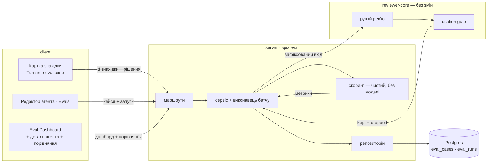
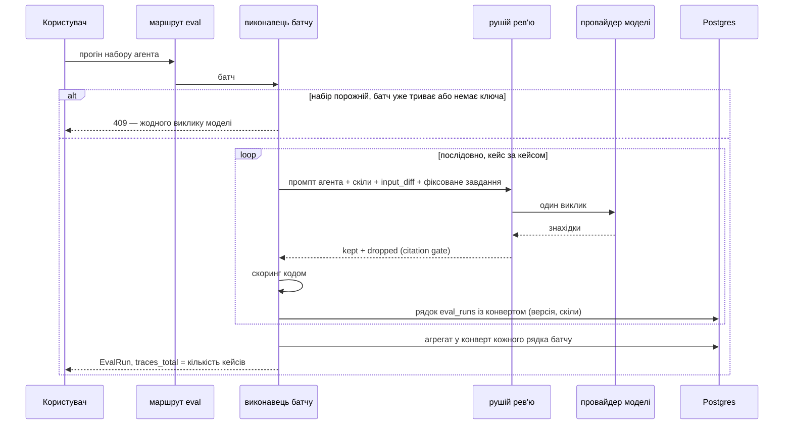

# Spec: Eval Pipeline for the reviewer agents

**Spec ID:** SPEC-05
**Status:** approved
**Created:** 2026-08-22
**Supersedes:** _Немає._
**Modules:** server, client

## Problem and user

Користувач DevDigest — розробник, який редагує власного рев'ю-агента: міняє системний промпт,
модель або перелік прилінкованих скілів. Сьогодні після такої зміни він не має жодного способу
дізнатися, чи стало краще. Єдиний доступний доказ — запустити агента на живому PR і прочитати
знахідки очима; результат не порівнюваний із попереднім (інший діф, інший стан репозиторію), не
зберігається як число і не переживає наступну зміну. Тому кожна правка промпта — здогадка, а
регресія помічається лише тоді, коли агент почав або мовчати про справжню проблему, або шуміти
на порожньому місці.

При цьому датасет уже існує і накопичується сам: кожне рішення `accept` / `dismiss` на знахідці
(`findings.accepted_at` / `findings.dismissed_at`) — це судження людини про те, що агент мав
знайти і чого не мав казати. Воно фіксується з L01, але нічого з нього не читає.

Ця фіча перетворює ці рішення на регресійний захист: набір eval-кейсів із зафіксованими входами,
прогін агента на всьому наборі однією дією і три числа — recall, precision, citation_accuracy —
які видимо рухаються, коли змінюється конфіг агента.

## Goals / Non-goals

**Goals**

- **G1** — Реальне рішення по знахідці (accept / dismiss) перетворюється на eval-кейс одним
  кліком, із зафіксованим входом і очікуванням, тип якого визначає саме рішення.
- **G2** — Набір кейсів агента видимий, редагований і запускається покейсово.
- **G3** — Прогін агента на всьому наборі виконується однією дією проти зафіксованих входів і
  атрибутується до конкретної версії агента, щоб два прогони були порівнянні.
- **G4** — recall, precision і citation_accuracy обчислюються повністю кодом, без жодного
  виклику моделі, за правилом «той самий файл і перетин рядків».
- **G5** — Історія прогонів видима на окремій сторінці, і два прогони порівнюються поруч:
  «старий промпт vs новий».
- **G6** — Регресійний експеримент відтворюваний і перевіряється механічно, а не кліканням.

**Non-goals** — межі для планувальника, не побажання:

- **N1** — Кейси, чий власник — скіл (`owner_kind = 'skill'`). Контракт їх допускає; ця фіча їх
  не створює і не запускає.
- **N2** — Будь-який LLM-суддя в скорингу. Очікування — це `file:line`, і збіг рахує код.
- **N3** — Export власного агента (окремий шматок ДЗ, ще не переданий) — ані вимоги, ані TODO.
- **N4** — Export-to-CI, `ci_runs`, запуск evals у CI GitHub Actions.
- **N5** — Пакет `evals/` у корені репозиторію (лабораторний harness для `.claude/skills/*` і
  `.claude/agents/*`). Це інша площина і інший продукт; ця специфікація його не торкається.
- **N6** — Нові таблиці або нові колонки в БД. Схема `eval_cases` / `eval_runs` і контракти
  `eval-ci.ts` вважаються заданими.
- **N7** — Масове автоматичне породження кейсів з усіх наявних знахідок.
- **N8** — Розклад / cron / автозапуск evals після зміни агента.
- **N9** — Пункти сайдбару з макета, що належать іншим урокам: Memory, Multi-Agent Review,
  Agent Performance, CI Runs.
- **N10** — Вкладки Stats і CI у редакторі агента, які макет показує поруч із Evals.

## Decisions and alternatives

**D1 — Схема і контракти зафіксовані; батч живе в конверті `actual_output`.** `eval_runs` не має
колонки з версією агента і не має колонки, що групує рядки одного прогону. Обидва факти потрібні:
макет показує історію по версіях (v3…v7) і порівняння «v6 → v7». Рішення: `actual_output`
(`jsonb`, у контракті `EvalRunRecord` це `z.unknown()`) несе конверт із `batch_id`, `agent_id`,
`agent_version`, `provider`, `model`, переліком прилінкованих скілів, знахідками після gate і
кількістю відкинутих. Контракт розширюється **додаванням** Zod-схем конверта, а не зміною
наявних. _Відкинуто:_ таблиця `eval_batches` і колонки `agent_version` / `batch_id` — це
суперечить умові «схему даємо готовою» і вимагає міграції там, де jsonb уже достатньо.

**D2 — «Прогін» на екрані — це батч, а рядок `eval_runs` — це кейс.** Макет говорить «5 runs on
the 20-trace gold set»: п'ять батчів по двадцять кейсів — це сто рядків `eval_runs`. Одиничний
прогін кейса («Run case») — це батч з одного кейса. Обидва повертають одну й ту саму форму
`EvalRun` з `knowledge.ts`, у якої `traces_total` = кількість кейсів, а `per_trace` — по запису
на кейс. Ця відповідність — головна причина, чому контракт має і `EvalRun` (агрегат), і
`EvalRunRecord` (рядок).

**D3 — Агрегат батчу записується в конверт після завершення і більше не перераховується.**
Інакше видалення одного кейса заднім числом змінює «17/20 pass» минулого прогону і робить
порівняння v6→v7 порівнянням різних знаменників. Регресійний харнес, у якого історія рухається,
не є доказом нічого. _Відкинуто:_ перерахунок агрегату під час читання.

**D4 — Атрибуція входів: `agents.version` плюс перелік скілів.** `agents.version` бампається на
будь-якій зміні конфігу і знімається в `agent_versions` — саме «for reproducibility for eval».
Але прив'язка скілів (`agent_skills`) версію **не** бампає, а тіла скілів потрапляють у промпт.
Тому конверт зберігає ще й перелік прилінкованих скілів: інакше два прогони з різними метриками
виглядали б як прогони однакового входу.

**D5 — Збіг рахується лише по файлу і перетину рядків.** `severity`, `category` і `title` в
очікуванні зберігаються і показуються (макет малює їх тегом), але на зарахування не впливають.
Це рішення умови ДЗ; воно ж не дає скорингу непомітно перетворитися на порівняння текстів.

**D5a — уточнення 2026-08-23, за реальними прогонами.** Дешева модель регулярно репортить одну
й ту саму реальну проблему двома-трьома сусідніми знахідками (JSON-об'єкти з ледь різними
рядками на один SSRF-виклик, один route). Без де-дупу перша зараховувалась, решта ставали
"шумом", і кейс провалювався попри правильну відповідь. Дві спроби виправити це промптом (точний
підрахунок рядків; явна вимога "об'єднуй сусідні знахідки в одну") обидві **погіршили** метрики —
складніша мета-інструкція коштує моделі точності в самій задачі. Рішення: `dedupeOverlapping`
(`server/src/modules/eval/scoring.ts`) об'єднує знахідки, що перетинаються МІЖ СОБОЮ в тому
самому файлі, в одну (об'єднання діапазону), **до** підрахунку. Знахідки, що не перетинаються —
навіть по сусідству — шумом лишаються: саме це й ловить D7/AC-73. `citation_accuracy` рахується з
сирої (недедупленої) кількості — де-дуп не чіпає її семантику. Тести:
`server/test/eval-scoring.test.ts`, описи `dedupeOverlapping` і `scoreCase — dedup changes
precision/pass but never citation_accuracy`.

**D6 — Очікування — масив із полярністю.** `expected_output` — масив записів; запис без явної
полярності означає `must_find`, запис із полярністю `must_not_flag` означає «тут коментувати не
можна». Порожній масив — «на цьому фрагменті не має бути нічого» (макет показує такий кейс тегом
`empty []`). Форма зберігає те, що показує макет — масив об'єктів у текстовому полі, — і не
вимагає ані нової колонки, ані другого поля. _Відкинуто:_ окремий стовпчик типу очікування;
окремий об'єкт `{must_find: [], must_not_flag: []}` — він суперечить макету.

**D7 — Усе, чого нема в очікуваннях кейса, — шум.** Саме це робить precision чутливою до
зіпсованого промпта, і саме через це `input_diff` — **фрагмент** (файл, який цитує знахідка, з
його ханками), а не весь діф PR: на фрагменті одного файлу вимога «перелічи все, що тут має бути
знайдено» чесна, а на діфі з тридцяти файлів — ні.

**D8 — Прогін виконується проти зафіксованого входу, а не через PR-шлях.** PR-шлях домішує
repo-intel, project context і derived intent, які залежать від стану клону та індексації, тож два
прогони різних версій агента не були б порівнянними. Прогін кейса подає моделі рівно: системний
промпт поточної версії, тіла прилінкованих скілів, `input_diff`, `input_meta` і фіксований рядок
завдання.

**D9 — Батч синхронний, послідовний і обмежений.** Відповідь повертається, коли всі кейси
пораховані; рядок кожного кейса пишеться одразу, тож обрив з'єднання не втрачає вже оплачену
роботу. Послідовність — тому що кожен кейс це платний виклик. Обмеження на кількість кейсів у
батчі — тому що ніякої стелі витрат у системі немає. _Відкинуто:_ фонова черга задач — вона додає
стан «прогін триває, повертайтеся пізніше» і другий шлях читання без потреби на цьому обсязі.

**D10 — «Promote vN» застосовує знімок конфігу через звичайне оновлення агента.** Механізму
промоушену версії в модулі агентів не існує: є лише читання історії. Промоушен створює **нову**
версію з вмістом обраної; рядок обраної версії лишається незмінним. _Відкинуто:_ перезапис
`agents.version` на старе число — це переписування історії, на якій тримається вся атрибуція.

**D11 — Кейс не має зовнішнього ключа на знахідку.** Знахідки каскадно видаляються разом із
рев'ю і PR; датасет, що зникає разом із PR, не є регресійним захистом. Походження зберігається
текстом у `notes`.

**D12 — Кнопка «Turn into eval case» активна лише після рішення.** Тип очікування визначає саме
рішення; на знахідці без рішення його нізвідки взяти, а вибір руками був би другим шляхом
створення кейса.

**D13 — `input_files` похідний і не редагується.** Він заповнюється переліком шляхів, які несе
`input_diff`, і вкладка Files у редакторі його показує. У промпт він окремим слотом не йде —
такого слота в рушії немає.

**D14 — Метрики батчу — мікросереднє.** Знаменники об'єднуються по кейсах (усі очікування батчу,
усі знахідки батчу), а не усереднюються per-case значення: інакше кейс з одним очікуванням важив
би стільки ж, скільки кейс із десятьма.

## User stories

- **US-1** — Як розробник агента, я хочу одним кліком перетворити прийняту знахідку на кейс «має
  знайти X у file:line», щоб мій датасет збирався сам із роботи, яку я і так роблю.
- **US-2** — Як розробник агента, я хочу так само перетворити відхилену знахідку на кейс «НЕ має
  коментувати Y», щоб шум фіксувався так само точно, як користь.
- **US-3** — Як розробник агента, я хочу бачити весь набір кейсів агента і стан кожного, щоб
  розуміти, на чому саме він падає.
- **US-4** — Як розробник агента, я хочу запустити агента на всьому наборі однією дією, щоб не
  клікати по кейсах.
- **US-5** — Як розробник агента, я хочу бачити recall / precision / citation_accuracy прогону,
  щоб зміна промпта мала числову ціну.
- **US-6** — Як розробник агента, я хочу відкрити історію прогонів і покласти два поруч, щоб
  побачити, що саме змінив новий промпт.
- **US-7** — Як розробник агента, я хочу, щоб зіпсований промпт видимо валив precision, щоб
  харнес ловив регресію, а не лише підтверджував покращення.
- **US-8** — Як людина, що приймає роботу, я хочу перевірити всі критерії однією командою, а не
  клікаючи по екранах.

## Acceptance criteria (EARS)

### Створення кейса зі знахідки

- **AC-1** — **КОЛИ** користувач натискає «Turn into eval case» на знахідці, у якої проставлено
  `accepted_at`, система повинна (shall) створити eval-кейс з `owner_kind = 'agent'`, `owner_id`
  того агента, чий прогін дав знахідку, і одним очікуванням типу `must_find`, що несе `file`,
  `start_line`, `end_line`, `severity`, `category` і `title` цієї знахідки.
- **AC-2** — **КОЛИ** користувач натискає ту саму кнопку на знахідці, у якої проставлено
  `dismissed_at`, система повинна (shall) створити кейс з одним очікуванням типу
  `must_not_flag` з тими самими координатами.
- **AC-3** — **ЯКЩО** у знахідки не проставлено ні `accepted_at`, ні `dismissed_at`, **ТОДІ**
  система повинна (shall) лишити кнопку неактивною і назвати причину, а кейс не створювати.
- **AC-4** — **КОЛИ** кейс створюється, система повинна (shall) зберегти в `input_diff` фрагмент
  діфу PR, що містить лише той файл, який цитує знахідка, з усіма його ханками.
- **AC-5** — **ЯКЩО** діф PR неможливо отримати (недоступний ні `git diff` по клону, ні
  збережені патчі файлів PR), **ТОДІ** система повинна (shall) відмовити з кодом 409 і не
  створювати кейс із порожнім входом.
- **AC-6** — **ЯКЩО** діапазон `[start_line, end_line]` знахідки не перетинає жодного ханка
  збереженого фрагмента, **ТОДІ** система повинна (shall) відмовити з кодом 422, назвавши, що
  таке очікування не пережило б citation gate.
- **AC-7** — **КОЛИ** кейс створюється, система повинна (shall) назвати його слагом заголовка
  знахідки.
- **AC-8** — **ЯКЩО** таке ім'я вже зайняте в наборі цього агента, **ТОДІ** система повинна
  (shall) додати найменший вільний числовий суфікс.
- **AC-9** — **КОЛИ** кейс створюється, система повинна (shall) записати в `notes` походження
  простим текстом: ідентифікатор знахідки, репозиторій і номер PR, тип рішення і його дату.
- **AC-10** — **ЯКЩО** для цієї знахідки кейс уже створено, **ТОДІ** повторне натискання
  повинно (shall) відкрити наявний кейс і не створювати другого.
- **AC-11** — Система повинна (shall) зберігати eval-кейс і його прогони після видалення
  знахідки, рев'ю або PR, з якого кейс народився.
- **AC-12** — **КОЛИ** кейс створюється, система повинна (shall) записати в `input_meta`
  заголовок і опис PR (обрізані до ліміту), а в `input_files` — перелік шляхів, які несе
  збережений фрагмент.

### Набір кейсів і редактор кейса

- **AC-13** — **КОЛИ** користувач відкриває вкладку Evals агента, система повинна (shall)
  показати всі кейси, чий власник — цей агент.
- **AC-14** — **КОЛИ** рядок кейса відмальовується, він повинен (shall) показати стан останнього
  прогону трьома станами — пройдено, не пройдено, ніколи не запускався.
- **AC-15** — **КОЛИ** рядок кейса відмальовується, він повинен (shall) показати кількість
  очікуваних знахідок і кількість отриманих в останньому прогоні.
- **AC-16** — **ЯКЩО** у агента немає жодного кейса, **ТОДІ** вкладка повинна (shall) пояснити,
  як створити перший, замість порожнього списку.
- **AC-17** — **КОЛИ** вкладка Evals відмальовується, заголовок набору повинен (shall) нести
  бейдж «N / M passing», де N — кейси, чий останній прогін пройдено, M — усі кейси набору.
- **AC-18** — **КОЛИ** користувач відкриває редактор кейса, той повинен (shall) показати ім'я,
  вхід трьома вкладками (діф, файли, метадані PR) і `expected_output` як редагований JSON.
- **AC-19** — **ЯКЩО** `expected_output` не проходить контракт очікувань, **ТОДІ** система
  повинна (shall) заблокувати збереження і показати, що саме не так.
- **AC-20** — **ДЕ** ввімкнено перемикач «Run on save», система повинна (shall) після успішного
  збереження одразу запустити цей кейс і показати його результат у редакторі.
- **AC-21** — **КОЛИ** користувач запускає один кейс, система повинна (shall) повернути
  `EvalRunResult`, чий `result.traces_total` дорівнює 1, і записати рівно один рядок `eval_runs`.
- **AC-22** — **КОЛИ** користувач видаляє кейс, система повинна (shall) видалити його рядки
  прогонів разом із ним і не змінити жодного вже записаного агрегату батчу.
- **AC-23** — **ЯКЩО** `input_diff` кейса не розбирається в діф хоча б з одним ханком, що несе
  нові рядки, **ТОДІ** система повинна (shall) відмовити зберегти або запустити цей кейс.

### Прогін набору

- **AC-24** — **КОЛИ** надходить запит на прогін набору агента, система повинна (shall)
  виконати агента на кожному кейсі набору і записати рівно один рядок `eval_runs` на кейс.
- **AC-25** — **КОЛИ** виконується кейс, промпт повинен (shall) складатися лише з системного
  промпта поточної версії агента, тіл прилінкованих скілів, `input_diff`, `input_meta` і
  фіксованого рядка завдання — без repo-intel, project context, derived intent і memory.
- **AC-26** — Система повинна (shall) подавати моделі байт-ідентичні входи у двох прогонах
  одного набору, якщо між ними не змінилися конфіг агента, його скіли і самі кейси.
- **AC-27** — **ЯКЩО** у агента немає жодного кейса, **ТОДІ** система повинна (shall) відмовити
  з кодом 409 і не зробити жодного виклику моделі.
- **AC-28** — **ЯКЩО** для цього агента вже виконується батч, **ТОДІ** система повинна (shall)
  відмовити з кодом 409 і назвати ідентифікатор того батчу.
- **AC-29** — **ЯКЩО** для провайдера агента не налаштовано ключ, **ТОДІ** система повинна
  (shall) відмовити до першого виклику моделі.
- **AC-30** — **КОЛИ** рядок кейса записується, `actual_output` повинен (shall) нести конверт із
  `batch_id`, `agent_id`, `agent_version`, провайдером, моделлю, переліком прилінкованих скілів,
  знахідками, що пережили citation gate, і кількістю відкинутих ним.
- **AC-31** — **КОЛИ** батч завершується, система повинна (shall) дописати в конверт кожного
  його рядка агрегат: кількість кейсів, кількість пройдених, pooled recall, precision і
  citation_accuracy, сумарні вартість і тривалість.
- **AC-32** — **ЯКЩО** виклик моделі для окремого кейса завершився помилкою, **ТОДІ** система
  повинна (shall) записати його рядок із `pass = false`, метриками `null` і текстом помилки в
  конверті, і продовжити батч.
- **AC-33** — **ЯКЩО** хоча б один кейс завершився помилкою, **ТОДІ** агрегат повинен (shall)
  нести кількість помилок, а помилкові кейси не потрапляють у знаменники pooled-метрик.
- **AC-34** — **ЯКЩО** помилкою завершилися всі кейси батчу, **ТОДІ** система повинна (shall) не
  записувати агрегат, і такий батч не з'являється ні в тренді, ні в порівнянні.
- **AC-35** — **ПОКИ** батч виконується, екран, з якого його запустили, повинен (shall)
  показувати, що прогін триває, і не дозволяти запустити той самий набір удруге.
- **AC-36** — **ПОКИ** батч виконується, у провайдера моделі повинен (shall) бути щонайбільше
  один одночасний виклик.
- **AC-37** — **КОЛИ** користувач натискає «Run all agents» на дашборді, система повинна (shall)
  прогнати набір кожного агента, що має хоча б один кейс, і назвати тих, кого пропустила.

### Скоринг

- **AC-38** — Система повинна (shall) обчислювати recall, precision і citation_accuracy без
  жодного виклику моделі.
- **AC-39** — Система повинна (shall) зараховувати знахідку очікуванню лише тоді, коли збігається
  шлях файлу і діапазони рядків перетинаються; `severity`, `category` і `title` на зарахування не
  впливають.
- **AC-40** — Система повинна (shall) зараховувати щонайбільше одну знахідку на одне очікування і
  щонайбільше одне очікування на одну знахідку.
- **AC-41** — **КОЛИ** батч рахує recall, він повинен (shall) дорівнювати частці зарахованих
  `must_find`-очікувань від усіх `must_find`-очікувань кейсів батчу.
- **AC-42** — **КОЛИ** батч рахує precision, він повинен (shall) дорівнювати частці знахідок, що
  закрили `must_find`-очікування, від усіх знахідок батчу, що пережили citation gate.
- **AC-43** — Система повинна (shall) рахувати шумом знахідку, що перетинає
  `must_not_flag`-очікування, і не зараховувати її жодному очікуванню.
- **AC-44** — Система повинна (shall) рахувати шумом знахідку, якої немає в очікуваннях кейса,
  навіть коли вона стосується іншого місця того самого фрагмента.
- **AC-45** — **КОЛИ** батч рахує citation_accuracy, він повинен (shall) дорівнювати частці
  знахідок, що пережили citation gate, від усіх знахідок, які модель повернула на його вхід.
- **AC-46** — **ЯКЩО** знахідку відкинув citation gate, **ТОДІ** вона не повинна (shall)
  зараховуватися жодному очікуванню і не потрапляє у знаменник precision.
- **AC-47** — **ЯКЩО** у кейса немає жодного `must_find`-очікування, **ТОДІ** його per-case
  recall дорівнює 1, і кейс не додає нічого до pooled-знаменника recall.
- **AC-48** — **ЯКЩО** агент не повернув для кейса жодної знахідки, **ТОДІ** його per-case
  precision і citation_accuracy дорівнюють 1, і кейс не додає нічого до відповідних
  pooled-знаменників.
- **AC-49** — Система повинна (shall) позначати кейс пройденим лише тоді, коли зараховані всі
  його `must_find`-очікування і не лишилося жодної знахідки-шуму.
- **AC-50** — Система повинна (shall) рахувати pooled-метрики батчу як мікросереднє по
  об'єднаних лічильниках, а не як середнє per-case значень.
- **AC-51** — Система повинна (shall) тримати всі три метрики в межах від 0 до 1 включно.

### Дашборд, історія і порівняння

- **AC-52** — **КОЛИ** користувач відкриває лівий сайдбар, він повинен (shall) бачити пункт Eval
  Dashboard у групі SKILLS LAB.
- **AC-53** — **КОЛИ** користувач відкриває Eval Dashboard, система повинна (shall) показати
  картку на кожного агента, що має кейси: ім'я, бейдж моделі, останній батч (версія, дата,
  пройдено з усього), спарклайн і три метрики.
- **AC-54** — **КОЛИ** Eval Dashboard відмальовується, під картками повинна (shall) бути зведена
  таблиця останніх батчів усіх агентів, де один рядок — один батч.
- **AC-55** — **КОЛИ** користувач відкриває сторінку одного агента, система повинна (shall)
  показати три метрик-картки з дельтою до попереднього батчу, графік тренду і таблицю батчів із
  колонкою вартості.
- **AC-56** — **ЯКЩО** у агента менше двох завершених батчів, **ТОДІ** система повинна (shall) не
  показувати ані дельт, ані банера.
- **AC-57** — **КОЛИ** у агента є щонайменше два завершені батчі, система повинна (shall)
  згенерувати банер із дельт кодом, без виклику моделі, назвавши метрику, напрямок і версію.
- **AC-58** — **КОЛИ** користувач змінює фільтр діапазону дат, система повинна (shall) обмежити
  ним і графік тренду, і таблицю батчів.
- **AC-59** — **КОЛИ** у таблиці батчів обрано рівно два рядки, кнопка порівняння повинна (shall)
  стати активною; за будь-якої іншої кількості — лишатися неактивною.
- **AC-60** — **КОЛИ** відкрито порівняння, система повинна (shall) показати чотири значення
  «старе → нове» з дельтою: recall, precision, citation_accuracy і вартість.
- **AC-61** — **КОЛИ** версії агента у двох порівнюваних батчів різні, система повинна (shall)
  показати повний текст системного промпта з підсвіченими лише зміненими рядками.
- **AC-62** — **ЯКЩО** обидва батчі виконані на одній версії агента, **ТОДІ** система повинна
  (shall) сказати, що системний промпт не змінювався, і все одно показати дельти метрик.
- **AC-63** — **ЯКЩО** набори кейсів двох батчів різні за кількістю або складом, **ТОДІ** система
  повинна (shall) попередити, що порівняння не є like-for-like.
- **AC-64** — **КОЛИ** користувач натискає «Promote», система повинна (shall) застосувати знімок
  конфігу обраної версії звичайним шляхом оновлення агента, створивши нову версію.
- **AC-65** — **КОЛИ** версію промоутять, її власний рядок в історії версій повинен (shall)
  лишитися незмінним.
- **AC-66** — **КОЛИ** вкладка Evals агента відмальовується, вона повинна (shall) показати ті
  самі чотири показники — recall, precision, citation_accuracy і кількість пройдених кейсів — з
  дельтою і посиланням на повний дашборд.

### Тенантність і межі

- **AC-67** — Система повинна (shall) скоупити кожне читання і кожен запис `eval_runs` через
  робочий простір власника кейса.
- **AC-68** — **ЯКЩО** власник кейса належить іншому робочому простору, **ТОДІ** система повинна
  (shall) відповісти 404 і не створити кейс.
- **AC-69** — **ЯКЩО** `input_diff` перевищує ліміт розміру або `expected_output` перевищує
  ліміт кількості записів чи байтів, **ТОДІ** система повинна (shall) відмовити з кодом 422 до
  будь-якого виклику моделі.
- **AC-70** — **ЯКЩО** у наборі більше кейсів, ніж дозволено в одному батчі, **ТОДІ** система
  повинна (shall) відмовити і назвати обидва числа.
- **AC-71** — Система повинна (shall) передавати `input_diff` і `input_meta` в промпт лише як
  недовірений контент у відповідних огороджених слотах рушія.

### Експеримент і приймання

- **AC-72** — **КОЛИ** два батчі одного набору виконані з різними системними промптами,
  порівняння повинно (shall) показати дві різні трійки pooled-метрик і непорожній діф промпта.
- **AC-73** — **КОЛИ** до системного промпта додано інструкцію, що змушує агента повідомляти
  знахідки поза очікуваннями набору, precision наступного батчу повинна (shall) бути нижчою за
  precision попереднього на тому самому наборі.
- **AC-74** — Набір щонайменше одного агента повинен (shall) містити не менше восьми кейсів, і
  кожен із них створений через реальний потік «Turn into eval case», а не вставлений у базу.
- **AC-75** — **КОЛИ** хтось запускає команду перевірки лесона (`verify:l06`), вона повинна
  (shall) виконати герметичні перевірки, надрукувати для кожного кроку, який критерій він
  доводить, і завершитися ненульовим кодом на першому провалі.
- **AC-76** — **ДЕ** передано прапорець підключення бази, команда перевірки повинна (shall)
  додатково виконати маршрутні тести на Testcontainers-Postgres.

## Traceability

| AC | Служить | Спостережуване | Джерело вимоги |
|---|---|---|---|
| AC-1 | G1 · US-1 | Рядок `eval_cases` з `owner_kind='agent'` і `must_find`-очікуванням у `expected_output` | промпт диспатчу; `specs/assets/SPEC-05-eval-pipeline-finding-card-turn-into-eval-case.png` |
| AC-2 | G1 · US-2 | Той самий рядок із `must_not_flag` | промпт диспатчу |
| AC-3 | G1 | Неактивна кнопка з підказкою; жодного нового рядка `eval_cases` | промпт диспатчу («тип залежить від рішення») |
| AC-4 | G1 · G3 | `input_diff` містить рівно один шлях файлу | промпт диспатчу («зберігає diff-фрагмент») |
| AC-5 | G1 | Код відповіді 409, тіло з причиною; таблиця без нового рядка | `server/src/modules/reviews/diff-loader.ts:12` |
| AC-6 | G1 · G4 | Код відповіді 422; таблиця без нового рядка | `reviewer-core/src/grounding.ts:59` |
| AC-7 | G1 | `eval_cases.name` = слаг заголовка | `specs/assets/SPEC-05-eval-pipeline-agent-editor-evals-tab.png` (`stripe-key-leak`) |
| AC-8 | G1 | Друге ім'я з суфіксом у тому самому наборі | AC-7 |
| AC-9 | G1 · G6 | Текст `notes` містить id знахідки, PR і дату рішення | D11 |
| AC-10 | G1 | Другий клік не збільшує кількість кейсів набору | промпт диспатчу («одним кліком») |
| AC-11 | G6 | Кейс і його рядки читаються після видалення PR | `server/src/db/schema/reviews.ts:45-64` (каскади) |
| AC-12 | G3 | `input_meta` з title/body, `input_files` зі шляхами | `server/src/db/schema/eval.ts:15-18`; макет редактора кейса |
| AC-13 | G2 · US-3 | Список кейсів на вкладці Evals | `specs/assets/SPEC-05-eval-pipeline-agent-editor-evals-tab.png` |
| AC-14 | G2 | Іконка стану в рядку кейса | той самий макет (`never run`) |
| AC-15 | G2 | Текст «expected N finding(s), got M» | той самий макет |
| AC-16 | G2 | Пояснювальний текст замість порожнього списку | `client/messages/en/eval.json` (`evalsTab.emptyCases`) |
| AC-17 | G2 | Бейдж «N / M passing» | той самий макет |
| AC-18 | G2 | Модалка з полями Name / Diff / Files / PR meta / Expected output | `specs/assets/SPEC-05-eval-pipeline-eval-case-editor-modal.png` |
| AC-19 | G2 | Заблокована кнопка збереження і повідомлення про помилку | той самий макет (бейдж `valid JSON`) |
| AC-20 | G2 | Смуга результату в модалці одразу після збереження | той самий макет («Run on save») |
| AC-21 | G2 · G4 | Відповідь із `traces_total = 1`; +1 рядок `eval_runs` | `server/src/vendor/shared/contracts/eval-ci.ts:49` |
| AC-22 | G5 | Рядки кейса зникли; агрегат минулого батчу в конвертах не змінився | `server/src/db/schema/eval.ts:24-26` (каскад) + D3 |
| AC-23 | G3 | Відмова зберегти/запустити з поясненням | `server/src/modules/reviews/diff-review.ts:113` |
| AC-24 | G3 · US-4 | Кількість нових рядків `eval_runs` дорівнює кількості кейсів | промпт диспатчу (`POST /agents/:id/eval-runs`) |
| AC-25 | G3 | Перелік секцій зібраного промпта | `server/src/modules/reviews/run-executor.ts:403`; `reviewer-core/src/review/run.ts:44` |
| AC-26 | G3 | Два прогони дають однаковий текст промпта | промпт диспатчу («входи зафіксовані») |
| AC-27 | G3 | Код 409; лічильник викликів провайдера = 0 | `server/src/modules/reviews/diff-review.ts:186` |
| AC-28 | G3 | Код 409 з `batch_id` у тілі | edge case «паралельні прогони» |
| AC-29 | G3 | Відмова до першого виклику; лічильник викликів = 0 | `server/src/platform/container.ts:368` |
| AC-30 | G3 · G5 | Поля конверта в `actual_output` рядка | D1 |
| AC-31 | G3 · G5 | Поле агрегату в конверті кожного рядка батчу | D3 |
| AC-32 | G3 | Рядок із `pass=false`, метриками `null` і помилкою; решта рядків записані | edge case «часткова відмова» |
| AC-33 | G4 | Поле кількості помилок в агрегаті; знаменники без цих кейсів | AC-32 |
| AC-34 | G5 | Батч відсутній у тренді і в списку для порівняння | AC-32 |
| AC-35 | G2 · G3 | Стан «Running…» і заблокована кнопка запуску | `client/messages/en/eval.json` (`dashboard.running`) |
| AC-36 | G3 | Максимум одночасних викликів у стубі провайдера = 1 | D9 |
| AC-37 | G5 | Прогін кожного агента з кейсами; повідомлення про пропущених | `specs/assets/SPEC-05-eval-pipeline-dashboard-all-agents.png` |
| AC-38 | G4 · US-5 | Метрики пораховані в тесті без сконфігурованого провайдера | промпт диспатчу («скоринг не робить жодного LLM-виклику») |
| AC-39 | G4 | Пара «очікування ↔ знахідка» зарахована лише за файлом і перетином | промпт диспатчу («збігається файл і перетинаються рядки») |
| AC-40 | G4 | Дві однакові знахідки на одному очікуванні дають одне зарахування | edge case «дублікати» |
| AC-41 | G4 | Число recall у відповіді і в рядку | промпт диспатчу |
| AC-42 | G4 | Число precision у відповіді і в рядку | промпт диспатчу |
| AC-43 | G4 · US-2 | `must_not_flag`-кейс із влучанням дає precision < 1 | промпт диспатчу («dismissed-кейси працюють саме тут») |
| AC-44 | G4 | Незв'язана знахідка знижує precision | D7 |
| AC-45 | G4 | Число citation_accuracy дорівнює kept/(kept+dropped) | `reviewer-core/src/grounding.ts:93` |
| AC-46 | G4 | Відкинута знахідка не закриває очікування і не в знаменнику precision | `reviewer-core/src/grounding.ts:59` |
| AC-47 | G4 | per-case recall = 1 при порожньому наборі `must_find` | edge case «нуль очікувань» |
| AC-48 | G4 | per-case precision і citation = 1 при нулі знахідок | edge case «нуль знахідок» |
| AC-49 | G4 | `eval_runs.pass` для кейса | `specs/assets/SPEC-05-eval-pipeline-agent-editor-evals-tab.png` |
| AC-50 | G4 | Агрегат кейсів 1×10 і 10×1 не дорівнює середньому per-case | D14 |
| AC-51 | G4 | Значення в межах контракту `EvalRun` | `server/src/vendor/shared/contracts/knowledge.ts:537-540` |
| AC-52 | G5 | Пункт сайдбару в групі SKILLS LAB | `client/src/vendor/ui/nav.ts:40-47`; макет дашборда |
| AC-53 | G5 · US-6 | Картка агента з версією, датою, X/Y і трьома числами | `specs/assets/SPEC-05-eval-pipeline-dashboard-all-agents.png` |
| AC-54 | G5 | Таблиця «Recent eval runs · all agents» | той самий макет |
| AC-55 | G5 | Три картки з дельтою, графік, таблиця з вартістю | `specs/assets/SPEC-05-eval-pipeline-dashboard-agent-detail.png` |
| AC-56 | G5 | Відсутність дельт і банера на першому батчі | той самий макет (дельта = різниця двох) |
| AC-57 | G5 | Текст банера, згенерований із чисел | той самий макет; `contracts/eval-ci.ts:87` (`alert`) |
| AC-58 | G5 | Тренд і таблиця, обмежені діапазоном | той самий макет («30 days») |
| AC-59 | G5 · US-6 | Стан кнопки Compare при 0/1/2/3 обраних | той самий макет («2 selected») |
| AC-60 | G5 · US-5 | Чотири плитки «старе → нове» з дельтою | `specs/assets/SPEC-05-eval-pipeline-compare-runs-modal.png` |
| AC-61 | G5 · US-6 | Текст промпта з підсвіченим зміненим рядком | той самий макет |
| AC-62 | G5 | Повідомлення «промпт не змінювався» + дельти на місці | edge case «однакова версія» |
| AC-63 | G5 | Попередження про різні набори | edge case «різні набори» |
| AC-64 | G5 | Нова версія агента з конфігом обраної | той самий макет («Promote v7»); `server/src/modules/agents/repository.ts:135` |
| AC-65 | G5 | Рядок обраної версії в історії не змінився | D10 |
| AC-66 | G2 · G5 | Чотири показники і посилання на дашборд у вкладці Evals | `specs/assets/SPEC-05-eval-pipeline-agent-editor-evals-tab.png` |
| AC-67 | G6 | Запит із чужим ідентифікатором не повертає рядків | `server/INSIGHTS.md:965` |
| AC-68 | G6 | Код 404 і відсутність рядка | той самий урок |
| AC-69 | G6 | Код 422 і лічильник викликів провайдера = 0 | `server/src/modules/reviews/diff-review.ts:36` |
| AC-70 | G6 | Відмова з обома числами в тексті | NFR |
| AC-71 | G6 | Секції промпта, огороджені як недовірені | `reviewer-core/src/prompt.ts` (INJECTION_GUARD) |
| AC-72 | G6 · US-6 | Дві трійки чисел і непорожній діф у порівнянні | промпт диспатчу («зміна system prompt видимо рухає recall/precision») |
| AC-73 | G6 · US-7 | Число precision другого батчу нижче за перше | промпт диспатчу («зіпсуйте промпт навмисно → precision падає») |
| AC-74 | G6 | Кількість кейсів набору ≥ 8, кожен із походженням у `notes` | промпт диспатчу («у наборі ≥8 кейсів») |
| AC-75 | G6 · US-8 | Код виходу команди і її друк по кроках | промпт диспатчу («pnpm verify:l06 зелений»); `scripts/verify-l03.sh` |
| AC-76 | G6 | Виконані маршрутні тести на реальній базі | `scripts/verify-l03.sh` (`--with-db`) |

## Edge cases

| Випадок | Очікувана поведінка |
|---|---|
| Набір агента порожній | Прогін відмовляється (409) до будь-якого виклику моделі — AC-27. Порожній результат виглядав би як «усе добре», а це fail-open. |
| Знахідку, рев'ю або PR видалено після створення кейса | Кейс і його історія лишаються: зовнішнього ключа немає, походження — текст у `notes` (D11, AC-11). |
| `must_not_flag`-кейс, де агент дав валідну, але не пов'язану знахідку в тому самому фрагменті | Знахідка рахується шумом і знижує precision — AC-44. Це ціна D7 і саме те, що робить харнес чутливим. |
| Два паралельні прогони одного агента | Другий відмовляється (409) з ідентифікатором першого — AC-28. |
| Кейс без `must_find`-очікувань | per-case recall = 1, у pooled-знаменник не додає нічого — AC-47. |
| Агент не повернув жодної знахідки | per-case precision і citation_accuracy = 1, у pooled-знаменники не додають нічого — AC-48. |
| Один кейс батчу впав на виклику моделі | Рядок із помилкою, батч триває, агрегат несе кількість помилок — AC-32, AC-33. |
| Впали всі кейси | Агрегат не пишеться; батч не потрапляє в тренд і в порівняння — AC-34. |
| Процес помер посеред батчу | Рядки без агрегату лишаються на диску і читаються як незавершений батч: не в тренді, не в порівнянні. Наступний запуск дозволений. |
| Повторний клік «Turn into eval case» на тій самій знахідці | Відкривається наявний кейс — AC-10. |
| Знахідка вказує на файл, якого немає в доступному діфі | Створення відмовляється (AC-5/AC-6), а не зберігає недосяжний кейс. |
| Дві знахідки на одному очікуванні / одна знахідка на двох очікуваннях | Одне зарахування, решта — шум — AC-40. |
| Два порівнювані батчі однієї версії агента | Модалка каже, що промпт не змінювався, і показує дельти метрик — AC-62. Типовий випадок: змінилися лише скіли (D4). |
| Два порівнювані батчі різних наборів кейсів | Попередження, що порівняння не like-for-like — AC-63. |
| Вимкнений агент (`enabled = false`) | Прогін набору дозволений: evals — інструмент розробки агента, а не рев'ю живого PR. Макет показує вимкненого агента з метриками. |
| «Run all agents», де частина агентів без кейсів | Прогнати тих, у кого кейси є; пропущених назвати — AC-37. |
| Немає ключа провайдера | Відмова до першого виклику — AC-29. |
| `expected_output` — не масив або з невідомими полями | Збереження заблоковане з поясненням — AC-19. |
| Кейс відредаговано так, що діф лишився без ханків | Відмова зберегти або запустити — AC-23. |
| Кейс, чиї очікування описують файл, якого немає в його ж `input_diff` | Усі такі очікування завжди незараховані: recall кейса ≤ 1 − частка таких. Редактор повинен показати це в результаті прогону, а не приховати. |

## Module interactions

Фіча живе у двох пакетах; `reviewer-core` **споживається без змін** — і це перевірка задуму: якщо
планувальник виявить, що рушій треба міняти, значить прогін пішов не тим шляхом, яким ходить
`POST /reviews/diff`.

- **server** — новий модуль зрізу `eval` у реєстрі модулів (реєстр саме його й називає серед
  наступних уроків). Кільця за `onion-architecture`: маршрути валідують і резолвлять тенантність,
  сервіс оркеструє, репозиторій тримає Drizzle, скоринг — чиста функція без жодного порту (він
  же — доказ AC-38). Модуль `eval` **не імпортує** `modules/reviews`: усе, що йому потрібно від
  знахідок і діфів, приходить через контейнер або через власний репозиторій. Побудова фрагмента
  діфу — саме та межа, яку план мусить розв'язати явно: сьогодні цей код лежить усередині зрізу
  `reviews`.
- **client** — три точки: кнопка на картці знахідки (сторінка PR), нова вкладка в редакторі
  агента, нова сторінка Eval Dashboard із деталлю агента і модалкою порівняння. Пункт сайдбару
  додається до наявної групи SKILLS LAB — макет малює додаткові групи, яких у цьому застосунку
  немає (N9). Дані ходять через шар хуків, як усе інше в цьому пакеті; стан вибору двох батчів для
  порівняння — стан екрана, стан фільтра діапазону дат — стан URL.
- **Контракти** — `EvalCaseInput`, `EvalRunRecord`, `EvalRunResult`, `EvalTrendPoint`,
  `EvalDashboard` уже існують і використовуються як є. Додається (а не змінюється) схема
  очікування, схема конверта `actual_output` і схема відповіді батчу. **`@devdigest/shared`
  вендорений двічі** — копія сервера є джерелом істини, копія клієнта мусить бути дзеркальною,
  і розбіжність не ловиться типами.
- **База** — `eval_cases` і `eval_runs` уже створені міграцією `0000`. Нових таблиць і колонок
  немає (N6). `eval_runs` не має власного `workspace_id`, тож тенантність тримається виключно на
  з'єднанні з `eval_cases` — це та сама пастка «батько заскоуплений, дитина припущена», яку цей
  репозиторій уже одного разу отримав на `agent_skills`.

## Non-functional requirements

- **Таймаут і повтор.** Виклик моделі на один кейс обмежений 60 секундами. Понад ремонт
  структурованого виходу, який робить сам рушій (до 2 спроб), батч не повторює нічого: кейс, що
  впав, записується як помилка — інакше вартість батчу необмежена.
- **Вартість виклику моделі.** Вартість пишеться на кожен рядок і може бути `null` — «провайдер
  не повідомив ціну» і «безкоштовно» це різні факти, і лише один із них варто показувати як
  `0.00`. Вартість батчу — сума ненульових. Стелі витрат у системі немає, тому обмеження ставиться
  на обсяг: **не більше 25 кейсів в одному батчі** і **не більше 200 кейсів у наборі агента**.
  Частота: **не більше 3 запусків батчу за хвилину** на робочий простір.
- **Поведінка без моделі.** Скоринг не робить жодного виклику (AC-38), тож усі метрики
  перевіряються на фіксованих наборах даних без провайдера. Прогін, у якого провайдер підмінений,
  проходить повністю — це умова того, щоб `verify:l06` був герметичним.
- **Обсяг входу.** `input_diff` — не більше **50 000 символів** (приблизно 12 тис. токенів на
  кейс); `expected_output` — не більше **50 записів** і **64 КБ**; `input_meta.body` — не більше
  **4 000 символів**; у конверті зберігається не більше **100 знахідок** на кейс, надлишок
  обрізається з позначкою.
- **Незавершена фонова задача.** Батч синхронний; черги задач він не використовує. Обрив
  з'єднання або смерть процесу лишає вже записані рядки без агрегату — вони читаються як
  незавершений батч і не потрапляють ні в тренд, ні в порівняння.
- **Що лишається в БД.** Рядки `eval_cases` і `eval_runs` не видаляються автоматично і не мають
  строку зберігання; видалення кейса каскадно видаляє його рядки, видалення робочого простору —
  його кейси. Нових таблиць і колонок не з'являється.
- **Обсяг читань.** Тренд агента — не більше 20 останніх завершених батчів; зведена таблиця
  дашборда — не більше 50 рядків; дашборд одного агента будується не більше ніж чотирма запитами
  до бази.

## Inputs

| Вхід | Звідки фізично | Відтворюваний |
|---|---|---|
| `input_diff` кейса | Фрагмент діфу PR у момент створення кейса (клон або збережені патчі файлів PR), або текст, введений у редакторі | Так — зберігається в рядку і більше не перечитується |
| `input_files` | Похідний від `input_diff` (перелік шляхів) | Так |
| `input_meta` | Заголовок і опис PR у момент створення, або поля редактора | Так |
| `expected_output` | Рішення користувача по знахідці, далі — редактор | Так |
| Системний промпт агента | `agents.system_prompt` поточної версії; знімок кожної версії — в історії версій | Так, через номер версії в конверті |
| Тіла прилінкованих скілів | Прив'язки агента до скілів на момент запуску | Частково — прив'язка не бампає версію агента, тому перелік скілів пишеться в конверт (D4) |
| Модель і провайдер | Конфіг агента | Так |
| Ключ провайдера | `SecretsProvider` — ніколи не змінна оточення і не конфіг | Не зберігається |
| Ціна виклику | Прайс-бук (живі ціни з кешем і статичний фолбек) | Ні — записана вартість є оцінкою на момент прогону |
| Знахідки моделі | Відповідь моделі після citation gate | Ні — це і є те, що вимірюється |

## Untrusted inputs

| Вхід | Ким керований | Що система зобов'язана зробити |
|---|---|---|
| `input_diff` | Користувач (редактор) і автор чужого PR (фрагмент) | Ліміт розміру до розбору; розбір у структуру діфу; відмова, якщо немає ханка з новими рядками; у промпт — лише огородженим недовіреним слотом, під тим самим guard'ом, що й діф живого PR. Це вектор prompt injection, а не формальність: текст із чужого репозиторію потрапляє в промпт моделі. |
| `input_meta` (title / body PR) | Автор чужого PR | Обрізання до ліміту, огороджений недовірений слот. |
| `expected_output` | Користувач | Валідація Zod-контрактом на межі (не в сервісі), ліміт кількості записів і байтів, відмова 422 до будь-якого виклику моделі. Ніколи не інтерпретується як код і не рендериться як розмітка. |
| `name`, `notes` | Користувач | Ліміт довжини; рендер як текст. |
| `owner_id` (агент), `case_id`, `batch_id` у запитах | Клієнт | Перевірка належності робочому простору **до** будь-якої дії; для `eval_runs` — виключно через з'єднання з `eval_cases`, бо власного `workspace_id` у нього немає (AC-67, AC-68). |
| Знахідки моделі | Модель | Проходять citation gate; зберігаються як дані, не як розмітка; кількість обмежена. |
| Частота і обсяг запуску | Клієнт | Обмеження частоти на маршрут запуску і стеля кейсів у батчі — єдиний захист від необмеженої витрати грошей (AC-70). |
| Тіла прилінкованих скілів | Автор скіла | Потрапляють у промпт як інструкції — так само, як у живому рев'ю; ця фіча не послаблює наявну перевірку і не додає нового шляху їх туди донести. |

## Sources

Прочитано під час написання:

- Текст завдання і уточнення з промпту диспатчу (єдине джерело формулювань «Як юзер я можу…» і
  п'яти критеріїв приймання).
- Макети: `specs/assets/SPEC-05-eval-pipeline-finding-card-turn-into-eval-case.png`,
  `specs/assets/SPEC-05-eval-pipeline-dashboard-all-agents.png`,
  `specs/assets/SPEC-05-eval-pipeline-dashboard-agent-detail.png`,
  `specs/assets/SPEC-05-eval-pipeline-compare-runs-modal.png`,
  `specs/assets/SPEC-05-eval-pipeline-agent-editor-evals-tab.png`,
  `specs/assets/SPEC-05-eval-pipeline-eval-case-editor-modal.png` — усі шість відкриті.
- Схема: `server/src/db/schema/eval.ts`, `server/src/db/schema/agents.ts`,
  `server/src/db/schema/reviews.ts`, `server/src/db/migrations/0000_init.sql` (рядки 116 і 129 —
  таблиці вже змігровані).
- Контракти: `server/src/vendor/shared/contracts/eval-ci.ts`,
  `server/src/vendor/shared/contracts/knowledge.ts` (блок Eval і `Agent`),
  `server/src/vendor/shared/contracts/findings.ts`.
- Рушій і gate: `reviewer-core/src/grounding.ts`, `reviewer-core/src/review/run.ts`,
  `reviewer-core/README.md`.
- Виконання агента: `server/src/modules/reviews/run-executor.ts`,
  `server/src/modules/reviews/diff-review.ts`, `server/src/modules/reviews/diff-loader.ts`,
  `server/src/modules/reviews/findings.ts`, `server/src/modules/reviews/routes.ts`.
- Агенти і версії: `server/src/modules/agents/{routes,service,repository,helpers}.ts`.
- Платформа: `server/src/platform/{container,price-book,jobs,skill-injection}.ts`,
  `server/src/modules/index.ts`.
- Клієнт: `client/src/vendor/ui/nav.ts`, `client/src/app/agents/[id]/_components/AgentEditor/`
  (склад вкладок), картка знахідки на сторінці PR, `client/messages/en/eval.json` — ключі
  інтерфейсу для цих екранів уже існують як заготовка.
- Конвенції: кореневий `AGENTS.md`, `server/AGENTS.md`, `client/AGENTS.md`,
  `reviewer-core/AGENTS.md`, `specs/README.md`, `scripts/verify-l03.sh`.
- `server/INSIGHTS.md` — вибірково: урок про тенантність зв'язкової таблиці (рядок 965, прямо
  адресований наступному уроку, що заповнить `eval`) і форма зведень на читанні.

Не вдалося прочитати: стан реальної бази цього робочого простору — контейнер Postgres не
запущений, тож кількість уже наявних рішень `accept`/`dismiss` перевірити було нічим (див. Q-1).

## Open questions

_Немає._

**Усі чотири питання закрив людина 2026-08-22.** Жодне не змінило документ — кожна відповідь
підтвердила варіант, який спека вже фіксувала за замовчуванням:

- **Q-2** (шум у `must_find`-кейсі) — підтверджено: лишається **D7**, без правок.
- **Q-3** (Promote новою версією) — підтверджено: лишається **D10**, без правок.
- **Q-4** (стелі 25 кейсів / 60с) — підтверджено: лишаються числа в `## Non-functional
  requirements` і AC-70, без правок.
- **Q-1** (чи вже є ≥8 вирішених знахідок в одному наборі) — перевірено фактом, не думкою: у
  робочому просторі 211 знахідок, з них вирішено лише 8 (1 accept, 7 dismiss), і жодного агента з
  ≥8 рішень нема (максимум — Security Reviewer, 3). Людина обрала: перед збіркою
  набору прогнати додаткові реальні рев'ю Security Reviewer і власноруч прийняти/відхилити
  знахідки через справжній UI-потік, поки в нього не набереться ≥8 вирішених — це підготовчий
  крок обсягу роботи, а не зміна форми фічі (сам AC-74 це вже передбачав).
