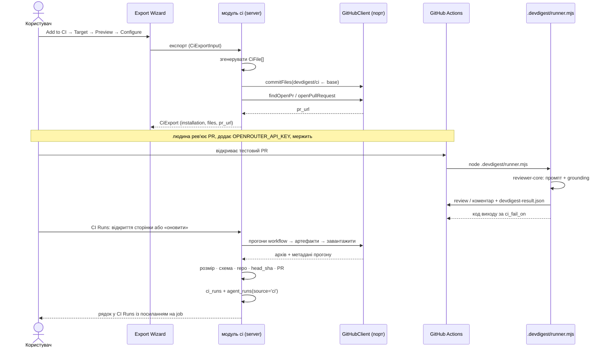

# Spec: Export to CI

**Spec ID:** SPEC-05
**Status:** approved
**Approved:** 2026-08-26 — 122 критерії, D1…D20
**Re-approved:** 2026-08-26 — **149 критеріїв, D1…D24**, після закриття **Q-11**. Людина прочитала,
що критеріїв тепер 149, а не 134, і що шість старих критеріїв читаються інакше, і затвердила цей
обсяг. Q-11 закрито тим самим рішенням: успадкований `.github/workflows/devdigest-review.yml`
вилучається тим самим комітом, що публікує новий бандл (**D24**), і ціна цього названа в D24, а не
знайдена потім. Дописано D24; **переписано AC-145 і AC-146** — вони писалися так, щоб покрити обидва
шляхи, тепер обидва називають один. Нових критеріїв не дописано, їх лишається **149**: відмова
GitHub у записі вже покрита AC-43. Оновлено рядок `## Edge cases` про перевидання в репозиторій з
успадкованим файлом, два рядки `## Traceability` і `## Open questions` — таблиця там тепер порожня.
**Created:** 2026-08-26
**Clarifications:** одинадцять питань, усі закриті 2026-08-26. **Шість закрив автор диспатчу доказом
із коду** — Q-1, Q-2, Q-4, Q-7, Q-9, Q-10; **п'ять закрила людина** — Q-3, Q-5, Q-6, Q-8 і Q-11.
Кожне живе як рішення — Q-1…Q-10 як **D11…D20** (номер питання плюс десять), Q-11 як **D24**, — а не
як мітка в тексті: питання, що лишилося в таблиці після відповіді, читається як невирішене.
**Amended:** 2026-08-26 — відповіді на Q-1…Q-10. Дописано D11…D20, N9, N10 і **AC-95…AC-122**;
**переписано** AC-8, AC-17, AC-42, AC-52, AC-65, AC-66, AC-67, AC-68, AC-79, AC-87 і AC-90, хвости
D4, D6 і D9 (посилання на закриті питання), US-6, рядок `memory.jsonl` у `## Inputs`, абзаци «Обсяг
входу» і «Частота опитування» в `## Non-functional requirements`, три розриви контракт/схема в
`## Module interactions` і **чотири** рядки `## Edge cases`. Дописано **п'ять** нових рядків
`## Edge cases`, рядок `.devdigest/memory.jsonl` в `## Untrusted inputs`, абзац «Обсяг файлу
пам'яті» в `## Non-functional requirements` і абзац про перетин у `modules/context` у
`## Module interactions`. Номери AC не перевикористано. **Спека не схвалена:** це відповіді на
питання, а не приймання документа, і критеріїв у ньому тепер **122**, а не 94.
**Amended:** 2026-08-26 (друга поправка) — дописано **D21** і **AC-123…AC-133**: два поля міграції
(`ci_runs.workflow_run_id` з унікальністю, `ci_installations.last_polled_at`) і значення `skipped` у
`CiRunStatus`, разом із рядками `## Traceability` на кожен новий критерій. Нічого не переписано і
не скасовано; D18 розширено, а не переглянуто. Номери AC-1…AC-122 не перевикористано, критеріїв
тепер **133**. **Статус лишається `approved`:** поправку замовив і продиктував автор специфікації,
вона робить явним те, чого вже вимагають AC-75, AC-84, AC-110, AC-114 і AC-121, і нового обсягу на
розсуд агента не вносить.
**Amended:** 2026-08-26 (третя поправка) — **переписано AC-52**: умову пропуску виправлено з
`github.event.pull_request.head.repo.fork == true` на
`head.repo.full_name != github.repository`. Перший вираз описує походження head-репозиторію, а не
відношення head до base, тож у репозиторії, який сам є форком, він істинний для **кожного** PR і
пропускав рев'ю на внутрішніх PR — доведено артефактом живого прогону (**D22**). Дописано **D22** і
**AC-134** (внутрішній PR у репозиторії-форку рев'юється), рядок `## Traceability` на AC-134 і
оновлено рядок AC-52. AC-109 і AC-110 сформульовані нейтрально і лишилися без змін. Номери
AC-1…AC-133 не перевикористано, критеріїв тепер **134**. **Статус лишається `approved`:** це
виправлення доведеної помилки, зміст якого продиктував автор специфікації, а не нова вимога на
розсуд агента.
**Amended:** 2026-08-26 (четверта поправка) — **кілька агентів на один репозиторій**, випадок, якого
специфікація не передбачала жодним критерієм, хоча база дозволяє його з самого початку. Ім'я файлу
workflow було константою, тоді як шлях маніфеста — похідним від агента, тож експорт другого агента
**тихо перезаписував** workflow першого. Дописано **D23** і **AC-135…AC-149**; **переписано** AC-16,
AC-20, AC-31, AC-51, AC-68 і AC-85 — кожен із них називав один спільний файл workflow або рахував
інсталяцію активною за фактом рядка в БД. AC-53, AC-54 і AC-70 сформульовані нейтрально, переносять
нове значення самі і лишилися без змін. Дописано рядки `## Traceability` на кожен новий критерій,
чотири рядки `## Edge cases`, абзац про контракт інсталяції в `## Module interactions`, уточнення в
абзацах «Частота опитування» і «Вартість виклику моделі» та рядок workflow в `## Untrusted inputs`.
Номери AC-1…AC-134 не перевикористано, критеріїв тепер **149**. **Відкрито Q-11** — доля
успадкованого файлу `.github/workflows/devdigest-review.yml` у вже встановлених репозиторіях: два
однаково законні шляхи, і вибір між ними за людиною _(закрито того ж дня — див. `**Re-approved:**`
вище і **D24**)_. **Статус лишається `approved`:** зміст поправки
продиктував автор специфікації, обравши окремий workflow на агента з трьох названих варіантів.

**Supersedes:** _Немає._
**Modules:** server, client, reviewer-core, agent-runner (новий пакет)

_Робота ведеться у worktree B (`emdash/export-to-ci-ju1ik`). Паралельний worktree A веде
multi-agent review і PR-стрічку; межа між ними зафіксована в `## Goals / Non-goals` (N4)._

## Problem and user

**Хто.** Розробник або тимлід, який уже налаштував рев'ю-агента в студії DevDigest: обрав модель,
написав системний промпт, прив'язав навички, прогнав його руками на кількох PR і бачить, що
знахідки корисні.

**Що в них зараз не виходить.** Агент існує тільки всередині студії. Щоб він щось перевірив,
хтось має тримати ввімкненим `localhost:3001`, відкрити сторінку PR і натиснути «Run Review».
Тобто найдорожча частина роботи — доведення агента до стану, коли йому довіряють, — не
перетворюється на жодну гарантію для команди: PR, який ніхто не відкрив у DevDigest, проходить
без рев'ю. Немає способу сказати «цей агент дивиться кожен PR у цьому репозиторії, і CRITICAL не
дає змержити».

**Чому це варто робити зараз.** Каркас під цю фічу вже стоїть і порожній, і кожен його шматок
було закладено саме під неї. `ci_installations` і `ci_runs` існують без жодного рядка
(`server/src/db/schema/ci.ts`). Контракти `CiTarget`, `CiFile`, `AgentManifest`, `CiExportInput`,
`CiInstallation`, `CiExport`, `CiRunStatus`, `CiRun`, `CiResultArtifact` написані й ніким не
читаються (`server/src/vendor/shared/contracts/eval-ci.ts:174-283`). `agent_runs.source` уже має
значення `'ci'`, якого ніхто не пише (`server/src/db/schema/runs.ts:38`). `agents.ci_fail_on`
уже колонка (`server/src/db/schema/agents.ts:41-43`). GitHub-порт уже вміє атомарно закомітити
набір файлів на нову гілку і відкрити PR — `commitFiles`, `findOpenPr`, `openPullRequest`
(`server/src/vendor/shared/adapters.ts:166-174`) — і жоден модуль цих трьох методів не викликає.
Нарешті, шапка `reviewer-core/src/index.ts:1-12` уже називає свого другого споживача:
«the agent-runner (CI)». Споживача не існує.

Тобто це не фіча з нуля, а замикання контуру, який репозиторій уже наполовину проклав.

## Goals / Non-goals

**G1.** Візард із чотирьох кроків генерує повний бандл для GitHub Actions і встановлює його в
цільовий репозиторій **як PR на окремій гілці**, ніколи не пишучи в базову гілку.

**G2.** Згенерований workflow безпечний за замовчуванням і читабельний людиною, яка рев'ює той
PR: мінімальні дозволи, секрети лише з Actions Secrets, жодного обходу правил для fork-PR,
жодного перетворення тексту від автора PR на команду.

**G3.** Раннер виконує рев'ю всередині CI **без жодного мережевого встановлення** і дає
детермінований код виходу, похідний від `Fail CI on`.

**G4.** Результат повертається в DevDigest **перевіреним pull-каналом** і осідає рядком у
`ci_runs` та рядком у `agent_runs` із `source='ci'`.

**G5.** Сторінка CI Runs і вкладка CI агента показують те, що справді сталося, включно з розривом
між задеплоєним бандлом і поточним станом агента.

**G6.** Користувач бачить кожен згенерований файл до встановлення і після встановлення знає рівно
той крок, якого візард зробити не може.

**G7.** Екран не обіцяє того, чого немає: нереалізовані цілі позначені як нереалізовані, а не
приховані і не вдають робочі.

**Non-goals** — межі для планувальника, не побажання:

**N1.** Генератори для CircleCI, Jenkins і Generic CLI. Картки видно (G7), вибрати не можна.
**N2.** Push-endpoint, у який CI сам стукає в DevDigest. Причина — D1.
**N3.** Публікація `devdigest/review-action` у GitHub Marketplace.
**N4.** Сервіс мультипрогонів і PR-стрічка — це worktree A. Ця специфікація не змінює
`multi_agent_runs`, `modules/reviews` і жодного екрана PR-стрічки.
**N5.** Автоматизація кроків 1–7 приймального флоу. Їх виконує людина руками; специфікація дає
їм перевірні критерії, але не тест.
**N6.** Читання, збереження чи показ значення `OPENROUTER_API_KEY` цільового репозиторію.
**N7.** Налаштування branch protection, ruleset або required status check за користувача.
**N8.** Ретроспективний ingest прогонів, чиї артефакти GitHub уже видалив за retention.
**N9.** _(Додано 2026-08-26, відповідь на Q-9 — D19.)_ Ручна реєстрація інсталяції для файлів,
доданих із zip. Zip лишається аварійним виходом без зворотного зв'язку, і це названа межа, а не
дефект до полагодження.
**N10.** _(Додано 2026-08-26, відповідь на Q-10 — D20.)_ Фонове опитування Actions API за
розкладом. Опитування запускає дія користувача — і тільки вона (AC-68, AC-120, AC-122).

## Decisions and alternatives

**D1. Канал ingest — pull через GitHub API, не push.** Сервер DevDigest локальний
(`localhost:3001`), а автентифікації в ньому немає взагалі: `LocalNoAuthProvider` завжди повертає
єдиного системного користувача і єдиний воркспейс
(`server/src/adapters/auth/local.ts:14-37`). GitHub-раннер до нього не достукається, а якби
достукався — endpoint приймав би що завгодно від кого завгодно. Тому workflow вивантажує
`devdigest-result.json` як **артефакт**, а DevDigest сам опитує Actions API своїм наявним
токеном, качає артефакт і валідує його перед записом. Це і є «інший перевірений канал».
_Відкинуто:_ push-endpoint із тунелем — потребує автентифікації, якої в цьому сервері немає; це
окрема фіча, не деталь цієї.

**D2. Раннер — збандлений `.devdigest/runner.mjs`, закомічений у цільовий репозиторій.** Новий
пакет `agent-runner/` у цьому репозиторії, збірка в один самодостатній ESM-файл. Виміряно:
esbuild по `reviewer-core/src/index.ts` разом із `openai`, `zod` і вендореними контрактами дає
**671 КБ** за 41 мс; реальний раннер — близько 700 КБ. Workflow не робить жодного `npm install`.
_Відкинуто:_ `npm install` у workflow — мережа, час і ланцюг постачання на кожному PR;
marketplace-action — його не існує (N3), а раннер уже лежить у репозиторії.
_Пом'якшення закріплені критеріями:_ шапка файлу з версією, SHA джерела і «generated — do not
edit» (AC-22), `linguist-generated=true` (AC-23), нередагованість у Preview (AC-21).

**D3. Крок Target показує всі чотири цілі, реалізована одна.** CircleCI, Jenkins і Generic CLI —
картки з видимою позначкою «not implemented», недоступні для вибору (AC-12, AC-13). Екран
збігається з макетом і при цьому нічого не обіцяє (G7).

**D4. `.devdigest/memory.jsonl` входить у бандл; його вміст визначено в D11 — файл їде порожнім.**
_(Переписано 2026-08-26: перша редакція лишала вміст відкритим питанням Q-1.)_ Таблиця `memory`
навмисно порожня до пізніших уроків (`CLAUDE.md`, «The DB schema is intentionally
over-provisioned»), а заповнена сусідка — `conventions` (`server/src/db/schema/knowledge.ts:64-131`,
модуль `server/src/modules/conventions/`). Файл у списку є в будь-якому разі, бо він є в макеті, і
порожній файл теж є відповіддю — але тоді це має сказати критерій, а не мовчання. Тепер каже:
AC-95…AC-100, підстава — **D11**.

**D5. Файлів у бандлі — `N + 5`, і лічильник похідний.** Макет перелічує 5 файлів
(`EXPORT_TREE`), а YAML у тому ж макеті запускає `node .devdigest/runner.mjs`, якого в дереві
немає; текст кроку Install при цьому жорстко каже «with the **5** generated files». За D2 додається
раннер, за D6 — `.gitattributes`. Для агента з `N` навичками бандл — це маніфест + `N` навичок +
`memory.jsonl` + раннер + `.gitattributes` + workflow. Лічильник у тексті **обчислюється з довжини
списку** (AC-38), тому питання «5 чи 6 чи 7» перестає існувати.

**D6. `linguist-generated` кладеться в `.devdigest/.gitattributes`, а не в кореневий.** Кореневий
`.gitattributes` цільового репозиторію майже напевно вже існує, а дописати в нього треба вміти
прочитати — `GitHubClient` не має жодного методу читання дерева чужого репозиторію
(`server/src/vendor/shared/adapters.ts:153-176`), тож `commitFiles` перезаписав би його цілком і
знищив чужі правила. `.gitattributes` у підкаталозі діє на цей каталог, чого достатньо: маркувати
треба лише раннер. Це розширює рішення D2, а не переглядає його — **підтверджено в D14**.

**D7. `uses: devdigest/review-action@v1` із макета в згенерований YAML не потрапляє.** Такого
опублікованого action немає (N3), а плейсхолдер, який дійде до чужого репозиторію, — це зламаний
workflow. Крок раннера — `node .devdigest/runner.mjs` (AC-52).

**D8. Прив'язка результату до коміту й репозиторію береться з метаданих workflow-run, а не з тіла
артефакту.** Артефакт написаний кодом, який лежить у гілці PR і який автор PR може змінити, тож
його самозвіт про `repository` і commit SHA нічого не доводить. `head_sha`, `repository` і PR
прогону віддає сам GitHub через Actions API — це і є перевірка автентичності (AC-73, AC-74).
Самозвіт артефакту приймається лише як **збіг**: розбіжність — привід відкинути (AC-74).

**D9. Fork-PR не рев'юються взагалі.** Для PR із форка GitHub за замовчуванням не дає секретів, а
`GITHUB_TOKEN` робить read-only. Обійти це через `pull_request_target` із checkout коду PR —
класичний спосіб віддати секрети атакувальнику, і специфікація це прямо забороняє (AC-46).
Наслідок, який треба назвати вголос: fork-PR отримує **зелений** check без рев'ю (AC-52). Людина
це прийняла і додала до нього вимогу явного запису причини — **D16**; сам D9 лишається чинним без
змін.

**D10. Стан візарда живе в модалці й нічого не пише, доки не натиснуто Install.** Закритий на
півдорозі візард не лишає ані рядка, ані гілки, ані PR (AC-7).

### Рішення за відповідями на Q-1…Q-10, 2026-08-26

_Десять питань першої редакції закриті. Шість — Q-1, Q-2, Q-4, Q-7, Q-9, Q-10 — закрив автор
диспатчу доказом із коду цього репозиторію; чотири — Q-3, Q-5, Q-6, Q-8 — закрила людина. Нижче
кожне як рішення з автором. Таблиця відкритих питань їх більше не тримає._

**D11. `.devdigest/memory.jsonl` їде свідомо порожнім, і раннер його читає.** _(Автор диспатчу,
Q-1, з коду.)_

_Слот під пам'ять уже існує наскрізь._ `PromptParts.memory?: string[]` із коментарем «Relevant
memory items (trusted, curated)» (`reviewer-core/src/prompt.ts:100-101`), `ReviewInput.memory?:
string[]` (`reviewer-core/src/review/run.ts:58-59`), вливається у збірку промпта на
`run.ts:158` і рендериться секцією `## Relevant memory` (`prompt.ts:200-202,257`).

_Але сервер сьогодні не кладе туди нічого._ `server/src/modules/reviews/run-executor.ts:786`
фіксує `prompt_assembly: { …, memory: null, … }`, `memory_pulled` порожній у обох місцях, де
пишеться (`run-executor.ts:583,789`), і жоден файл модуля не встановлює `memory` на вхід рев'ю.
Конвенції в промпт рев'ю не заведені взагалі: `rg conventions server/src/modules/reviews/
reviewer-core/src/prompt.ts` не дає жодного влучення.

_Вирішальний аргумент — паритет._ Якби експорт налив у файл конвенції, агент у CI читав би не те,
що той самий агент читає в студії, а вся передумова фічі в тому, що це **той самий агент**. Тож
файл їде порожнім (валідний JSONL із нуля рядків, AC-95), нічого з БД воркспейсу в нього не
пишеться (AC-96), раннер його парсить і передає в `ReviewInput.memory` (AC-97), і він наповниться,
коли урок про пам'ять наповнить таблицю. Критерій каже «порожній» **і** каже, що раннер його читає
— інакше планувальник вирішить, що файл декоративний, і викине його.

_Наслідок, якого не було в питанні, і він безпековий._ `## Relevant memory` рендериться **без**
недовіреної обгортки — простим списком (`prompt.ts:200-202`), на відміну від `specs`, `repoMap` і
`callers`, які загорнуті роздільниками. У студії це коректно: елементи курує воркспейс. У CI цей
файл лежить у **чужому** репозиторії, і автор same-repo PR може дописати в нього рядки, які
дійдуть до моделі під заголовком, що читається як довірений. Це той самий клас, що й
`.devdigest/runner.mjs` у гілці PR (ескалації немає — автор гілки вже має право запису), але
назвати його треба, а загорнути коштує нуль: AC-98 плюс стеля обсягу в
`## Non-functional requirements`.

_Відкинуто: налити конвенції._ Ламає паритет — див. вище. _Відкинуто: прибрати файл із бандла._
Він є в макеті, а слот у контракті має мати куди приземлитися, коли пам'ять з'явиться.

**D12. Колонку `ci_fail_on` не чіпаємо: UI показує три значення, раннер шанує чотири.** _(Автор
диспатчу, Q-2, з коду.)_

`agents.ci_fail_on` лишається з `never|critical|warning|any`
(`server/src/db/schema/agents.ts:38-40`), контракт — `CiFailOn`
(`server/src/vendor/shared/contracts/knowledge.ts:730`), поле маніфесту — `AgentManifest.ci_fail_on`
(`eval-ci.ts:167`). Міграція заради косметики не окупається, а колонка ще й вендорена в двох копіях.
Вкладка CI малює три кнопки, як у макеті (AC-87), і `any` не надсилає ніколи (AC-101). Раннер
виводить код виходу з будь-якого з чотирьох за одним правилом (AC-65).

**Асиметрія написана, а не лишена збігом** — і в одному місці вона ширша, ніж здавалося на вході:
`any` **не є** недосяжним поза маніфестом. `server/src/modules/agents/routes.ts:41,54` приймають
повний `CiFailOn` і на створенні, і на патчі, тож агент, якому `ci_fail_on` виставили поза вкладкою
CI, понесе `any` у згенерований маніфест через AC-26. Тобто в CI `any` приходить двома шляхами —
руками відредагований маніфест у цільовому репозиторії або значення, записане в БД поза цією
вкладкою, — і жодним із них не є натискання кнопки. Звідси AC-102: значення `any`, що вже лежить у
БД, не має права підсвітити чужу кнопку як поточну.

**D13. Селектор цільового репозиторію живе в кроці Target.** _(Людина, Q-3.)_ За замовчуванням —
поточний репозиторій із бічної панелі, вибір — із імпортованих у воркспейс. `Add repository` на
вкладці CI відкриває візард саме з ним (AC-3 лишається чинним). AC-8 переписано: показати
репозиторій замало, потрібен елемент вибору; AC-103 фіксує, що обране значення і є `repo` у
`CiExportInput`.

_Наслідок, який створює сама відповідь._ Селектор дозволяє обрати репозиторій, у якому цей агент
**уже** стоїть. Один агент × один репозиторій має лишатися **одним** рядком `ci_installations`,
інакше бейдж «Active in N repos» (AC-85) рахує двічі, а `Update CI config` (AC-91) не знає, який із
двох рядків оновлювати. Тому AC-42 переписано з «створити рядок» на «створити або оновити рівно
один», а візард каже це вголос до Install (AC-104).

_Порожній після нормалізації slug._ Лишається обробленим випадком і перестає бути дірою в
критеріях: AC-17 несе саме правило, AC-105 — випадок, коли воно дає порожній рядок.

**D14. `.devdigest/.gitattributes` приймається як окремий файл бандла.** _(Автор диспатчу, Q-4, з
коду.)_ Підстава та, яку спека вже встановила в D6 і яку звірено ще раз: інтерфейс `GitHubClient`
(`server/src/vendor/shared/adapters.ts:154-178`) має `listPullRequests`, `getPullRequest`,
`postReview`, `listReviewComments`, `createReviewComment`, `openPullRequest`, `commitFiles`,
`findOpenPr`, `getIssue`, `currentLogin` — і **жодного** читання дерева чужого репозиторію. Тож
дописати в кореневий `.gitattributes` нічим, а `commitFiles` затер би чужі правила. **Жоден
критерій не змінюється**: AC-16 і AC-23 уже описують прийнятий варіант, а питання називало їх тому,
що їх змінила б **відмова**.

**D15. Бандл виключається зі скану Project Context.** _(Людина, Q-5.)_ `.devdigest/skills/**` і
`.devdigest/agents/**` перестають бути документами контексту (AC-106, AC-107); шляхи бандла з
макета **не змінюються**.

_Радіус ураження вужчий, ніж здається._ `DOC_EXTENSIONS = ['.md']`
(`server/src/modules/context/constants.ts:113`, вживається в `scan-executor.ts:55`), тож `.yaml`,
`.jsonl`, `.mjs` і `.gitattributes` скан не бачить у принципі. Виключення потрібне рівно для
`.devdigest/skills/*.md` — двох-трьох файлів, які інакше потрапили б у скан як документи виду
`other` (`kindForRoot`, `server/src/modules/context/helpers.ts:193-199`) і звідти в промпт рев'ю,
замикаючи контур, де агент читає власну навичку як факт про репозиторій.

_Це свідомий мінімальний перетин межі._ Правка лягає в `server/src/modules/context/`, а не в
`ci/`: `.devdigest` стає безумовним коренем скану в `settings.ts:90`
(`return [...new Set([...roots, DEVDIGEST_ROOT])]`), а обхід іде в `scan-executor.ts:38-80`.
Названо в `## Module interactions` саме тому, щоб `implementation-planner` не вважав його
випадковим і не виніс за межі плану.

_Межа виключення._ Усе інше під `.devdigest/` лишається в скані без змін (AC-108) — там живуть
документи, які Project Context пише сам, і корінь є безумовним саме заради їхньої довговічності
(`constants.ts:95-107`).

_Чого ця відповідь **не** закриває._ Другу половину колізії: після мержу CI-PR частина
`.devdigest/` стає відстежуваною, і `sync()` робить `reset --hard`. Розібрано в `## Edge cases` —
там показано, чому лишок ризику малий, а не чому його немає.

**D16. Fork-PR: зелений check із явним поясненням у job summary.** _(Людина, Q-6.)_ Прогін
відбувається, виходить із нулем (AC-52) і пише в job summary «skipped: fork PR, secrets
unavailable» або рівноцінне (AC-109). D9 лишається чинним.

_Причину зафіксовано обидві, бо вона неочевидна._ Required check, який ніколи не звітує, блокує
кожен fork-PR **назавжди**; червоний на кожному форку привчає ігнорувати червоне — і тоді червоний
від справжнього CRITICAL (US-3) теж проґавлять.

_Одне наслідкове рішення, яке довелося ухвалити тут, щоб документ не суперечив собі._ AC-54 —
всеосяжний критерій: workflow вивантажує артефакт. Прогін, що вийшов раніше і не вивантажив нічого,
його порушує. Розв'язано так, як спека вже розв'язала свій **інший** пропуск: AC-67 вивантажує
артефакт із позначкою пропуску і виходить із нулем, тож fork робить те саме (AC-110), і пропуск
видно в CI Runs, а не тільки в чужому job summary. _Відкинуто: звузити AC-54 до прогонів, що дійшли
до рев'ю_ — тоді fork-пропуск лишався б невидимим у DevDigest, а G7 саме про те, щоб екран не
ховав того, чого не сталося. У `## Untrusted inputs` fork лишається названим залишковим ризиком, як
уже записано.

**D17. Стеля дифу 15 000 лишається — як задокументований дефолт, а не як виміряна межа.** _(Автор
диспатчу, Q-7.)_ Критерій AC-67 називає стелю **посиланням** на
`## Non-functional requirements`, а не числом, тому пізніший вимір замінює одне число в одному
місці й не переписує жодного критерію.

_Що робить той вимір можливим, а не гіпотетичним._ Артефакт **кожного** прогону несе виміряну
кількість змінених рядків і стелю, що діяла (AC-111). Без цього поля число можна було б замінити
лише іншим здогадом: артефакти — єдина вибірка реальних PR, яку ця фіча взагалі збирає.

**D18. Схему й контракти розширюємо; звуження UI відкинуто.** _(Людина, Q-8.)_ Міграція додає в
`ci_runs` те, чого бракує — агента, тривалість, commit SHA і версію бандла (AC-112), — а в
`ci_installations` версію агента, з якої згенеровано задеплоєний бандл (AC-115), щоб позначка
застарілості з AC-90 мала на чому стояти. `CiRun` отримує verdict (AC-113), `CiResultArtifact` —
стан прогону (AC-114) і verdict (AC-116).

_Підстава — вимога замовника дослівно:_ «CI Runs показує репозиторій, PR, агента, verdict,
знахідки, вартість, тривалість і посилання на job». Звуження UI їй суперечить.

_Числа, щоб рішення переглядалося з них._ Сьогодні `ci_runs` — це `ci_installation_id`,
`pr_number`, `ran_at`, `status`, `findings_count`, `cost_usd`, `github_url`, `source`
(`server/src/db/schema/ci.ts:14-26`). `CiRun` уже має `agent` і `duration_s` як `nullish`
(`eval-ci.ts:219-220`) — розрив зафіксований у типі й не закритий у схемі. `Verdict`
(`request_changes|approve|comment`, `contracts/findings.ts:26`) — інша вісь, ніж `CiRunStatus`
(`eval-ci.ts:205`): перша про рев'ю, друга про job. Версія, з якою порівнюється застарілість, —
`agents.version` (`server/src/db/schema/agents.ts:46`), історія якої вже ведеться в `agent_versions`
(`agents.ts:52-61`). Дзеркалення в обидві вендорені копії обов'язкове (AC-93); станом на 2026-08-26
копії побайтово збігаються.

_AC-75 і AC-76 лишаються чинними без змін:_ нові колонки додаються, а не змінюють того, що вже
вимагалося.

_Наслідок, який створює сама відповідь._ Бандл живе в чужому репозиторії і **відстає** — це
властивість D2, і саме на ній стоїть AC-90. Артефакт, написаний старішим бандлом, не має ані стану
прогону, ані verdict. Його треба приймати з порожніми полями, а не відкидати (AC-118), інакше перша
ж поправка контракту мовчки зупинила б ingest для кожного вже встановленого репозиторію.

**D19. Zip — аварійний вихід без зворотного зв'язку, і це названа межа.** _(Людина, Q-9.)_ Рядка
`ci_installations` він не створює (AC-44), ingest цей репозиторій не опитує, у CI Runs нічого не
з'явиться. US-6 лишається задоволеною наполовину **свідомо**: файли є, видимості немає.

_Наслідок із G7, а не з питання._ Екран не має права обіцяти того, чого немає, тож крок Install це
проговорює (AC-119). Для планувальника межа стоїть як N9. У `## Edge cases` цей рядок тепер
записаний як межа, а не як дефект до полагодження.

**D20. Опитування Actions API — вручну і при відкритті сторінки CI Runs; фонової задачі немає.**
_(Автор диспатчу, Q-10, з коду.)_

_Сервісу опитування в репозиторії немає взагалі._ `server/src/modules/polling/` містить самі
`routes.ts`, і той маршрут — ручний `POST /repos/:id/poll`, який лише синхронізує список PR
(«MANUAL refresh that ONLY syncs the PR list … It does NOT trigger any review»,
`server/src/modules/polling/routes.ts:9-20`). Періодичне опитування довелося б заводити з нуля — і
воно палило б ліміт GitHub API на кожному встановленому репозиторії без жодного споживача в ту
мить.

Тож тригерів рівно два: ручне оновлення (AC-68) і відкриття сторінки (AC-120). Щоб друге не стало
планувальником у гримі, повторне відкриття в межах 5 хвилин на репозиторій не опитує нічого і
показує збережені рядки з міткою часу (AC-121, AC-84). Таймер заборонений явно (AC-122, N10).

**D21. Розширення D18: два поля міграції і п'яте значення `CiRunStatus`.** _(Автор специфікації,
2026-08-26, друга поправка.)_ D18 не переглядається — він лишається чинним дослівно. Тут він
добудовується трьома пунктами, кожен із яких **уже вимагається** затвердженим критерієм, але не був
названий прямо, тож ішов у план як припущення.

_`ci_runs.workflow_run_id`, унікальне._ **AC-75** вимагає створювати або оновлювати рівно один
рядок на workflow-run, **ідемпотентно за ідентифікатором прогону**. Ідентифікатора в схемі немає:
`ci_runs` — це `ci_installation_id`, `pr_number`, `ran_at`, `status`, `findings_count`, `cost_usd`,
`github_url`, `source` (`server/src/db/schema/ci.ts:14-26`). Без збереженого ідентифікатора
повторний ingest того самого прогону нема за чим упізнати, і AC-75 нездійсненний: `github_url` для
цього не годиться — це людське посилання, а не ключ, і воно `nullable`. Унікальність ставиться
обмеженням у схемі, а не перевіркою в сервісі: два процеси ingest, що читають артефакт одночасно,
інакше створять два рядки, і жоден із них не помилиться.

_`ci_installations.last_polled_at`._ **AC-84** вимагає показувати час останнього успішного
опитування, **AC-121** — не опитувати Actions API повторно в межах 5 хвилин на репозиторій. Обидва
потребують пам'яті про те, коли цей репозиторій опитували востаннє, і ця пам'ять мусить пережити
перезапуск процесу: вікно, що живе в пам'яті сервера, після рестарту відкриває опитування всіх
інсталяцій одразу — рівно те, чого D20 уникає. Колонка стоїть на `ci_installations`, бо вікно
з AC-121 — «на репозиторій», а інсталяція і є репозиторієм.

_`skipped` у `CiRunStatus`._ Перерахунок має чотири значення — `succeeded`, `failed`,
`no_findings`, `running` (`CiRunStatus` у `server/src/vendor/shared/contracts/eval-ci.ts`).
Проте **AC-114** кладе `skipped` в артефакт як один із трьох станів прогону, а **AC-110** вимагає,
щоб пропущений через fork-PR прогін було видно в CI Runs. П'ятого значення немає, і D18 його не додав:
він перелічує колонки й verdict, а стан job лишає як є. Без нього пропуск довелося б показувати
під чужим станом — `failed` збрехав би про причину, `no_findings` збрехав би про те, що рев'ю
взагалі відбулося.

_Дзеркалення в **обидві** вендорені копії обов'язкове (AC-93)._ `CiRunStatus` живе двічі —
`server/src/vendor/shared/contracts/eval-ci.ts` і `client/src/vendor/shared/contracts/eval-ci.ts`;
станом на 2026-08-26 обидві копії несуть ті самі чотири значення. Типізація розриву не побачить —
кожен пакет компілюється проти власної копії, — тож п'яте значення, додане в одну, дає екран, який
мовчки не вміє показати стан, що вже лежить у БД.

_Що ця поправка **не** робить._ Вона не додає ні цілі, ні історії, ні колонки понад ті три пункти,
не змінює жодного з AC-1…AC-122 і не переглядає D18. Спосіб реалізації — форма міграції, тип
колонки, місце перевірки вікна — належить `implementation-planner`.

**D22. «PR із чужого репозиторію» — це порівняння `head.repo.full_name` з `github.repository`, а не
`head.repo.fork`.** _(Третя поправка, 2026-08-26. Розширення D9, а не перегляд: що саме не
рев'юється, лишилося тим самим — змінився вираз, яким це впізнається.)_ `head.repo.fork` описує
**походження head-репозиторію** — чи він сам колись був відгалужений від іншого. Умова, яку D9
насправді має на увазі, — це **відношення між head і base**: чи гілка PR лежить поза тим
репозиторієм, у якому виконується workflow. У звичайному репозиторії ці дві речі збігаються, і
помилка не видно. У репозиторії, який **сам є форком**, вони розходяться: `head.repo.fork` дорівнює
`true` для **кожного** PR, включно з внутрішнім, зробленим із гілки того самого репозиторію.

_Доказ, знятий із живого репозиторію `Holubinka/dev-digest` 2026-08-26._ `GET /repos/Holubinka/dev-digest`
повертає `"fork": true` з `"parent": "ai-agentic-engineering-neo/dev-digest"`. Із workflow на `main`
пройшли два прогони, обидва `completed/success`; артефакт `devdigest-result.json` останнього:

```json
{ "status": "skipped",
  "reason": "fork pull request — repository secrets are not available to a workflow triggered from a fork, so OPENROUTER_API_KEY is absent and no model was called",
  "duration_ms": 3, "findings_count": 0, "pr_number": 24 }
```

PR №24 прийшов із гілки `devdigest/ci` **того самого** репозиторію, не з форка. Три мілісекунди,
модель не викликано, check зелений.

_Чому це не косметика._ З хибним виразом власник репозиторію-форка отримує зелену галочку і нуль
знахідок на **кожному** PR, і ніщо на екрані не каже, що рев'ю не було: `skipped` виглядає точно
так, як задумано в D16 для справжнього fork-PR. Це прямо руйнує критерій приймання «тестовий PR
отримав результат агента; CRITICAL робить required check червоним» — фіча мовчки не працює там, де
виглядає працюючою. Правильний вираз — `github.event.pull_request.head.repo.full_name !=
github.repository` (AC-52), а зворотний бік того самого порівняння названо окремим критерієм
AC-134, щоб «внутрішній PR у форку рев'юється» була перевірювана вимога, а не наслідок, який ніхто
не перевіряє.

_Що D22 **не** робить._ Він не переглядає D9 і D16: fork-PR, як і раніше, не рев'юються, виходять
кодом 0, пишуть причину в job summary (AC-109) і вивантажують артефакт зі станом `skipped`
(AC-110). Формулювання AC-109 і AC-110 нейтральні — вони кажуть «коли прогін пропускається через
fork-PR» і не називають виразу, — тож виправлення AC-52 переносить на них правильне значення без
змін у тексті.

**D23. Один агент — один файл workflow, іменований від слага агента.** _(Четверта поправка,
2026-08-26. Розширення D2 і D5, а не перегляд: бандл лишається тим самим набором файлів — похідним
стає рівно одне ім'я в ньому, і з нього випливає окремий прогін, окремий артефакт і окремий check на
агента.)_ Специфікація ніде не припускала, що на один репозиторій претендує **більш ніж один**
агент, хоча схема дозволяє це з першого дня: логічний ключ інсталяції — пара (`agent_id`, `repo`)
(AC-42, колонки в `server/src/db/schema/ci.ts:13-20`), тож два рядки на один репозиторій з різними
агентами цілком законні. Жоден із AC-1…AC-134 цього випадку не згадує.

_Причина — асиметрія всередині генератора._ Шлях маніфеста **похідний** від агента
(`.devdigest/agents/<slug>.yaml`, AC-16, AC-17), а шлях workflow — **константа**:
`WORKFLOW_PATH = '.github/workflows/devdigest-review.yml'`
(`server/src/modules/ci/constants.ts:22`). Слаг доходить до workflow лише як значення
`DEVDIGEST_AGENT` (`server/src/modules/ci/generate/workflow.ts:87`) — тобто **всередину** файлу, а
не в його ім'я. Разом із ним константні ще дві речі, і кожна дає власну колізію: `name: DevDigest
Review` (`generate/workflow.ts:63`) — це ім'я, яким GitHub називає check, — і група
`concurrency: devdigest-review-${{ … pull_request.number }}` з `cancel-in-progress: true`
(`generate/workflow.ts:71-73`), яка за спільної групи змусила б прогін другого агента **скасувати**
прогін першого на тому самому PR.

_Доказ, знятий із живої системи 2026-08-26._ Два бандли, згенеровані для `Holubinka/dev-digest`
(`action: files`, без запису):

| | Security Reviewer | General Reviewer |
|---|---|---|
| маніфест | `.devdigest/agents/security-reviewer.yaml` | `.devdigest/agents/general-reviewer.yaml` |
| workflow | `.github/workflows/devdigest-review.yml` | **той самий шлях** |
| `DEVDIGEST_AGENT` | `security-reviewer` | `general-reviewer` |

Наслідок видно в самій гілці. `git ls-tree -r origin/devdigest/ci` містить **обидва** маніфести —
`security-reviewer.yaml` і `general-reviewer.yaml`, — але **один** `.github/workflows/devdigest-review.yml`,
і в ньому `DEVDIGEST_AGENT: general-reviewer`. Експорт другого агента тихо перезаписав workflow
першого. Обидва рядки `ci_installations` при цьому законні, вкладка CI показує обидві інсталяції
активними, а Security Reviewer у цьому репозиторії більше не запускається — і ніде про це не
сказано. Це рівно той клас дефекту, що й D22: конфігурація, яка працює не так, як показує інтерфейс.

_Обране: окремий файл workflow на агента._ Ім'я — сталий префікс `devdigest-review-` плюс слаг
агента (AC-135). Префікс не косметичний: без нього агент з іменем «Client» дав би
`.github/workflows/client.yml` і перезаписав би **чужий** workflow цільового репозиторію — у
`Holubinka/dev-digest` такий файл існує. Обидва агенти рецензують паралельно, дають два незалежні
checks, кожен зі своїм гейтом і своїм артефактом, і саме це лягає на сценарій блокування мержу
через required status checks (AC-30, US-3): required check вибирається за **іменем**, тож імена
мають різнитися (AC-138).

_Відкинуто: матриця агентів в одному workflow._ Щоб дописати агента в наявний файл, експорт мусив
би цей файл спершу **прочитати** — а `GitHubClient` не має жодного методу читання дерева чужого
репозиторію (D14, `server/src/vendor/shared/adapters.ts:153-176`), і `commitFiles` затер би і
матрицю, і ручні правки, які AC-20 прямо дозволяє. Крім того, одна матриця — це один job і одна
назва check на всіх агентів, тож required check не можна було б увімкнути для одного агента й не
вмикати для іншого.

_Відкинуто: забороняти другого агента на репозиторії._ Це зробило б нелегальним стан, який схема
дозволяє (`(agent_id, repo)`), який уже існує в живій базі і який AC-42 і AC-85 уже описують як
норму.

_Відкинуто: суфікс `-2` для двох агентів з однаковим слагом_ — за зразком AC-18, який розводить
однакові слаги **всередині одного бандла**. Між бандлами суфікс мусив би пережити перевидання, а
отже — осісти колонкою в `ci_installations`, тобто міграцією заради випадку «два агенти з іменами,
що нормалізуються в один слаг». Замість цього колізія називається користувачеві до Install і
публікація зупиняється (AC-137).

_Два критерії поправка **не** чіпає, і це рішення, а не недогляд._ **AC-54** лишає ім'я артефакту
`devdigest-result`: артефакти живуть **у межах свого workflow-run** і читаються через
`listRunArtifacts(repo, runId)`, тож два агенти в двох різних прогонах не колізують іменами, а
похідне ім'я зламало б ingest кожного вже встановленого бандла, який вивантажує старе. **AC-70**
каже «лише з прогонів цього workflow» — формулювання нейтральне, і після AC-68 «цей workflow»
означає файл **цієї інсталяції**, а не спільне ім'я.

_Що лишалося невирішеним у момент поправки._ Успадкований `.github/workflows/devdigest-review.yml` у
репозиторіях, де бандл уже встановлено: після зміни перевидання створить файл із новим іменем, а
старий лишиться і продовжить запускатися зі своїм `DEVDIGEST_AGENT`. Це було **Q-11**; людина
закрила його 2026-08-26, і відповідь живе нижче як **D24**.

**D24. Успадкований `.github/workflows/devdigest-review.yml` вилучається тим самим комітом, що
публікує новий бандл.** _(Людина, 2026-08-26, закриття Q-11. Хвіст D23, а не окреме рішення про
форму фічі: без нього четверта поправка лишає вже встановлені репозиторії з двома workflow одного
агента.)_ Перевидання створює файл із новим іменем (AC-135), і старий шлях більше нікому не
належить — у ньому стоїть `DEVDIGEST_AGENT` того самого агента, чий новий workflow щойно поруч
з'явився. Крок Install називає цей шлях і те, що його буде вилучено, **до** публікації (AC-145), а
саме вилучення їде тим самим комітом і тим самим PR, що й нові файли (AC-146), тож користувач бачить
одну зміну, а не дві, і репозиторій ніколи не лишається ані з двома workflow одного агента, ані без
жодного.

_Ціна, яку прийнято разом із рішенням._ Дві, і обидві названі до вибору, а не знайдені після нього.

**Перша — нова здатність GitHub-порту.** `commitFiles` сьогодні вміє лише **писати**: він складає
дерево з `content` кожного файлу і не має записів `sha: null`
(`server/src/adapters/github/octokit.ts:335-378`). Щоб вилучити шлях, контракт порту мусить навчитися
виражати видалення, а цей контракт вендорений двічі — `server/src/vendor/shared/adapters.ts` як
джерело істини і `client/src/vendor/shared/adapters.ts` як його дзеркало, — тож зміна зачіпає обидві
копії, реалізацію в `octokit.ts` і мок, яким користуються тести. Це не побічний ефект рішення, це
його ціна.

**Друга — ризик для ручних правок.** AC-20 прямо дозволяє редагувати опублікований workflow руками,
і в успадкованому файлі така правка цілком може жити. Вона зникне разом із файлом. Попередження за
AC-145 називає **шлях**, а не те, що саме в ньому змінили: щоб сказати друге, DevDigest мусив би
прочитати вміст файлу в чужому репозиторії, чого `GitHubClient` не вміє (D14,
`server/src/vendor/shared/adapters.ts:153-176`). Рішення ухвалене **з цим ризиком**, а не всупереч
непоміченому.

_Відкинуто: лишити файл, попередивши користувача._ Найдешевше в реалізації — жодної нової здатності
порту — і найгірше в експлуатації: старий workflow продовжує запускатися, той самий агент рецензує
кожен PR **двічі** й оплачує два виклики моделі, доки хтось не прибере файл руками. Специфікація
тоді мусила б ще й зробити цей подвійний прогін видимим у CI Runs, тобто нести дефект як
задокументовану поведінку.

_Відкинуто: вилучати лише незмінений файл_ — тобто такий, що побайтово збігається з тим, що DevDigest
сам колись опублікував. Найточніший із трьох варіантів: ручна правка вижила б. Але для порівняння
треба **прочитати** вміст файлу в чужому репозиторії, а метода читання дерева `GitHubClient` не має
(D14), тож ціна — не одна нова здатність порту, а дві, заради випадку, який попередження за AC-145
і так виносить користувачеві на очі перед публікацією.

Рішення про **спосіб** реалізації — де лежить модуль, який бандлер, які файли — цій специфікації не
належать; їх ухвалює `implementation-planner`.

## User stories

**US-1.** Як тимлід, я хочу задеплоїти вже налаштованого агента в CI цільового репозиторію, щоб
кожен PR отримував рев'ю без того, щоб хтось відкривав DevDigest.

**US-2.** Як людина, що рев'ює згенерований PR, я хочу побачити кожен файл, дозволи workflow,
тригери і спосіб поводження із секретами до того, як він змержиться, щоб не впустити в репозиторій
те, чого не читав.

**US-3.** Як тимлід, я хочу, щоб знахідка рівня CRITICAL робила check червоним, щоб такий PR не
можна було змержити за наявних правил гілки.

**US-4.** Як розробник, я хочу бачити в DevDigest, що саме порахував CI: репозиторій, PR, агент,
verdict, знахідки, вартість, тривалість і посилання на job.

**US-5.** Як власник агента, я хочу керувати інсталяціями і порогом `Fail CI on` з однієї вкладки
і бачити, де задеплоєний бандл відстав від поточного агента.

**US-6.** Як людина без прав запису в цільовий репозиторій, я хочу забрати ті самі файли архівом і
додати їх самостійно. _(Уточнено 2026-08-26 за відповіддю на Q-9: історія задовольняється
**наполовину і свідомо** — файли є, видимості прогонів у DevDigest немає. Межа — D19 і N9, і крок
Install називає її вголос, AC-119.)_

## Acceptance criteria (EARS)

### Wizard shell and the CI tab entry

**AC-1.** Редактор агента повинен (shall) містити вкладку `CI` на додачу до наявних `config`,
`skills`, `context`, і `?tab=ci` повинен її відкривати.

**AC-2.** **ПОКИ** в агента немає жодного рядка `ci_installations`, вкладка CI повинна (shall)
показувати порожній стан «Not in CI yet» з єдиною дією `Add to CI`.

**AC-3.** **КОЛИ** користувач активує `Add to CI` або `Add repository`, система повинна (shall)
відкрити модальний Export Wizard на кроці Target.

**AC-4.** Індикатор кроків повинен (shall) показувати чотири кроки в порядку Target → Preview →
Configure → Install, позначаючи пройдені галочкою, а поточний — номером.

**AC-5.** **КОЛИ** користувач натискає `Back`, система повинна (shall) повернути попередній крок,
зберігши всі вибори поточної сесії візарда.

**AC-6.** Модалка повинна (shall) мати заголовок «Export to CI» і підзаголовок «Run &lt;ім'я
агента&gt; automatically on pull requests».

**AC-7.** **КОЛИ** користувач закриває візард до натискання `Install`, система повинна (shall) не
створити жодного рядка в БД, жодної гілки і жодного PR.

**AC-8.** _(Переписано 2026-08-26 за відповіддю на Q-3 — D13.)_ Крок Target повинен (shall) містити
селектор цільового репозиторію з переліком імпортованих репозиторіїв воркспейсу, з обраним за
замовчуванням поточним репозиторієм бічної панелі, і показувати обраний у формі `owner/name` разом
із базовою гілкою, від якої буде відгалужено PR.

**AC-9.** **ЯКЩО** у воркспейсі немає жодного репозиторію, **ТОДІ** крок Target повинен (shall)
пояснити це і не дати перейти далі.

### Step 1 — Target

**AC-10.** Крок Target повинен (shall) показувати чотири картки в порядку GitHub Actions,
CircleCI, Jenkins, Generic CLI з описами «Runs on pull_request events», «config.yml job»,
«Pipeline stage», «devdigest review --pr».

**AC-11.** Картка GitHub Actions повинна (shall) нести бейдж `recommended` і бути обраною за
замовчуванням.

**AC-12.** Картки CircleCI, Jenkins і Generic CLI повинні (shall) нести видиму позначку «not
implemented» і бути позначені `aria-disabled="true"`.

**AC-13.** **ЯКЩО** користувач активує нереалізовану картку мишею, `Enter` або пробілом, **ТОДІ**
вибір повинен (shall) лишитися на GitHub Actions, а крок — не змінитися.

**AC-14.** **КОЛИ** візард надсилає запит на експорт, поле `target` у `CiExportInput` повинно
(shall) дорівнювати `gha`.

**AC-15.** **ЯКЩО** запит на експорт приходить із `target`, відмінним від `gha`, **ТОДІ** сервер
повинен (shall) відповісти помилкою валідації з названим полем і не створити ані файлів, ані
рядка інсталяції.

### Step 2 — Preview

**AC-16.** _(Переписано 2026-08-26, четверта поправка — D23: ім'я файлу workflow стало похідним від
слага агента, як і шлях маніфеста.)_ Список «FILES TO CREATE» повинен (shall) містити рівно:
`.devdigest/agents/<slug>.yaml`, по одному `.devdigest/skills/<slug>.md` на кожну прив'язану до
агента навичку, `.devdigest/memory.jsonl`, `.devdigest/runner.mjs`, `.devdigest/.gitattributes` і
`.github/workflows/devdigest-review-<slug>.yml`.

**AC-17.** _(Переписано 2026-08-26 за відповіддю на Q-3 — D13; випадок порожнього результату
винесено у власний критерій AC-105.)_ `<slug>` повинен (shall) детерміновано виводитися з імені
агента чи навички: нижній регістр, кожна послідовність не-алфанумерних символів → один дефіс,
дефіси на краях обрізані.

**AC-18.** **ЯКЩО** два slug у межах одного бандла збігаються, **ТОДІ** система повинна (shall)
дописати до другого й наступних суфікс `-2`, `-3`… і показати підсумковий шлях у списку.

**AC-19.** **КОЛИ** користувач обирає файл у списку, редактор повинен (shall) показати його шлях у
шапці і його вміст у тілі.

**AC-20.** _(Переписано 2026-08-26, четверта поправка — D23: той самий файл, похідне ім'я.)_
`.github/workflows/devdigest-review-<slug>.yml` повинен (shall) бути обраним за замовчуванням,
нести бейдж `editable` і бути редагованим.

**AC-21.** `.devdigest/runner.mjs` і `.devdigest/.gitattributes` повинні (shall) нести бейдж
`generated` і бути нередагованими.

**AC-22.** Перші рядки `.devdigest/runner.mjs` повинні (shall) бути коментарем, що містить версію
раннера, commit SHA джерела, з якого його зібрано, і текст «generated — do not edit».

**AC-23.** `.devdigest/.gitattributes` повинен (shall) містити рядок
`runner.mjs linguist-generated=true`.

**AC-24.** **ПОКИ** обраний файл перевищує поріг попереднього перегляду, редактор повинен (shall)
показувати шапку файлу, його розмір у байтах і пояснення, що вміст згенеровано, замість повного
тексту.

**AC-25.** Жоден згенерований файл не повинен (shall) містити значення жодного секрету.

**AC-26.** `.devdigest/agents/<slug>.yaml` повинен (shall) валідуватися схемою `AgentManifest` і
нести `ci_fail_on`, що дорівнює поточному `agents.ci_fail_on` цього агента.

### Step 3 — Configure

**AC-27.** Крок Configure повинен (shall) показувати три чіпи тригерів —
`pull_request:opened`, `pull_request:synchronize`, `pull_request:reopened`, — з першими двома
вибраними.

**AC-28.** **ЯКЩО** користувач знімає останній вибраний тригер, **ТОДІ** кнопка `Continue` повинна
(shall) стати недоступною з видимим поясненням причини.

**AC-29.** Блок «Post results as» повинен (shall) показувати три взаємовиключні варіанти — `GitHub
review` із бейджем `recommended`, `PR comment`, `None (exit code only)` — із першим обраним.

**AC-30.** Крок Configure повинен (shall) пояснювати, що блокування merge вимагає одночасно
`Fail CI on` і required status check у правилах гілки цільового репозиторію, і що GitHub App для
цього не потрібен.

**AC-31.** _(Переписано 2026-08-26, четверта поправка — D23: файл названо роллю, а не константним
іменем.)_ **КОЛИ** користувач змінює тригери або «Post results as», система повинна (shall)
перегенерувати файл workflow цього агента (AC-135).

**AC-32.** **ЯКЩО** YAML було відредаговано вручну і зміна на кроці Configure його перегенерує,
**ТОДІ** система повинна (shall) попередити про втрату правок і дати скасувати зміну.

**AC-33.** **ДЕ** обрано `GitHub review` або `PR comment`, блок `permissions` згенерованого
workflow повинен (shall) містити рівно `contents: read` і `pull-requests: write`.

**AC-34.** **ДЕ** обрано `None (exit code only)`, блок `permissions` повинен (shall) містити рівно
`contents: read`.

**AC-35.** Секція `on:` згенерованого workflow повинна (shall) містити лише `pull_request` з
обраними на цьому кроці `types`.

### Step 4 — Install

**AC-36.** Крок Install повинен (shall) показувати два варіанти: «Open a PR with these files» із
бейджем `recommended` і «Copy files as a zip».

**AC-37.** Текст варіанта «Open a PR» повинен (shall) називати цільовий репозиторій і заголовок
майбутнього PR «Add DevDigest CI review».

**AC-38.** Кількість файлів у тексті кроку Install повинна (shall) обчислюватися з довжини списку
згенерованих файлів, а не бути константою.

**AC-39.** **КОЛИ** користувач підтверджує `Install` з дією «Open a PR», система повинна (shall)
записати всі згенеровані файли **одним комітом** на гілку `devdigest/ci`, створену від базової
гілки.

**AC-40.** Система не повинна (shall) за жодного шляху цієї фічі комітити в базову гілку цільового
репозиторію.

**AC-41.** **ЯКЩО** відкритий PR із головою `devdigest/ci` в цьому репозиторії вже існує, **ТОДІ**
система повинна (shall) дописати новий коміт у ту саму гілку і повернути посилання на наявний PR,
не відкриваючи другого.

**AC-42.** _(Переписано 2026-08-26 за відповіддю на Q-3 — D13: селектор дозволяє обрати вже
встановлений репозиторій, тож «створити» перетворилося на «створити або оновити».)_ **КОЛИ** PR
створено або оновлено, система повинна (shall) створити або оновити рівно один рядок
`ci_installations` на пару (`agent_id`, `repo`) з `target_type='gha'` і повернути `CiExport` із
заповненим `pr_url`.

**AC-43.** **ЯКЩО** GitHub відмовляє в записі — немає прав, репозиторій не знайдено, токен
недійсний, — **ТОДІ** система повинна (shall) не створити рядка інсталяції, показати названу
причину і лишити візард на кроці Install.

**AC-44.** **КОЛИ** користувач обирає «Copy files as a zip», система повинна (shall) віддати архів
із тими самими файлами за тими самими шляхами, не зробивши жодного виклику до GitHub і не
записавши рядка інсталяції.

**AC-45.** **КОЛИ** встановлення завершилося успішно, система повинна (shall) показати посилання на
PR і назвати крок, якого візард зробити не може: додати `OPENROUTER_API_KEY` у Settings → Secrets
and variables → Actions цільового репозиторію.

### The generated workflow

**AC-46.** Згенерований workflow не повинен (shall) використовувати подію `pull_request_target`.

**AC-47.** `OPENROUTER_API_KEY` повинен (shall) потрапляти в job виключно як
`${{ secrets.OPENROUTER_API_KEY }}` у блоці `env:` кроку раннера.

**AC-48.** Згенерований workflow не повинен (shall) містити жодного `npm install`, `npm ci`, `npx`,
`pnpm` чи іншої команди, що встановлює залежності з мережі.

**AC-49.** Кожен зовнішній action у згенерованому workflow повинен (shall) бути закріплений повним
40-символьним commit SHA з коментарем, який називає версію.

**AC-50.** Жоден рядок `run:` у згенерованому workflow не повинен (shall) містити виразу
`${{ ... }}` з даними, керованими автором PR; номер PR повинен передаватися через `env:` і
читатися всередині команди як змінна оточення.

**AC-51.** _(Переписано 2026-08-26, четверта поправка — D23: група, зібрана лише за номером PR,
змусила б прогін другого агента скасувати прогін першого.)_ Job згенерованого workflow повинен
(shall) мати `timeout-minutes` і `concurrency` з `cancel-in-progress: true`, згруповану за номером
PR **і слагом агента разом**.

**AC-52.** _(Переписано двічі: 2026-08-26 за відповіддю на Q-6 — D16; 2026-08-26, третя поправка —
D22, вираз умови виправлено з `head.repo.fork` на порівняння повних імен репозиторіїв. Запис у job
summary — власний критерій AC-109, вивантаження артефакта пропуску — AC-110.)_ **ЯКЩО**
`github.event.pull_request.head.repo.full_name` **не** дорівнює `github.repository`, **ТОДІ** прогін
повинен (shall) завершитися кодом виходу 0 без жодного виклику моделі.

**AC-53.** Крок раннера повинен (shall) виконувати `node .devdigest/runner.mjs`, і згенерований
workflow не повинен містити `uses: devdigest/review-action@v1`.

**AC-54.** Workflow повинен (shall) вивантажувати артефакт з іменем `devdigest-result`, що містить
рівно один файл `devdigest-result.json`.

**AC-55.** **ЯКЩО** відредагований користувачем YAML не є валідним YAML, **ТОДІ** система повинна
(shall) відмовити в установленні з названим рядком помилки і нічого не закомітити.

### The agent-runner

**AC-56.** `.devdigest/runner.mjs` повинен (shall) бути одним самодостатнім ESM-файлом, що
запускається на Node 20 і Node 22 без каталогу `node_modules`.

**AC-57.** **КОЛИ** раннер стартує, він повинен (shall) прочитати `.devdigest/agents/<slug>.yaml` і
провалідувати його схемою `AgentManifest`.

**AC-58.** **ЯКЩО** маніфест не проходить валідацію, **ТОДІ** раннер повинен (shall) вийти з
ненульовим кодом, надрукувати назву поля, що не пройшло, і не зробити жодного виклику моделі.

**AC-59.** **КОЛИ** маніфест валідний, раннер повинен (shall) отримати diff PR через GitHub API,
використовуючи `GITHUB_TOKEN` з оточення job.

**AC-60.** Раннер повинен (shall) загортати diff, назву гілки, заголовок і тіло PR та коментарі як
недовірений текст перед складанням промпта.

**AC-61.** Раннер повинен (shall) виконувати рев'ю через `reviewPullRequest` із `reviewer-core` із
увімкненим grounding gate, і незаземлені знахідки не повинні потрапляти ані в публікацію, ані в
артефакт.

**AC-62.** **КОЛИ** рев'ю завершено, раннер повинен (shall) записати `devdigest-result.json`, що
валідується схемою `CiResultArtifact`.

**AC-63.** `devdigest-result.json` не повинен (shall) містити значень секретів, тексту промпта,
сирого дифу і жодного рядка, розпізнаного як витік секрету.

**AC-64.** Спосіб публікації результату повинен (shall) детерміновано визначатися значенням
`post_as`, записаним у workflow: `github_review` → опублікований review, `pr_comment` → коментар
до PR, `none` → жодної публікації.

**AC-65.** _(Переписано 2026-08-26 за відповіддю на Q-2 — D12: асиметрія «чотири в раннері, три в
UI» тепер написана, а не лишається збігом.)_ Код виходу раннера повинен (shall) визначатися
`ci_fail_on` з маніфесту і максимальною severity серед заземлених знахідок для **всіх чотирьох**
значень `CiFailOn`: `never` → 0 завжди; `critical` → ненульовий лише за наявності CRITICAL;
`warning` → ненульовий за WARNING або CRITICAL; `any` → ненульовий за будь-якої знахідки. Значення
`any` вкладка CI не пропонує і не надсилає (AC-87, AC-101); у маніфест воно потрапляє або правкою
файлу в цільовому репозиторії, або з агента, якому його виставили поза цією вкладкою — і код виходу для
нього визначається тим самим правилом, що й для решти трьох.

**AC-66.** _(Переписано 2026-08-26 за відповіддю на Q-8 — D18: «позначений як невдалий» тепер має
поле, у якому це записується.)_ **ЯКЩО** виклик моделі або GitHub API не вдався після вичерпання
ретраїв, **ТОДІ** раннер повинен (shall) вийти з ненульовим кодом і все одно вивантажити артефакт зі
станом прогону `failed` і названою причиною (AC-114).

**AC-67.** _(Переписано 2026-08-26 за відповіддю на Q-7 — D17: стеля названа посиланням на
`## Non-functional requirements`, а не числом, щоб пізніший вимір замінював одне число в одному
місці.)_ **ЯКЩО** diff перевищує стелю вхідного обсягу, задокументовану в
`## Non-functional requirements`, **ТОДІ** раннер повинен (shall) не викликати модель, вивантажити
артефакт зі станом прогону `skipped` і причиною і вийти з кодом 0.

### Pull-based ingest

**AC-68.** _(Переписано двічі: 2026-08-26 за відповіддю на Q-10 — D20, тригер названо явно ручним,
бо відкриття сторінки стало другим і окремим тригером, AC-120; 2026-08-26, четверта поправка — D23,
опитування прив'язано до інсталяції, а не до одного константного імені файлу.)_ **КОЛИ** користувач
натискає оновлення на сторінці CI Runs, система повинна (shall) опитати Actions API про прогони
workflow **кожної** інсталяції `ci_installations` — за файлом, похідним від слага її агента
(AC-135), — а не про один спільний файл на репозиторій.

**AC-69.** Токен для цього опитування повинен (shall) надходити виключно через `SecretsProvider` і
ніколи через `process.env` чи `AppConfig`.

**AC-70.** Система повинна (shall) завантажувати лише артефакт з іменем `devdigest-result` і лише з
прогонів цього workflow.

**AC-71.** **ЯКЩО** архів артефакту або його розпакований вміст перевищує ліміт, містить не рівно
один файл, або цей файл не є валідним JSON, **ТОДІ** система повинна (shall) відкинути його,
записати причину в лог і не створити жодного рядка.

**AC-72.** **ЯКЩО** вміст не проходить схему `CiResultArtifact`, **ТОДІ** система повинна (shall)
відкинути його з названим полем і не створити жодного рядка.

**AC-73.** Репозиторій, commit SHA і номер PR, з якими прив'язується прогін, повинні (shall)
братися з метаданих workflow-run, отриманих від GitHub, а не з тіла артефакту.

**AC-74.** **ЯКЩО** артефакт сам повідомляє `pr_number`, що не збігається з PR прогону, або
репозиторій прогону не збігається з `ci_installations.repo`, **ТОДІ** система повинна (shall)
відкинути артефакт і не створити жодного рядка.

**AC-75.** **КОЛИ** артефакт прийнято, система повинна (shall) створити або оновити рівно один
рядок `ci_runs` на workflow-run, ідемпотентно за ідентифікатором прогону.

**AC-76.** **КОЛИ** артефакт прийнято, система повинна (shall) створити рядок `agent_runs` із
`source='ci'`, заповнивши `findings_count`, `cost_usd`, `duration_ms` і `status` з прийнятих даних.

**AC-77.** Жодне поле артефакту не повинне (shall) інтерпретуватися як розмітка, HTML чи команда;
усе зберігається і показується як текст.

### CI Runs page

**AC-78.** Сторінка CI Runs повинна (shall) бути доступною з глобальної навігації.

**AC-79.** _(Переписано 2026-08-26 за відповіддю на Q-8 — D18: кожна з восьми колонок тепер має
поле, з якого береться.)_ Кожен рядок сторінки CI Runs повинен (shall) показувати репозиторій,
номер PR, ім'я агента, verdict рев'ю зі значеннями `Verdict` (AC-113), кількість знахідок,
вартість, тривалість і посилання на job у GitHub Actions.

**AC-80.** **ЯКЩО** `cost_usd` дорівнює `null`, **ТОДІ** сторінка повинна (shall) показувати «—», а
не «$0.00».

**AC-81.** Посилання на job повинне (shall) відкриватися в новій вкладці з
`rel="noopener noreferrer"`.

**AC-82.** **ПОКИ** жодного прогону не було прийнято, сторінка повинна (shall) показувати порожній
стан і не показувати жодного вигаданого рядка.

**AC-83.** **ЯКЩО** токен DevDigest не має права читати Actions цільового репозиторію, **ТОДІ**
сторінка повинна (shall) показати названу причину і залишити на місці раніше отримані рядки.

**AC-84.** Сторінка повинна (shall) показувати час останнього успішного опитування.

### Agent CI tab

**AC-85.** _(Переписано 2026-08-26, четверта поправка — D23: рядок у БД перестав бути доказом того,
що агент справді запускається, тож «Active» рахує підтверджені інсталяції, а не рядки.)_ **ПОКИ**
агент має щонайменше одну інсталяцію, вкладка CI повинна (shall) показувати заголовок
«CI deployment» і бейдж «Active in N repos», де `N` дорівнює кількості інсталяцій цього агента,
чий workflow востаннє підтверджено присутнім у репозиторії (AC-147, AC-148, AC-149).

**AC-86.** Рядок кожної інсталяції повинен (shall) показувати репозиторій, тип цілі, статус
останнього прогону і скільки часу минуло з нього.

**AC-87.** _(Переписано 2026-08-26 за відповіддю на Q-2 — D12: «три кнопки» стало вимогою з
названою причиною, а не збігом із макетом; випадок збереженого `any` — AC-102.)_ Блок `Fail CI on`
повинен (shall) показувати рівно три варіанти — `Critical`, `Warning +`, `Never` — з підсвіченим
поточним значенням `agents.ci_fail_on`, коли воно є одним із цих трьох.

**AC-88.** **КОЛИ** користувач змінює `Fail CI on`, система повинна (shall) зберегти нове значення
в `agents.ci_fail_on` і показати підтвердження збереження.

**AC-89.** Вкладка CI повинна (shall) пояснювати, що зміна `Fail CI on` діє на прогони в CI лише
після повторної публікації бандла, бо поріг живе в закоміченому маніфесті.

**AC-90.** _(Переписано 2026-08-26 за відповіддю на Q-8 — D18: «відстає» тепер порівняння двох
названих чисел, а не враження.)_ **ПОКИ** версія агента, записана в рядку `ci_installations`
(AC-115), менша за поточну `agents.version`, рядок цієї інсталяції повинен (shall) нести видиму
позначку застарілості.

**AC-91.** **КОЛИ** користувач натискає `Update CI config` для інсталяції, система повинна (shall)
перегенерувати бандл і опублікувати його тим самим шляхом, що й Install (AC-39, AC-41).

**AC-92.** DevDigest не повинен (shall) ніде читати, зберігати чи показувати значення
`OPENROUTER_API_KEY` цільового репозиторію.

**AC-93.** Обидві вендорені копії — `server/src/vendor/shared/` і `client/src/vendor/shared/` —
повинні (shall) лишитися побайтово однаковими після будь-якої зміни контрактів цієї фічі.

**AC-94.** **ЯКЩО** збереження нового значення `Fail CI on` не вдалося, **ТОДІ** перемикач
повинен (shall) повернутися до збереженого значення і показати названу причину, не лишаючи на
екрані вибору, якого немає в БД.

### Bundle memory file _(за відповіддю на Q-1, 2026-08-26)_

**AC-95.** `.devdigest/memory.jsonl` у згенерованому бандлі повинен (shall) бути порожнім файлом —
валідним JSONL із нуля рядків.

**AC-96.** Система не повинна (shall) записувати в `.devdigest/memory.jsonl` конвенції, елементи
таблиці `memory` чи будь-який інший вміст із БД воркспейсу.

**AC-97.** **КОЛИ** раннер стартує, він повинен (shall) прочитати `.devdigest/memory.jsonl` у межах
стелі обсягу, названої в `## Non-functional requirements`, і передати розібрані елементи в
`ReviewInput.memory`.

**AC-98.** Раннер повинен (shall) загортати кожен елемент, прочитаний із `.devdigest/memory.jsonl`,
як недовірений текст перед складанням промпта.

**AC-99.** **ЯКЩО** рядок `.devdigest/memory.jsonl` не є валідним JSON, **ТОДІ** раннер повинен
(shall) пропустити цей рядок, назвавши його номер у job summary, і виконати рев'ю рештою елементів.

**AC-100.** **ЯКЩО** файлу `.devdigest/memory.jsonl` немає в чекауті, **ТОДІ** раннер повинен
(shall) виконати рев'ю з порожньою пам'яттю і не завершуватися помилкою.

### Fail CI on — the tab, the column and the runner _(за відповіддю на Q-2, 2026-08-26)_

**AC-101.** Вкладка CI не повинна (shall) надсилати значення `any` у жодному запиті збереження
`Fail CI on`.

**AC-102.** **ЯКЩО** поточне значення `agents.ci_fail_on` дорівнює `any`, **ТОДІ** блок `Fail CI on`
повинен (shall) показати це значення як назване поточне і не позначити жодну з трьох кнопок
обраною.

### Target repository selection _(за відповіддю на Q-3, 2026-08-26)_

**AC-103.** **КОЛИ** користувач обирає репозиторій у селекторі кроку Target, поле `repo` у
`CiExportInput` наступного запиту експорту повинно (shall) дорівнювати `owner/name` обраного
репозиторію.

**AC-104.** **ЯКЩО** обраний репозиторій уже має інсталяцію цього агента, **ТОДІ** візард повинен
(shall) назвати це до натискання `Install` і пояснити, що встановлення допише коміт у наявний PR
(AC-41) і оновить наявний рядок інсталяції (AC-42), а не створить другого.

**AC-105.** **ЯКЩО** slug після нормалізації правилом AC-17 порожній, **ТОДІ** система повинна
(shall) взяти ідентифікатор агента чи навички як slug і показати підсумковий шлях у списку файлів.

### The bundle and Project Context _(за відповіддю на Q-5, 2026-08-26)_

**AC-106.** Скан Project Context не повинен (shall) створювати жодного документа зі шляхом під
`.devdigest/skills/` або `.devdigest/agents/`.

**AC-107.** Жоден файл під `.devdigest/skills/` або `.devdigest/agents/` не повинен (shall)
потрапляти в секцію `## Project context` промпта рев'ю.

**AC-108.** Документи під `.devdigest/specs/`, `.devdigest/docs/`, `.devdigest/insights/` і
документи, створені самим Project Context, повинні (shall) лишатися в скані без змін.

### Fork pull requests _(за відповіддю на Q-6, 2026-08-26)_

**AC-109.** **КОЛИ** прогін пропускається через fork-PR, workflow повинен (shall) записати в job
summary рядок, що називає причину пропуску і недоступність секретів.

**AC-110.** **КОЛИ** прогін пропускається через fork-PR, він повинен (shall) вивантажити артефакт зі
станом `skipped` і причиною — тим самим шляхом, що й пропуск за обсягом (AC-67).

### The documented input ceiling _(за відповіддю на Q-7, 2026-08-26)_

**AC-111.** `devdigest-result.json` кожного прогону повинен (shall) містити виміряну кількість
змінених рядків дифу і стелю вхідного обсягу, що діяла на цьому прогоні.

### CI run record — schema and contracts _(за відповіддю на Q-8, 2026-08-26)_

**AC-112.** Рядок `ci_runs` повинен (shall) нести ім'я агента, тривалість прогону, commit SHA голови
PR і версію бандла, з якою прогін виконано.

**AC-113.** `CiRun` повинен (shall) нести verdict рев'ю зі значеннями `Verdict`
(`request_changes|approve|comment`), окремими від `CiRunStatus`.

**AC-114.** `CiResultArtifact` повинен (shall) нести стан прогону — `succeeded`, `failed` або
`skipped` — і названу причину для двох останніх.

**AC-115.** Рядок `ci_installations` повинен (shall) нести версію агента, з якої згенеровано
задеплоєний бандл.

**AC-116.** `CiResultArtifact` повинен (shall) нести verdict рев'ю зі значеннями `Verdict`.

**AC-117.** **КОЛИ** артефакт прийнято, verdict у рядку `ci_runs` повинен (shall) дорівнювати
verdict з артефакту, а не виводитися з кількості знахідок.

**AC-118.** **ЯКЩО** прийнятий артефакт не несе стану прогону або verdict — тобто написаний бандлом
старішої версії, — **ТОДІ** система повинна (shall) створити рядок із порожніми відповідними полями
і не відкинути прогін.

### Zip without feedback _(за відповіддю на Q-9, 2026-08-26)_

**AC-119.** **КОЛИ** користувач обирає «Copy files as a zip», крок Install повинен (shall) назвати,
що DevDigest не бачитиме прогонів цього репозиторію: рядка інсталяції немає, тож у CI Runs вони не
з'являться.

### Polling cadence _(за відповіддю на Q-10, 2026-08-26)_

**AC-120.** **КОЛИ** користувач відкриває сторінку CI Runs, система повинна (shall) опитати Actions
API кожного репозиторію, що має рядок `ci_installations`.

**AC-121.** **ЯКЩО** сторінку CI Runs відкрито раніше ніж через 5 хвилин після останнього успішного
опитування репозиторію, **ТОДІ** система повинна (shall) не опитувати Actions API для нього і
показати збережені рядки з міткою часу останнього опитування (AC-84).

**AC-122.** Система не повинна (shall) опитувати Actions API за таймером, розкладом чи фоновою
задачею, запущеною без дії користувача.

### Run identity, poll memory and the skipped state _(друга поправка, 2026-08-26 — D21)_

**AC-123.** Рядок `ci_runs` повинен (shall) нести ідентифікатор workflow-прогону GitHub Actions,
з артефакту якого його створено.

**AC-124.** Унікальність цього ідентифікатора в `ci_runs` повинна (shall) бути забезпечена
обмеженням у схемі бази, а не лише перевіркою в коді, що читає таблицю перед записом.

**AC-125.** **ЯКЩО** артефакт того самого workflow-прогону прийнято вдруге, **ТОДІ** система
повинна (shall) оновити наявний рядок, лишивши в таблиці рівно один рядок із цим ідентифікатором.

**AC-126.** **ЯКЩО** в `ci_runs` уже є рядки, створені до цієї міграції і без ідентифікатора
прогону, **ТОДІ** міграція повинна (shall) лишити їх на місці, а обмеження унікальності не повинно
вважати два порожні значення дублікатом.

**AC-127.** Рядок `ci_installations` повинен (shall) нести час останнього успішного опитування
Actions API для цього репозиторію — порожній, доки такого опитування не було.

**AC-128.** **КОЛИ** опитування Actions API для репозиторію завершилося успішно, система повинна
(shall) записати час цього опитування в його рядок `ci_installations`.

**AC-129.** **ЯКЩО** опитування Actions API не вдалося, **ТОДІ** система повинна (shall) лишити
збережений час незмінним — щоб мітка з AC-84 не показувала опитування, якого не було, а вікно
AC-121 не зсувалося невдалою спробою.

**AC-130.** Перерахунок `CiRunStatus` повинен (shall) містити значення `skipped` поряд із
`succeeded`, `failed`, `no_findings` і `running`.

**AC-131.** **КОЛИ** прийнято артефакт зі станом прогону `skipped`, система повинна (shall)
записати `skipped` у стан рядка `ci_runs`, а не `failed` і не `no_findings`.

**AC-132.** **ЯКЩО** прийнятий артефакт несе стан прогону, якого немає в переліку `CiRunStatus`,
**ТОДІ** система повинна (shall) створити рядок із порожнім станом і названою в лозі причиною, не
записуючи нерозпізнане значення і не відкидаючи прогін (узгоджено з AC-118).

**AC-133.** Розширений перелік `CiRunStatus` повинен (shall) бути присутній в обох вендорених
копіях — `server/src/vendor/shared/contracts/eval-ci.ts` і
`client/src/vendor/shared/contracts/eval-ci.ts` — з однаковим набором із п'яти значень (AC-93).

### Fork detection — the head repository versus this repository _(третя поправка, 2026-08-26 — D22)_

**AC-134.** **КОЛИ** `github.event.pull_request.head.repo.full_name` дорівнює `github.repository` —
**зокрема й тоді, коли сам цей репозиторій є форком іншого** і `github.event.pull_request.head.repo.fork`
дорівнює `true`, — прогін повинен (shall) виконати рев'ю з викликом моделі, а не завершитися станом
`skipped`.

### Several agents in one repository _(четверта поправка, 2026-08-26 — D23)_

**AC-135.** Шлях згенерованого файлу workflow повинен (shall) бути
`.github/workflows/devdigest-review-<slug>.yml`, де `<slug>` — той самий слаг агента, що й у шляху
маніфеста (AC-17), а `devdigest-review-` — сталий префікс.

**AC-136.** **КОЛИ** бандли двох агентів із різними слагами публікуються в один репозиторій, кожен
із них повинен (shall) лишити в репозиторії власний файл workflow за власним шляхом, не змінивши й
не видаливши файл іншого.

**AC-137.** **ЯКЩО** слаг агента, чий бандл публікується, збігається зі слагом агента, який уже має
інсталяцію в цьому репозиторії, **ТОДІ** система повинна (shall) назвати цю колізію на кроці Install
і не публікувати бандл.

**AC-138.** Значення `name:` згенерованого workflow — ім'я, яким GitHub називає check, — повинне
(shall) містити ім'я агента, тож два агенти в одному репозиторії дають два різні імена checks, кожен
із яких можна окремо додати в required status checks (AC-30).

**AC-139.** **ЯКЩО** на одному PR запускаються workflow двох агентів, **ТОДІ** скасування за
`cancel-in-progress` (AC-51) не повинне (shall) перервати прогін іншого агента.

**AC-140.** **КОЛИ** на одному PR виконалися прогони двох агентів, система повинна (shall) створити
два рядки `ci_runs` — по одному на прогін (артефакт кожного їде своїм прогоном за AC-54).

**AC-141.** **ЯКЩО** прогін одного агента завершився ненульовим кодом виходу, **ТОДІ** код виходу
прогону іншого агента на тому самому PR повинен (shall) визначатися лише його власними знахідками і
його власним `Fail CI on`.

**AC-142.** **КОЛИ** артефакт прийнято, рядок `ci_runs` повинен (shall) посилатися на ту
інсталяцію, чий агент цей прогін виконав.

**AC-143.** **ЯКЩО** артефакт прогону, отриманого для інсталяції, називає в полі агента іншого
агента, **ТОДІ** система повинна (shall) відкинути його з названою причиною і не створити жодного
рядка (за зразком AC-74).

**AC-144.** **ЯКЩО** в репозиторії стоять дві інсталяції, **ТОДІ** опитування другої з них не
повинне (shall) переприв'язувати вже створений рядок `ci_runs` до себе: рядок, ідемпотентний за
ідентифікатором прогону (AC-75, AC-125), зберігає ту інсталяцію, чий агент прогін виконав.

**AC-145.** **КОЛИ** система публікує бандл у репозиторій, у якому вже лежить файл workflow цієї
фічі за успадкованим шляхом `.github/workflows/devdigest-review.yml`, крок Install повинен (shall)
назвати цей шлях і сказати, що його буде вилучено цим самим комітом.

**AC-146.** **КОЛИ** система публікує бандл у репозиторій, у якому вже лежить файл за успадкованим
шляхом `.github/workflows/devdigest-review.yml`, вона повинна (shall) вилучити цей шлях тим самим
комітом і тим самим PR, що й нові файли бандла, — репозиторій не лишається ані з двома workflow
одного агента, ані без жодного.

**AC-147.** **ЯКЩО** опитування Actions API повідомляє, що файлу workflow цієї інсталяції в
репозиторії немає, **ТОДІ** вкладка CI повинна (shall) показати рядок цієї інсталяції
непідтвердженим і назвати очікуваний шлях файлу (у бейдж «Active in N repos» така інсталяція не
потрапляє за AC-85).

**AC-148.** **ПОКИ** інсталяцію жодного разу успішно не опитано (`last_polled_at` порожній, AC-127),
її рядок не повинен (shall) стверджувати, що workflow цього агента в репозиторії працює.

**AC-149.** **ЯКЩО** прогони, отримані для інсталяції, називають у артефакті іншого агента, **ТОДІ**
вкладка CI повинна (shall) показати цю інсталяцію непідтвердженою і назвати агента, який у цьому
файлі виконується насправді.

_Активних критеріїв — **149**. Номери AC-1…AC-94 лишилися на місці і не перевикористані;
**шістнадцять** із них переписано, і кожен несе позначку про це. Друга поправка 2026-08-26 дописала AC-123…AC-133 і
не змінила жодного з попередніх. Третя поправка 2026-08-26 переписала AC-52 і дописала AC-134.
Четверта поправка того самого дня дописала AC-135…AC-149 і переписала AC-16, AC-20, AC-31, AC-51,
AC-68 та AC-85._

## Traceability

| AC | Служить | Спостережуване | Джерело вимоги |
|---|---|---|---|
| AC-1 | G6, US-5 | Четверта вкладка в панелі вкладок редактора агента; `?tab=ci` не падає на `config` | `SPEC-05-export-to-ci-tab.png`; `client/src/app/agents/[id]/_components/AgentEditor/constants.ts:11-18` |
| AC-2 | G6, US-1 | Текст «Not in CI yet» і одна кнопка на порожній вкладці | `SPEC-05-export-to-ci-mockup.jsx` (`CITab`, `EmptyState`) |
| AC-3 | G1, US-1 | Модалка «Export to CI» поверх сторінки, крок 1 активний | `SPEC-05-export-to-ci-target.png` |
| AC-4 | G6 | Ряд із чотирьох підписів і галочки на пройдених | усі чотири скріншоти візарда |
| AC-5 | G6 | Кнопка `Back` і збережені вибори після повернення | `SPEC-05-export-to-ci-preview.png` |
| AC-6 | G6 | Рядок заголовка й підзаголовка модалки | `SPEC-05-export-to-ci-target.png` |
| AC-7 | G1, D10 | Порожні `ci_installations`, відсутня гілка `devdigest/ci` після закриття | промпт диспатчу (D10) |
| AC-8 | G1, US-2 | Селектор репозиторію на кроці Target; обраний `owner/name` і назва базової гілки | відповідь на Q-3 (D13); `CiExportInput.repo`, `.base` (`eval-ci.ts:175,181`) |
| AC-9 | G6 | Пояснення замість карток і неактивний `Continue` | `server/src/db/schema/repos.ts:5-22` |
| AC-10 | G7, US-1 | Чотири картки з підписами й описами | `SPEC-05-export-to-ci-target.png`; `CI_TARGETS` у макеті |
| AC-11 | G1 | Бейдж `recommended` і рамка виділення на першій картці | `SPEC-05-export-to-ci-target.png` |
| AC-12 | G7 | Текст «not implemented» на трьох картках; `aria-disabled` в DOM | промпт диспатчу (рішення №3) |
| AC-13 | G7 | Виділення лишається на GitHub Actions після кліку/`Enter` | промпт диспатчу (рішення №3) |
| AC-14 | G1 | Тіло запиту експорту з `"target":"gha"` | `CiTarget` (`eval-ci.ts:174`) |
| AC-15 | G7 | Код помилки й назване поле у відповіді; порожні `ci_installations` | `CiExportInput` (`eval-ci.ts:205`) |
| AC-16 | G6, US-2 | Панель «FILES TO CREATE» зі списком шляхів | `SPEC-05-export-to-ci-preview.png`; `EXPORT_TREE`; D2, D6; четверта поправка (D23) — шлях workflow став похідним |
| AC-17 | G1 | Ім'я файлу в списку для агента з довільним ім'ям | `agents`/`skills` не мають колонки slug (`schema/agents.ts:26`, `schema/skills.ts:14`); порожній результат — окремо в AC-105 (D13) |
| AC-18 | G1 | Два різні шляхи в списку для двох навичок з однаковим slug | те саме |
| AC-19 | G6, US-2 | Шлях у шапці редактора і текст у тілі | `SPEC-05-export-to-ci-preview.png` |
| AC-20 | G6, US-2 | Бейдж `editable`; введений символ лишається в полі | `SPEC-05-export-to-ci-preview.png`; `CiFile.editable` (`eval-ci.ts:178`); четверта поправка (D23) — ім'я файлу |
| AC-21 | G6, D2 | Бейдж `generated`; редактор не приймає введення | промпт диспатчу (рішення №2) |
| AC-22 | G6, D2 | Перші рядки файлу в панелі попереднього перегляду і в PR | промпт диспатчу (рішення №2) |
| AC-23 | G6, D6 | Вміст `.devdigest/.gitattributes` у PR; згорнутий діф раннера на GitHub | промпт диспатчу (рішення №2) |
| AC-24 | G6 | Розмір у байтах замість 700 КБ тексту в панелі | `## Non-functional requirements` |
| AC-25 | G2, N6 | Пошук за префіксом ключа по всіх файлах бандла нічого не дає | промпт диспатчу (безпека) |
| AC-26 | G3 | Вміст `.devdigest/agents/<slug>.yaml` у PR | `AgentManifest` (`eval-ci.ts:154-172`); `agents.ci_fail_on` (`schema/agents.ts:41`) |
| AC-27 | G1 | Три чіпи, два з галочкою | `SPEC-05-export-to-ci-configure.png` |
| AC-28 | G1 | Неактивна кнопка `Continue` і текст причини | промпт диспатчу (тригери) |
| AC-29 | G1 | Три радіо-кнопки і бейдж `recommended` | `SPEC-05-export-to-ci-configure.png` |
| AC-30 | G6, US-3 | Текст інформаційної панелі на кроці Configure | `SPEC-05-export-to-ci-configure.png` |
| AC-31 | G1 | Змінений блок `types:` у YAML на кроці Preview | промпт диспатчу; четверта поправка (D23) — файл названо роллю, а не іменем |
| AC-32 | G6 | Діалог попередження перед втратою правок | розрив у дизайні (див. `## Edge cases`) |
| AC-33 | G2, US-2 | Блок `permissions:` у згенерованому YAML | промпт диспатчу (безпека workflow) |
| AC-34 | G2 | Блок `permissions:` у згенерованому YAML | те саме |
| AC-35 | G2 | Секція `on:` у згенерованому YAML | `SPEC-05-export-to-ci-preview.png` |
| AC-36 | G1, US-6 | Дві картки на кроці Install | `SPEC-05-export-to-ci-install.png` |
| AC-37 | G1 | Текст картки з ім'ям репозиторію і заголовком PR | `SPEC-05-export-to-ci-install.png` |
| AC-38 | G6, D5 | Число у фразі кроку Install дорівнює довжині списку з AC-16 | розрив у дизайні (промпт диспатчу) |
| AC-39 | G1, US-1 | Один коміт на гілці `devdigest/ci` у цільовому репозиторії | `commitFiles` (`adapters.ts:172`), `octokit.ts:332` |
| AC-40 | G1, US-2 | Історія базової гілки без комітів DevDigest | промпт диспатчу |
| AC-41 | G1 | Той самий номер PR і другий коміт у ньому після повторного Install | `findOpenPr` (`adapters.ts:174`), `octokit.ts:400` |
| AC-42 | G4, US-5 | Один рядок у `ci_installations` на пару (агент, репозиторій) після двох Install поспіль; `pr_url` у відповіді | `schema/ci.ts:4-12`; `CiExport` (`eval-ci.ts:198-202`); відповідь на Q-3 (D13) |
| AC-43 | G1 | Повідомлення з причиною в модалці; порожні `ci_installations` | `octokit.ts:313-418` |
| AC-44 | US-6 | Завантажений архів із тими самими шляхами; порожні `ci_installations` | `SPEC-05-export-to-ci-install.png`; `CiExportInput.action='files'` |
| AC-45 | G6, N6 | Текст із маршрутом Settings → Secrets and variables → Actions | промпт диспатчу (флоу приймання, крок 3) |
| AC-46 | G2 | Секція `on:` не містить `pull_request_target` | промпт диспатчу (безпека workflow) |
| AC-47 | G2 | Блок `env:` кроку раннера у YAML | те саме |
| AC-48 | G3, D2 | Список кроків у YAML | промпт диспатчу (рішення №2) |
| AC-49 | G2 | `uses:` рядки у YAML із 40-символьним SHA | промпт диспатчу (безпека workflow) |
| AC-50 | G2 | Рядки `run:` у YAML | те саме |
| AC-51 | G3 | Ключі `timeout-minutes` і `concurrency` у job; група містить і номер PR, і слаг агента | `## Non-functional requirements`; четверта поправка (D23) — спільна група скасовувала б чужий прогін (AC-139) |
| AC-52 | G2, D9 | Код виходу 0 і нуль викликів моделі на PR, чий `head.repo.full_name` не збігається з `github.repository` | промпт диспатчу (безпека workflow); відповідь на Q-6 (D16); третя поправка (D22) — вираз виправлено з `head.repo.fork` |
| AC-53 | G3, D7 | Рядок `run:` кроку раннера у YAML | промпт диспатчу (рішення про плейсхолдер) |
| AC-54 | G4 | Вкладка Artifacts прогону в GitHub Actions | `CiResultArtifact` (`eval-ci.ts:265`) |
| AC-55 | G1 | Повідомлення про рядок помилки; відсутній коміт | розрив у дизайні (редагований YAML) |
| AC-56 | G3, D2 | Прогін job без кроку встановлення залежностей | промпт диспатчу (рішення №2) |
| AC-57 | G3 | Рядок у логу job із прочитаним шляхом маніфесту | `AgentManifest` (`eval-ci.ts:154`) |
| AC-58 | G3 | Код виходу і назване поле в логу job | `AgentManifest` |
| AC-59 | G3 | Рядок у логу job про отриманий diff | `GITHUB_TOKEN` у `env:` (AC-47) |
| AC-60 | G2 | Промпт, зібраний через `wrapUntrusted`/`escapeUntrusted` | `reviewer-core/src/index.ts:15-23` |
| AC-61 | G3 | Кількість знахідок у логу до і після заземлення | `reviewer-core/src/index.ts:25-26` |
| AC-62 | G4 | Вміст `devdigest-result.json` в артефакті | `CiResultArtifact` (`eval-ci.ts:265-281`) |
| AC-63 | G2, N6 | Пошук за префіксом ключа в артефакті нічого не дає | промпт диспатчу (безпека workflow) |
| AC-64 | G1, US-4 | Опублікований review або коментар на тестовому PR | `SPEC-05-export-to-ci-configure.png`; `CiExportInput.post_as` |
| AC-65 | G3, US-3 | Код виходу job на PR із CRITICAL і на PR без знахідок; прогін маніфесту з `any` | `CiFailOn` (`contracts/knowledge.ts:730`); `agents.ci_fail_on` (`schema/agents.ts:38-40`); відповідь на Q-2 (D12) |
| AC-66 | G3 | Ненульовий код виходу і артефакт зі станом `failed` після збою моделі | `platform/resilience.ts:47`; відповідь на Q-8 (D18) |
| AC-67 | G3 | Стан `skipped` в артефакті і код виходу 0 на завеликому дифі | `## Non-functional requirements`; відповідь на Q-7 (D17) |
| AC-68 | G4, US-4 | Мережеві виклики до Actions API після натискання «оновити»: файл workflow у кожному запиті; оновлений список | промпт диспатчу (рішення №1); відповідь на Q-10 (D20); четверта поправка (D23) — `listWorkflowRuns(ref, WORKFLOW_FILE)` (`ingest-executor.ts:79`) опитує одне константне ім'я |
| AC-69 | G2 | Відсутність токена в `AppConfig` і в схемі оточення | `CLAUDE.md`; `platform/config.ts:10-11` |
| AC-70 | G4, D8 | Ім'я завантаженого артефакту в логу | промпт диспатчу (рішення №1) |
| AC-71 | G2 | Рядок причини в логу; незмінна кількість рядків `ci_runs` | `## Non-functional requirements` |
| AC-72 | G2 | Назване поле в логу; незмінна кількість рядків `ci_runs` | `CiResultArtifact` (`eval-ci.ts:265`) |
| AC-73 | G4, D8 | Значення `repo`, commit SHA і `pr_number` у створеному рядку | промпт диспатчу (безпека workflow) |
| AC-74 | G2, D8 | Рядок причини в логу; незмінна кількість рядків `ci_runs` | те саме |
| AC-75 | G4 | Одна кількість рядків `ci_runs` після двох поспіль оновлень | `schema/ci.ts:14-27` |
| AC-76 | G4 | Рядок у `agent_runs` із `source='ci'` | `schema/runs.ts:38` |
| AC-77 | G2 | Текст артефакту, показаний як текст на сторінці | `## Untrusted inputs` |
| AC-78 | G5, US-4 | Пункт «CI Runs» у глобальній навігації | `SPEC-05-export-to-ci-tab.png` (бічна панель) |
| AC-79 | G5, US-4 | Вісім колонок у рядку сторінки, зокрема verdict | промпт диспатчу; `CiRun` (`eval-ci.ts:209-221`); `Verdict` (`contracts/findings.ts:26`); відповідь на Q-8 (D18) |
| AC-80 | G5 | Символ «—» у колонці вартості | `schema/runs.ts:24-30` |
| AC-81 | G5 | Атрибути `target` і `rel` на посиланні | `CiRun.github_url` |
| AC-82 | G5 | Порожній стан замість таблиці | пам'ять проєкту: жодних вигаданих демо-даних |
| AC-83 | G5 | Повідомлення з причиною над таблицею; наявні рядки на місці | `octokit.ts:69` (токен) |
| AC-84 | G5 | Мітка часу над таблицею | `## Non-functional requirements` |
| AC-85 | G5, US-5 | Заголовок і бейдж із числом; число дорівнює кількості підтверджених інсталяцій, а не рядків у БД | `SPEC-05-export-to-ci-tab.png`; четверта поправка (D23) — дві активні інсталяції на репозиторій, з яких запускається одна |
| AC-86 | G5, US-5 | Рядок репозиторію з бейджами і відносним часом | `SPEC-05-export-to-ci-tab.png` |
| AC-87 | G5, US-3 | Сегментований перемикач рівно з трьома підписами | `SPEC-05-export-to-ci-tab.png`; `FAIL_OPTS` у макеті; `agents.ci_fail_on` (`schema/agents.ts:38-40`); відповідь на Q-2 (D12) |
| AC-88 | US-3 | Змінене значення `agents.ci_fail_on` після перезавантаження сторінки | `schema/agents.ts:41-43` |
| AC-89 | G5, US-3 | Пояснювальний текст біля перемикача | `AgentManifest.ci_fail_on` (`eval-ci.ts:170`) |
| AC-90 | G5, US-5 | Позначка застарілості, коли версія в рядку інсталяції менша за `agents.version` | `agents.version` (`schema/agents.ts:46`), `agent_versions` (`agents.ts:52-61`); відповідь на Q-8 (D18) |
| AC-91 | G5, US-5 | Новий коміт у тому самому PR `devdigest/ci` | `SPEC-05-export-to-ci-tab.png` (кнопка `Update CI config`) |
| AC-92 | N6 | Відсутність значення ключа в БД, логах і на екранах | промпт диспатчу (флоу приймання, крок 3) |
| AC-93 | G4 | Побайтова однаковість двох каталогів `vendor/shared` | `CLAUDE.md`; `INSIGHTS.md:1645-1660` |
| AC-94 | US-3, G5 | Повернуте попереднє значення перемикача і текст причини | двійник AC-88 |
| AC-95 | G3, D11 | Вміст `.devdigest/memory.jsonl` у PR: нуль рядків | відповідь на Q-1 (D11); `PromptParts.memory` (`reviewer-core/src/prompt.ts:100-101`) |
| AC-96 | G3, D11 | Пошук тексту прийнятих конвенцій по файлах бандла нічого не дає | відповідь на Q-1 (D11); паритет зі студією: `run-executor.ts:786` (`memory: null`) |
| AC-97 | G3, D11 | Рядок у лозі job про прочитаний файл; `ReviewInput.memory` у зібраному промпті | `ReviewInput.memory` (`reviewer-core/src/review/run.ts:58-59,158`) |
| AC-98 | G2, D11 | Роздільники недовіреного тексту навколо елементів пам'яті в промпті | `## Relevant memory` рендериться без обгортки (`prompt.ts:200-202,257`); `wrapUntrusted` (`reviewer-core/src/index.ts:15-23`) |
| AC-99 | G3 | Номер зіпсованого рядка в job summary; рев'ю все одно виконано | двійник AC-97 |
| AC-100 | G3 | Прогін без файлу завершується рев'ю, а не помилкою | двійник AC-97 |
| AC-101 | G5, US-3 | Тіло запиту збереження `Fail CI on` | відповідь на Q-2 (D12); `agents/routes.ts:41,54` приймають усі чотири |
| AC-102 | G7, US-5 | Вкладка CI для агента з `ci_fail_on='any'` у БД | `agents.ci_fail_on` (`schema/agents.ts:38-40`); `agents/routes.ts:41,54` |
| AC-103 | G1, US-1 | Тіло запиту експорту з обраним `repo` | відповідь на Q-3 (D13) |
| AC-104 | G6, US-5 | Текст на кроці Target для вже встановленого репозиторію | відповідь на Q-3 (D13); AC-41, AC-42 |
| AC-105 | G1 | Шлях у списку для агента з іменем із самих розділових знаків | відповідь на Q-3 (D13) |
| AC-106 | G2, G7 | Перелік документів Project Context після мержу CI-PR | відповідь на Q-5 (D15); `context/settings.ts:90`, `scan-executor.ts:38-80` |
| AC-107 | G2 | Секція `## Project context` зібраного промпта рев'ю | `kindForRoot` (`context/helpers.ts:193-199`); `DOC_EXTENSIONS` (`context/constants.ts:113`) |
| AC-108 | G7 | Документи `.devdigest/specs/**` на місці після тієї самої зміни | `DEVDIGEST_ROOT` (`context/constants.ts:95-107`) |
| AC-109 | G2, D9 | Текст job summary на fork-PR | відповідь на Q-6 (D16) |
| AC-110 | G4, G7 | Вкладка Artifacts прогону на fork-PR; рядок пропуску в CI Runs | відповідь на Q-6 (D16); узгодження з AC-54 і AC-67 |
| AC-111 | G3 | Поля виміру в `devdigest-result.json` кожного прогону | відповідь на Q-7 (D17); `## Non-functional requirements` |
| AC-112 | G5, US-4 | Значення колонок у створеному рядку `ci_runs` | `schema/ci.ts:14-26`; `CiRun.agent`, `.duration_s` (`eval-ci.ts:219-220`); відповідь на Q-8 (D18) |
| AC-113 | G5, US-4 | Поле verdict у тілі відповіді CI Runs | `Verdict` (`contracts/findings.ts:26`) проти `CiRunStatus` (`eval-ci.ts:205`) |
| AC-114 | G4 | Стан і причина в артефакті невдалого і пропущеного прогону | `CiResultArtifact` (`eval-ci.ts:228-239`); AC-66, AC-67, AC-110 |
| AC-115 | G5, US-5 | Значення версії у створеному рядку `ci_installations` | `agents.version` (`schema/agents.ts:46`) |
| AC-116 | G4, US-4 | Поле verdict у прийнятому артефакті | `CiResultArtifact` (`eval-ci.ts:228-239`) |
| AC-117 | G4, US-4 | Verdict у рядку `ci_runs` проти verdict у тілі артефакту | D8: прив'язка — з метаданих прогону, вміст рев'ю — з артефакту |
| AC-118 | G4, D2 | Створений рядок після ingest артефакту старішої версії бандла | `CiResultArtifact.version` (`eval-ci.ts:236`); AC-90 |
| AC-119 | G7, US-6 | Текст картки zip на кроці Install | відповідь на Q-9 (D19); N9 |
| AC-120 | G4, US-4 | Мережеві виклики до Actions API при відкритті сторінки | відповідь на Q-10 (D20) |
| AC-121 | G4 | Нуль викликів при другому відкритті в межах 5 хвилин; мітка часу на місці | двійник AC-120; `## Non-functional requirements` |
| AC-122 | G4 | Відсутність задачі за розкладом; нуль викликів без дії користувача | N10; `server/src/modules/polling/routes.ts:9-20` — іншого сервісу опитування немає |
| AC-123 | G4, US-4 | Ідентифікатор прогону в створеному рядку `ci_runs` | друга поправка (D21); AC-75; `schema/ci.ts:14-26` — колонки немає |
| AC-124 | G4 | Обмеження унікальності в схемі БД; другий запис із тим самим ідентифікатором відхиляється базою | двійник AC-123; AC-75 «ідемпотентно за ідентифікатором прогону» |
| AC-125 | G4, US-4 | Кількість рядків `ci_runs` із цим ідентифікатором після повторного ingest | двійник AC-123; AC-75 |
| AC-126 | G4 | Наявні рядки на місці після міграції; два порожні ідентифікатори співіснують | двійник AC-124; `schema/ci.ts:14-26` — існуючі рядки ідентифікатора не мають |
| AC-127 | G5, US-4 | Значення часу останнього опитування в рядку `ci_installations` | друга поправка (D21); AC-84, AC-121 |
| AC-128 | G5 | Збережений час після успішного опитування | двійник AC-127; AC-120 |
| AC-129 | G5 | Незмінений збережений час після невдалого опитування; мітка на екрані та ж | двійник AC-128; AC-84, AC-121 |
| AC-130 | G4, G5 | Набір значень `CiRunStatus` | друга поправка (D21); `CiRunStatus` (`vendor/shared/contracts/eval-ci.ts`) має чотири; AC-110, AC-114 |
| AC-131 | G4, G5, US-4 | Стан рядка `ci_runs` після ingest пропущеного прогону | двійник AC-130; AC-110, AC-67 |
| AC-132 | G4 | Створений рядок і рядок у лозі після артефакту з нерозпізнаним станом | двійник AC-131; узгодження з AC-118 |
| AC-133 | G4, G5 | Обидві вендорені копії `eval-ci.ts` несуть ті самі п'ять значень | AC-93; дзеркалення обов'язкове (D18, D21) |
| AC-134 | G2, G3, D22 | Прогін на внутрішньому PR у репозиторії-форку: виклик моделі відбувся, стан прогону не `skipped` | третя поправка (D22); артефакт `devdigest-result.json` прогону PR №24 в `Holubinka/dev-digest`, `"status": "skipped"` на same-repo PR |
| AC-135 | G1, G6, US-2 | Шлях файлу workflow у списку «FILES TO CREATE» і в дифі PR | четверта поправка (D23); `WORKFLOW_PATH` — константа (`modules/ci/constants.ts:22`) проти похідного шляху маніфеста (AC-16, AC-17) |
| AC-136 | G1, US-1 | Дерево `.github/workflows/` цільового репозиторію після двох експортів: два файли, обидва цілі | двійник AC-135; `git ls-tree -r origin/devdigest/ci` — два маніфести, один workflow із `DEVDIGEST_AGENT: general-reviewer` |
| AC-137 | G1, G7 | Названа причина на кроці Install; жодного нового коміту і жодного рядка інсталяції | четверта поправка (D23); AC-18 розводить слаги лише всередині одного бандла |
| AC-138 | G3, US-3 | Два різні імена checks у списку перевірок PR; обидва доступні в required status checks | четверта поправка (D23); `name: DevDigest Review` — константа (`generate/workflow.ts:63`); AC-30 |
| AC-139 | G3, US-3 | Обидва прогони на одному PR дійшли до кінця; жоден не має стану cancelled | двійник AC-51; `concurrency: devdigest-review-${{ … number }}`, `cancel-in-progress: true` (`generate/workflow.ts:71-73`) |
| AC-140 | G4, US-4 | Два прогони і два артефакти на одному PR; два рядки `ci_runs` | четверта поправка (D23); AC-54 (ім'я артефакту не змінено — артефакт живе в межах свого прогону) |
| AC-141 | G3, US-3 | Код виходу другого прогону при ненульовому коді першого | двійник AC-140; AC-65 (код виходу з `Fail CI on`) |
| AC-142 | G4, G5, US-4 | `ci_installation_id` створеного рядка проти агента, названого в артефакті | четверта поправка (D23); `ci_runs.agent` і `CiResultArtifact.agent` (`eval-ci.ts:329`) |
| AC-143 | G4, G2 | Відсутність рядка і названа причина в лозі після артефакту чужого агента | двійник AC-142; AC-74 — той самий спосіб для чужого репозиторію і чужого PR |
| AC-144 | G4, G5 | `ci_installation_id` рядка після опитування обома інсталяціями | двійник AC-142; унікальний індекс `(repo, workflow_run_id)` (`schema/ci.ts:75`) робить друге опитування upsert-ом того самого рядка |
| AC-145 | G6, G7, US-5 | Названий шлях успадкованого файлу і його вилучення на кроці Install перед публікацією | четверта поправка (D23); Q-11 закрито людиною 2026-08-26 → D24 |
| AC-146 | G1, G6 | Диф одного коміту PR: нові файли додано і успадкований шлях вилучено разом | D24; двійник AC-145; `commitFiles` пише лише `content`, записів `sha: null` не має (`adapters/github/octokit.ts:335-378`) |
| AC-147 | G5, G7, US-5 | Стан рядка інсталяції і число в бейджі після опитування, яке не знайшло workflow | четверта поправка (D23); переписаний AC-85; `listWorkflowRuns` за іменем файлу (`ingest-executor.ts:79`) |
| AC-148 | G5, G7 | Рядок щойно створеної інсталяції до першого опитування | двійник AC-147; `ci_installations.last_polled_at` (AC-127) |
| AC-149 | G5, G7, US-5 | Стан інсталяції Security Reviewer у репозиторії, чий workflow виконує General Reviewer | четверта поправка (D23); живий стан `Holubinka/dev-digest` 2026-08-26 |

Кожна ціль G1…G7 має щонайменше один критерій; кожен критерій служить цілі або історії. Це
лишається чинним і після поправки 2026-08-26: двадцять вісім нових критеріїв не додали жодної нової
цілі — вони добудовують G2 (недовірений вхід і межі скану), G3 (детермінований прогін), G4
(запис прогону), G5 (що показує CI Runs і вкладка), G6 (що бачить користувач до Install) і G7
(екран не обіцяє того, чого немає). Друга поправка того самого дня додала AC-123…AC-133 усередині
G4 і G5: вони не розширюють обсягу, а називають прямо те, чого вже вимагали AC-75, AC-84, AC-110,
AC-114 і AC-121. Третя поправка того самого дня переписала AC-52 і додала AC-134 усередині G2 і
G3 — це зворотний бік уже наявної вимоги, а не нова ціль. Четверта поправка додала AC-135…AC-149
усередині G1, G3, G4, G5, G6 і G7: жодної нової цілі вона не вносить — вона поширює вже наявні на
випадок, якого специфікація не бачила, коли на один репозиторій претендує більш ніж один агент.

## Edge cases

| Випадок | Очікувана поведінка |
|---|---|
| Агент без жодної прив'язаної навички | Бандл містить `N + 5` файлів із `N = 0`; каталог `.devdigest/skills/` не створюється; лічильник на кроці Install показує 5 (AC-16, AC-38) |
| Ім'я агента з кирилицею, емодзі або самими розділовими знаками | Slug виводиться правилом AC-17; якщо після нормалізації порожній — бере ідентифікатор агента. _(Оновлено 2026-08-26: закрито критерієм AC-105, більше не відкрите питання)_ |
| Дві навички з іменами «Secret Leakage Gate» і «secret-leakage gate» | Другий файл отримує суфікс `-2` (AC-18) |
| `.devdigest/` у цільовому репозиторії вже існує як **невідстежувана** папка Project Context | Колізія семантики: сьогодні `.devdigest/` — безумовний scan-корінь кожного репозиторію і навмисно поза git (`server/src/modules/context/constants.ts:95-107`, `server/src/adapters/git/simple-git.ts:134-146`). Після мержу CI-PR частина цієї папки стає **відстежуваною**, і `sync()` робить `reset --hard`, який знищує локальні правки в ній. Крім того, два закомічені `.devdigest/skills/*.md` потраплять у скан як документи виду `other` (`ContextDocKind` = `specs\|docs\|insights\|other`, `helpers.ts:186`) і зможуть потрапити в промпт рев'ю як «контекст проєкту» — контур зворотного зв'язку, де агент читає власну навичку як факт про репозиторій. _(Оновлено 2026-08-26 за відповіддю на Q-5 — D15.)_ **Контур зворотного зв'язку закрито:** `.devdigest/skills/**` і `.devdigest/agents/**` виключено зі скану (AC-106, AC-107), решта `.devdigest/` лишається (AC-108), а `.yaml`, `.jsonl`, `.mjs` і `.gitattributes` скан не бачив і так (`DOC_EXTENSIONS = ['.md']`, `context/constants.ts:113`). **Друга половина лишається названою межею:** після мержу частина `.devdigest/` стає відстежуваною, і `reset --hard` у `sync()` поверне закомічений файл бандла до стану HEAD, стерши локальну правку в ньому. Залишковий ризик малий і свідомий — файли бандла згенеровані й нередаговані за AC-21, а невідстежувані документи Project Context `reset --hard` і далі не чіпає |
| Користувач відредагував YAML, потім повернувся на Configure і змінив тригер | Попередження перед перегенерацією з можливістю скасувати (AC-32) |
| Користувач відредагував YAML у щось невалідне | Установлення відхилено з рядком помилки (AC-55) |
| Гілка `devdigest/ci` існує, але її PR закрито | `findOpenPr` не знайде відкритого PR; система дописує коміт у наявну гілку і відкриває **новий** PR. Прикрито AC-39 + AC-41 разом; окремого критерію не потребує |
| Цільовий репозиторій має захищену базову гілку, що забороняє створення гілок ботом | AC-43: названа причина, жодного рядка інсталяції |
| PR із форка | Прогін завершується кодом 0 без виклику моделі (AC-52) і **check лишається зеленим**. _(Оновлено 2026-08-26 за відповіддю на Q-6 — D16: це прийнято, і до нього додано вимогу явності.)_ Причина стоїть у job summary (AC-109), а сам пропуск їде артефактом зі станом `skipped` (AC-110), тож у CI Runs видно, що прогін був і чому нічого не порахував. Не діра, а названий компроміс: required check, який ніколи не звітує, блокував би кожен fork-PR назавжди |
| Автор same-repo PR підмінив `.devdigest/runner.mjs` у своїй гілці | Виконається його код із `pull-requests: write` і `OPENROUTER_API_KEY`. Це **не** ескалація: автор гілки в тому самому репозиторії вже має право запису і вже міг змінити сам workflow. Названо в `## Untrusted inputs`; окремого захисту специфікація не вимагає, бо його не існує для `pull_request` із checkout коду PR |
| `Fail CI on` змінили в студії, бандл не перевидали | CI далі використовує старий поріг із закоміченого маніфесту; вкладка це прямо каже (AC-89) і позначає інсталяцію застарілою (AC-90) |
| Diff PR більший за стелю обсягу | Модель не викликається, артефакт із позначкою пропуску, код виходу 0 (AC-67) |
| Модель не повернула жодної знахідки, або заземлення відкинуло всі | Артефакт із `findings_count: 0`; код виходу 0 за будь-якого `ci_fail_on`, бо ненульовий код визначається наявністю знахідки (AC-65) |
| Артефакт зник за retention GitHub раніше, ніж DevDigest його забрав | Прогін у CI Runs не з'явиться ніколи. N8: резервного каналу немає |
| Прогін на PR, якого DevDigest не імпортував у `pull_requests` | `agent_runs.pr_id` лишається `null` (колонка nullable, `schema/runs.ts:15`); рядок створюється, PR показується номером із метаданих прогону (AC-73, AC-76) |
| Користувач забрав zip і встановив файли руками | Рядка `ci_installations` немає (AC-44), тож ingest цей репозиторій не опитує і прогони не з'являться ніколи. _(Оновлено 2026-08-26 за відповіддю на Q-9 — D19.)_ **Названа межа, а не дефект до полагодження:** zip — аварійний вихід без зворотного зв'язку, US-6 задоволена наполовину свідомо, ручна реєстрація інсталяції — N9, а крок Install каже це користувачеві до того, як він забере архів (AC-119) |
| Агент має `ci_fail_on='any'`, виставлений поза вкладкою CI | Вкладка показує назване поточне значення і не підсвічує жодної з трьох кнопок (AC-102); маніфест несе `any` (AC-26) і раннер його виконує (AC-65). Досяжно, бо `agents/routes.ts:41,54` приймають повний `CiFailOn` — асиметрія UI і колонки свідома (D12) |
| Користувач обрав у селекторі репозиторій, де цей агент уже стоїть | Візард каже це до Install (AC-104), коміт іде в наявний PR (AC-41), рядок інсталяції оновлюється, а не дублюється (AC-42). Без цього «Active in N repos» (AC-85) рахував би двічі |
| Артефакт написаний бандлом старішої версії — без стану прогону і без verdict | Рядок створюється з порожніми відповідними полями (AC-118). Бандл живе в чужому репозиторії і відстає за побудовою (D2), тож відкидання такого артефакта зупинило б ingest для кожного вже встановленого репозиторію після першої ж поправки контракту |
| Хтось дописав рядки в `.devdigest/memory.jsonl` у цільовому репозиторії | Раннер їх прочитає (AC-97), але загорне як недовірений текст (AC-98), а зіпсований рядок пропустить з номером у job summary (AC-99). Це той самий клас, що й правка `runner.mjs` у гілці PR: автор same-repo гілки вже має право запису, ескалації немає, але `## Relevant memory` рендериться **без** обгортки за замовчуванням (`prompt.ts:200-202`), тож обгортання робить раннер |
| Сторінку CI Runs відкрили тричі поспіль | Опитування відбувається один раз; наступні два відкриття показують збережені рядки і мітку часу (AC-121). Без цієї межі відкриття сторінки стало б фоновим опитувачем у гримі, який N10 забороняє |
| Токен DevDigest не має права `actions: read` | Названа причина на сторінці, старі рядки на місці (AC-83) |
| Два оновлення CI Runs одне за одним | Рядків не побільшало: ідемпотентність за id прогону (AC-75) |
| Один агент задеплоєно у два репозиторії | Два рядки `ci_installations`, бейдж «Active in 2 repos» (AC-85), незалежні статуси (AC-86) |
| Два агенти задеплоєно в **один** репозиторій | _(Додано 2026-08-26, четверта поправка — D23.)_ Два файли workflow з різними іменами (AC-135, AC-136), два прогони на кожному PR, два артефакти і два рядки `ci_runs` (AC-140), два імена checks, які можна зробити required окремо (AC-138), і гейт одного не впливає на інший (AC-141). Ціна названа і прийнята: кожен PR оплачує два виклики моделі. До поправки цей випадок мовчки давав один workflow і одного агента, який запускається |
| Два агенти, чиї імена нормалізуються в один слаг, у одному репозиторії | _(Додано 2026-08-26, четверта поправка — D23.)_ Колізія названа до Install, публікації немає (AC-137). Суфікс за зразком AC-18 тут не працює: він мусив би пережити перевидання, тобто осісти колонкою в `ci_installations` |
| Бандл перевидають у репозиторій, де вже лежить успадкований `.github/workflows/devdigest-review.yml` | _(Додано 2026-08-26, четверта поправка — D23; однозначне після закриття Q-11 — D24.)_ Крок Install називає цей шлях і те, що його буде вилучено (AC-145), і вилучення їде тим самим комітом, що й нові файли (AC-146). Лишити його не дозволено: він продовжив би запускатися зі своїм `DEVDIGEST_AGENT` і давав би другий прогін того самого агента. Ручна правка, яку AC-20 дозволяє, зникає разом із файлом — прийнята ціна, названа в D24 |
| Рядок `ci_installations` є, а workflow у репозиторії немає — PR ще не змержено або файл прибрали руками | _(Додано 2026-08-26, четверта поправка — D23.)_ Рядок показується непідтвердженим із названим очікуваним шляхом і не рахується в «Active in N repos» (AC-147, AC-85); до першого опитування рядок не стверджує нічого (AC-148). Прогонів у CI Runs при цьому не з'являється, і тепер це видно на екрані, а не лише у відсутності рядків |
| Агента видалили в студії, а бандл лишився в чужому репозиторії | `ci_installations` зникає каскадом (`schema/ci.ts:7-9`), workflow у цільовому репо працює далі і публікує рев'ю, якого DevDigest більше не бачить. Специфікація не вимагає його зупиняти; це наслідок того, що бандл самодостатній (D2) |

## Module interactions

| Пакет | Що робить у цій фічі | Хто володіє формою контракту |
|---|---|---|
| `server/` | Новий модуль `ci`: генерація бандла, установлення через GitHub-порт, pull-ingest, читання `ci_installations`/`ci_runs`. Реєструється вручну в `server/src/modules/index.ts`. **Плюс один свідомий перетин у `modules/context`** — див. абзац «Перетин у чужий модуль» нижче (D15) | Володіє `server/src/vendor/shared/contracts/eval-ci.ts` — джерело правди для обох вендорених копій |
| `client/` | Вкладка CI, модальний Export Wizard, сторінка CI Runs | Читає контракти зі своєї копії `client/src/vendor/shared/`; форму не визначає |
| `reviewer-core/` | Дає раннеру `assemblePrompt`, `wrapUntrusted`, `groundFindings`, `reviewPullRequest`, `toReviewPayload`, `gateTriggered`. **Не змінюється цією фічею**; його дві залежності — `openai` і `zod` — лишаються двома | Володіє формою `ReviewInput`/`ReviewOutcome` |
| `agent-runner/` (новий) | Збирається в один ESM-файл, що йде в чужий репозиторій. Читає `AgentManifest`, викликає `reviewer-core`, пише `CiResultArtifact` | Нічого не володіє: обидві його межі — контракти `server/src/vendor/shared/` |
| `mcp/`, `e2e/` | Не зачіпаються | — |

**Контракти, що перетинають межу пакета, і чого їм бракує.** Наявні форми в
`eval-ci.ts:174-283` покривають більшу частину фічі, і три розриви між ними, схемою БД і
вимогами замовника — реальні, а не косметичні:

1. **`ci_runs` не має колонок під те, що вимагає показати CI Runs.** У таблиці є
   `ci_installation_id`, `pr_number`, `ran_at`, `status`, `findings_count`, `cost_usd`,
   `github_url`, `source` (`server/src/db/schema/ci.ts:14-27`). Немає агента, тривалості, commit
   SHA і версії workflow. Контракт `CiRun` уже має `agent` і `duration_s` як `nullish`
   (`eval-ci.ts:261-262`) — тобто розрив уже зафіксований у типі і не закритий у схемі.
2. **`CiRun` не має verdict.** Вимога «CI Runs показує … verdict» і `CiRunStatus`
   (`succeeded\|failed\|no_findings\|running`) — різні речі: перше про рев'ю, друге про job.
   `Verdict` (`request_changes\|approve\|comment`, `contracts/findings.ts:26`) у `CiRun` не
   згадується.
3. **`CiResultArtifact` не має стану прогону.** AC-66 вимагає вивантажити артефакт і для невдалого
   прогону, а полів `status` чи `error` у схемі немає (`eval-ci.ts:265-281`). `commit_sha` і
   `repository` в артефакті теж немає — і це **правильно** за D8, бо авторитетні значення дає
   Actions API, а не файл, написаний кодом із гілки PR.

**Ці три закриті 2026-08-26 відповіддю людини на Q-8 — рішення D18: розширюємо.** Схема дістає
колонки (AC-112, AC-115), `CiRun` — verdict (AC-113), `CiResultArtifact` — стан прогону і verdict
(AC-114, AC-116), ingest бере verdict із артефакту (AC-117) і терпить артефакт старішого бандла
(AC-118). Звуження UI відкинуто: воно суперечило б дослівній вимозі замовника про вміст рядка CI
Runs. Яким саме чином — одна міграція чи дві, порядок колонок, форма поля — рішення планувальника;
незмінне лише те, що зміна контракту тягне обидві вендорені копії (AC-93).

**Перетин у чужий модуль, названий свідомо.** Відповідь на Q-5 (D15) кладе правку не в `ci/`, а в
`server/src/modules/context/`: `.devdigest` стає безумовним коренем скану в
`context/settings.ts:90`, а обхід із розширеннями йде в `context/scan-executor.ts:38-80`. Перетин
**мінімальний за побудовою**, бо `DOC_EXTENSIONS = ['.md']` (`context/constants.ts:113`) — скан не
бачить ані `.yaml`, ані `.jsonl`, ані `.mjs`, ані `.gitattributes`, тож виключати треба рівно
`.devdigest/skills/*.md` і `.devdigest/agents/*.md`. Названо тут, щоб `implementation-planner` не
вважав його випадковим і не виніс за межі плану: без нього закомічена навичка повертається в промпт
рев'ю власного агента (AC-107).

**Що додає четверта поправка (D23) до контракту інсталяції.** Рядок `ci_installations` перестає бути
доказом того, що агент справді запускається: доказ дає лише опитування Actions API про **його** файл
workflow (AC-68). Тому вкладка CI має показувати стан підтвердження на кожну інсталяцію — присутній
workflow, відсутній, ще не опитаний, або той, що виконує іншого агента (AC-147, AC-148, AC-149), — і
цей стан **належить серверу**: він походить із відповіді Actions API, живе в `ci_installations` поряд
із `last_polled_at` (AC-127) і перетинає межу пакета через `CiInstallationListItem`
(`eval-ci.ts:249-255`), який клієнт лише читає. Виводити його на клієнті нема з чого — той бачить
рядок, а не репозиторій. Як завжди при зміні контракту, тягне обидві вендорені копії (AC-93). Форму
поля — перерахування, прапорець чи час останньої підтвердженої появи — обирає
`implementation-planner`.

**GitHub-порт не вміє того, що потрібно ingest.** `GitHubClient`
(`server/src/vendor/shared/adapters.ts:153-176`) має все для кроку Install — `commitFiles`,
`findOpenPr`, `openPullRequest` — і **жодного** методу для Actions: ні списку прогонів workflow,
ні списку артефактів, ні завантаження артефакту. Ingest вимагає всіх трьох, і за конвенцією репо
кожен новий зовнішній виклик іде через порт із реалізацією в `server/src/adapters/mocks.ts`.



## Non-functional requirements

**Розмір бандла.** `.devdigest/runner.mjs` — не більше **1,5 МіБ**. Виміряно 2026-08-26:
`esbuild --bundle --platform=node --format=esm --minify` по `reviewer-core/src/index.ts` разом з
`openai`, `zod` і вендореними контрактами дає **671 КБ** за 41 мс; реальний раннер очікується
близько 700 КБ. Стеля існує, щоб PR лишався тим, що людина може змержити не жахнувшись.

**Поріг попереднього перегляду.** Файл, більший за **64 КіБ**, у панелі Preview не показується
текстом (AC-24). 700 КБ мініфікованого JS у DOM — це не перегляд.

**Таймаут і повтор.** Job — `timeout-minutes: 15`. Виклик моделі всередині раннера — таймаут
**120 000 мс** і **3** повтори з експоненційним відступом, як `withRetry` за замовчуванням
(`server/src/platform/resilience.ts:47`); структуровані reprompt-повтори — **2**
(`DEFAULT_REVIEW_MAX_RETRIES`, `reviewer-core/src/review/run.ts:33`).

**Обсяг входу.** Стеля дифу одного CI-прогону — **15 000 змінених рядків**. Понад неї модель не
викликається (AC-67). Поріг переходу на map-reduce лишається наявним **400** рядків
(`DEFAULT_MAP_THRESHOLD_LINES`, `reviewer-core/src/review/run.ts:31`), а стратегію бере
`AgentManifest.strategy`. _(Переписано 2026-08-26 за відповіддю на Q-7 — D17.)_ **15 000 —
задокументований дефолт, а не виміряна межа**, і читати його треба саме так: AC-67 називає стелю
посиланням на цей розділ, тож пізніший вимір замінює число тут і не переписує жодного критерію.
Матеріал для того виміру збирає AC-111 — кожен артефакт несе виміряну кількість змінених рядків і
стелю, що діяла на цьому прогоні.

**Обсяг файлу пам'яті.** `.devdigest/memory.jsonl` — не більше **64 КіБ** і не більше **100**
рядків; надлишок раннер не читає (AC-97). Файл їде порожнім (AC-95), тож будь-який вміст у ньому
дописала чужа рука в цільовому репозиторії — і межа тут не про продуктивність, а про те, скільки
недовіреного тексту має право дійти до промпта (AC-98).

**Артефакт.** Архів — не більше **1 МіБ**, розпакований вміст — не більше **4 МіБ**, рівно
**один** файл усередині (AC-71).

**Вартість виклику моделі.** Стелі в доларах ця специфікація не ставить: обмежувачем є стеля
дифу вище. Фактична вартість пишеться в `agent_runs.cost_usd` і в артефакт; `null` означає
«невідомо» і показується як «—», ніколи як `$0.00` (AC-80,
`server/src/db/schema/runs.ts:24-30`). Ціни беруться живими з OpenRouter із кешем на 6 годин
(`server/src/platform/price-book.ts:5-40`), тому оцінка одразу після холодного старту може бути
з таблиці-фолбеку. _(Доповнено 2026-08-26, четверта поправка — D23.)_ **Вартість масштабується
кількістю агентів на репозиторії лінійно:** `N` інсталяцій — це `N` прогонів і `N` викликів моделі
на кожен PR, кожен зі своєю власною стелею дифу. Спільної стелі на репозиторій специфікація не
ставить — агентів обирає користувач, і кожен прогін видно окремим рядком у CI Runs (AC-140).

**Поведінка без моделі.** Grounding gate обов'язковий і в CI (AC-61). Якщо заземлення відкинуло
всі знахідки, прогін — це `findings_count: 0` і код виходу 0; жоден детермінований підсумок за
знахідки не видається.

**Незавершена фонова задача.** Ingest виконується як задача `JobRunner`: таймаут **120 000 мс**,
**2** повтори, паралельність **3** (`server/src/platform/jobs.ts:38-40`). Опитування ідемпотентне
(AC-75), тому вбитий процес не псує даних — повторний запуск доганяє. Претензія на прогін, старша
за **10 хвилин**, вважається мертвою, за зразком `SCAN_CLAIM_STALE_MS`
(`server/src/modules/context/constants.ts:122-125`).

**Частота опитування.** _(Переписано 2026-08-26 за відповіддю на Q-10 — D20.)_ Тригерів рівно два, і
обидва — дія користувача: натиснуте оновлення (AC-68) і відкриття сторінки CI Runs (AC-120).
Опитування при відкритті — не частіше ніж **раз на 5 хвилин** на **інсталяцію**, а не на репозиторій
_(уточнено 2026-08-26, четверта поправка — D23: два агенти в одному репозиторії опитують два різні
файли workflow, тож вікно тримає `ci_installations.last_polled_at` кожного з них окремо, AC-127)_; у
межах цього вікна
сторінка показує збережені рядки і мітку часу останнього успішного опитування (AC-121, AC-84).
Фонового опитування за розкладом немає взагалі (AC-122, N10): сервісу опитування в репозиторії не
існує — `server/src/modules/polling/` містить самі `routes.ts` із ручним маршрутом, — а періодичне
опитування палило б ліміт GitHub API на кожному встановленому репозиторії без жодного споживача в
ту мить.

**Обмеження частоти запису.** Маршрут експорту — не більше **10** запитів за хвилину, за зразком
`EXTRACT_RATE_LIMIT` у `server/src/modules/conventions/routes.ts:24`, бо кожен виклик пише в чужий
репозиторій.

**Що лишається в БД.** `ci_installations` живуть до видалення агента (каскад,
`server/src/db/schema/ci.ts:7-9`). `ci_runs` і `agent_runs` із `source='ci'` не мають TTL і
живуть, доки живий воркспейс. Тіло артефакту **не зберігається** — у БД осідають лише розібрані
поля. Сам артефакт зникає за retention цільового репозиторію (типово 90 днів у GitHub), і
пропущений прогін уже не відновити (N8).

## Inputs

| Вхід | Звідки фізично | Відтворюваний |
|---|---|---|
| Конфігурація агента: ім'я, провайдер, модель, системний промпт, стратегія, `ci_fail_on` | Таблиця `agents` цього воркспейсу | Так, доки агента не змінено |
| Тіла прив'язаних навичок | `skills.body` через `agent_skills` | Так |
| Вміст `.devdigest/memory.jsonl` | _(Переписано 2026-08-26, Q-1 → D11.)_ Нізвідки: файл генерується порожнім (AC-95), нічого з БД воркспейсу в нього не пишеться (AC-96). У CI читається з чекауту цільового репозиторію, тобто з чужого дерева | Так, доки порожній; після правки в чужому репозиторії — ні |
| Цільовий репозиторій і базова гілка | `repos` воркспейсу; вибір користувача у візарді | Так |
| Тригери і «Post results as» | Вибір користувача на кроці Configure | Ні — рішення людини |
| Ручні правки YAML | Текстове поле на кроці Preview | Ні |
| Токен GitHub для установлення й ingest | `SecretsProvider` (`~/.devdigest/secrets.json`, 0600) | Так |
| `GITHUB_TOKEN` у job | Видається GitHub Actions на час прогону | Ні — короткоживучий |
| `OPENROUTER_API_KEY` у job | GitHub Actions Secrets цільового репозиторію; DevDigest його не бачить (N6) | Ні |
| Diff PR, його заголовок, тіло, гілка, коментарі | GitHub API всередині job | Ні — змінюється з кожним пушем |
| Відповідь моделі | OpenRouter | Ні — недетермінована |
| `devdigest-result.json` | Артефакт прогону GitHub Actions | Так, доки не спрацював retention |
| Метадані workflow-run: `head_sha`, `repository`, PR, посилання на job | Actions API | Так |

## Untrusted inputs

| Вхід | Ким керований | Що система зобов'язана зробити |
|---|---|---|
| Diff PR | Автором PR | Загорнути як недовірений текст перед промптом (AC-60); обмежити обсягом (AC-67); ніколи не виконувати |
| Заголовок, тіло, назва гілки і коментарі PR | Автором PR | Те саме, плюс: жоден із них не потрапляє в рядок `run:` згенерованого workflow (AC-50) |
| `.devdigest/runner.mjs` у гілці PR | Автором same-repo PR | Виконання коду з гілки PR — свідоме і невідворотне для події `pull_request` із checkout. Стримано двома межами: fork-PR не виконуються взагалі (AC-52), а автор same-repo гілки вже має право запису. Ескалації немає; специфікація вимагає, щоб це було написано, а не щоб це «полагодили» |
| `.github/workflows/devdigest-review-<slug>.yml` у гілці PR — і будь-який інший файл бандла іншого агента в тому ж репозиторії | Автором same-repo PR | Те саме міркування: для `pull_request` GitHub бере workflow із голови PR. Мінімальні `permissions` (AC-33, AC-34) — межа за замовчуванням, не гарантія проти автора з правом запису |
| `devdigest-result.json` | Кодом, що виконався в чужому репозиторії | Обмежити розмір архіву й розпакованого вмісту, вимагати рівно один файл, розібрати JSON у try (AC-71); провалідувати схемою (AC-72); прив'язку взяти з метаданих прогону, а не з файлу (AC-73); розбіжність — відкинути (AC-74); показувати як текст (AC-77). _(Доповнено 2026-08-26, D18.)_ Розбір схемою `CiResultArtifact` і є тим, що знешкоджує зайві ключі, зокрема `__proto__`: у рядок потрапляють лише поля схеми, а не те, що прийшло в JSON. Нові поля — стан прогону і verdict — приймаються лише як значення з переліку (AC-114, AC-116), а їхня відсутність відкидати прогін не має права (AC-118) |
| `.devdigest/memory.jsonl` у гілці PR | Автором same-repo PR | _(Додано 2026-08-26, D11.)_ Загорнути кожен елемент як недовірений текст перед складанням промпта (AC-98): секція `## Relevant memory` рендериться **без** обгортки за замовчуванням (`reviewer-core/src/prompt.ts:200-202,257`), тож без цієї вимоги чужий текст дійшов би до моделі під заголовком, який системний промпт читає як довірений. Обмежити обсяг файлу (AC-97 і `## Non-functional requirements`); зіпсований рядок пропустити, назвавши номер (AC-99). Ескалації немає — автор same-repo гілки вже має право запису, — а fork-PR не виконуються взагалі (AC-52) |
| Ім'я репозиторію у формі `owner/name` | Користувачем воркспейсу | Провалідувати формою перед підстановкою в шлях виклику GitHub API; відхилити все, що містить `..`, слеш понад один або пробіл |
| Відредагований YAML | Користувачем воркспейсу | Розібрати як YAML перед комітом і відмовити з рядком помилки (AC-55). Це не зовнішній вхід, але зламаний workflow у чужому репозиторії — це наслідок, який видно не нам |
| `OPENROUTER_API_KEY` | Ніким із наших — він у чужому репозиторії | Не читати, не передавати, не показувати, не логувати (AC-92, N6) |

## Sources

**Прочитано — дизайн:**
- `specs/assets/SPEC-05-export-to-ci-target.png`
- `specs/assets/SPEC-05-export-to-ci-preview.png`
- `specs/assets/SPEC-05-export-to-ci-configure.png`
- `specs/assets/SPEC-05-export-to-ci-install.png`
- `specs/assets/SPEC-05-export-to-ci-tab.png`
- `specs/assets/SPEC-05-export-to-ci-mockup.jsx` — `CI_TARGETS`, `EXPORT_TREE`, `YAML_PREVIEW`,
  `ExportWizard`, `CITab`, `FAIL_OPTS`

**Прочитано — контракти і схема:**
- `server/src/vendor/shared/contracts/eval-ci.ts` (розділ Export-to-CI + CI Runs, рядки 174-283)
- `server/src/vendor/shared/contracts/knowledge.ts:730-786` (`CiFailOn`, `Agent`)
- `server/src/vendor/shared/contracts/findings.ts:11-27` (`Severity`, `Verdict`)
- `server/src/vendor/shared/contracts/platform.ts` (`ContextDocKind`)
- `server/src/vendor/shared/adapters.ts:100-176` (`GitHubClient`, `CommitFilesPayload`)
- `server/src/db/schema/ci.ts`, `runs.ts`, `agents.ts`, `skills.ts`, `repos.ts`, `knowledge.ts`

**Прочитано — код:**
- `server/src/adapters/github/octokit.ts` (перелік методів; жодного виклику Actions API)
- `server/src/adapters/auth/local.ts:14-37` (`LocalNoAuthProvider`)
- `server/src/modules/index.ts` (ручна реєстрація модулів)
- `server/src/modules/conventions/` — `routes.ts`, `repository.ts` (для D4 і ліміту частоти)
- `server/src/modules/context/constants.ts:95-125`, `helpers.ts:110-223`,
  `server/src/adapters/git/simple-git.ts:130-150` — семантика `.devdigest/`
- `server/src/platform/` — `resilience.ts`, `jobs.ts`, `price-book.ts`, `grounding.ts`, `config.ts`
- `reviewer-core/src/index.ts`, `reviewer-core/src/review/run.ts:31-33`,
  `reviewer-core/package.json`
- `client/src/app/agents/[id]/_components/AgentEditor/constants.ts`

**Прочитано — документи:**
- `CLAUDE.md` (root), `specs/README.md`, `specs/SPEC-04-onboarding-tour-depth.md` (формат)
- `INSIGHTS.md` — розділи про дрейф вендорених копій (1645-1660) і про гейти для змін збірки
  (600-618)
- `server/INSIGHTS.md` — записи про esbuild-формат за найближчим маніфестом (1879-1886) і про
  відсутність кроку збірки (1928-1932)

**Звірено:** вендорені копії `server/src/vendor/shared` і `client/src/vendor/shared` збігаються
станом на 2026-08-26, тож розрив, описаний у `INSIGHTS.md:1645-1660`, на момент написання не
відкритий.

**Не прочитано:** нічого з переданого. Усі шість дизайн-артефактів лежали в репозиторії і були
відкриті.

**Прочитано для поправки 2026-08-26 (закриття Q-1…Q-10):**
- `reviewer-core/src/prompt.ts:95-115,200-202,257` — слот `memory` і те, як він рендериться
- `reviewer-core/src/review/run.ts:50-70,150-165` — `ReviewInput.memory` і збірка `promptParts`
- `server/src/modules/reviews/run-executor.ts:583,786,789`, плюс порожні `rg memory` і
  `rg conventions` по `server/src/modules/reviews/`
- `server/src/db/schema/agents.ts:35-61` і `server/src/db/schema/ci.ts` цілком
- `server/src/modules/agents/routes.ts:41,54` — хто приймає `CiFailOn`
- `server/src/modules/context/constants.ts:90-125`, `settings.ts:90`, `scan-executor.ts:30-80`,
  `helpers.ts:180-200` — межі скану Project Context
- `server/src/modules/polling/routes.ts` цілком — єдиний наявний «опитувач»
- `server/src/vendor/shared/contracts/eval-ci.ts:128-239`,
  `server/src/vendor/shared/contracts/findings.ts:10-30`
- `specs/SPEC-04-onboarding-tour-depth.md` — конвенція оформлення поправки

**Звірка посилань 2026-08-26 і одна розбіжність, яку читачеві варто знати.** Усі докази, передані з
відповідями, підтвердилися. Але **цитати першої редакції в зоні Export-to-CI зсунуті приблизно на
сорок рядків**: `CiTarget` стоїть на `eval-ci.ts:133`, а не 174; `CiFile` — на 137, а не 178;
`CiExportInput` — 174-182; `CiRun` — 209-221; `CiResultArtifact` — 228-239, тобто весь блок
«Export-to-CI + CI Runs» — це рядки 128-239, а не 174-283. Так само `ci_fail_on` оголошено на
`server/src/db/schema/agents.ts:38`, а не 41. Виправлено в тих рядках, які поправка й так
переписувала; решту не рухано, щоб не переписувати місць, яких відповіді не стосуються. Читаючи
спеку, звіряй за іменем символа, а не за номером рядка.

**Вендорені копії звірено повторно 2026-08-26:** `diff -r server/src/vendor/shared
client/src/vendor/shared` порожній, тож розрив із `INSIGHTS.md:1645-1660` і на день поправки не
відкритий.

**Прочитано для четвертої поправки 2026-08-26 (D23, кілька агентів на репозиторій):**
- `server/src/modules/ci/constants.ts:1-40` — `WORKFLOW_PATH` і `WORKFLOW_FILE` як константи поряд
  із похідним шляхом маніфеста
- `server/src/modules/ci/generate/workflow.ts:36-100` — `name:`, група `concurrency`,
  `DEVDIGEST_AGENT: ${input.agentSlug}` (рядок 87)
- `server/src/modules/ci/generate/bundle.ts:90-130` — набір файлів бандла і `WORKFLOW_PATH` у ньому
- `server/src/modules/ci/ingest-executor.ts:60-160` — цикл по інсталяціях,
  `listWorkflowRuns(ref, WORKFLOW_FILE)` (рядок 79), прив'язка прогону до `target`
- `server/src/adapters/github/octokit.ts:335-378` — `commitFiles`: blobs → tree → commit, кожен
  запис із `content`, жодного `sha: null`
- `server/src/db/schema/ci.ts` цілком — ключ `(agent_id, repo)`, `last_polled_at`, унікальний індекс
  `ci_runs_repo_run_idx` на `(repo, workflow_run_id)` (рядок 75)
- `server/src/vendor/shared/adapters.ts:162-230` — `WorkflowRunRef`, `WorkflowArtifactRef` і три
  методи Actions на `GitHubClient`
- `git ls-tree -r origin/devdigest/ci` і `git show origin/devdigest/ci:.github/workflows/devdigest-review.yml`
  — живий доказ перезапису: два маніфести, один workflow, `DEVDIGEST_AGENT: general-reviewer`
- Скіл `frontend-architecture` — де живе стан підтвердження інсталяції (принцип «серверні дані — у
  кеші запитів»), для абзацу в `## Module interactions`

**Номери рядків, звірені саме 2026-08-26 у момент четвертої поправки:** `CiInstallation` —
`eval-ci.ts:237`, `CiInstallationListItem` — 249-255, `CiRunStatus` — 266, `CiResultArtifact` —
322-351 (поле `agent` — 329). Це **не** суперечить попередній звірці: код фічі з того часу написано,
і файл виріс. Правило лишається те саме — звіряй за іменем символа, а не за номером рядка.

## Open questions

_Немає._ Таблиця порожня: одинадцять питань, одинадцять відповідей.

**Q-11** — доля успадкованого `.github/workflows/devdigest-review.yml` у репозиторіях, де бандл уже
встановлено — **закрито людиною 2026-08-26**: файл вилучається тим самим комітом. Воно живе тепер як
**D24** у `## Decisions and alternatives`, разом із прийнятою ціною (нова здатність GitHub-порту і
ризик для ручних правок) і двома відкинутими варіантами. У цій таблиці його немає за тим самим
правилом, що й Q-1…Q-10: питання, що лишилося в ній після відповіді, читається як невирішене.

_Усі десять питань першої поправки закриті 2026-08-26 і живуть тепер як **D11…D20** у
`## Decisions and alternatives` — номер питання плюс десять. У цій таблиці їх немає навмисне:
питання, що лишилося в ній після відповіді, читається як невирішене._

_Хто закрив кожне._ Шість — Q-1, Q-2, Q-4, Q-7, Q-9, Q-10 — закрив автор диспатчу **доказом із коду
цього репозиторію**, а не рішенням смаку: слот пам'яті наскрізь порожній (D11), колонка
`ci_fail_on` уже чотиризначна (D12), `GitHubClient` не вміє читати чуже дерево (D14), стеля дифу
ніким не зміряна (D17), zip не створює інсталяції (D19), сервісу опитування не існує (D20). Чотири
— Q-3, Q-5, Q-6, Q-8 — закрила людина, бо жодне з них із коду не виводиться: де стоїть селектор
репозиторію, чи виключати бандл зі скану контексту, що бачить автор fork-PR і чи розширювати схему
заради того, що показує CI Runs.

_Одне уточнення до відповіді, яке варте рядка._ Q-2 закривався формулою «`any` досяжний лише через
маніфест, не через UI». Звірка показала, що межа ширша: `server/src/modules/agents/routes.ts:41,54`
приймають повний `CiFailOn` і на створенні, і на патчі, тож `any` може вже лежати в БД і потрапити
в маніфест через AC-26. Саме рішення від цього не змінилося — колонку не чіпаємо, вкладка показує
три, — але з'явився AC-102 про те, що збережене `any` не має права підсвітити чужу кнопку.

Питань до `researcher` немає: усе, що можна було встановити з коду й дизайну цього репозиторію,
встановлено і перелічено в `## Sources`.
