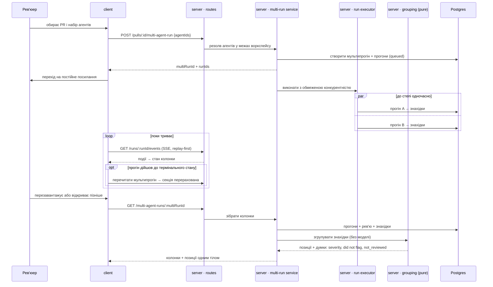

# Spec: Multi-Agent Review

**Spec ID:** SPEC-05
**Status:** approved
**Created:** 2026-08-26
**Clarifications:** чотири питання, усі закриті людиною одним раундом до написання файлу. Перше
розвернуло припущення диспатчу: фан-аут у `run-executor.ts:203` **послідовний**, а не паралельний,
тож формула естімейту з рішення №3 трималася на хибній підставі. Відповідь — не «переписати
формулу», а «зробити підставу правдивою, не зачепивши наявних шляхів» (D10). Решта три —
D11, D12, D13. Один рядок із переліку кутових випадків диспатчу людина скасувала як неточний
(див. D11).
**Amended:** 2026-08-26, того ж дня — відповіді людини на Q-1, Q-2 і Q-3. Це **пізніші рішення, а не
відновлення втраченого**: усі три були поставлені як питання, а не пропущені. Дописано D19, D20, D21
і AC-101…AC-118. **Переписано AC-62**, бо відповідь на Q-1 прямо його скасувала в частині третьої
кнопки, і **звужено D8** до двох кнопок замість трьох. `## Open questions` порожній.
При написанні критеріїв до Q-1 знайдено **шосту зміну контракту**, якої не було в жодному з
переліків — див. `## Module interactions`. **Спека не схвалена:** це відповіді на питання, а не
приймання документа, і критеріїв у ньому тепер **118**, а не 100.
**Amended (2):** 2026-08-26, вже після схвалення — розрізнення «не флагнув» і «не дивився». Це
**не пізніше рішення, а прогалина першого проходу**: D1 забороняє вигадувати думку агента, а AC-71
у первісному формулюванні вигадував її з іншого боку — агент, чий прогін упав, був скасований або
ще триває, рендерився написом `did not flag`, тобто як агент, який подивився на це місце й свідомо
промовчав. Людина підтвердила виправлення 2026-08-26. Дописано **D22, D23, D24** і
**AC-119…AC-135**; **переписано AC-71, AC-76, AC-111, AC-113**; звужено D1, розширено D20 до
чотирьох порожніх станів, додано **сьому зміну контракту** (`ConflictTake.verdict`). Статус
лишається `approved`, бо схвалено саме цю зміну; критеріїв у документі тепер **135**, а не 118.
**Amended (3):** 2026-08-26, після того як фічу реалізували всі чотири пакети й вона пройшла
рев'ю — три рішення людини за наслідками того рев'ю. Природа в кожного своя, і вона названа:
(1) **двоїстість, яку створив первісний текст і виявила реалізація** — AC-110 сформульований
безумовно, а AC-132 називає його текст причиною *порожньої* секції, тож самотній агент, який
щось знайшов, не бачив цього тексту ніколи; (2) **пізніше рішення** — стеля конкурентності
публікується в контракті, бо сьогодні її називає лише один із двох екранів; (3) **прогалина, якої
в спеці не було взагалі** — кількість одночасних SSE-потоків не обмежена нічим, при стелі в 10
агентів і 6 з'єднаннях на орігін у HTTP/1.1. Дописано **D25, D26, D27** і **AC-136…AC-150**;
**переписано AC-16, AC-78, AC-110, AC-113, AC-132, AC-133**; додано **восьму зміну контракту**
(дефолт конкурентності в `platform.ts`). Статус лишається `approved`, бо схвалено саме ці три
рішення; критеріїв у документі тепер **150**, а не 135. Але `## Open questions` більше не
порожній: опублікована стеля робить видимою суперечність у формулі естімейту (AC-17), і розв'язує
її людина, а не ця поправка — **Q-4**.
**Amended (4):** 2026-08-26, того ж дня — **відповідь людини на Q-4**, підперта живим виміром: на
прогоні з п'ятьма агентами при стелі 3 колонки показали 3.4, 3.8, 3.3, 3.7 і 5.1 с, а рядок
метаданих — «5.1s total», тоді як дві хвилі дали ≈ 8.9 с. Число, підписане як «total», було
занижене приблизно на три чверті — і це не наближення, а звіт про те, чого ніхто не переживав.
Рішення розділило два числа, які досі рахувалися однією формулою: **естімейт до запуску лишається
наближенням і рахує хвилі** ⌈N ÷ стеля⌉, **підсумок завершеного мультипрогону стає виміром**.
Дописано **D28** і **AC-151…AC-160**; **переписано AC-17, AC-41 і D3**; додано **дев'яту зміну
контракту** (`MultiAgentRun.total_duration_ms`, чий коментар у файлі й досі стверджує спростоване
«max over the runs»). `## Open questions` знову порожній.
**Amended (5):** 2026-08-26, того ж дня — **знято заборону, яку поставив первісний текст цієї
спеки**. `## Untrusted inputs` вимагав не робити зі шляху знахідки посилання; людина подивилася на
живий екран і вирішила інакше: клік по `file:line` веде в код так само, як на сторінці PR — і в
картках знахідок, і в заголовку позиції секції розбіжностей. Природа зміни названа чесно: це
**пізніше рішення людини**, а не прогалина першого проходу, — але заборона, яку воно скасовує,
трималася на непровіреному припущенні, і перевірка його спростувала. Будівник URL бере хост із
константи, кодує кожен сегмент окремо і відмовляється, щойно в імені репозиторію, коміті чи шляху
трапиться сегмент `.` або `..` (`client/src/lib/github-urls.ts:114`), тож вивести читача за межі
`github.com` шляхом, який написала модель, не можна. Сторінка PR будує такі посилання від початку —
тобто новий екран був суворішим за старий без підстави. Дописано **D29** і **AC-161…AC-174**;
**переписано рядок «Шлях файлу зі знахідки»** в `## Untrusted inputs`. Десятої зміни контракту
немає: коміт, який бачили агенти, уже лежить у `MultiAgentRun.head_sha`, доданому заради AC-109.
Статус лишається `approved`, бо рішення ухвалила людина; критеріїв у документі тепер **174**, а не
160. `## Open questions` лишається порожній.
**Amended (6):** 2026-08-27 — **правило групування виправлено на користь макета**. На живому екрані
один агент дав warning і suggestion, четверо завершилися без знахідок, і секція «Where agents
disagree» показала порожньо: правило, записане в цій спеці, викидало компонент, якого торкнувся
лише один прогін, щойно завершених агентів було двоє й більше. Макет увесь час показував
протилежне — **обидві** позиції в `…-columns.png` мають рівно один вердикт і по два «did not flag».
Тобто реалізація мовчки викидала саме той випадок, заради якого секція існує, і на даних власного
макета секція була б порожня цілком. Рішення людини 2026-08-27: мовчання завершеного агента — це
думка, і позиція має показуватися. Природа зміни: **прогалина першого проходу**, а не пізніше
рішення, — і вона четверта в цій фічі, де слова спеки розійшлися з макетом, і **перша, де правий
був макет**. Дописано **D30** і **AC-175…AC-177**; **переписано AC-75, AC-111**, прозу D11 і рядок
`## Edge cases` про знахідки без перетину; уточнено `## Non-functional requirements` числом позицій.
Правило про `not_reviewed` не чіпано: агент, чий прогін не дійшов до кінця, і далі не рахується ні
за, ні проти (AC-119, AC-128). Статус лишається `approved`, бо рішення ухвалила людина; критеріїв у
документі тепер **177**, а не 174. `## Open questions` більше не порожній: обсяг, який відкриває це
правило, робить видимим питання про тумблер — **Q-5**.
**Amended (7):** 2026-08-27, того ж дня — **відповідь людини на Q-5**, дослівно: «це згода,
конфліктом має бути тільки різна severity». Підстава — вимір: нинішній предикат прогнали по
**дев'ятьох реальних мультипрогонах**, і тумблер не сховав **жодної** позиції в жодному з них.
Дописано **D31** і **AC-178, AC-179**; **переписано AC-126, AC-112 і AC-132**. Природа в кожного
своя: AC-126 — **пізніше рішення людини**; AC-112 — слова, які застаріли після поправки 6; AC-132 —
**суперечність, яку звуження зробило живою**: він пускав усі три останні тексти лише при порожньому
переліку **побудованих** позицій, а умова AC-112 вимагає, щоб позиції були, тож AC-112 не міг
спрацювати ніколи. Порожнеч дві, і тепер вони розрізнені. AC-111 переписувати не довелося: він уже
каже «ніхто нічого не знайшов» із поправки 6 — брехав **словник клієнта**, і саме на це є новий
AC-179. Правило «`not_reviewed` відкидається першим» не чіпане (AC-127, AC-128). Усі чотири тексти
секції лишаються досяжними — перевірено поіменно в D31. Статус лишається `approved`; критеріїв у
документі тепер **179**, а не 177. `## Open questions` знову порожній.
**Обсяг проти схваленого:** людина схвалила документ на **135** критеріях. Після поправок 3, 4 і 5
їх **179**. Статус лишається `approved`, бо кожне рішення в цих поправках ухвалене людиною, — але
сорок чотири критерії додано **після** того схвалення, і перечитати їх варто саме як доповнення:
AC-136…AC-150 (поправка 3), AC-151…AC-160 (поправка 4), AC-161…AC-174 (поправка 5),
AC-175…AC-177 (поправка 6) і AC-178…AC-179 (поправка 7).
**Supersedes:** _Немає._
**Modules:** server, client

## Problem and user

Користувач — розробник, який рев'ює чужий PR у DevDigest. Агентів у нього кілька і вони
навмисно різні: `Security`, `Performance`, `Junior Mentor`, `Customer-Facing`, `Architecture` —
кожен зі своїм системним промптом і своїм кутом зору. Продукт уже вміє прогнати їх усіх
(`POST /pulls/:id/review` з `{all:true}`), але вміє це рівно в один спосіб: **накидати їхні
знахідки в один список**.

**Що з цього виходить.** Той самий рядок `src/middleware/ratelimit.ts:52` бачать троє агентів,
двоє з них пишуть про нього по знахідці — і в списку це дві незалежні картки. Читач не має
жодного способу дізнатися, що це те саме місце, і читає його двічі. Симетричний випадок гірший:
один агент флагнув місце, двоє інших його подивилися і промовчали — а мовчання в списку не
представлене взагалі, тож сигнал «троє дивилися, злякався один» просто не існує в UI. Саме цей
сигнал і є причиною тримати кількох агентів: **цінність не в сумі їхніх знахідок, а в тому, де
вони збіглися і де розійшлися.**

**Друге. Вибір «один або всі» — це не вибір.** `RunReviewDropdown.tsx` дає рівно два режими:
конкретний агент або кожен увімкнений. Прогнати саме `Security` і `Customer-Facing` на PR про
rate limiting — а це найзвичайніша річ, яку хочеться зробити, — можна тільки двома окремими
запусками, і результат тоді лежить у двох різних місцях без спільного адресата.

**Третє. Ціна невідома до того, як її заплачено.** Кожен агент — це оплачений виклик моделі.
`agent_runs` уже зберігає `duration_ms` і `cost_usd` кожного прогону, тобто дані, щоб сказати
«приблизно 8 секунд і двадцять центів», у базі лежать — але жодний екран їх перед запуском не
показує. Заміряно на цьому продукті раніше й записано в `INSIGHTS.md:450`: п'ять увімкнених
агентів на 193-символьному діфі — **1 хв 35 с**.

**Четверте, і це та обставина, задля якої спека мала зупинитися перед написанням.** Продуктова
теза «агенти працюють паралельно» в коді неправдива. `run-executor.ts:203` — це
`for (const { agent, runId } of jobs) { … await this.runOneAgent(…) }`: спільна пре-робота (діф,
intent, repo-intel) справді робиться один раз на весь набір, а самі агенти йдуть один за одним.
`diff-review.ts:199` — той самий цикл. Тобто макет, який обіцяє `≈ 8.2s` на чотирьох агентах,
обіцяє те, чого продукт не робить, і естімейт `max` був би не оптимістичним, а просто хибним —
вчетверо. Рішення людини (D10) — не пом'якшити обіцянку, а зробити її правдою **тільки для
мультипрогону**, лишивши наявні шляхи буквально незмінними.

**Чого ця спека не робить.** Вона не намагається звести кілька думок до однієї. Ніякого
«консенсусного вердикту», ніякого арбітра, який вирішить, хто з агентів має рацію. Обидві частини
відповіді — колонки й позиції розбіжностей — показують те, що агенти сказали, і залишають
рішення читачеві. Це не скромність обсягу: **арбітр — це ще один виклик моделі над виходом
моделі**, і його помилка була б невідрізненна від помилки агента, зате виглядала б як висновок.

## Goals / Non-goals

**G1.** Один запуск проганяє довільно обраний **набір** агентів на одному PR і лишає по собі
мультипрогін із постійним посиланням на результат.

**G2.** Результати агентів видно поруч у двох режимах — Columns і Tabs — з деталлю знахідки в
другому.

**G3.** Збіги й розбіжності між агентами обчислені **детерміновано** і показані окремим блоком, у
якому мовчання агента представлене нарівні зі знахідкою.

**G4.** До запуску видно чесний естімейт часу й вартості — з наявних вимірів, без вигаданих чисел
там, де вимірів немає.

**G5.** Під час прогону видно живий стан кожного агента, а з кожної колонки й з деталі є вхід у
трейс — той самий, що на сторінці PR, а не другий такий самий.

**G6.** Наявні шляхи запуску рев'ю — кнопка на сторінці PR і рев'ю сирого діфа — після цієї фічі
поводяться так само, як до неї. Це межа, а не побажання: обидва ділять із мультипрогоном той
самий виконавець.

**G7.** Атрибуція знахідки агенту лишається відновлюваною з даних після мультипрогону — сировина
для Per-Agent Stats, який ця спека не будує.

**G8.** У фічу є вхід із сайдбара і вхід зі сторінки PR, і жоден із них не лишає мультипрогону без
адреси.

---

**N1.** Движок `ci/` і `agent-runner/` не чіпається. Мультипрогін — локальна дія, `source: 'local'`.

**N2.** Compose Review drawer — курування знахідок перед публікацією рев'ю — інша фіча. Дії над
знахідкою тут обмежені тими, що вже є.

**N3.** Екран Per-Agent Stats не будується. `AgentStats` у контракті вже описаний і лишається без
реалізації.

**N4.** `Learn` і `Turn into eval case` не отримують механіки (D8).

**N5.** Ані ембедингів, ані LLM-судді для схожості знахідок (D2).

**N6.** Жодного `git worktree`. Агенти виконуються в процесі сервера (D9).

**N7.** Рядки Memory / Eval Dashboard / Agent Performance / CI Runs у сайдбарі не додаються (D5).

**N8.** Скасування мультипрогону цілим не додається. Скасування окремого прогону вже існує і не
змінюється; мультипрогін зобов'язаний лише вміти показати скасований прогін.

## Decisions and alternatives

**D1 — «did not flag» без вигаданого тексту.** У позиції розбіжності агент, який її не флагнув,
показує сірий маркер і напис `did not flag`, і **жодної нотатки**. Пояснення з макета («Not a
security concern.», «Cosmetic; out of scope for arch review.») у реальних даних не існує: агент,
який промовчав, не написав нічого, з чого їх узяти. _Відкинуто:_ окремий виклик моделі, який
попросив би агента пояснити своє мовчання — це вигадування думки заднім числом, ще й оплачене.
Нотатка заповнюється лише для агентів, які реально флагнули, і береться з обґрунтування їхньої
знахідки.

_Звужено 2026-08-26 (поправка):_ D1 накриває агента, **чий прогін дійшов до кінця** — подивився й
промовчав. Агент, чий прогін упав, скасований або ще триває, під D1 не підпадає взагалі: у нього
немає ані знахідки, ані мовчання. Це третій стан — див. D22.

**D2 — схожість суті рахується детерміновано.** Дві знахідки — про те саме, якщо збігається файл
**І** їхні діапазони рядків перетинаються **І** (збігається категорія **АБО** схожість
нормалізованих токенів заголовка не менша за поріг). _Відкинуто:_ ембединги і LLM-суддя. Підстава
не в ціні: правило має бути юніт-тестованим і давати той самий результат на тому самому наборі
знахідок, а обидві відкинуті альтернативи цього не дають.

**D3 — естімейт з ОСТАННЬОГО прогону, не з середнього.** Час і вартість агента беруться з його
останнього **успішного** прогону в цьому воркспейсі. Вартість мультипрогону — сума по обраних.
_Відкинуто:_ середнє по N прогонах — воно розмиває зміну моделі агента, після якої попередні
прогони описують інший агент.

_Переписано 2026-08-26 (поправка 4, відповідь на Q-4):_ звідси прибрано «час мультипрогону —
максимум по обраних». Це формулювання було правдою рівно поки обраних не більше за стелю
конкурентності, і воно ж стояло і за естімейтом, і за підсумком завершеного прогону. Тепер це два
різні числа з двох різних джерел — D28. Решта D3 чинна: з якого саме прогону агента береться його
власне число, вирішує саме вона.

**D4 — роути.** Configure run — репо-скоупний шлях; результати конкретного мультипрогону — шлях
із його ідентифікатором, і це і є постійне посилання. Сторінка репо-скоупна, бо список PR
репо-скоупний.

**D5 — сайдбар: секція GLOBAL з єдиним рядком.** Ключ `multi-agent` уже повертає
`activeKeyFor()` (`client/src/components/app-shell/helpers.ts:29`), і переклад `nav.multi-agent`
уже лежить у `client/messages/en/shell.json:26`. Бракує рядка в `NAV`. Решта рядків GLOBAL із
макета належать іншим шматкам роботи.

**D6 — трейс-дровер перевикористовується, а не дублюється.** `RunTraceDrawer` переїжджає з
колокейтнутої теки PR-сторінки у спільне місце клієнта; обидві сторінки монтують один компонент.
Поведінка PR-сторінки при цьому не змінюється, і це вимога, а не сподівання (AC-80).

**D7 — мультипрогін створюється завжди**, навіть коли обрано одного агента: інакше в результату
немає постійного URL, а посилання з PR-сторінки нема куди вести.

**D8 — `Learn` і `Turn into eval case` — гачки, не механіка.** Рендеряться в деталі знахідки й
неактивні. Підстава конкретна: `server/src/modules/reviews/findings.ts` приймає рівно `accept` і
`dismiss` і будь-яку іншу дію відхиляє 400, а таблиця `memory` порожня до наступних уроків. Це
свідома межа, а не недоробка — кнопка, яка мовчки нічого не робить, гірша за кнопку, яка видно
неактивна.

_Звужено 2026-08-26 (відповідь на Q-1):_ D8 накриває **рівно ці дві** кнопки. `Reply to author`
з-під нього виходить — див. D19.

**D9 — «fan-out via worktrees» з макета не переноситься.** Жодних git worktree в
`run-executor.ts` немає — агенти виконуються в процесі. Правильний текст рядка описує виконання в
процесі з обмеженою конкурентністю. Наявний рядок перекладу
(`client/messages/en/runs.json`, `page.meta`) каже «fan-out via p-queue» — це ближче до правди,
але теж не факт про цей шлях: `p-queue` є в залежностях і використовується у фоновому раннері
задач, а не в рев'ю.

**D10 — паралель ТІЛЬКИ для мультипрогону.** Виконавець прогонів отримує опційний параметр
конкурентності з дефолтом **1**. Наявні виклики передають його не передають — і їхня поведінка не
змінюється ані на крок. Мультипрогін передає стелю і пускає обраних агентів разом. _Відкинуто:_
зробити паралель дефолтом для всіх — це зміна поведінки кнопки на сторінці PR і рев'ю сирого
діфа, тобто рівно те, що D6 забороняє для дровера, а G6 — для шляхів. _Відкинуто також:_ лишити
все послідовним і рахувати естімейт сумою — тоді чотири агенти коштують хвилину, і фіча, яка
існує заради порівняння кількох думок, карає за кожну додану думку.

**D11 — «Show only conflicts» звужує секцію, а не колонки.** Секція «Where agents disagree»
показує **всі** побудовані позиції, включно з тими, де агенти зійшлися: у цьому половина її
цінності — дублікати перестають муляти, бо видно, що це те саме місце. Тумблер звужує її до
позицій, де є розбіжність. Колонки й вкладки тумблер не фільтрує ніколи. Рядок із переліку
кутових випадків диспатчу — «знахідки без перетину з жодним іншим агентом при увімкненому Show
only conflicts» — читався як протилежне і **скасований людиною як неточний**; замість нього в
`## Edge cases` стоїть справжній випадок: мультипрогін, у якому жодна позиція не має розбіжності.

_Уточнено 2026-08-26 (поправка):_ що саме рахується розбіжністю, D11 не визначав — визначає D23.

_Переписано 2026-08-27 (поправка 6):_ слово «крос-агентні» тут було зайвим кваліфікатором і саме
воно звузило правило до того, що секція порожніла на власному макеті. Секція показує **всі**
позиції, а не лише ті, яких торкнулося два і більше прогонів — D30.

**D12 — зі сторінки PR у результат веде неблокуюче посилання, не редирект.** Людина натиснула
«прогнати рев'ю на цьому PR», а не «піти на інший екран». Сирота-мультипрогін без входу в UI —
теж не варіант.

**D13 — дропдаун PR показує все, включно з `merged` і `stale`.** Наявна поведінка виграє в
макета: `RunReviewDropdown.tsx` уже встановив продуктове правило — попереджати, а не забороняти.
Фільтр `p.status !== "stale"` у макеті — зручність прототипу на фікстурах. Два екрани, які не
згодні між собою, що таке «PR, на якому можна прогнати рев'ю», гірші за розходження з макетом.

**D14 — колір агента виводиться з його ідентифікатора.** У `agents` немає колонки кольору чи
іконки, а макет розфарбовує агентів наскрізь — картка в пікері, верхня смуга колонки, підкреслення
вкладки, ліва межа шапки. Колір має бути функцією **тільки** незмінного ідентифікатора агента, а
не його позиції в списку: інакше агент змінює колір між пікером (де видно всіх) і результатом (де
видно обраних), тобто рівно там, де колір мав би зв'язати два екрани. Палітра скінченна, тож два
агенти можуть отримати один колір — це прийнято свідомо, і саме тому AC-45 вимагає, щоб колір
ніде не був єдиним носієм тотожності.

**D15 — заголовок позиції виводиться зі знахідок-учасниць детерміновано.** У макеті позиції
підписані «Magic number 3600» і «429 response shape» — а таких заголовків немає в жодної знахідки
поруч («Extract magic number 3600», «Retry-After header omitted on 429»). Тобто макет показує
згенерований підпис, а D2 забороняє питати про нього модель. Заголовком стає заголовок
найважчої знахідки-учасниці, з названим детермінованим правилом розв'язання нічиїх.

**D16 — у пікері попередньо позначені всі увімкнені агенти.** Це та сама межа, що вже проведена в
`RunReviewDropdown.tsx`: перелічуються ВСІ агенти, конкретного вимкненого можна прогнати явно, а
«всі» означає «всі увімкнені». Спека переносить це правило, а не вигадує нове.

**D17 — стелі названі числами, а не «розумно».** Безмежний фан-аут — це безмежна витрата на один
клік. Числа в `## Non-functional requirements`.

**D18 — відповідь мультипрогону самодостатня.** Один запит має віддати все, що малюють обидва
режими і деталь знахідки. _Відкинуто:_ добирати обґрунтування й запропоноване виправлення другим
запитом до наявного ендпоінта рев'ю — тоді сторінка має два джерела правди про одну знахідку, і
вони розходяться рівно тоді, коли між двома запитами хтось прийняв знахідку.

**D19 — `Reply to author` підключається до наявного створення інлайн-коментаря.** Це не третій
гачок: ендпоінт коментарів PR уже існує і працює. Але з нього випливають три обставини, яких
жодна інша дія в цій деталі не має, і саме вони формують критерії AC-101…AC-109.

Перша: **дія зовнішня і незворотна.** Accept і Dismiss пишуть у власну БД, і їх можна переграти.
Коментар іде в GitHub і стає видимим авторові PR негайно. Тому тут — і тільки тут — потрібне явне
підтвердження людини на екрані порівняння; кнопка, яка публікує з першого кліку, на екрані, де
поруч лежать чотири думки чотирьох агентів, помиляється надто дешево.

Друга: **вона регулярно падає, і це не помилка користувача.** Ендпоінт має два різні шляхи
відмови, обидва з видимою причиною: немає токена GitHub (`github_unavailable`, «Connect a GitHub
token to post comments.») і GitHub відхилив коментар (`github_comment_failed`) — що трапляється
на рядку **поза діфом** і на закритому PR. Перший випадок звичайний: модель цитує рядок, якого
в патчі немає. Другий випадок ця спека створює сама, бо за D13 `merged`/`closed` PR лишається в
дропдауні.

Третя: **коментар прив'язується до поточного `head_sha` PR**, а знахідки мультипрогону вироблені
на тому стані, який агенти бачили. Якщо PR відтоді зрушив, рядок міг поїхати — і коментар ляже
не туди, куди дивився агент. Це той самий клас, що вже названий у SPEC-02 доктриною «не подавати
число іншого стану як поточне»; тут ціна вища, бо результат публічний.

Що йде в коментар: файл і **початковий** рядок знахідки (контракт коментаря приймає один рядок, не
діапазон), тіло — попередньо заповнене з обґрунтування знахідки і **редаговане** до відправки.

**D20 — кожна причина порожньої секції розбіжностей отримує свій текст.** Один агент у
прогоні; спільні позиції є, але розбіжностей немає; жодної позиції не побудовано. Друга
з них — **не порожнеча, а результат**: «чотири агенти подивилися і всюди зійшлися» — це відповідь,
заради якої екран існує, і подавати її тим самим сірим «нічого немає», що й «ти обрав одного
агента», означає викинути найкращий можливий результат прогону.

_Розширено 2026-08-26 (поправка):_ причин **чотири**, а не три. Четверта — **менш ніж два прогони
дійшли до кінця**: усі, крім одного, впали, або впали всі, або решта ще триває. Наявні три її не
накривають, і це перевірено поіменно: «ти обрав одного агента» неправда, бо агентів кілька;
«агенти дивилися на різні місця» неправда, бо решта не дивилася зовсім; «агенти зійшлися скрізь» —
найгірша з трьох, бо подає обвал прогонів як одностайність. Текст четвертої причини називає
числа — скільки прогонів завершилося, скільки триває, скільки не дійшло (AC-129), — тому один
текст чесний і для «впали всі», і для «ще триває». Порядок розв'язання чотирьох причин
названий в AC-132.

_Уточнено 2026-08-27 (поправка 6):_ третя причина називається інакше. Після D30 будь-яка знахідка
дає позицію, тож порожній перелік при двох і більше завершених прогонах означає «ніхто нічого не
знайшов», а не «дивилися на різні місця» (AC-111). Поіменна перевірка вище від цього не втрачає
сили: під новою назвою третій текст так само не накриває четверту причину — «ніхто нічого не
знайшов» неправда, коли решта прогонів просто не дійшла до кінця.

_Звужено 2026-08-26 (поправка 3):_ «причина порожньої секції» — правильний опис для трьох із
чотирьох, але не для першої. Один агент у прогоні — це не те, **як вийшло**, а те, **що обрано**:
секція в цьому разі не порожніє, а не будується взагалі. Див. D25, який виводить цю причину з-під
спільного формулювання D20.

**D21 — повторний запуск створює НОВИЙ мультипрогін.** Сторінка результатів дає запуск наново тим
самим набором на тому самому PR. За D7 це новий мультипрогін із власним посиланням, а попереднє
порівняння лишається доступним за своїм. _Відкинуто:_ перезаписати наявний мультипрогін — це
зламало б рівно ту властивість, заради якої D7 його взагалі створює, і мовчки знищило б
порівняння, на яке хтось міг послатися.

**D22 — «не дивився» — це третій стан вердикту, а не мовчання.** _(поправка 2026-08-26)_
`ConflictTake.verdict` сьогодні — `Severity | 'ignored'`, тобто рівно дві можливості: агент флагнув
або агент промовчав. Третьої — «у цього агента немає думки, бо його прогін не дійшов до кінця» —
немає, і тому впалий, скасований чи ще живий прогін неминуче читається як другий випадок. Додається
значення **`not_reviewed`**: воно ставиться тоді й лише тоді, коли прогін агента не в стані `done`.
Назва обрана так, щоб різниця читалася з самого поля: `ignored` — агент подивився і пропустив,
`not_reviewed` — агента тут не було.

_Відкинуто:_ лишити два значення й позначати відмову порожньою нотаткою — нотатка вже забрана
рішенням D1, і повертати її як службове повідомлення означає покласти текст системи в поле,
відведене під обґрунтування агента.

_Відкинуто:_ чотири значення замість одного — `failed`, `cancelled`, `running`, `queued` окремо.
Стан прогону вже лежить у його колонці, у тому самому тілі відповіді (D18, AC-98), і дублювати
його всередині думки означає завести два місця, які можуть розійтися. Розходження тут не
теоретичне: секція, яка каже «reviewing» поруч із колонкою, яка каже «run failed», — це видимий
читачеві дефект. Тому думка каже **що** думки немає, колонка каже **чому**, а підпис у секції
бере слово в колонки (AC-123, AC-125).

**D23 — конфлікт визначається лише серед прогонів, що дійшли до кінця.** _(поправка 2026-08-26)_
Позиція, де один агент флагнув, а решта **впала**, — не розбіжність: не з чим не погоджуватися.
Думка з вердиктом `not_reviewed` не рахується ні за, ні проти; після її відсіву позиція є
конфліктом лише тоді, коли серед тих, хто **флагнув**, є щонайменше дві різні severity (AC-126).
Якщо після відсіву лишилася одна думка або жодної, позиція не конфлікт (AC-127).

Підстава не лише в логіці — це вже було написано в самому контракті й загубилося дорогою. Коментар
над `Conflict` у `contracts/observability.ts:61-65` визначає конфлікт як місце, яке «at least one
agent flagged and at least one **other agent (that also reviewed)** did NOT». Кваліфікатор «that
also reviewed» — рівно це правило; спека його не вигадує, а повертає.

_Переписано 2026-08-27 (поправка 7):_ із того самого коментаря лишається чинним **тільки**
кваліфікатор «that also reviewed» — тобто відкидання `not_reviewed`, заради якого D23 і писався.
Решту його означення — «один флагнув, інший ні» — людина скасувала: це згода, а не конфлікт (D31,
AC-126). Тобто тепер уже **коментар у контракті** розходиться зі спекою, а не навпаки, і виправити
його — робота коду, не цього документа. Наслідок для самого D23 вузький і незмінний: впалий прогін
і далі не рахується ні за, ні проти, і позиція з ним і далі видима при вимкненому тумблері
(AC-128).

_Відкинуто:_ рахувати впалий прогін за мовчання — це та сама вигадка, що й у AC-71 до поправки,
тільки піднята у фільтр: тумблер «Show only conflicts» показував би позиції, де ніхто ні з ким не
розійшовся. _Відкинуто:_ рахувати його за незгоду — гірше, бо це вже вигадана незгода, а не
вигадане мовчання. _Відкинуто:_ ховати такі позиції й при вимкненому тумблері — тоді зникає
знання, заради якого секція існує: самотня знахідка лишається самотньою **невідомо чому**, і читач
не бачить, що підтвердити її не було кому (AC-128).

**D24 — секція живе разом із прогоном, а не з'являється після нього.** _(поправка 2026-08-26)_
Секція рендериться від першого відкриття сторінки результатів, включно з моментом, коли частина
агентів ще в `queued`/`running`. Вона показує позиції з тих знахідок, які **вже** збережені; думки
агентів, чиї прогони ще не дійшли до кінця, мають `not_reviewed` з підписом стану; і поки хоч один
прогін не в термінальному стані, секція несе видиму ознаку, що порівняння не остаточне (AC-133).
Позиції не зберігаються (AC-97), тож перерахунок на кожному завершенні прогону — це не інвалідація
кешу, а звичайне читання (AC-134).

_Відкинуто:_ ховати секцію до завершення всіх прогонів. По-перше, це втрата найранішого корисного
сигналу: двоє вже завершилися і вже розійшлися — це видно за секунди до кінця мультипрогону.
По-друге, при вимірі з `INSIGHTS.md:450` (п'ять агентів — 1 хв 35 с) тумблер і половина екрана
півтори хвилини були б мертві, а потім стрибком з'явилися б, зсунувши вміст під руками читача.

**D25 — самотній агент: секція складається з самого тексту.** _(поправка 3, 2026-08-26)_
Первісний текст лишив тут двоїстість, і реалізація її показала. AC-110 сформульований безумовно
(«якщо в мультипрогоні один агент»), а AC-132 називає його одним із чотирьох текстів **порожньої**
секції. Але правило групування при менш ніж двох завершених прогонах зберігає **кожен** компонент —
інакше самотня знахідка зникала б, що прямо забороняє AC-128. Отже, коли самотній агент **щось
знайшов**, позиції є, гілка порожнього стану не спрацьовує, і текст AC-110 не з'являється **ніколи**.
Він був видимий рівно в одному випадку — коли самотній агент не знайшов нічого.

**Рішення людини:** текст показується **завжди**, коли в мультипрогоні рівно один агент. Порівнювати
справді нема з ким, і подавати самотню знахідку як «позицію» означає натякати на зіставлення, якого
не було: у позиції одна думка, і рядок «did not flag» під нею не стоїть, бо стояти нема кому.

**Що з цього випливає для екрана.** Секція складається з самого тексту: жодної позиції (AC-136),
жодного тумблера (AC-137), жодної ознаки неостаточності (AC-138, і саме тому звужено AC-133). Знахідки
самотнього агента при цьому нікуди не діваються — вони в його колонці й у його вкладці в повному
складі (AC-139), тобто секція не приховує нічого, вона лише не переказує вдруге того, що поруч уже
показано без натяку на порівняння. _Відкинуто:_ показати текст, а під ним усе одно позиції — тоді
екран каже «нема з ким порівнювати» і тут же малює те, що виглядає як порівняння; читач вірить
картинці, а не рядку над нею.

**Це не той випадок, що AC-128, і межа між ними проходить по тому, кого обрали.** AC-128 накриває
мультипрогін, у якому агентів **кілька**, а дійшов один: там було з ким порівнювати, порівняння не
відбулося через відмови, і позиція має лишитися видимою — інакше зникне знання, що підтвердити
знахідку **не було кому**. D25 накриває мультипрогін, у якому агент **один із самого початку**: тут
нема ні відмови, ні знання про неї, і показувати нема чого. Два випадки не перетинаються, бо
розрізняє їх кількість агентів у мультипрогоні, а не кількість завершених прогонів.

**D26 — стеля конкурентності публікується в контракті.** _(поправка 3, 2026-08-26)_ Естімейт на
Configure run каже «in-process fan-out», а рядок метаданих на сторінці результатів — «in-process
fan-out, up to 3 at a time». Розбіжність не задумана: число живе на `MultiAgentRun.concurrency`,
тобто **на прогоні**, якого на екрані налаштування ще не існує, а в спільному контракті
опублікована лише стеля агентів (`MAX_AGENTS_PER_MULTI_RUN`). Дефолт конкурентності лежить у
модулі рев'ю сервера і клієнтові недосяжний.

**Рішення людини:** дефолт переїжджає у спільний контракт, поруч зі стелею агентів, і обидва екрани
починають називати число, а не мовчати про нього (AC-140, AC-141). Це **восьма** зміна контракту
цієї фічі — з тим самим правилом дзеркалення двох вендорованих копій, що й решта семи.

**Але однакове число — не завжди правда, і саме тут вона розходиться.** `multi_agent_runs.concurrency`
зберігається на рядку прогону, тож мультипрогін, запущений місяць тому, несе те число, з яким його
справді виконали, а дефолт відтоді міг змінитися. Тому екрани називають число з різних джерел
свідомо: Configure run описує те, що **буде** (чинний дефолт, AC-141), сторінка результатів — те, що
**було** (число цього прогону, AC-143). _Відкинуто:_ малювати на результатах чинний дефолт, бо він
«актуальніший» — це рівно та доктрина, яку SPEC-02 уже назвала: не подавати число іншого стану як
поточне (AC-144).

**D27 — живих потоків подій не більше чотирьох.** _(поправка 3, 2026-08-26)_ Сторінка результатів
відкриває один `EventSource` на прогін (`client/src/lib/hooks/multi-agent.ts:122`), а стеля агентів —
10. Браузер по HTTP/1.1 дає **6 з'єднань на орігін**, і всі потоки та всі звичайні запити цієї
сторінки йдуть на один орігін — API. Наслідок на прогоні з 10 агентів потрійний: чотири колонки не
підключаються взагалі; їхнє закриття потоку не настає, тож сторінка після їх завершення не
перечитується; і кожен звичайний запит стає в чергу за шістьма довгоживучими потоками.

**Рішення людини:** клієнт тримає потоки лише для **нетермінальних** прогонів і не більше **чотирьох**
одночасно; решта підхоплюється, коли попередні закриваються (AC-145…AC-147).

**Наслідок, який мусить лишитися істинним, і він тут головний.** Колонка, для якої потік ще не
відкрито, **не має права виглядати завершеною або застряглою**: стан вона бере з того самого читання
мультипрогону, що й решта колонок (AC-148). Потік — це прискорення оновлення, а не джерело стану, і
різниця між «я про цей прогін ще не слухаю» та «цей прогін нічого не робить» на екрані не має бути
видимою. Так само перерахунок секції не має права загубитися: прогін, який дійшов до кінця, доки
його не слухали, все одно змушує перечитати мультипрогін (AC-149). _Відкинуто:_ підняти стелю до
шести — тоді на живі дані не лишається жодного з'єднання ні для звичайних запитів, ні для живого
логу трейс-дровера, який відкриває свій власний потік (AC-150).

**D28 — естімейт наближає, підсумок вимірює.** _(поправка 4, 2026-08-26, відповідь на Q-4)_ Обидва
числа рахувалися однією формулою — максимум по прогонах, — і обидва були хибні щойно обраних більше
за стелю. Вимір: п'ять агентів при стелі 3, колонки 3.4 / 3.8 / 3.3 / 3.7 / 5.1 с, рядок метаданих
«5.1s total», фактично ≈ 8.9 с двома хвилями. **Рішення людини розділяє їх за природою:** естімейт
описує майбутнє і має право наближати; підсумок описує минуле, і наближення в ньому неприйнятне.

**Підсумок — виміряний проміжок самого мультипрогону.** Сервер знає, коли мультипрогін почався і
коли його останній прогін дійшов до термінального стану; це число він і віддає (AC-41, AC-155).
Воно не виводиться з тривалостей окремих прогонів **узагалі** — і саме тому вбирає те, чого в них
не видно: очікування в черзі між хвилями, спільну пре-роботу, паузи планувальника. Поки прогін іще
йде, рядок показує час, що **минув** дотепер, і підписаний він відповідно: «total» незавершеного
прогону — це твердження про стан, якого ще не сталося (AC-156).

_Відкинуто:_ лишити максимум і просто перейменувати підпис із «total» на «longest». Підпис став би
правдивим, а екран — беззмістовним: питання, на яке людина дивиться в цьому рядку, — «скільки це
коштувало мені часу», і найдовший окремий прогін на нього не відповідає.

**Естімейт — сума максимумів по хвилях.** Хвиль ⌈N ÷ стеля⌉ (AC-151), і рахуються вони по **всіх**
обраних агентах: агент займає слот незалежно від того, чи ми знаємо його тривалість. Порядок
формування хвиль детермінований — за спаданням тривалості останнього успішного прогону, а агенти
без історії йдуть у хвіст у сталому порядку агентів AC-46 (AC-152). Спадання обране не для
акуратності: хвильова модель ставить бар'єр там, де черга робіт його не має — вона тримає слот
вільним до кінця хвилі, — тож така оцінка **завищує** відносно того, як виконавець працює
насправді. Для числа, яке людина читає перед тим, як заплатити, помилка вгору — правильний бік.
Коли обраних не більше за стелю, хвиля одна і естімейт дорівнює максимуму, тобто рівно старій
поведінці в тому єдиному випадку, де вона була правдива (AC-153).

**Агенти без історії ламають хвильову оцінку з двох боків одразу**, і це та обставина, заради якої
питання взагалі поставили: невідома і тривалість такого агента, і те, скільки часу додасть хвиля,
у якій він стоїть. Спека не вигадує йому числа — вона визнає наслідок: щойно серед обраних є хоч
один агент без історії, число часу перестає бути оцінкою і подається як **нижня межа** (AC-154).
Скільки саме агентів у неї не потрапило, рядок уже зобов'язаний назвати (AC-22), а якщо історії
немає ні в кого — число не показується взагалі (AC-23). _Відкинуто:_ підставити такому агентові
середню тривалість решти — це вигадане число всередині числа, підписаного як вимір сусіднього
екрана.

**Третій наслідок, якого в питанні не було, і його дала схема.** Жнець позначає осиротілі прогони
відмовою на старті сервера (`run.repo.ts:137`) і **не пише їм тривалості**. Тобто мультипрогін,
перерваний смертю процесу, дійде до термінального стану через годину після того, як усе спинилося,
і різниця «почався — останній прогін став термінальним» виміряє не роботу, а простій. Таке число
брехливіше за старий максимум, бо виглядає як вимір. Тому мультипрогін без записаного моменту
завершення показує `—` і каже, що його перервано (AC-158). _Відкинуто:_ узяти момент жнива — це
рівно та підміна, яку D28 і прибирає.

**Дрібний виграш, який дістається задарма і варто назвати:** підсумок, виміряний на мультипрогоні,
не змінюється, коли з нього видаляють прогін (AC-159). Виведений із тривалостей — змінювався б, і
постійне посилання з D4 показувало б завтра інше число, ніж учора, без жодної події.

**D29 — `file:line` веде в код, і веде туди, куди дивилися агенти.** _(поправка 5, 2026-08-26)_
Первісний текст цієї спеки заборонив робити зі шляху знахідки посилання, і заборона була
**помилкова**. Її підстава — «шлях пише модель, яка щойно прочитала недовірений діф» — правдива;
її висновок — ні, бо між цим шляхом і адресним рядком браузера стоїть будівник, який уже вміє з
таким шляхом поводитися. Він бере хост із константи, кодує кожен сегмент окремо і повертає «нічого»
на будь-якому сегменті `.` чи `..` (`client/src/lib/github-urls.ts:114`). Сторінка PR живе з цим
від початку. Тобто новий екран був **суворіший за старий, не будучи безпечнішим** — а ціна
суворості лягла на читача: він бачив координату знахідки й не мав із неї жодного шляху до коду.

**Що гарантовано і що ні — прямо, бо на цьому й трималася заборона.** Гарантовано: орігін
побудованого посилання — завжди `https://github.com`, хоч би що модель написала у шлях; дописування
до вже абсолютного URL нового орігіну не створює, а кодування сегментів лишає від схеми `https%3A`.
Гарантовано також, що цитата не відкриє **чужого репозиторію**: єдине, чого кодування не знімає, —
це сегменти `.` та `..`, які браузер розкриває сам, і саме на них будівник відмовляє (AC-168,
AC-174). Не гарантовано **нічого про ціль**: модель може написати шлях, якого в тому дереві немає,
і GitHub відповість 404. Це зламане посилання, а не вразливість, і ця фіча його не перевіряє
(AC-173) — перевірка означала б запит із застосунку на кожну знахідку заради того, щоб приховати
посилання, яке в найгіршому разі показує сторінку «файлу немає».

**Місць, де надрукований `file:line`, три, і посиланням стають усі три** (AC-161…AC-163): картка
знахідки у вкладці, компактна картка в колонці й заголовок позиції в секції розбіжностей. Читання
доручення тут ширше за його букву — «картки знахідок» узято як **обидва** місця, де надрукована
координата знахідки, — бо інакше клік працює в Tabs і мовчить у Columns на тій самій знахідці, а це
дефект, який читач бачить. _Відкинуто:_ зробити посиланням і **заголовок позиції** — той текст
вивела фіча із заголовків знахідок-учасниць, він не є координатою і вести йому нікуди (AC-164).

**Коміт береться з мультипрогону, а не з поточного стану PR** (AC-165), і це те саме рішення, яке
вже ухвалене для `Reply to author` (AC-109), тільки застосоване там, де воно не кричить. Знахідка
зроблена проти того стану коду, який бачили агенти; поточний head може бути іншим, і тоді
посилання відкриє рядок, який зсунувся. Різниця з AC-109 в одному: там людина бачить попередження
перед публічною дією, тут просто відкривається не той рядок — тихо. Другий доказ — не міркування,
а вимір: у `client/INSIGHTS.md` записано випадок, коли посилання, прив'язане до чужого коміту,
давало 404 **на кожному файлі, який PR додає** (2f8b7e19 → 404, 208c29e8 → 200 на тому самому
шляху). Коміт мультипрогону — це якраз те дерево, у якому доданий файл існує.

_Відкинуто:_ підставити `pr.head_sha`, коли на мультипрогоні коміту немає (старі рядки до
міграції). Мовчазний відкат дає посилання, яке **виглядає** прив'язаним до перегляду, а веде в
інший стан коду, і відрізнити його на екрані нічим. Тому такий мультипрогін лишає `file:line`
текстом (AC-166) — того самого класу відмова, що й брак повного імені репозиторію (AC-167) чи
шлях із `..` (AC-168): посилання не з'являється, координата лишається читабельною цілком.

**D30 — позицією стає компонент, а не перетин.** _(поправка 6, 2026-08-27)_ Первісне правило
викидало компонент, якого торкнувся один-єдиний прогін, щойно завершених агентів було двоє й
більше. На живому екрані це дало порожню секцію при одному агенті з warning і suggestion і
чотирьох, що завершилися чисто. **Рішення людини: позиція показується незалежно від того, скільки
прогонів її торкнулося** (AC-175); думки решти завершених агентів у ній — `ignored`, і що вони
показують, уже сказано в AC-70 і AC-71, тому нового критерію на це не додано. Правило про
`not_reviewed` не змінене ні на слово: агент, чий прогін не дійшов до `done`, і далі не рахується
ні за, ні проти (AC-119, AC-128).

**Підстава — макет, і вона сильніша, ніж виглядала.** У `…-columns.png` секція має дві позиції, і
**обидві** — з одним вердиктом: `ratelimit.ts:28` «Magic number 3600» (Junior Mentor SUGGESTION,
Security і Architecture — `did not flag`) і `ratelimit.ts:52` «429 response shape»
(Customer-Facing WARNING, Performance і Security — `did not flag`). Тобто правило, записане
словами, викидало **не крайній випадок, а єдиний випадок, який дизайн узагалі показує**: на даних
власного макета секція була б порожня цілком. Це й робить помилку прогалиною першого проходу, а
не пізнішим рішенням, — жодне нове знання для неї не було потрібне, досить було подивитися на
картинку, яка лежала в `specs/assets/` від початку.

**Чому мовчання завершеного агента — думка, а не її брак.** Половина цінності секції в тому, що
вона показує **розподіл** уваги: один агент вважає місце вартим уваги, інші подивилися й свідомо
пройшли повз. Викинути таку позицію — значить показати читачеві тільки ті місця, де двоє й більше
агентів **збіглися**, тобто рівно те, що він і так побачить у двох колонках поруч. Найцінніший
рядок — самотній сигнал із трьома «did not flag» — зникав саме тому, що був самотній.

**Наслідок для обсягу названо числом, і він не малий.** Секція тепер показує кожну знахідку
кожного агента, згруповану за місцем: п'ять агентів по десять знахідок — до **50** позицій там, де
раніше були одиниці, а на межі NFR (10 × 50 = 500 знахідок) — до **500** позицій із до **10**
думок у кожній. Наявні числа NFR це тримають і не змінюються: 250 мс на групування, 2 МБ на тіло
відповіді, де ріжеться текст обґрунтувань, а не кількість позицій. Чого спека не дозволяє — тихо
показати частину переліку (AC-177).

**Що це робить з тумблером, сказано чесно: майже нічого.** За AC-126 позиція з одним флагом і
хоча б одним `ignored` **є** конфліктом, тож після D30 конфліктом є майже кожна позиція, і
«Show only conflicts» відсіює лише ту, де **всі** завершені агенти флагнули з однаковою severity
(випадок AC-112). Строго кажучи, це було правдою й до поправки — предикат не змінився, — але на
переліку з одиниць позицій не муляло, а на переліку з п'ятдесяти стає видно. Спека цього **не**
розв'язує: чи має тумблер означати щось вужче — продуктове рішення, і воно винесене в **Q-5**.
_Відкинуто:_ підправити AC-126 самотужки, щоб тумблер «запрацював». Це означало б переписати
визначення конфлікту заради поведінки контрола, тобто вирішити за людину те саме питання, яке
щойно коштувало цій фічі порожньої секції.

**D31 — конфлікт — це різні severity, і більше нічого.** _(поправка 7, 2026-08-27, відповідь на
Q-5)_ Позиція є конфліктом тоді й лише тоді, коли серед тих, хто **флагнув**, зустрічається дві
різні severity (AC-126). Половина колишньої умови — «хтось флагнув, а хтось `ignored`» — скасована
людиною дослівно: **це згода**. Один агент вважає місце вартим уваги, решта завершених подивилася
й свідомо пройшла повз — у цьому немає розбіжності, яку варто показувати окремим фільтром
(AC-178).

**Підстава — вимір, а не міркування.** Нинішній предикат прогнали по **дев'ятьох реальних
мультипрогонах**: тумблер не сховав **жодної** позиції в жодному з них. Він робив рівно те, що
було написано в AC-126, і саме тому був марний — контрол, який ніколи нічого не змінює, гірший за
відсутній, бо обіцяє фільтр і бере на себе місце в шапці секції.

**Що це полагодило, крім тумблера.** AC-112 — «вони скрізь зійшлися» — знову має сенс: тепер
існують позиції, які не є конфліктом, тож увімкнений тумблер може лишити порожній перелік при
непорожньому наборі позицій, і це найкращий можливий результат прогону, а не порожнеча. Ця гілка
була майже мертва двічі поспіль і з різних причин: до поправки 6 не існувало позицій із одного
прогону, після неї конфліктом стало майже все.

**І одна суперечність, яку звуження зробило живою.** AC-132 пускав усі три останні тексти лише при
**порожньому** переліку побудованих позицій, а AC-112 вимагає протилежного — щоб позиції були. Тобто
AC-112 не міг спрацювати ніколи, хоч би що казав його власний текст. Доти це нічого не ламало, бо
тумблер однаково нічого не ховав. Порожнеч насправді дві, і тепер вони розрізнені: **нічого не
побудовано** (AC-129, AC-111) і **побудовано, але тумблер усе сховав** (AC-112).

**AC-127 після цього нічого не додає, і його лишено навмисно.** Позиція, у якій після відсіву
`not_reviewed` менш ніж дві думки, не має двох різних severity за означенням, тож нове AC-126 ховає
її й без нього. Критерій лишається, бо саме він тримає правило «`not_reviewed` відкидається
першим» окремим і перевірюваним, а не розчиненим у означенні конфлікту. _Відкинуто:_ прибрати його
як надлишковий — надлишковість тут дешева, а втрата явного правила про `not_reviewed` коштувала б
рівно тієї плутанини, заради якої писалися D22 і D23.

### П'ять розходжень з макетом, названі поіменно

| Макет каже | Продукт робитиме | Чому |
|---|---|---|
| `4 agents · fan-out via worktrees` | виконання в процесі з обмеженою конкурентністю | D9 — worktree немає в коді |
| дропдаун PR ховає `stale` | показує всі PR, попереджає на `merged`/`closed` | D13 |
| «did not flag» + пояснення нотаткою | «did not flag» без нотатки | D1 — таких даних не існує |
| у позиції є думка агента `Architecture`, якого немає серед чотирьох колонок | думки покривають рівно агентів цього мультипрогону | артефакт фікстури макета |
| думка буває або флагнутою, або `did not flag`, третього не буває: `flagged = t.verdict !== "ignored"` (`screen.jsx:35`) | три стани думки, у третього — власний маркер і власний підпис | D22 — на `not_reviewed` цей вираз дав би `flagged = true`, тобто впалий агент відрендерився б жовтим severity-чіпом `var(--warn)` (`screen.jsx:39-40`) |

**Шосте розходження було, і його розв'язано на користь макета — тому в таблиці його немає.**
_(поправка 6, 2026-08-27)_ Таблиця вище перелічує місця, де продукт **свідомо** відходить від
макета. Це — не таке: макет показував позицію з одним вердиктом і двома «did not flag», спека
своїми словами таку позицію викидала, і права була картинка (D30). Рядок тут стоїть заради одного
уроку, який коштував порожньої секції на живому екрані: у цій фічі чотири рази слова спеки
розійшлися з дизайном, тричі точнішими були слова — і на четвертий раз ніхто не перевірив, чи так
само буде вчетверте. Розходження зі своїм же макетом варте погляду на макет, а не лише
аргументу.

## User stories

**US-1.** Як рев'юер, я хочу обрати кілька агентів і прогнати їх одним запуском, щоб не запускати
їх по черзі й не збирати результат руками.

**US-2.** Як рев'юер, я хочу бачити результати агентів поруч, щоб за один погляд зрозуміти, хто що
знайшов.

**US-3.** Як рев'юер, я хочу бачити, де агенти розійшлися, і бачити мовчання нарівні зі знахідкою,
щоб не читати ту саму знахідку чотири рази і щоб самотній сигнал було видно як самотній.

**US-4.** Як рев'юер, я хочу знати приблизний час і вартість до того, як натисну кнопку, щоб не
платити наосліп.

**US-5.** Як рев'юер, я хочу відкрити трейс агента, чия знахідка виглядає дивно, прямо з
результатів, щоб перевірити, що він взагалі бачив.

**US-6.** Як рев'юер, я хочу повернутися до результату завтра за посиланням і показати його
колезі, щоб не проганяти те саме вдруге.

**US-7.** Як той, хто будуватиме Per-Agent Stats наступним, я хочу, щоб після мультипрогону з
даних лишалося видно, який агент дав яку знахідку, щоб не довелося переробляти цю фічу.

## Acceptance criteria (EARS)

### Configure run — крок 1, PR

**AC-1.** Сторінка Configure run повинна (shall) показувати заголовок «Run a Multi-Agent Review» і
два пронумеровані кроки: «Pull request» і «Agents to run».

**AC-2.** **ЯКЩО** PR не обрано, **ТОДІ** система повинна (shall) показати замість переліку
агентів порожній стан із заголовком «Pick a pull request first» і поясненням «Choose which PR to
review above, then select the agents to run on it.»

**AC-3.** **ЯКЩО** PR не обрано, **ТОДІ** система повинна (shall) тримати кнопку запуску
неактивною і візуально відрізнити її від активної, незалежно від того, скільки агентів позначено.

**AC-4.** **КОЛИ** користувач розкриває дропдаун PR, система повинна (shall) перелічити всі PR
репозиторію, включно зі статусами `merged`, `closed` і `stale`.

**AC-5.** **ЯКЩО** обраний PR має статус `merged` або `closed`, **ТОДІ** система повинна (shall)
показати те саме неблокуюче попередження, яке показує наявний запуск рев'ю на сторінці PR, і
лишити запуск дозволеним.

**AC-6.** **ЯКЩО** в репозиторії немає жодного імпортованого PR, **ТОДІ** система повинна (shall)
сказати це в дропдауні замість порожнього переліку.

### Configure run — крок 2, агенти

**AC-7.** **КОЛИ** PR обрано, система повинна (shall) показати картку на кожного агента
воркспейсу з його іменем, описом і станом вибору.

**AC-8.** **ДЕ** агент має `enabled = false`, система повинна (shall) позначити його картку як
вимкнену і лишити її придатною до вибору.

**AC-9.** **КОЛИ** Configure run відкривається і вибору ще не робилося, система повинна (shall)
попередньо позначити всіх увімкнених агентів і жодного вимкненого.

**AC-10.** **КОЛИ** користувач натискає «Select all», система повинна (shall) позначити всіх
увімкнених агентів і змінити лейбл цієї дії на «Clear all».

**AC-11.** **КОЛИ** користувач натискає «Clear all», система повинна (shall) зняти позначку з усіх
агентів і змінити лейбл назад на «Select all».

**AC-12.** **ЯКЩО** у воркспейсі немає жодного агента, **ТОДІ** система повинна (shall) показати
порожній стан із переходом на екран агентів замість переліку карток.

**AC-13.** **КОЛИ** не обрано жодного агента, система повинна (shall) показати на кнопці «Select
agents» і тримати її неактивною.

**AC-14.** **КОЛИ** обрано рівно одного агента, система повинна (shall) показати на кнопці «Run 1
agent».

**AC-15.** **КОЛИ** обрано двох або більше агентів, система повинна (shall) показати на кнопці
«Run multi-agent review (N)», де N — кількість обраних.

### Естімейт до запуску

**AC-16.** **КОЛИ** обрано PR і щонайменше одного агента, система повинна (shall) показати поруч
із кнопкою запуску естімейт часу, естімейт вартості й опис способу фан-ауту, у якому **названо
числом стелю одночасних прогонів**.

_Переписано 2026-08-26 (поправка 3): «опис способу фан-ауту» лишав стелю неназваною, і рядок
виходив біднішим за рядок метаданих на сторінці результатів, який її називає. Звідки береться
число — AC-141, чому воно взагалі стало досяжним клієнтові — D26._

**AC-17.** Естімейт часу повинен (shall) дорівнювати **сумі максимумів по хвилях**, де хвиля —
група обраних агентів, які виконуватимуться одночасно, а максимум хвилі — найбільша `duration_ms`
серед останніх успішних прогонів її агентів у цьому воркспейсі.

_Переписано 2026-08-26 (поправка 4, відповідь на Q-4): був «максимум по обраних» — число, правдиве
лише поки обраних не більше за стелю конкурентності, і хибне вчетверо на десяти агентах при стелі
3. Як складаються хвилі — AC-151 і AC-152; що з агентами без історії — AC-154; чому саме так —
D28._

**AC-18.** Естімейт вартості повинен (shall) дорівнювати **сумі** `cost_usd` тих самих прогонів.

**AC-19.** Картка агента в пікері повинна (shall) показувати час і вартість його останнього
успішного прогону.

**AC-20.** **ЯКЩО** в агента немає жодного успішного прогону, **ТОДІ** система повинна (shall)
показати в його картці `—` замість часу й вартості і не додати його до жодної з двох сум.

**AC-21.** **ЯКЩО** останній успішний прогін агента має `cost_usd` рівний null, **ТОДІ** система
повинна (shall) показати його вартість як `—`, не додати його до суми вартості й водночас
врахувати його `duration_ms` в естімейті часу нарівні з рештою.

_Переписано 2026-08-26 (поправка 4): був «у максимумі часу» — після переходу на хвилі глобального
максимуму більше немає, тривалість агента бере участь у максимумі своєї хвилі (AC-17, AC-152).
Вимога та сама: невідома вартість не забирає в агента відомого часу._

**AC-22.** **ЯКЩО** хоч один обраний агент не дав числа хоча б в одну із сум, **ТОДІ** система
повинна (shall) назвати поруч з естімейтом, скільки обраних агентів у цю суму не потрапило.

**AC-23.** **ЯКЩО** жоден обраний агент не дав числа в суму, **ТОДІ** система повинна (shall)
показати цю суму як `—`, а не як `0.0s` чи `$0.00`.

### Запуск мультипрогону

**AC-24.** **КОЛИ** користувач запускає прогін з обраним набором агентів, система повинна (shall)
створити рівно один мультипрогін, навіть якщо обрано одного агента.

**AC-25.** Кожен прогін агента повинен (shall) належати щонайбільше одному мультипрогону — тому,
який його створив.

**AC-26.** **КОЛИ** мультипрогін створено, система повинна (shall) відповісти ідентифікатором, за
яким результат лишається доступним після завершення прогону.

**AC-27.** **КОЛИ** запит на мультипрогін не називає жодного агента, система повинна (shall)
відхилити його в наявному конверті помилок і не створити ані мультипрогону, ані прогонів.

**AC-28.** **ЯКЩО** серед названих ідентифікаторів агентів є такий, що не належить воркспейсу
запитувача, **ТОДІ** система повинна (shall) відхилити весь запит і не запустити жодного агента.

**AC-29.** **КОЛИ** той самий ідентифікатор агента названо в запиті кілька разів, система повинна
(shall) врахувати його один раз.

**AC-30.** **ЯКЩО** кількість названих агентів перевищує стелю агентів на мультипрогін, **ТОДІ**
система повинна (shall) відхилити запит і не запустити жодного агента.

**AC-31.** **ДЕ** обраного агента вимкнено, система повинна (shall) виконати його нарівні з
рештою обраних.

### Виконання

**AC-32.** **КОЛИ** мультипрогін стартує, система повинна (shall) виконувати обраних агентів
одночасно, у межах стелі конкурентності.

**AC-33.** **ЯКЩО** обраних агентів більше за стелю конкурентності, **ТОДІ** система повинна
(shall) тримати надлишкових у стані «в черзі», доки не звільниться місце.

**AC-34.** Прогін, який ще не стартував, повинен (shall) мати стан, відмінний від «виконується»,
скрізь, де цей стан читається — у даних, у відповіді мультипрогону і в шапці його колонки.

**AC-35.** Запуск мультипрогону не повинен (shall) змінювати поведінки наявного запуску рев'ю на
сторінці PR і наявного рев'ю сирого діфа — ані кількості одночасних агентів, ані порядку, ані
подій, які вони публікують.

**AC-36.** **ЯКЩО** один агент мультипрогону впав, **ТОДІ** система повинна (shall) довести решту
до кінця і показати колонку впалого агента з ознакою відмови та її причиною.

**AC-37.** **ЯКЩО** впали всі агенти мультипрогону, **ТОДІ** система повинна (shall) показати
сторінку результатів із усіма колонками у стані відмови, а не порожній стан «прогону ще не було».

**AC-38.** **ЯКЩО** спільна пре-робота мультипрогону не вдалася, **ТОДІ** система повинна (shall)
позначити відмовою кожен прогін цього мультипрогону і назвати в кожному з них ту саму причину.

**AC-39.** **ЯКЩО** прогін мультипрогону скасовано, **ТОДІ** система повинна (shall) показати його
колонку як скасовану, відрізнивши це від відмови.

### Результати — спільне

**AC-40.** Сторінка результатів повинна (shall) показувати номер і заголовок PR, кількість агентів
мультипрогону, спосіб виконання, сумарний час і сумарну вартість.

**AC-41.** Сумарний час завершеного мультипрогону повинен (shall) дорівнювати **виміряному
проміжку** від його початку до моменту, коли останній його прогін дійшов до термінального стану, —
і не повинен виводитися з `duration_ms` окремих прогонів.

_Переписано 2026-08-26 (поправка 4, відповідь на Q-4): був «максимум `duration_ms` його прогонів»,
і на живому прогоні з п'яти агентів при стелі 3 це дало «5.1s total» там, де насправді минуло
≈ 8.9 с. Друга половина критерію — сумарна вартість як сума `cost_usd` — не змінилася ні на слово
і живе далі окремим критерієм **AC-160**, бо в одному критерії її не можна перевірити нарізно з
часом._

**AC-42.** **ЯКЩО** `cost_usd` хоч одного прогону мультипрогону дорівнює null, **ТОДІ** система
повинна (shall) показати сумарну вартість із ознакою неповноти, а не як точне число.

**AC-43.** Сторінка результатів повинна (shall) давати перемикач між режимами Columns і Tabs і дію
«Configure run», що веде на крок налаштування з тим самим PR.

**AC-44.** Кожному агенту повинен (shall) відповідати один сталий колір, однаковий у пікері, у
шапці колонки, у вкладці й у позиціях розбіжностей, виведений детерміновано з незмінного
ідентифікатора агента і ні з чого іншого.

**AC-45.** Скрізь, де застосовано колір агента, поруч повинно (shall) бути видно його ім'я.

**AC-46.** Агенти повинні (shall) йти в пікері, у колонках, у вкладках і в думках усередині
позиції в одному й тому самому порядку — тому, у якому їх уже віддає наявний список агентів.

### Результати — режим Columns

**AC-47.** У режимі Columns система повинна (shall) показати рівно одну колонку на агента
мультипрогону.

**AC-48.** Шапка колонки повинна (shall) показувати ім'я агента, стан його прогону, його час,
його вартість і його оцінку.

**AC-49.** **ЯКЩО** прогін агента не має оцінки, **ТОДІ** система повинна (shall) показати `—`, а
не нуль.

**AC-50.** Тіло колонки повинно (shall) показувати знахідки цього агента, кожну з її severity,
заголовком і файлом із рядком.

**AC-51.** Підвал колонки повинен (shall) показувати кількість знахідок агента і вхід у трейс саме
цього прогону.

**AC-52.** **ЯКЩО** агент завершився без жодної знахідки, **ТОДІ** система повинна (shall)
сказати це в його колонці словами, а не лишити тіло колонки порожнім.

**AC-53.** **ЯКЩО** агентів у мультипрогоні більше, ніж уміщається за шириною, **ТОДІ** система
повинна (shall) лишити всі колонки досяжними горизонтальним прокручуванням і не приховати жодної.

### Результати — режим Tabs і деталь знахідки

**AC-54.** У режимі Tabs система повинна (shall) показати вкладку на кожного агента
мультипрогону з його іменем і оцінкою.

**AC-55.** Під обраною вкладкою система повинна (shall) показати шапку агента з його підсумком,
оцінкою, часом, вартістю і входом у трейс.

**AC-56.** **ЯКЩО** прогін агента не залишив підсумку, **ТОДІ** система повинна (shall) показати
шапку без нього, а не з порожнім рядком.

**AC-57.** **КОЛИ** користувач розгортає знахідку, система повинна (shall) показати файл із
діапазоном рядків, впевненість, обґрунтування і запропоноване виправлення.

**AC-58.** **ЯКЩО** знахідка не має запропонованого виправлення, **ТОДІ** система повинна (shall)
не малювати цього блоку взагалі.

**AC-59.** **ЯКЩО** початковий і кінцевий рядки знахідки збігаються, **ТОДІ** система повинна
(shall) показати один рядок, а не діапазон із двох однакових чисел.

**AC-60.** Розгорнута знахідка повинна (shall) показувати дії Accept, Dismiss, Learn, Turn into
eval case і Reply to author.

**AC-61.** **КОЛИ** користувач тисне Accept або Dismiss, система повинна (shall) записати цю дію
через наявний ендпоінт дій над знахідкою і показати новий стан знахідки.

**AC-62.** Дії Learn і Turn into eval case — і тільки ці дві — повинні (shall) рендеритися
неактивними, не надсилаючи жодного запиту.

_Переписано 2026-08-26: до відповіді на Q-1 цей критерій накривав і `Reply to author`. Відповідь
його звідси прибрала — див. AC-101…AC-109._

**AC-63.** **КОЛИ** сторінку результатів відкрито, знахідка, яку вже прийняли або відхилили
раніше, повинна (shall) показувати цей стан одразу, не чекаючи нової дії.

### Where agents disagree

**AC-64.** Сторінка результатів повинна (shall) показувати секцію «Where agents disagree» в обох
режимах перегляду.

**AC-65.** Система повинна (shall) групувати знахідки різних агентів у позиції детермінованим
правилом і не звертатися при цьому до моделі.

**AC-66.** Дві знахідки повинні (shall) потрапляти в одну позицію тоді й лише тоді, коли
збігається файл, їхні діапазони рядків перетинаються і при цьому або збігається категорія, або
схожість нормалізованих токенів їхніх заголовків не менша за поріг.

**AC-67.** Правило нормалізації заголовка і поріг схожості повинні (shall) бути параметрами
правила з названими дефолтними значеннями.

**AC-68.** Позиція повинна (shall) збиратися як зв'язний компонент цього відношення, тож знахідка,
схожа хоч на одну знахідку позиції, належить цій позиції.

**AC-69.** Один і той самий набір знахідок повинен (shall) давати той самий набір позицій, у тому
самому порядку, скільки б разів його не порахували.

**AC-70.** Позиція повинна (shall) містити рівно одну думку на кожного агента мультипрогону — і
на тих, хто флагнув, і на тих, хто ні.

**AC-71.** **ЯКЩО** агент, **чий прогін дійшов до стану `done`**, не флагнув позицію, **ТОДІ**
система повинна (shall) показати сірий маркер і напис `did not flag` і не показати жодної нотатки.

_Переписано 2026-08-26 (поправка): до неї критерій не питав про стан прогону, тож агент, чий прогін
упав, був скасований або ще тривав, підпадав під нього і читався як такий, що подивився й промовчав.
Прогони, які не дійшли до `done`, накриті AC-119…AC-123._

**AC-72.** **ЯКЩО** агент флагнув позицію, **ТОДІ** система повинна (shall) показати severity його
знахідки і нотатку, взяту з обґрунтування цієї знахідки.

**AC-73.** **ЯКЩО** в агента в одній позиції більше ніж одна знахідка, **ТОДІ** система повинна
(shall) вивести його думку з найважчої з них за названим детермінованим правилом.

**AC-74.** Заголовок позиції повинен (shall) виводитися зі знахідок-учасниць детермінованим
правилом і не братися від моделі.

**AC-75.** **ПОКИ** тумблер «Show only conflicts» вимкнено, секція повинна (shall) показувати всі
побудовані позиції, включно з тими, де всі агенти зійшлися, і з тими, яких торкнувся єдиний прогін.

_Переписано 2026-08-27 (поправка 6): слово «крос-агентні» звужувало перелік до позицій із двох і
більше прогонів — саме воно порожнило секцію на випадку, який макет показує як головний (D30)._

**AC-76.** **КОЛИ** тумблер «Show only conflicts» увімкнено, система повинна (shall) лишити тільки
ті позиції, які є конфліктом за AC-126.

_Переписано 2026-08-26 (поправка): формулювання «де хтось не флагнув» без кваліфікатора накривало й
агента, чий прогін не дійшов до кінця, тож тумблер показував би позиції, де ніхто ні з ким не
розійшовся (D23)._

**AC-77.** Тумблер «Show only conflicts» не повинен (shall) фільтрувати колонки й вкладки за
жодного свого стану.

### Живі стани і трейс

**AC-78.** **ПОКИ** мультипрогін триває, система повинна (shall) оновлювати стан колонки з живого
потоку подій відповідного прогону — для кожного прогону, потік якого відкрито за AC-145.

_Переписано 2026-08-26 (поправка 3): «кожної колонки» стало неправдою, щойно кількість одночасних
потоків обмежили чотирма (D27). Колонка, потік якої ще не відкрито, оновлюється з читання
мультипрогону нарівні з рештою — AC-148, — а не лишається без стану._

**AC-79.** **КОЛИ** користувач перезавантажує сторінку посеред мультипрогону, система повинна
(shall) відновити стани прогонів із сервера і продовжити живе оновлення, а не показати їх
завершеними або порожніми.

**AC-80.** **КОЛИ** користувач відкриває трейс із шапки колонки або з деталі знахідки, система
повинна (shall) показати той самий компонент трейс-дровера, який відкриває сторінка PR, з тими
самими вкладками і тією самою дією копіювання сирого виходу.

**AC-81.** Поведінка трейс-дровера на сторінці PR не повинна (shall) змінитися — ані вкладка за
замовчуванням, ані те, як вона перемикається між живим логом і збереженим трейсом.

**AC-82.** **ЯКЩО** для прогону ще немає збереженого трейсу, **ТОДІ** дровер повинен (shall)
показати живий лог, а не помилку.

### Стан в URL

**AC-83.** Обраний режим перегляду повинен (shall) зберігатися в URL так, щоб перезавантаження
його не втрачало.

**AC-84.** Обрана вкладка агента повинна (shall) зберігатися в URL.

**AC-85.** Стан тумблера «Show only conflicts» повинен (shall) зберігатися в URL.

**AC-86.** Відкритий трейс повинен (shall) зберігатися в URL.

### Сторінка PR

**AC-87.** Сторінка PR повинна (shall) дозволяти обрати набір агентів і запустити їх одним
запуском замість вибору «один або всі».

**AC-88.** **КОЛИ** прогін запущено зі сторінки PR, система повинна (shall) показати поруч зі
станом прогону неблокуюче посилання на сторінку результатів цього мультипрогону.

**AC-89.** **КОЛИ** прогін запущено зі сторінки PR, система повинна (shall) лишити користувача на
сторінці PR.

### Навігація і порожні стани

**AC-90.** Сайдбар повинен (shall) мати секцію GLOBAL з єдиним рядком «Multi-Agent Review».

**AC-91.** **КОЛИ** відкрито будь-яку сторінку Multi-Agent Review, система повинна (shall)
підсвітити в сайдбарі саме цей рядок.

**AC-92.** Configure run повинен (shall) бути доступний за репо-скоупним шляхом, а результати
конкретного мультипрогону — за шляхом, що містить ідентифікатор мультипрогону.

**AC-93.** **КОЛИ** сторінку відкрито без дійсного репозиторію в шляху, система повинна (shall)
показати ту саму поведінку «репозиторій не знайдено», яку вже показують інші репо-скоупні
сторінки.

**AC-94.** **КОЛИ** відкрито сторінку Multi-Agent Review репозиторію, у якому мультипрогонів ще не
було, система повинна (shall) показати порожній стан із переходом на Configure run.

**AC-95.** **ЯКЩО** названий мультипрогін не існує або належить іншому воркспейсу, **ТОДІ**
система повинна (shall) відповісти «не знайдено» і показати це користувачу як стан сторінки, а не
як порожній результат.

### Дані і контракти

**AC-96.** Після мультипрогону з даних повинно (shall) лишатися відновлюваним, який агент дав яку
знахідку.

**AC-97.** Позиції розбіжностей не повинні (shall) зберігатися — вони обчислюються на кожне
читання зі збережених знахідок.

**AC-98.** Відповідь мультипрогону повинна (shall) містити все, що малюють обидва режими і деталь
знахідки, за один запит.

**AC-99.** **ЯКЩО** прогін мультипрогону видалено, **ТОДІ** система повинна (shall) показати
мультипрогін без цієї колонки і перерахувати позиції без її знахідок.

**AC-100.** Обидві вендоровані копії спільних контрактів повинні (shall) лишитися ідентичними
після кожної зміни контракту цієї фічі.

### Reply to author _(додано 2026-08-26, відповідь на Q-1)_

**AC-101.** **КОЛИ** користувач тисне «Reply to author», система повинна (shall) показати
редаговане тіло коментаря, попередньо заповнене з обґрунтування цієї знахідки.

**AC-102.** Коментар повинен (shall) адресуватися файлу знахідки і її **початковому** рядку.

**AC-103.** **КОЛИ** користувач підтверджує відправку, система повинна (shall) опублікувати
інлайн-коментар через наявний ендпоінт коментарів PR.

**AC-104.** Система не повинна (shall) публікувати коментаря без явного підтвердження людини на
екрані порівняння.

**AC-105.** **КОЛИ** коментар опубліковано, система повинна (shall) показати підтвердження з
посиланням на опублікований коментар.

**AC-106.** **ЯКЩО** токен GitHub не під'єднано, **ТОДІ** система повинна (shall) показати
повернуту причину поруч зі знахідкою, не втративши набраного тексту.

**AC-107.** **ЯКЩО** GitHub відхилив коментар — рядок поза діфом або закритий PR, — **ТОДІ**
система повинна (shall) показати повернуту причину поруч зі знахідкою, не втративши набраного
тексту.

**AC-108.** **ЯКЩО** PR має статус `merged` або `closed`, **ТОДІ** система повинна (shall)
попередити про очікувану відмову GitHub до відправки, пояснивши, що причина в стані PR, а не в
діях користувача.

**AC-109.** **ЯКЩО** знахідки мультипрогону вироблені не на поточному стані PR, **ТОДІ** система
повинна (shall) попередити перед відправкою, що рядок міг зсунутися відносно стану, який бачив
агент.

### Порожні стани секції розбіжностей _(додано 2026-08-26, відповідь на Q-2)_

**AC-110.** **ЯКЩО** у мультипрогоні рівно один агент, **ТОДІ** секція повинна (shall) сказати, що
порівнювати нема з ким, і назвати, як додати агентів — **незалежно від того, чи цей агент щось
знайшов**.

_Переписано 2026-08-26 (поправка 3): у первісному формулюванні цей текст не з'являвся ніколи, коли
самотній агент щось знаходив, — умова була безумовна, а гілка, яка її перевіряла, спрацьовувала
лише на порожньому переліку позицій. Двоїстість із AC-132 знято в самому AC-132; чому текст
показується завжди — D25._

**AC-111.** **ЯКЩО** щонайменше два прогони дійшли до `done`, але не побудовано жодної позиції,
**ТОДІ** секція повинна (shall) сказати саме це — порівнювати нема чого, бо ніхто нічого не
знайшов.

_Переписано 2026-08-26 (поправка): без умови про два завершені прогони критерій накривав і
мультипрогін, у якому решта агентів упала, — і тоді його текст брехав. Вони не дивилися на інші
місця; вони не дивилися взагалі (AC-129)._

_Переписано 2026-08-27 (поправка 6): умова лишилася досяжною, а слова стали хибні. Після D30 будь-яка
знахідка дає позицію, тож порожній перелік при двох і більше завершених прогонах означає не «дивилися
на різні місця», а «знахідок немає взагалі» — стан звичайного чистого PR. Критерій не дублює жодного
з решти трьох: AC-110 — про одного агента, AC-129 — про менш ніж два завершені прогони, AC-112 — про
випадок, коли позиції **є**. Тобто його не викинуто, а переписано, і поправка при цьому лікує другий,
прихований дефект: на чистому PR стара редакція стверджувала б, що агенти дивилися на різні місця._

**AC-112.** **ЯКЩО** позиції побудовано, але жодна з них не є конфліктом за AC-126, а тумблер
увімкнено, **ТОДІ** секція повинна (shall) подати це як результат — агенти зійшлися скрізь, — а не
як відсутність даних.

_Переписано 2026-08-27 (поправка 7): «спільні позиції» — слово з часів, коли позиція вимагала двох
прогонів (знято поправкою 6), а «не має розбіжності» тепер означає конкретне і звужене AC-126. Ця
гілка була майже мертва двічі поспіль — спершу бо позицій із одного прогону не існувало, потім бо
конфліктом було майже все, — і саме поправка 7 робить її досяжною по-справжньому._

**AC-113.** Чотири випадки, у яких секція не показує жодної позиції — AC-110, AC-129, AC-111 і
AC-112, — не повинні (shall) ділити один текст.

_Переписано 2026-08-26 (поправка): причин стало чотири (D20)._

_Переписано 2026-08-26 (поправка 3): «причини порожньої секції» тепер неточність — AC-110
спрацьовує і тоді, коли позиції були б, і секція не порожніє, а не будується (D25). Вимога та сама:
чотири випадки — чотири різні рядки._

### Повторний запуск _(додано 2026-08-26, відповідь на Q-3)_

**AC-114.** Сторінка результатів повинна (shall) давати дію повторного запуску тим самим набором
агентів на тому самому PR.

**AC-115.** **КОЛИ** користувач запускає повторно, система повинна (shall) створити новий
мультипрогін, лишивши попередній доступним за його власним посиланням.

**AC-116.** **КОЛИ** повторний запуск створено, система повинна (shall) перевести користувача на
посилання нового мультипрогону.

**AC-117.** **ЯКЩО** когось із агентів попереднього мультипрогону вже немає у воркспейсі,
**ТОДІ** система повинна (shall) запустити решту і назвати, кого пропущено.

**AC-118.** **ЯКЩО** агента, чия колонка є в мультипрогоні, видалено з воркспейсу, **ТОДІ**
система повинна (shall) лишитися здатною назвати, який агент дав цю колонку, і позначити його як
видаленого.

### Думка агента, чий прогін не дійшов до кінця _(поправка 2026-08-26)_

**AC-119.** Думка агента в позиції повинна (shall) мати вердикт `not_reviewed` тоді й лише тоді,
коли прогін цього агента не перебуває у стані `done` — тобто `failed`, `cancelled`, `running` або
`queued`.

**AC-120.** **ЯКЩО** прогін агента завершився відмовою або скасуванням, **ТОДІ** його думки
повинні (shall) лишитися `not_reviewed` і не стати `ignored`: відсутність знахідки в прогоні, який
не дійшов до кінця, не є мовчанням агента.

**AC-121.** **ЯКЩО** думка має вердикт `not_reviewed`, **ТОДІ** система повинна (shall) показати
маркер, відмінний від сірого маркера AC-71 **формою**, а не лише відтінком.

**AC-122.** **ЯКЩО** думка має вердикт `not_reviewed`, **ТОДІ** система повинна (shall) не показати
під нею жодної нотатки.

**AC-123.** **ЯКЩО** думка має вердикт `not_reviewed`, **ТОДІ** підпис під маркером повинен (shall)
називати стан прогону цього агента одним із чотирьох текстів: `queued`, `reviewing`, `run failed`,
`run cancelled`.

**AC-124.** Текст `did not flag` не повинен (shall) з'являтися в думці, вердикт якої
`not_reviewed`, за жодного стану прогону.

**AC-125.** Підпис думки `not_reviewed` і стан у шапці колонки того самого прогону повинні (shall)
називати цей стан тим самим словом.

### Що рахується конфліктом _(поправка 2026-08-26)_

**AC-126.** Позиція повинна (shall) вважатися конфліктом тоді й лише тоді, коли серед її думок, що
**флагнули** — тобто мають severity, а не `ignored` і не `not_reviewed`, — зустрічається
щонайменше дві різні severity.

_Переписано 2026-08-27 (поправка 7, відповідь на Q-5): половина умови «хтось флагнув, а хтось
`ignored`» скасована людиною — один флаг при мовчазній решті завершених є **згодою**, а не
конфліктом. Відкидання `not_reviewed` першим лишилося недоторканим: воно тепер міститься в самому
означенні «флагнули»._

**AC-127.** **ЯКЩО** після відсіву думок `not_reviewed` у позиції лишилося менш ніж дві думки,
**ТОДІ** система повинна (shall) не показувати цієї позиції при увімкненому тумблері «Show only
conflicts».

**AC-128.** **ПОКИ** тумблер «Show only conflicts» вимкнено, секція повинна (shall) показувати
позицію, частина думок якої має `not_reviewed`, разом із цими думками — щоб самотня знахідка не
читалася як така, з якою решта агентів не погодилася.

### Порожня секція — четверта причина _(поправка 2026-08-26)_

**AC-129.** **ЯКЩО** у мультипрогоні щонайменше два агенти, але менш ніж два його прогони дійшли
до `done`, **ТОДІ** секція повинна (shall) сказати, що порівнювати нема чого, і назвати числами,
скільки прогонів завершилося, скільки ще триває і скільки не дійшло до кінця.

**AC-130.** Текст AC-129 не повинен (shall) казати ані що агенти зійшлися, ані що вони дивилися на
різні місця.

**AC-131.** **ЯКЩО** секція показує текст AC-129 і жоден прогін мультипрогону вже не триває,
**ТОДІ** вона повинна (shall) запропонувати повторний запуск (AC-114).

**AC-132.** Чотири тексти секції повинні (shall) розв'язуватися в названому порядку — AC-110, далі
AC-129, далі AC-111, далі AC-112, — і текст дає перша умова, яка справдилася, причому AC-110
перевіряється **до** побудови позицій, AC-129 і AC-111 — лише коли **не побудовано жодної**
позиції, а AC-112 — лише коли позиції побудовано, але після тумблера не лишилося жодної.

_Переписано 2026-08-27 (поправка 7): попередня редакція пускала **всі три** останні тексти тільки
при порожньому переліку побудованих позицій, а умова AC-112 вимагає протилежного — щоб позиції
**були**. Тобто AC-112 не міг спрацювати ніколи, і це суперечність, а не строгість. Доти вона нічого
не ламала, бо конфліктом було майже все й тумблер однаково нічого не ховав; звуження AC-126 зробило
її живою. Порожнеч дві, і тепер вони розрізнені: «нічого не побудовано» і «побудовано, але тумблер
усе сховав»._

_Переписано 2026-08-26 (поправка 3): у первісному формулюванні всі чотири були «причинами порожньої
секції», і це робило AC-110 недосяжним — до перевірки причин доходили лише при порожньому переліку
позицій, а самотній агент зі знахідкою давав непорожній (D25)._

### Секція під час живого мультипрогону _(поправка 2026-08-26)_

**AC-133.** **ПОКИ** хоч один прогін мультипрогону **з двома або більше агентами** не в
термінальному стані (`done`, `failed`, `cancelled`), секція повинна (shall) нести видиму ознаку
того, що порівняння ще не остаточне.

_Переписано 2026-08-26 (поправка 3): у мультипрогоні з одним агентом ознака неостаточності обіцяє
порівняння, якого не буде і після завершення прогону — див. D25 і AC-138._

**AC-134.** **КОЛИ** прогін мультипрогону досягає термінального стану, система повинна (shall)
перерахувати позиції й думки секції без перезавантаження сторінки.

**AC-135.** **ЯКЩО** перерахунок після завершення прогону не вдався, **ТОДІ** секція повинна
(shall) лишити на екрані попередній свій стан разом з ознакою неостаточності, а не показати
порожню секцію.

### Самотній агент у мультипрогоні _(поправка 3, 2026-08-26)_

**AC-136.** **ЯКЩО** у мультипрогоні рівно один агент, **ТОДІ** секція не повинна (shall) показати
жодної позиції, скільки б знахідок цей агент не дав.

**AC-137.** **ЯКЩО** у мультипрогоні рівно один агент, **ТОДІ** секція не повинна (shall)
пропонувати тумблера «Show only conflicts».

**AC-138.** **ЯКЩО** у мультипрогоні рівно один агент, **ТОДІ** текст AC-110 повинен (shall)
лишатися тим самим від першого відкриття сторінки до кінця мультипрогону і не заміщуватися жодним
іншим текстом секції.

**AC-139.** **ЯКЩО** секція не показує позицій за AC-136, **ТОДІ** кожна знахідка самотнього агента
повинна (shall) лишатися видимою в його колонці й у його вкладці.

### Стеля конкурентності в контракті _(поправка 3, 2026-08-26)_

**AC-140.** Дефолт конкурентності мультипрогону повинен (shall) публікуватися в тому самому
спільному контракті, що й стеля агентів на мультипрогін, і бути єдиним джерелом цього числа для
обох пакетів.

**AC-141.** **КОЛИ** Configure run показує рядок естімейту, система повинна (shall) взяти стелю
одночасних прогонів з опублікованого дефолту, а не з власного числа екрана.

**AC-142.** **КОЛИ** мультипрогін створюється, система повинна (shall) записати на нього ту стелю
конкурентності, яку передано виконавцеві прогонів, — а не кількість обраних агентів.

**AC-143.** Рядок метаданих сторінки результатів повинен (shall) називати конкурентність **цього**
мультипрогону.

**AC-144.** **ЯКЩО** конкурентність збереженого мультипрогону відрізняється від чинного
опублікованого дефолту, **ТОДІ** сторінка результатів повинна (shall) показати збережене число і не
підмінити його чинним.

### Скільки живих потоків тримає клієнт _(поправка 3, 2026-08-26)_

**AC-145.** **ПОКИ** сторінку результатів відкрито, клієнт повинен (shall) тримати відкритим потік
подій лише для прогонів у нетермінальному стані і не більше ніж для чотирьох одночасно.

**AC-146.** **КОЛИ** прогін досягає термінального стану, клієнт повинен (shall) закрити його потік.

**AC-147.** **КОЛИ** потік закривається і лишається нетермінальний прогін без відкритого потоку,
клієнт повинен (shall) відкрити потік для нього.

**AC-148.** **ЯКЩО** для прогону потік ще не відкрито, **ТОДІ** його колонка повинна (shall) взяти
стан із того самого читання мультипрогону, що й решта колонок, і не показати ані завершення, ані
застрягання.

**AC-149.** **ЯКЩО** прогін дійшов до термінального стану, доки його потік не був відкритий, **ТОДІ**
система повинна (shall) все одно перечитати мультипрогін і перерахувати секцію за AC-134 — не
пізніше, ніж коли для цього прогону звільниться слот.

**AC-150.** **КОЛИ** користувач відкриває трейс прогону, що триває, система повинна (shall) показати
його живий лог навіть тоді, коли чотири колонкові потоки вже відкриті.

### Естімейт рахує хвилі _(поправка 4, 2026-08-26)_

**AC-151.** Кількість хвиль повинна (shall) дорівнювати ⌈N ÷ стеля конкурентності⌉, де N — кількість
**усіх** обраних агентів, незалежно від того, чи має кожен із них історію прогонів.

**AC-152.** Агенти повинні (shall) розподілятися по хвилях за спаданням `duration_ms` останнього
успішного прогону, а агенти без успішного прогону — після всіх інших, у сталому порядку агентів
AC-46.

**AC-153.** **ЯКЩО** обраних агентів не більше за стелю конкурентності, **ТОДІ** естімейт часу
повинен (shall) дорівнювати максимуму по обраних — тобто рівно тому числу, яке давала формула до
поправки 4.

**AC-154.** **ЯКЩО** хоч один обраний агент не має успішного прогону, **ТОДІ** система повинна
(shall) подати естімейт часу як нижню межу, а не як оцінку.

### Підсумок мультипрогону — вимір _(поправка 4, 2026-08-26)_

**AC-155.** **КОЛИ** останній прогін мультипрогону досягає термінального стану, система повинна
(shall) записати момент завершення мультипрогону.

**AC-156.** **ПОКИ** хоч один прогін мультипрогону не в термінальному стані, рядок метаданих повинен
(shall) показувати час, що минув від початку мультипрогону дотепер, підписаний як час, що минув, а
не як сумарний.

**AC-157.** **ЯКЩО** прогонів у мультипрогоні більше за його стелю конкурентності, **ТОДІ** сумарний
час не повинен (shall) дорівнювати найдовшому окремому прогону.

**AC-158.** **ЯКЩО** мультипрогін не має записаного моменту завершення, а його прогони перевів у
термінальний стан жнець після перезапуску сервера, **ТОДІ** система повинна (shall) показати
сумарний час як `—` і назвати, що мультипрогін перервано.

**AC-159.** **ЯКЩО** прогін мультипрогону видалено, **ТОДІ** сумарний час мультипрогону не повинен
(shall) змінитися.

**AC-160.** Сумарна вартість мультипрогону повинна (shall) дорівнювати сумі `cost_usd` його
прогонів.

### Посилання зі знахідки в код _(поправка 5, 2026-08-26)_

**AC-161.** У режимі Tabs рядок `file:line` картки знахідки повинен (shall) бути посиланням, яке
відкриває цей файл на github.com із підсвіченим діапазоном рядків цієї знахідки.

**AC-162.** У режимі Columns рядок `file:line` знахідки в колонці агента повинен (shall) бути таким
самим посиланням на той самий діапазон рядків.

**AC-163.** Рядок `file:line` у заголовку позиції секції «Where agents disagree» повинен (shall)
бути таким самим посиланням — на діапазон рядків самої позиції.

**AC-164.** Заголовок позиції, виведений із заголовків знахідок-учасниць за AC-74, повинен (shall)
лишатися текстом і не ставати посиланням.

**AC-165.** Кожне посилання в код зі сторінки результатів мультипрогону повинне (shall) вести на
коміт, записаний на самому мультипрогоні як стан PR, що його бачили агенти, — і ні на який інший.

**AC-166.** **ЯКЩО** на мультипрогоні не записано коміту, що його бачили агенти, **ТОДІ** система
повинна (shall) показати `file:line` текстом і не побудувати посилання ані з поточного стану PR,
ані з будь-якого іншого коміту.

**AC-167.** **ЯКЩО** повне ім'я репозиторію на сторінці недоступне, **ТОДІ** система повинна
(shall) показати `file:line` текстом.

**AC-168.** **ЯКЩО** шлях знахідки, ім'я репозиторію або коміт містить сегмент `.` чи `..`,
**ТОДІ** система повинна (shall) не будувати посилання і показати `file:line` текстом.

**AC-169.** **ЯКЩО** посилання не побудоване з будь-якої причини, **ТОДІ** координата повинна
(shall) лишитися видимою в повному вигляді — без ознаки помилки, без обрізання і без порожнього
посилання.

**AC-170.** **ЯКЩО** початковий і кінцевий рядки збігаються, **ТОДІ** посилання повинне (shall)
вказувати на один рядок, а не на діапазон із двох однакових.

**AC-171.** **КОЛИ** користувач тисне на `file:line`, система повинна (shall) відкрити код у новій
вкладці, лишивши сторінку результатів і її стан в URL без змін.

**AC-172.** **КОЛИ** користувач тисне на `file:line` всередині картки знахідки, система повинна
(shall) не змінити стану розгорнутості цієї картки.

**AC-173.** Система повинна (shall) будувати посилання лише з даних, які вже має на сторінці, і не
звертатися до GitHub, щоб перевірити, чи ціль існує.

**AC-174.** Хоч би що модель написала у шлях знахідки, побудоване посилання повинне (shall) мати
орігін `https://github.com` і лишатися в межах репозиторію, названого на сторінці.

### Позиція з єдиного прогону _(поправка 6, 2026-08-27)_

**AC-175.** Зв'язний компонент за AC-68 повинен (shall) ставати позицією незалежно від того,
скільки прогонів мультипрогону його торкнулося, — компонент з однієї знахідки одного прогону теж.

**AC-176.** **ЯКЩО** хоч один прогін, що дійшов до `done`, має знахідку, **ТОДІ** секція не повинна
(shall) показувати жодного з чотирьох текстів AC-110, AC-129, AC-111, AC-112 замість переліку
позицій.

**AC-177.** **ЯКЩО** секція показує не всі позиції, які пройшли чинний стан тумблера, **ТОДІ** вона
повинна (shall) назвати число прихованих — жодна позиція не зникає з переліку мовчки.

### Конфлікт — це різні severity _(поправка 7, 2026-08-27)_

**AC-178.** **ЯКЩО** у позиції флагнув рівно один агент, а решта завершених має `ignored`, **ТОДІ**
система повинна (shall) не вважати цю позицію конфліктом і не показувати її при увімкненому
тумблері.

**AC-179.** Текст причини AC-111 не повинен (shall) стверджувати, що завершені агенти знайшли щось
у різних місцях або не приземлилися на ті самі рядки.

## Traceability

| AC | Служить | Спостережуване | Джерело вимоги |
|---|---|---|---|
| AC-1 | G1, US-1 | Заголовок і два кроки на екрані | `SPEC-05-multi-agent-review-configure-run.png` |
| AC-2 | G1 | Блок із заголовком «Pick a pull request first» | `SPEC-05-multi-agent-review-configure-empty.png` |
| AC-3 | G1 | Кнопка в неактивному стані, відмінна на вигляд | `…screen.jsx` `RunConfig`, `disabled: !pr \|\| sel.length === 0` |
| AC-4 | G1, US-1 | Пункти дропдауна для PR кожного статусу | D13 |
| AC-5 | G1 | Попереджувальний рядок у дропдауні | `RunReviewDropdown.tsx` `warnMerged` |
| AC-6 | G1 | Рядок «немає PR» замість порожнього переліку | кутовий випадок |
| AC-7 | G1, US-1 | Картка на агента з іменем і описом | `…configure-run.png` |
| AC-8 | G1 | Вимкнена ознака на картці, картка лишається клікабельною | `agents.enabled`, `RunReviewDropdown.tsx` |
| AC-9 | G1 | Позначені чекбокси при першому відкритті | D16 |
| AC-10 | G1 | Усі увімкнені позначені, лейбл «Clear all» | `…screen.jsx` `setAll` |
| AC-11 | G1 | Жодного позначеного, лейбл «Select all» | `…screen.jsx` `allOn` |
| AC-12 | G1 | Порожній стан із переходом на екран агентів | `RunReviewDropdown.tsx` «No agents yet» |
| AC-13 | G1 | Текст «Select agents» на неактивній кнопці | `…screen.jsx` `RunConfig` |
| AC-14 | G1 | Текст «Run 1 agent» | `…screen.jsx` `RunConfig` |
| AC-15 | G1 | Текст «Run multi-agent review (N)» | `…screen.jsx` `RunConfig` |
| AC-16 | G4, US-4 | Рядок естімейту поруч із кнопкою, зі стелею, названою числом | `…configure-run.png`, D26 |
| AC-17 | G4 | Число часу на наборі, більшому за стелю: сума максимумів по хвилях, а не максимум | D3, D28 |
| AC-18 | G4 | Число вартості дорівнює сумі по обраних | D3 |
| AC-19 | G4 | Час і вартість у правому куті картки агента | `…configure-run.png` |
| AC-20 | G4 | `—` у картці, агент не змінює жодної суми | D3 |
| AC-21 | G4 | `—` у вартості, час усе одно врахований | `agent_runs.cost_usd` nullable, `runs.ts` |
| AC-22 | G4 | Підпис із кількістю агентів без даних | D3 |
| AC-23 | G4 | `—` замість `0.0s` / `$0.00` | D3 |
| AC-24 | G1, US-6 | Рядок мультипрогону створено на один обраний агент | D7 |
| AC-25 | G1, G7 | Зв'язок прогону з мультипрогоном у даних, не більше одного | промпт диспатчу |
| AC-26 | G1, US-6 | Ідентифікатор у відповіді, за яким сторінка відкривається пізніше | D4 |
| AC-27 | G1 | Код і тіло відповіді в наявному конверті помилок | `ApiErrorBody`, `contracts/platform.ts` |
| AC-28 | G1 | Відповідь-відмова, жодного нового рядка прогону | `getContext`, тенантність |
| AC-29 | G1 | Кількість створених прогонів дорівнює кількості унікальних агентів | кутовий випадок |
| AC-30 | G1 | Відповідь-відмова понад стелею | D17 |
| AC-31 | G1 | Прогін вимкненого агента виконано | D16 |
| AC-32 | G1, US-1 | Кілька прогонів у стані «виконується» одночасно | D10 |
| AC-33 | G1 | Прогони понад стелею у стані «в черзі» | D10, D17 |
| AC-34 | G5 | Шапка колонки не каже «running» до старту | `run.repo.ts:137` |
| AC-35 | G6 | Поведінка сторінки PR і рев'ю діфа без змін | D10, `run-executor.ts:203` |
| AC-36 | G1, G2 | Колонка з ознакою відмови й причиною; інші з результатами | `run-executor.ts` `catch` у циклі |
| AC-37 | G2 | Сторінка результатів з усіма колонками у відмові | кутовий випадок |
| AC-38 | G1 | Кожен прогін мультипрогону у відмові з тією самою причиною | `run-executor.ts` `failAll` |
| AC-39 | G2 | Колонка «скасовано», відмінна від «впало» | `run.repo.ts:99` |
| AC-40 | G2 | Рядок метаданих над колонками | `SPEC-05-multi-agent-review-columns.png` |
| AC-41 | G2 | Час у рядку метаданих більший за найдовшу колонку, коли хвиль було дві | D28, живий вимір 5 агентів / стеля 3 |
| AC-42 | G2 | Ознака неповноти поруч із сумою | `agent_runs.cost_usd` nullable |
| AC-43 | G2 | Перемикач Columns/Tabs і дія «Configure run» | `…columns.png`, `…tabs.png` |
| AC-44 | G2 | Один колір агента на трьох поверхнях | D14 |
| AC-45 | G2 | Ім'я агента поруч із кожним застосуванням кольору | D14 |
| AC-46 | G2 | Однаковий порядок агентів на чотирьох поверхнях | D14 |
| AC-47 | G2, US-2 | N колонок на N агентів | `…columns.png` |
| AC-48 | G2, G5 | Вміст шапки колонки | `…columns.png` |
| AC-49 | G2 | `—` замість нуля в оцінці | `AgentColumn.score` nullable |
| AC-50 | G2, US-2 | Картки знахідок у тілі колонки | `…columns.png` |
| AC-51 | G5, US-5 | Підвал із лічильником і входом у трейс | `…columns.png` |
| AC-52 | G2 | Текст про нуль знахідок у тілі колонки | кутовий випадок |
| AC-53 | G2 | Усі колонки досяжні прокручуванням | `…screen.jsx` `ColumnsView`, `overflowX` |
| AC-54 | G2 | Вкладки з іменем і оцінкою | `…tabs.png` |
| AC-55 | G2, G5 | Шапка агента під вкладками | `…tabs.png` |
| AC-56 | G2 | Шапка без рядка підсумку | `reviews.summary` nullable |
| AC-57 | G2 | Розгорнута картка знахідки з чотирма частинами | `…tabs.png` |
| AC-58 | G2 | Відсутній блок «SUGGESTED FIX» | `findings.suggestion` nullable |
| AC-59 | G2 | `file.ts:12` замість `file.ts:12-12` | `…tabs.png`, `webhooks.ts:61-74` |
| AC-60 | G2 | П'ять кнопок під розгорнутою знахідкою | `…tabs.png` |
| AC-61 | G2 | Новий стан знахідки після дії | `modules/reviews/findings.ts` |
| AC-62 | G2 | Неактивні кнопки, жодного мережевого запиту | D8 |
| AC-63 | G2 | Стан знахідки одразу після відкриття | `findings.accepted_at` / `dismissed_at` |
| AC-64 | G3, US-3 | Секція під колонками і під вкладками | `…columns.png`, `…tabs.png` |
| AC-65 | G3 | Позиції побудовані без виклику моделі | D2 |
| AC-66 | G3 | Склад позиції на заданому наборі знахідок | D2 |
| AC-67 | G3 | Названі дефолти поруч із правилом | D2 |
| AC-68 | G3 | Позиція зі знахідок, пов'язаних ланцюжком | D2 |
| AC-69 | G3 | Однаковий вихід на однаковому вході | D2 |
| AC-70 | G3, US-3 | Стільки думок, скільки агентів у мультипрогоні | D1 |
| AC-71 | G3, US-3 | Сірий маркер, напис `did not flag`, порожньо під ним — і лише для прогону в стані `done` | D1, D22 |
| AC-72 | G3 | Severity і текст нотатки в думці | D1 |
| AC-73 | G3 | Думка з найважчої знахідки агента в позиції | кутовий випадок |
| AC-74 | G3 | Підпис позиції збігається з заголовком знахідки-учасниці | D15 |
| AC-75 | G3, US-3 | Позиції без розбіжності присутні | D11 |
| AC-76 | G3 | Позиції без розбіжності зникають | D11, D23 |
| AC-77 | G3 | Склад колонок і вкладок не змінюється при перемиканні | D11 |
| AC-78 | G5 | Стан колонки з відкритим потоком змінюється без перезавантаження | `GET /runs/:id/events`, `useRunEvents`, D27 |
| AC-79 | G5 | Стани після перезавантаження збігаються зі станом на сервері | `activeRunsForPull`, `RunBus` replay |
| AC-80 | G5, US-5 | Той самий дровер із тими самими вкладками | D6 |
| AC-81 | G6 | Поведінка дровера на сторінці PR без змін | D6 |
| AC-82 | G5 | Живий лог замість помилки | `run_traces` пишеться на завершенні |
| AC-83 | G2, US-6 | Режим після перезавантаження той самий | `client/INSIGHTS.md:26-27` |
| AC-84 | G2, US-6 | Вкладка після перезавантаження та сама | `client/INSIGHTS.md:26-27` |
| AC-85 | G3, US-6 | Стан тумблера після перезавантаження той самий | `client/INSIGHTS.md:26-27` |
| AC-86 | G5, US-6 | Дровер після перезавантаження відкритий | `client/INSIGHTS.md:26-27`, `?trace` |
| AC-87 | G1, G8, US-1 | Пікер набору замість вибору «один або всі» | обсяг диспатчу |
| AC-88 | G8 | Посилання поруч зі станом прогону | D12 |
| AC-89 | G8 | Адреса сторінки після запуску не змінилася | D12 |
| AC-90 | G8 | Один рядок у секції GLOBAL | D5 |
| AC-91 | G8 | Підсвічений рядок сайдбара | `helpers.ts:29` `activeKeyFor` |
| AC-92 | G1, US-6 | Обидві адреси відкриваються | D4 |
| AC-93 | G8 | Той самий екран «репозиторій не знайдено» | `client/src/components/repo-not-found` |
| AC-94 | G8 | Порожній стан із переходом | `client/messages/en/runs.json` `page.noRun` |
| AC-95 | G1 | Код відповіді і стан сторінки | тенантність |
| AC-96 | G7, US-7 | Агент знахідки відновлюється з даних | `reviews.agent_id` → `findings.review_id` |
| AC-97 | G3 | Жодної збереженої позиції в даних | `contracts/observability.ts`, «not stored» |
| AC-98 | G2 | Обидва режими і деталь малюються з однієї відповіді | D18 |
| AC-99 | G2 | Мультипрогін без видаленої колонки | `DELETE /runs/:id` |
| AC-100 | G1 | Дві вендоровані копії ідентичні | `CLAUDE.md`, гейт `shared-sync` |
| AC-101 | G2 | Поле з текстом, узятим із обґрунтування, і його можна змінити | D19 |
| AC-102 | G2 | Шлях і рядок у надісланому тілі збігаються з `file` / `start_line` знахідки | `PrCommentInput`, `contracts/platform.ts` |
| AC-103 | G2 | Опублікований коментар на PR у GitHub | `pulls/routes.ts:335` |
| AC-104 | G2 | Жодного запиту до підтвердження | D19 |
| AC-105 | G2 | Підтвердження з посиланням на коментар | `PrReviewComment.html_url` |
| AC-106 | G2 | Текст «Connect a GitHub token to post comments.» біля знахідки, поле не спорожніло | `pulls/routes.ts:346`, `github_unavailable` |
| AC-107 | G2 | Повернутий текст причини біля знахідки, поле не спорожніло | `pulls/routes.ts:364`, `github_comment_failed` |
| AC-108 | G2 | Попередження до відправки на закритому PR | D13 + D19 |
| AC-109 | G2 | Попередження про можливий зсув рядка | `pulls/routes.ts:353` `commitId: pr.headSha`; `reviews.head_sha` |
| AC-110 | G3, US-3 | Текст «порівнювати нема з ким» + перехід до вибору агентів — і в прогоні, де самотній агент щось знайшов | D20, D25 |
| AC-111 | G3 | Текст «ніхто нічого не знайшов» — лише коли завершених прогонів щонайменше два і жодної позиції не побудовано | D20, D23, D30 |
| AC-112 | G3, US-3 | Текст, що подає одностайність як результат | D20 |
| AC-113 | G3 | Чотири різні рядки на чотири випадки | D20, D25 |
| AC-114 | G1, US-1 | Дія повторного запуску на сторінці результатів | D21 |
| AC-115 | G1, US-6 | Другий рядок мультипрогону; перше посилання досі відкривається | D21 |
| AC-116 | G1, US-6 | Адреса сторінки — нового мультипрогону | D21 |
| AC-117 | G1 | Прогони решти агентів + перелік пропущених | `agent_runs.agent_id` `ON DELETE SET NULL`, `db/schema/runs.ts` |
| AC-118 | G7, US-6 | Ім'я агента в колонці старого мультипрогону + ознака видалення | `db/schema/runs.ts`, те саме `SET NULL` |
| AC-119 | G3, US-3 | Значення `not_reviewed` у тілі відповіді на кожну думку агента, чий прогін не `done` | D22, `contracts/observability.ts:52-58` |
| AC-120 | G3, US-3 | Думки впалого і скасованого прогону лишаються `not_reviewed` після завершення мультипрогону | D22, `run.repo.ts:99`, `run.repo.ts:110` |
| AC-121 | G3 | Маркер, відмінний формою від сірого маркера AC-71 | D22, `screen.jsx:39` |
| AC-122 | G3 | Порожньо під маркером такої думки | D1, D22 |
| AC-123 | G3 | Один із чотирьох підписів у думці | D22, AC-34 |
| AC-124 | G3, US-3 | Тексту `did not flag` немає в жодній думці `not_reviewed` | D22 |
| AC-125 | G3, G5 | Однакове слово стану в думці і в шапці колонки того самого прогону | D22 |
| AC-126 | G3, US-3 | Склад конфліктів на заданому наборі знахідок і станів прогонів | D23, `contracts/observability.ts:61-65` |
| AC-127 | G3, US-3 | Позиція зникає при увімкненому тумблері | D23 |
| AC-128 | G3, US-3 | Позиція видима при вимкненому тумблері разом із думками `not_reviewed` | D23 |
| AC-129 | G3 | Текст із трьома числами замість трьох наявних текстів | D20, D23 |
| AC-130 | G3 | У тексті AC-129 немає ні слів про згоду, ні слів про різні місця | D20 |
| AC-131 | G3, US-1 | Дія повторного запуску всередині порожньої секції | D20, D21 |
| AC-132 | G3 | Який саме текст показано, коли справдилися дві умови одразу; текст AC-110 при непорожньому переліку позицій | D20, D25 |
| AC-133 | G3, G5 | Ознака неостаточності, поки триває мультипрогін із двох і більше агентів | D24, D25 |
| AC-134 | G3, G5 | Склад секції змінюється без перезавантаження, коли прогін дійшов до термінального стану | D24, `useRunEvents` |
| AC-135 | G3, G5 | Секція не порожніє, коли перерахунок не вдався | D24 |
| AC-136 | G3, US-3 | Секція без жодної картки позиції в прогоні з одним агентом, у якого є знахідки | D25 |
| AC-137 | G3 | Тумблера немає на екрані прогону з одним агентом | D25 |
| AC-138 | G3 | Той самий рядок секції на початку прогону і після його завершення | D25 |
| AC-139 | G2, G3 | Кількість карток знахідок у колонці й у вкладці самотнього агента | D25, AC-50, AC-55 |
| AC-140 | G4 | Значення дефолту, експортоване поруч зі стелею агентів, в обох вендорованих копіях | D26, `contracts/platform.ts:401` |
| AC-141 | G4, US-4 | Число в рядку естімейту змінюється разом з опублікованим дефолтом | D26 |
| AC-142 | G2 | Значення `concurrency` на рядку створеного мультипрогону | D26, `db/schema/runs.ts:91` |
| AC-143 | G2 | Число в рядку метаданих сторінки результатів | D26, `MultiAgentRun.concurrency` |
| AC-144 | G2 | Старий мультипрогін показує своє число, а не чинний дефолт | D26, SPEC-02 |
| AC-145 | G5 | Кількість відкритих потоків на прогоні з 10 агентів | D27, `lib/hooks/multi-agent.ts:122` |
| AC-146 | G5 | Потік прогону закритий після його переходу в термінальний стан | D27 |
| AC-147 | G5 | Потік п'ятого прогону відкривається після закриття одного з чотирьох | D27 |
| AC-148 | G2, G5 | Стан колонки без потоку збігається зі станом із читання мультипрогону | D27 |
| AC-149 | G3, G5 | Секція перерахована після прогону, якого не слухали | D27, AC-134 |
| AC-150 | G5, US-5 | Живий лог у трейс-дровері при чотирьох відкритих колонкових потоках | D27, `RunTraceDrawer.tsx:46` |
| AC-151 | G4, US-4 | Кількість хвиль на 5 обраних при стелі 3 — дві | D28 |
| AC-152 | G4 | Склад хвиль на заданому наборі тривалостей, включно з агентами без історії | D28, AC-46 |
| AC-153 | G4 | Те саме число, що й до поправки, коли обраних не більше за стелю | D28 |
| AC-154 | G4, US-4 | Число часу підписане як нижня межа, а не як оцінка | D28, AC-22 |
| AC-155 | G2 | Записаний момент завершення мультипрогону | D28 |
| AC-156 | G2, G5 | Підпис «минуло» замість «total», поки прогін іде | D28, SPEC-02 |
| AC-157 | G2 | Сумарний час ≠ найдовший прогін на прогоні з двома хвилями | D28, живий вимір |
| AC-158 | G2 | `—` і «перервано» замість проміжку до моменту жнива | D28, `run.repo.ts:137` |
| AC-159 | G2, US-6 | Те саме число після видалення прогону | D28, AC-99 |
| AC-160 | G2 | Сума вартостей у рядку метаданих | D3 (половина колишнього AC-41) |
| AC-161 | G2, US-2 | `href` на рядку `file:line` картки знахідки у вкладці, і файл із підсвіченим діапазоном за ним | D29, доручення людини 2026-08-26 |
| AC-162 | G2, US-2 | Той самий `href` на компактній картці знахідки в колонці агента | D29, доручення людини 2026-08-26 |
| AC-163 | G3, US-3 | Той самий `href` у заголовку позиції секції розбіжностей, на діапазон позиції | D29, доручення людини 2026-08-26 |
| AC-164 | G3 | Заголовок позиції без `href` — поруч із координатою, яка його має | D29, AC-74 |
| AC-165 | G2, G3, US-6 | Коміт в адресі посилання дорівнює комітові мультипрогону, а не поточному head PR | D29, `MultiAgentRun.head_sha`, AC-109 |
| AC-166 | G2, US-6 | Мультипрогін без записаного коміту: координата текстом, жодного `href` і жодного коміту PR в адресі | D29, `db/schema/runs.ts` — `head_sha` nullable |
| AC-167 | G2, G3 | Координата текстом, поки повного імені репозиторію на сторінці немає | D29, `client/src/lib/repo-context.tsx` |
| AC-168 | G2, G3 | Координата текстом на шляху із сегментом `..` | D29, `client/src/lib/github-urls.ts:114` |
| AC-169 | G2, G3 | Повний, необрізаний текст `file:line` на екрані в кожному з випадків AC-166…AC-168 | D29 |
| AC-170 | G2, G3 | Якір на один рядок замість діапазону з двох однакових на однорядковій знахідці | D29, AC-59 |
| AC-171 | G2, US-2 | Нова вкладка браузера; режим, вкладка агента, тумблер і відкритий трейс в URL не змінилися | D29, AC-83…AC-86 |
| AC-172 | G2, US-2 | Розгорнута картка лишається розгорнутою після кліку по координаті | D29 |
| AC-173 | G2, G3 | Жодного запиту із застосунку на github.com при рендері знахідок і позицій | D29 |
| AC-174 | G2, G3 | Орігін побудованої адреси на будь-якому шляху зі знахідки — `https://github.com` | D29, `client/src/lib/github-urls.ts:11`, `client/INSIGHTS.md` (перевірка орігіну) |
| AC-175 | G3, US-3 | Картка позиції на екрані, де знахідку дав один агент, а решта завершених мовчить | D30, `…-columns.png` — «Magic number 3600», «429 response shape» |
| AC-176 | G3, US-3 | Перелік позицій, а не порожній текст, щойно хоч один завершений агент має знахідку | D30, живий екран 2026-08-27 |
| AC-177 | G3 | Число прихованих позицій біля переліку, коли показано не всі | D30, NFR «Скільки позицій» |
| AC-178 | G3, US-3 | Позиція з одним флагом зникає при увімкненому тумблері | D31, вимір на дев'ятьох мультипрогонах |
| AC-179 | G3 | Рядки `differentPlacesTitle` / `differentPlacesBody` у словнику клієнта не кажуть про різні місця й ті самі рядки | D31, AC-111 |

## Edge cases

| Випадок | Очікувана поведінка | Де закрито |
|---|---|---|
| Агент упав посеред мультипрогону | Решта доводиться до кінця; колонка впалого показує причину | AC-36 |
| Упали всі агенти | Сторінка результатів із усіма колонками у відмові, не «прогону не було» | AC-37 |
| Пре-робота (діф, клон) не вдалася | Кожен прогін мультипрогону у відмові з тією самою причиною | AC-38 |
| Ключа провайдера немає взагалі | Кожен прогін падає на резолві провайдера — окремий випадок AC-38 | AC-37, AC-38 |
| Перезавантаження посеред прогону | Стани відновлюються з сервера, живе оновлення продовжується | AC-79 |
| Сервер перезапустився посеред прогону | Наявний жнець позначає осиротілі прогони відмовою; мультипрогін читається як мультипрогін із впалими колонками | AC-37 |
| Прогін скасовано зі сторінки PR | Колонка «скасовано», відмінна від «впало» | AC-39 |
| PR без жодного прогону | Порожній стан із переходом на Configure run | AC-94 |
| Агент без історії прогонів | `—` у картці, суми не змінює, підпис про неповноту | AC-20, AC-22 |
| Агент з історією, але `cost_usd = null` | `—` у вартості, час усе одно в естімейті — у максимумі своєї хвилі | AC-21 |
| Жоден обраний агент не має історії | Обидві суми `—`, не нулі | AC-23 |
| Один агент у мультипрогоні | Мультипрогін створюється; секція каже «порівнювати нема з ким» і веде до вибору агентів | AC-24, AC-110 |
| Один агент, і він **щось знайшов** | Секція складається з самого тексту: жодної позиції, жодного тумблера. Знахідки — в його колонці й у його вкладці, у повному складі | AC-110, AC-136, AC-137, AC-139 |
| Один агент, його прогін ще триває | Той самий текст від першого відкриття сторінки, без ознаки неостаточності | AC-133, AC-138 |
| Мультипрогін запущено, коли дефолт конкурентності був іншим | Результати називають число **цього** прогону; Configure run — чинний дефолт | AC-143, AC-144 |
| 10 агентів, сторінка результатів відкрита | Відкрито не більше чотирьох потоків; решта колонок бере стан із читання мультипрогону і не виглядає ані завершеною, ані застряглою | AC-145, AC-148 |
| Прогін завершився, доки його потік не був відкритий | Мультипрогін перечитано, секція перерахована — не пізніше, ніж коли для цього прогону звільниться слот | AC-149 |
| Трейс живого прогону відкрито при чотирьох уже відкритих потоках | Живий лог відкривається; це п'яте з'єднання, і бюджет на нього передбачений | AC-150 |
| П'ять агентів при стелі 3, колонки 3.4 / 3.8 / 3.3 / 3.7 / 5.1 с | Рядок метаданих показує виміряні ≈ 8.9 с, а не 5.1 — це той самий прогін, на якому знайдено дефект | AC-41, AC-157 |
| Обраних не більше за стелю | Одна хвиля, естімейт дорівнює максимуму — число не змінилося поправкою 4 | AC-153 |
| Частина обраних агентів без історії | Хвиль стільки ж, але число часу подано як нижню межу, і названо, скільки агентів у неї не потрапило | AC-151, AC-154, AC-22 |
| Жоден обраний агент не має історії | Час `—`, а не нижня межа в нуль секунд | AC-23 |
| Сервер помер посеред мультипрогону, прогони позначив жнець | Сумарний час `—` і «перервано»; проміжок до моменту жнива не показується ніколи | AC-158 |
| Прогін мультипрогону видалено | Сумарний час не змінився — він виміряний на мультипрогоні, а не виведений із прогонів | AC-99, AC-159 |
| Жодна позиція не має розбіжності, тумблер увімкнено | Подано як результат — агенти зійшлися скрізь, — не як відсутність даних. _Поправка 7: гілка вперше досяжна по-справжньому_ | AC-112, AC-132 |
| Один агент флагнув, решта завершених мовчить, тумблер увімкнено | Позиція схована: один флаг при мовчазній решті — згода, не конфлікт | AC-178, AC-126 |
| Двоє флагнули WARNING, третій — SUGGESTION | Конфлікт: дві різні severity серед тих, хто флагнув | AC-126 |
| Жодна знахідка не перетинається з чужою | Кожна знахідка — власна позиція; секція повна, а не порожня. _Переписано поправкою 6: до неї цей рядок казав «агенти дивилися на різні місця», і саме він описував дефект, а не поведінку_ | AC-175, AC-75 |
| Один агент флагнув, четверо завершилися чисто | Позиція показується: один вердикт і чотири `did not flag` — випадок, який показує макет | AC-175, AC-71, AC-176 |
| Двоє завершених агентів, у жодного жодної знахідки | Секція каже «ніхто нічого не знайшов», а не «дивилися на різні місця» | AC-111 |
| П'ять агентів по десять знахідок | До п'ятдесяти позицій; жодна не прихована мовчки | AC-175, AC-177 |
| Дві причини порожнечі справдилися разом — агент один, і той упав | Текст дає перша за порядком: «порівнювати нема з ким» | AC-132 |
| Чотири причини порожнечі, чотири тексти | Жодна причина не ділить рядок з іншою | AC-113 |
| Один агент флагнув, решта прогонів упала | Не конфлікт: при увімкненому тумблері позиція зникає, при вимкненому — видима, і видно, що підтвердити її не було кому | AC-127, AC-128 |
| Двоє флагнули однаково, третій упав | Не конфлікт — серед завершених згода, а впалий не рахується ні за, ні проти | AC-126 |
| Двоє флагнули з різною severity, третій ще триває | Конфлікт: його визначили двоє завершених, третій на це не впливає | AC-126 |
| Прогін у черзі, секція вже відрендерена | Підпис `queued`, не `reviewing` — той самий зсув, який забороняє AC-34 | AC-34, AC-123 |
| Прогін триває, секція вже відрендерена | Підпис `reviewing` і ознака неостаточності на секції | AC-123, AC-133 |
| Прогін дійшов до `done` з нулем знахідок | Усі його думки — `ignored` і `did not flag`: він справді подивився й промовчав | AC-52, AC-71 |
| Прогін скасовано, знахідок після нього немає | `not_reviewed`, а не `ignored` | AC-120 |
| Усі прогони, крім одного, впали | Четвертий текст із числами і пропозиція повторного запуску | AC-129, AC-131 |
| Упали всі прогони | Той самий четвертий текст, у ньому «0 завершених»; колонки — у стані відмови | AC-37, AC-129 |
| Останній прогін завершився, поки сторінка відкрита | Секція перерахувалася, ознака неостаточності зникла | AC-133, AC-134 |
| Більше 5 агентів у Columns | Горизонтальне прокручування, жодної прихованої колонки | AC-53 |
| Більше стелі агентів у запиті | Запит відхилено, жодного прогону | AC-30 |
| Вимкнений агент у пікері | Позначений вимкненим, обирається явно, виконується нарівні | AC-8, AC-31 |
| PR `merged` / `closed` | Показаний, попереджений, запуск дозволено | AC-4, AC-5 |
| PR `stale` | Показаний без окремого попередження — це «є новіший стан», а не «закрито» | AC-4 |
| Агент має дві знахідки в одній позиції | Думка виводиться з найважчої | AC-73 |
| Заголовки знахідок різні, категорія та сама | Групуються — правило поєднує умови через АБО | AC-66 |
| Той самий файл, діапазони не перетинаються | Не групуються | AC-66 |
| Знахідка без запропонованого виправлення | Блок не малюється | AC-58 |
| Знахідка в один рядок | `file:12`, не `file:12-12` | AC-59 |
| Прогін мультипрогону видалено | Мультипрогін без цієї колонки, позиції перераховані | AC-99 |
| Мультипрогін чужого воркспейсу | «Не знайдено» | AC-95 |
| Сторінка відкрита без активного репозиторію | Наявний екран «репозиторій не знайдено» | AC-93 |
| Той самий агент названий двічі | Врахований один раз | AC-29 |
| Два агенти отримали один колір із палітри | Прийнято; ім'я агента поруч завжди | AC-45 |
| Токен GitHub не під'єднано, тиснуть Reply | Причина видима, набраний текст не втрачено | AC-106 |
| Рядок знахідки поза діфом | GitHub відхиляє; причина видима, текст не втрачено | AC-107 |
| Reply на `merged`/`closed` PR | Попередження до відправки, що причина в стані PR | AC-108 |
| PR зрушив після мультипрогону, тиснуть Reply | Попередження про можливий зсув рядка перед публікацією | AC-109 |
| Повторний запуск, коли одного з агентів видалено | Решта запускається, пропущені названі | AC-117 |
| Старий мультипрогін, агент якого видалений | Колонка читається, агент названий і позначений видаленим | AC-118 |

## Module interactions

**`server/`** отримує новий модульний зріз мультипрогонів: маршрути (створити мультипрогін на PR;
прочитати останній мультипрогін PR; прочитати конкретний мультипрогін), сервіс, що резолвить
набір агентів у межах воркспейсу і віддає роботу наявному виконавцю прогонів, репозиторій до
`multi_agent_runs` і зв'язку прогонів, і **чиста** функція крос-агентного групування — вона нічого
не викликає, і саме тому її можна перевірити юніт-тестом на фіксованому наборі знахідок.

**Наявний виконавець прогонів** дістає опційну стелю конкурентності з дефолтом 1 (D10). Це єдина
зміна на спільному шляху, і вона зобов'язана бути невидимою для наявних викликів (AC-35).

**`client/`** отримує репо-скоупну сторінку у двох станах — Configure run і результати — плюс
пікер набору агентів на сторінці PR і посилання звідти на результат. `RunTraceDrawer` переїжджає з
теки PR-сторінки у спільне місце клієнта і монтується обома сторінками (D6). Увесь стан, який
можна поділитися посиланням — режим, вкладка, тумблер, відкритий трейс — живе в URL, як уже живуть
`?tab` і `?trace` на сторінці PR (`client/INSIGHTS.md:26-27`).

**Рядок сайдбара живе у вендорованій навігаційній таблиці клієнта**
(`client/src/vendor/ui/nav.ts`), а `vendor/` стоїть у переліку «Do not touch» у `CLAUDE.md`.
Тобто поява цього рядка — **свідома зміна вендорованої копії**, а не побічний ефект: її треба
назвати такою і дзеркалити за тим самим правилом, що й контракти. Ключ рядка не вільний —
`activeKeyFor()` уже повертає `"multi-agent"`, а переклад під цим ключем уже лежить у словнику
оболонки; будь-який інший ключ дає неперекладений рядок і несвітну підсвітку.

### Контракти, що перетинають межу модуля

Роути вже названі в шапці `contracts/observability.ts`: `POST /pulls/:id/multi-agent-run` і
`GET /pulls/:id/multi-agent`. Реалізації немає. До них додається читання конкретного мультипрогону
за його ідентифікатором — без нього постійне посилання з D4 нічим не обслуговується.

**Дев'ять змін наявних контрактів.** П'ять із них були названі при написанні спеки, шоста
(`AgentColumn.agent_id` / `agent_name`) знайшлася при відповіді на Q-1, сьома
(`ConflictTake.verdict`) — поправкою від 2026-08-26; заголовок цього абзацу до неї казав «п'ять»
при шести рядках у таблиці. Восьма — дефолт конкурентності (поправка 3, D26), дев'ята —
`MultiAgentRun.total_duration_ms` (поправка 4, D28). Кожна змінює обидві вендоровані копії
(`server/src/vendor/shared/` — джерело правди, `client/src/vendor/shared/` — дзеркало), і
розходження між ними ловить гейт `shared-sync`, а не типізація: кожен пакет компілюється проти
власної копії.

| Контракт | Сьогодні | Чому не вистачає |
|---|---|---|
| `RunRequest` | `{ agentId?, all? }` | не вміє виразити **набір** агентів — а це вся суть фічі (AC-24) |
| `ConflictTake.note` | обов'язковий рядок | агент, який не флагнув, не має що в нього покласти; порожній рядок — це не «немає нотатки», це «нотатка є і вона порожня» (D1, AC-71) |
| `ConflictTake.verdict` | `Severity \| 'ignored'` | не вміє сказати «агент не дивився»: прогін, який упав, був скасований або ще триває, під цим типом невідрізненний від агента, який подивився й промовчав. Додається третє значення `not_reviewed`; чим воно відрізняється від `'ignored'`, має бути написано в самому контракті поруч зі значеннями (D22, AC-119). Кваліфікатор, який це вже казав, у файлі є — коментар над `Conflict` каже «at least one other agent (**that also reviewed**) did NOT», і при першому проході він загубився (D23) |
| `Conflict.line` | один `number` | знахідки мають діапазон `[start_line, end_line]`, і правило групування працює саме на перетині діапазонів; макет показує `webhooks.ts:61-74` (D2, AC-59, AC-66) |
| `AgentColumn.status` | `'done' \| 'failed' \| 'running'` | не вміє сказати ані «в черзі» (D10, AC-33), ані «скасовано» — а `agent_runs.status` уже приймає `cancelled` (`run.repo.ts:99`) |
| `AgentColumnFinding` | `{ id, severity, category, title, file, start_line, kind }` | деталь знахідки малює впевненість, обґрунтування, запропоноване виправлення і **діапазон** рядків, а стан прийняття/відхилення потрібен, щоб кнопки показали правду одразу (D18, AC-57, AC-63) |
| `AgentColumn.agent_id` / `agent_name` | обидва обов'язкові рядки | не вміють описати колонку **видаленого** агента, а вона можлива: `agent_runs.agent_id` оголошений `ON DELETE SET NULL` (`db/schema/runs.ts`), тож після видалення агента прогін лишається, а його тотожність із рядка зникає. Ім'я агента не зберігається на прогоні взагалі — тобто постійне посилання з D4 сьогодні деградує до колонки без імені (AC-118) |
| `MultiAgentRun.total_duration_ms` | тип той самий, а коментар над полем стверджує спростоване: «Max over the runs, not the sum: they overlap in time» (`contracts/observability.ts:168`) | прогони перекриваються **до стелі**, а не всі: на п'яти агентах при стелі 3 максимум дав «5.1s total» замість ≈ 8.9 с. Поле лишається числом мілісекунд, але означає **виміряний проміжок мультипрогону**, а не максимум по прогонах, і коментар зобов'язаний сказати саме це — інакше наступний, хто читатиме контракт, відновить стару формулу з опису поля (D28, AC-41). Мультипрогін, перерваний смертю процесу, кладе сюди null (AC-158) |
| Дефолт конкурентності мультипрогону | у спільному контракті його немає — поруч зі стелею агентів (`contracts/platform.ts:401`) стоїть лише `MAX_AGENTS_PER_MULTI_RUN`, а саме число живе в модулі рев'ю сервера | Configure run не має звідки його взяти, і його рядок каже «in-process fan-out» без стелі, тоді як сторінка результатів каже «up to 3 at a time», беручи число з `MultiAgentRun.concurrency`. Два екрани описують один механізм із різною повнотою, і різниця не задумана, а механічна: на екрані налаштування прогону, з якого можна прочитати `concurrency`, ще не існує (D26, AC-16, AC-140, AC-141) |

_Поправка 2026-08-26:_ сьомий рядок живе за тим самим правилом дзеркалення, що й решта шести —
`server/src/vendor/shared/contracts/observability.ts` змінюється першим як джерело правди,
`client/src/vendor/shared/` дзеркалиться після нього, і розходження між копіями ловить гейт
`shared-sync`, а не типізація (AC-100). **Власного поля під числа AC-129 фіча не потребує:**
скільки прогонів завершилося, скільки ще триває, скільки не дійшло до кінця — виводяться
з `columns[].status` того самого тіла відповіді, і саме тому підпис думки й стан у шапці колонки
не можуть розійтися (D18, AC-98, AC-125). _(Формулювання цього речення виправлено поправкою 3:
до неї воно казало «восьмого поля», а восьма зміна контракту тепер існує і означає інше —
дефолт конкурентності.)_

_Поправка 3, 2026-08-26:_ восьмий рядок — єдиний, який змінює не `observability.ts`, а
`platform.ts`, і єдиний, який додає не поле типу, а **опубліковану константу**. Правило
дзеркалення від цього не змінюється: `server/src/vendor/shared/contracts/platform.ts` міняється
першим як джерело правди, `client/src/vendor/shared/contracts/platform.ts` дзеркалиться після
нього, і розходження між копіями ловить `shared-sync`, а не типізація — кожен пакет компілюється
проти власної копії (AC-100, AC-140). Наслідок для сервера: число, яке він передає виконавцеві як
стелю конкурентності, і число, опубліковане в контракті, стають **одним** числом, а не двома, що
випадково збігаються.

**Клієнт дістає ще одну межу, і вона не в контракті, а в браузері.** Сторінка результатів відкриває
`EventSource` на прогін, а їх до 10; браузер по HTTP/1.1 дає 6 з'єднань на орігін, і всі потоки та
всі звичайні запити цієї сторінки йдуть на один орігін — API. Тому кількість одночасних потоків
обмежена чотирма (D27, AC-145), а стан колонки береться з читання мультипрогону і лише
**прискорюється** потоком (AC-148). Це межа клієнта: сервер про неї не знає і жодного контракту
під неї не змінює.

**Один наявний контракт фіча починає споживати, не змінюючи його.** Створення інлайн-коментаря на
PR (`POST /pulls/:id/comments`, тіло `PrCommentInput`) — це вихід у **інший модуль сервера** і
далі назовні, у GitHub. Він лишається таким, як є: `Reply to author` підлаштовується під нього, а
не навпаки. Наслідок, який має бути видно в критеріях: тіло приймає **один** рядок, не діапазон
(AC-102), і має рівно два шляхи відмови, обидва з видимою причиною (AC-106, AC-107).

**Вимога до даних, не до механіки:** кожен прогін агента належить щонайбільше одному
мультипрогону; після мультипрогону з даних лишається видно, який агент дав яку знахідку; і ця
відповідь лишається доступною після того, як агента видалили (AC-118). Як саме це записано —
питання плану.

_Поправка 4, 2026-08-26:_ до цього переліку додається ще одна вимога до даних — **момент, коли
мультипрогін завершився** (AC-155). Сьогодні на рядку мультипрогону є `ran_at`, тобто початок, і
немає нічого про кінець; вивести кінець із прогонів не можна навіть у принципі, бо `agent_runs`
зберігає `duration_ms`, а не момент завершення, і жнець, позначаючи осиротілий прогін відмовою, не
пише йому й тривалості (`run.repo.ts:137`). Тому «мультипрогін без записаного кінця» — не збій, а
законний стан, і він читається як перерваний (AC-158). Як саме кінець записується — колонкою на
мультипрогоні чи інакше — питання плану.

## Non-functional requirements

**Конкурентність.** Стеля одночасних прогонів у мультипрогоні — параметр із дефолтом **3**, тим
самим числом, яким уже обмежений фоновий раннер задач цього сервера (`platform/jobs.ts:40`).
Дефолт для наявних викликів виконавця — **1**, тобто сьогоднішня поведінка (D10). Агенти понад
стелю чекають у стані «в черзі».

_Поправка 3, 2026-08-26:_ **3** — це число, яке публікується в спільному контракті поруч зі стелею
агентів (AC-140) і яке називають обидва екрани: Configure run — як чинний дефолт (AC-141),
сторінка результатів — як те, з чим цей прогін справді виконався (AC-143). Числа розходяться рівно
тоді, коли дефолт змінили після запуску, і тоді правий той екран, який показує збережене
(AC-144).

**Скільки живих потоків тримає клієнт.** _(поправка 3, 2026-08-26)_ Не більше **чотирьох**
одночасно, і лише для прогонів у нетермінальному стані (AC-145). Число виведене, а не обране:
браузер по HTTP/1.1 дає **6** з'єднань на орігін, усі потоки й усі звичайні запити цієї сторінки
йдуть на орігін API, а бюджет має вміщати ще **один** потік живого логу трейс-дровера (AC-150) і
залишати щонайменше **одне** з'єднання під звичайні запити — 4 + 1 + 1 = 6. При стелі в 10 агентів
без цієї межі чотири колонки не підключалися б узагалі, а кожен звичайний запит ставав би в чергу
за шістьма довгоживучими потоками. Затримка, якою за це заплачено, обмежена: колонка без потоку
показує стан із читання мультипрогону (AC-148), а прогін, який завершився, доки його не слухали,
все одно змушує перечитати мультипрогін (AC-149).

**Кількість агентів на мультипрогін.** Стеля — **10**. Понад неї запит відхиляється (AC-30).
Безмежний фан-аут — це безмежна витрата на один клік, і сьогодні її не обмежує ніщо.

**Рейт-ліміт.** Створення мультипрогону — **5 запитів за хвилину**, удвічі тісніше за наявні
10/хв на `POST /pulls/:id/review`: один запит тут розгортається у до 10 оплачених прогонів.
Читання мультипрогону лишається під загальним лімітом; потік подій лишається без ліміту, як уже
є для SSE.

**Таймаут і повтор.** Мультипрогін **не додає власного дедлайну**. Кожен прогін лишається під тим
самим таймаутом і тією самою політикою повторів, що й сьогодні (`platform/resilience.ts`).
Мультипрогін вважається завершеним, коли кожен його прогін дійшов до термінального стану.

**Вартість виклику моделі.** Мультипрогін не робить **жодного** додаткового виклику моделі понад
ті, що вже робить прогін агента. Групування — **нуль** викликів. Спільна пре-робота (діф, intent,
repo-intel) робиться один раз на весь мультипрогін, як уже робиться на набір прогонів сьогодні.

**Поведінка без моделі.** Агент без ключа провайдера падає на резолві провайдера, як і сьогодні;
мультипрогін показує його колонку у відмові з причиною (AC-36, AC-38). Сторінка результатів
лишається функціональною при нулі успішних колонок.

**Обсяг входу.** Групування на **10 агентів × 50 знахідок = 500 знахідок** повинно вкладатися в
**250 мс** і не робити жодного мережевого чи дискового звернення.

**Скільки позицій.** _(поправка 6, 2026-08-27)_ Після D30 позицією стає кожен компонент, тож їхня
кількість обмежена не перетинами, а самими знахідками: до **500** позицій на тій самій межі
10 × 50, і в кожній до **10** думок — до **5000** думок у відповіді. Практичне число, заради якого
це записано, менше й показовіше: п'ять агентів по десять знахідок дають до **50** позицій там, де
секція раніше показувала одиниці. Обидва наявні числа лишаються чинними і саме вони це тримають —
250 мс на групування і 2 МБ на тіло відповіді, де ріжеться текст обґрунтувань, а не кількість
позицій. Показати частину переліку мовчки спека не дозволяє (AC-177).

**Скільки разів це рахується.** _(поправка 2026-08-26)_ Секція перераховується на відкриття
сторінки і **не більше ніж один раз на кожен прогін**, що дійшов до термінального стану — тобто
щонайбільше **11** разів на мультипрогін при стелі в 10 агентів (AC-134). Опитування за таймером
не додається: сигнал про завершення прогону вже приходить наявним потоком подій.

_Уточнено поправкою 3:_ межа в 11 тримається і при обмеженій кількості потоків. Прогін, який
завершився, доки його не слухали, дає **той самий один** перерахунок — просто пізніше, коли для
нього звільниться слот (AC-149). Кількість перерахунків рахується по прогонах, а не по потоках.

**Розмір відповіді.** Тіло відповіді мультипрогону повинно лишатися під **2 МБ** при тому самому
навантаженні. Понад це — різати текст обґрунтувань, а не кількість знахідок, і сказати, що
різано.

**Незавершена фонова задача.** Прогін, лишений у стані «виконується» померлим процесом, підбирає
наявний жнець на старті сервера. Мультипрогін тоді читається як мультипрогін із впалими
колонками, а не висить «виконується» назавжди.

**Що лишається в БД.** Рядок мультипрогону і зв'язок його прогонів. Позиції розбіжностей **не
зберігаються** — обчислюються на кожне читання (AC-97). Видалення прогону лишає мультипрогін без
колонки, а не робить його непрочитним (AC-99).

## Inputs

| Вхід | Звідки фізично | Відтворюваний |
|---|---|---|
| Набір ідентифікаторів агентів | чекбокси пікера — на сторінці Configure run або на сторінці PR | так |
| Ідентифікатор PR | дропдаун PR або шлях сторінки PR | так |
| Ідентифікатор мультипрогону | шлях сторінки результатів | так |
| Список агентів воркспейсу з `enabled` | наявний список агентів | так |
| Список PR репозиторію зі статусами | наявний список PR репо | так |
| `duration_ms`, `cost_usd`, `status`, `score` прогону | `agent_runs` — виміри, записані на завершенні прогону | так, це виміри |
| Ціна моделі за токен | `PriceBook` — жива ціна OpenRouter із кешем на 6 годин, інакше статична таблиця | **ні** — те саме число завтра може бути іншим, і `cost_usd` буває null |
| Заголовок, обґрунтування, запропоноване виправлення, severity, категорія, файл, діапазон рядків знахідки | відповідь моделі через наявний шлях рев'ю, збережена у `findings` | **ні** — той самий агент на тому самому діфі може дати інший текст |
| Підсумок і вердикт агента | те саме | **ні** |
| Діапазон рядків, використаний правилом групування | `findings.start_line` / `end_line` | групування — так, самі знахідки — ні |
| Діф PR | наявний завантажувач діфа (клон або GitHub) | так, для фіксованого `head_sha` |

Наслідок, який має бути в плані свідомо: **правило групування відтворюване, вхід у нього — ні.**
Тест на правило подає йому фіксований набір знахідок, а не проганяє модель.

## Untrusted inputs

| Вхід | Ким керований | Що система зобов'язана зробити |
|---|---|---|
| `agentIds[]` у тілі запуску | клієнтом, тобто будь-ким, хто дістав до API | розібрати схемою на межі, а не руками в обробнику; кожен ідентифікатор має резолвитися **в межах воркспейсу запитувача** і давати «не знайдено» інакше; дедуплікувати; обмежити кількість стелею з NFR |
| `:id` PR у шляху | тим самим | резолв у межах воркспейсу наявним резолвером контексту; PR чужого воркспейсу — «не знайдено», не «заборонено» |
| `:multiRunId` у шляху | тим самим | те саме: мультипрогін чужого воркспейсу невідрізненний від неіснуючого (AC-95) |
| Заголовок, обґрунтування, запропоноване виправлення знахідки | **моделлю** — тобто опосередковано автором PR, чий діф модель читала | рендерити як **текст**, ніколи не як розмітку: жодного вставляння сирого рядка в HTML. Це найпряміший тут вектор збереженого XSS: діф PR потрапляє в промпт, вихід моделі потрапляє в БД, а потім на екран |
| Шлях файлу зі знахідки | тим самим | і далі **непрозорий рядок**: фіча не резолвить його на диску, нічого за ним не читає й не звіряє з деревом. Але з нього **будується посилання на github.com** — заборону знято 2026-08-26 (D29). Межі санітизації, на які ця дозволеність спирається, названо прямо. **Гарантовано:** хост — константа, а шлях розбивається по `/` і кожен сегмент кодується окремо, тож двокрапка схеми не виживає (`javascript:alert(1)` стає сегментом `javascript%3Aalert(1)`), і орігін побудованого посилання завжди `https://github.com` (AC-174); сегмент `.` чи `..` — єдине, чого кодування не знімає, бо браузер розкриває його сам, — змушує будівник не будувати посилання взагалі, тож цитата не відкриє чужого репозиторію (AC-168). **Не гарантовано нічого про ціль:** шлях може називати файл, якого в тому комі́ті немає, і GitHub віддасть 404 — зламане посилання, не вразливість, і фіча його не перевіряє (AC-173). Тут навмисно вжито слабший предикат, ніж той, яким інші екрани пропускають посилання від моделі: суворіший додатково відкидає керуючі символи й префікс `scheme:`, і потрібен там, де рядок моделі стає **цілим** href, а не сегментом шляху після константного хоста |
| Заголовки знахідок як вхід нормалізації токенів | тим самим | нормалізація не має права **будувати регулярний вираз із вмісту заголовка** — це ReDoS на тексті, який пише модель за діфом. Правило працює на фіксованому наборі шаблонів і фіксованому списку стоп-слів |
| Кількість і розмір знахідок на вхід групування | опосередковано розміром PR | групування квадратичне за парами; його вартість обмежена стелею агентів і числом із NFR |
| Частота натискань «Run» | користувачем | рейт-ліміт із NFR: без нього один клік у циклі — це необмежена витрата на моделі |
| Тіло коментаря в `Reply to author` | **моделлю, потім людиною** — попередньо заповнене з обґрунтування знахідки і відредаговане перед відправкою | єдиний **вихідний** недовірений потік цієї фічі: текст, який написала модель за недовіреним діфом, іде під іменем користувача в публічний коментар на GitHub. Тому він показується людині в редагованому вигляді й публікується лише з явного підтвердження (AC-101, AC-104) — редагування тут і є санітизацією, і воно свідомо покладене на людину, а не на фільтр |
| `path` і `line` у тому ж коментарі | походять зі знахідки, тобто з виходу моделі | ендпоінт передає їх у GitHub як є; GitHub відхиляє рядок поза діфом сам, і ця відмова має бути видимою, а не проковтнутою (AC-107). Ця фіча не «виправляє» рядок, щоб коментар пройшов |

**Чого ця фіча в промпт не додає — і це головне.** Мультипрогін не кладе в промпт **жодного
нового тексту**: агенти отримують рівно те, що отримували б поодинці. Групування і позиції
розбіжностей рахуються **після** моделі, детермінованим правилом, без другого виклику (D2). Тобто
поверхня для інʼєкції в промпт цією фічею не збільшується — і саме тому альтернатива «нехай
LLM-суддя вирішить, чи це те саме місце» відкинута не лише за детермінізм: вона годувала б модель
виходом іншої моделі, яка щойно прочитала недовірений діф.

## Sources

**Прочитано з диска:**

- `specs/assets/SPEC-05-multi-agent-review-configure-run.png` — Configure run з обраним PR.
- `specs/assets/SPEC-05-multi-agent-review-configure-empty.png` — порожній стан без PR.
- `specs/assets/SPEC-05-multi-agent-review-columns.png` — режим Columns і блок розбіжностей.
- `specs/assets/SPEC-05-multi-agent-review-tabs.png` — режим Tabs і деталь знахідки.
- `specs/assets/SPEC-05-multi-agent-review-screen.jsx` — лейбли, порожні стани, арифметика
  естімейту, лейбл кнопки за кількістю обраних.
- `server/src/vendor/shared/contracts/observability.ts` — `AgentColumnFinding`, `AgentColumn`,
  `ConflictTake`, `Conflict`, `MultiAgentRun`, назви роутів у шапці.
- `server/src/vendor/shared/contracts/platform.ts` — `RunRequest`, `PrStatus`, `ApiErrorBody`,
  `PrCommentInput`.
- `server/src/vendor/shared/contracts/findings.ts` — `Severity`, `FindingCategory`.
- `server/src/vendor/shared/contracts/knowledge.ts` — `Agent`, `AgentListItem`.
- `server/src/db/schema/runs.ts` — `agent_runs`, `run_traces`, `multi_agent_runs`.
- `server/src/db/schema/reviews.ts` — `reviews`, `findings`.
- `server/src/db/schema/agents.ts` — жодної колонки кольору чи іконки.
- `server/src/modules/reviews/routes.ts`, `service.ts`, `run-executor.ts`, `diff-review.ts`,
  `findings.ts`, `repository.ts`, `repository/run.repo.ts` — послідовний цикл, `failAll`,
  `resolveTargets`, дії над знахідкою, статуси прогону.
- `server/src/platform/sse.ts` — `RunBus` із replay-буфером; `platform/jobs.ts`,
  `platform/resilience.ts`, `platform/price-book.ts`, `platform/grounding.ts` — осі NFR.
- `client/src/components/app-shell/helpers.ts` — `activeKeyFor` уже повертає `"multi-agent"`.
- `client/src/vendor/ui/nav.ts` — `NAV` без цього рядка.
- `client/messages/en/shell.json`, `client/messages/en/runs.json` — `nav.multi-agent` уже є;
  блок `page` описує старший «Run all agents» і каже «fan-out via p-queue».
- `client/src/app/repos/[repoId]/pulls/[number]/_components/RunReviewDropdown/RunReviewDropdown.tsx`,
  `…/RunTraceDrawer/RunTraceDrawer.tsx`, `client/src/lib/hooks/reviews.ts` (`useRunEvents`),
  `client/src/app/repos/[repoId]/pulls/page.tsx`.
- `CLAUDE.md`, `specs/README.md`, `specs/SPEC-04-onboarding-tour-depth.md`, `server/README.md`,
  `INSIGHTS.md` (вимір послідовного фан-ауту), `client/INSIGHTS.md` (URL-стан).

**Дочитано для поправки 2026-08-26:** `server/src/modules/pulls/routes.ts:335-366` — створення
інлайн-коментаря, прив'язка до `pr.headSha`, два шляхи відмови (`github_unavailable`,
`github_comment_failed`); `client/src/lib/hooks/reviews.ts:89-113` — наявний клієнтський хук
коментарів; `server/src/db/schema/runs.ts` — `ON DELETE SET NULL` на `agent_runs.agent_id`.

**Перечитано для поправки 2026-08-26 (третій стан думки):**

- `server/src/vendor/shared/contracts/observability.ts:51-72` — `ConflictTake.verdict` як
  `Severity | 'ignored'`, коментар «Severity if the agent flagged it, or 'ignored' when it did
  not», і коментар над `Conflict` із кваліфікатором «at least one other agent (that also
  reviewed) did NOT» — доказ під D23.
- `server/src/vendor/shared/contracts/findings.ts:11` — `Severity` у верхньому регістрі
  (`CRITICAL`, `WARNING`, `SUGGESTION`), тож `not_reviewed` у нижньому не сплутати зі severity.
- `specs/assets/SPEC-05-multi-agent-review-screen.jsx:34-40` — `flagged = t.verdict !== "ignored"`
  і колір `var(--warn)` для невідомого вердикту: макет має рівно два стани думки.
- `server/src/db/schema/runs.ts:28` — `agent_runs.status` є вільним текстом;
  `server/src/modules/reviews/repository/run.repo.ts:99`, `:110`, `:137`, `:148` — значення, які
  туди реально пишуться сьогодні: `running`, `done`, `failed`, `cancelled`. `queued` — стан, який
  вводить ця фіча (AC-33, AC-34).

**Прочитано для поправки 3 (2026-08-26), уже по реалізованому коду:**

- `server/src/vendor/shared/contracts/platform.ts:401` — `MAX_AGENTS_PER_MULTI_RUN = 10`, і поруч
  **немає** дефолту конкурентності; `:411` — `agentIds` обмежений цією ж константою.
- `server/src/modules/reviews/multi-run-service.ts:34` — `MULTI_RUN_CONCURRENCY = 3` живе в модулі
  сервера, тобто клієнтові недосяжний; `:170`, `:194` — звідти воно йде і на рядок мультипрогону, і
  у виклик виконавця.
- `server/src/db/schema/runs.ts:91` — `multi_agent_runs.concurrency`, `notNull().default(3)`, тобто
  число зберігається на прогоні й **не буває порожнім**: старий мультипрогін завжди має що
  показати, і питання лише в тому, чиє число правильне (AC-144).
- `server/src/modules/reviews/run-executor.ts:141`, `:227` — `opts.concurrency ?? 1`, тобто дефолт
  наявних шляхів справді лишився одиницею (G6, D10).
- `client/messages/en/runs.json:137` — рядок метаданих результатів: «up to {concurrency} at a
  time»; `:178` — рядок естімейту: «in-process fan-out» без числа. Це і є розходження D26,
  видиме в самих словниках.
- `client/src/lib/hooks/multi-agent.ts:122`, `:158-162` — «One `EventSource` per run of a
  multi-run», масив джерел без жодної межі на кількість.
- `client/src/components/run-trace-drawer/RunTraceDrawer.tsx:46` —
  `useRunEvents(running ? [runId] : [])`, тобто дровер відкриває **свій** потік понад колонкові;
  саме він займає п'яте з'єднання з бюджету D27.

**Прочитано для поправки 4 (2026-08-26), відповідь на Q-4:**

- **Живий вимір, переданий у дорученні** — мультипрогін із п'яти агентів при стелі 3: колонки
  3.4 / 3.8 / 3.3 / 3.7 / 5.1 с, рядок метаданих «5.1s total», фактично ≈ 8.9 с двома хвилями. Це
  єдине джерело поправки, якого немає на диску, і воно ж її підстава.
- `server/src/db/schema/runs.ts:84` — на рядку мультипрогону є `ran_at` (початок) і **немає нічого
  про кінець**; `:47` — `agent_runs.durationMs` є, а моменту завершення прогону немає, тож кінець
  мультипрогону не виводиться з прогонів навіть у принципі.
- `server/src/modules/reviews/repository/run.repo.ts:137` — `reapStaleRunningRuns` ставить
  `status: 'failed'` і **не пише тривалості**. Звідси AC-158: перерваний мультипрогін не має
  вимірюваного кінця, а проміжок до моменту жнива виміряв би простій, не роботу.
- `server/src/vendor/shared/contracts/observability.ts:168` — коментар над `total_duration_ms`:
  «Max over the runs, not the sum: they overlap in time». Саме це твердження вимір і спростував:
  прогони перекриваються до стелі, а не всі.

**Прочитано для поправки 5 (2026-08-26), щоб перевірити підставу, а не повірити в неї:**

- `client/src/lib/github-urls.ts:11` — `HOST` як константа; `:78-83` — `encPath` розбиває шлях по
  `/` і проганяє кожен сегмент через `encodeURIComponent`, тож двокрапка схеми кодується і
  `javascript:alert(1)` лишається сегментом шляху; `:107-123` — `githubBlobUrl` відмовляє на
  сегменті `.`/`..` в імені репозиторію, коміті або шляху й повертає «нічого». Це і є вся межа, на
  яку спирається знята заборона (AC-168, AC-174).
- `client/src/lib/github-urls.ts:48-75` — суворіший предикат, який додатково відкидає керуючі
  символи й префікс `scheme:`. Його вживають екрани, де рядок від моделі стає **цілим** href;
  різниця названа в `## Untrusted inputs` навмисно, щоб її не прочитали як недогляд.
- `client/INSIGHTS.md` — два записи, обидва вимірювані: дописування недовіреного тексту до вже
  абсолютного URL орігіну не змінює (перевірено через `new URL(built).origin`), а посилання,
  прив'язане до чужого коміту, дає 404 на кожному файлі, який PR **додає** (2f8b7e19 → 404,
  208c29e8 → 200 на тому самому шляху). Другий запис — підстава під AC-165.
- `server/src/db/schema/runs.ts` — `multi_agent_runs.head_sha`, nullable, із коментарем «це НЕ
  поточний head PR»; `server/src/vendor/shared/contracts/observability.ts` — те саме поле в
  `MultiAgentRun`. Тобто коміт, потрібний посиланням, уже в контракті (AC-165, AC-166).
- Сторінка PR як прецедент: її картка знахідки будує таке саме посилання з тих самих даних —
  доказ, що новий екран був суворіший без підстави, а не обережніший.

**Перечитано для поправки 6 (2026-08-27) — і саме те, чого не перечитали першого разу:**

- `specs/assets/SPEC-05-multi-agent-review-columns.png` — **відкрито знову і подивлено на секцію**,
  а не на колонки. Дві позиції, обидві з одним вердиктом: `ratelimit.ts:28` «Magic number 3600»
  (Junior Mentor SUGGESTION; Security — «Not a security concern»; Architecture — «Cosmetic; out of
  scope for arch review») і `ratelimit.ts:52` «429 response shape» (Customer-Facing WARNING;
  Performance — «No perf impact»; Security — «No security impact»). Це підстава D30.
- `server/src/modules/reviews/conflicts.ts:221` — `if (runIds.size < 2 && doneAgentCount >= 2)
  continue;`, із коментарем, який чесно цитує AC-111 і AC-128. Код робив рівно те, що спека
  сказала; помилка була в спеці.
- Живий вимір, переданий у дорученні: один агент із warning і suggestion, четверо завершених без
  знахідок — секція порожня.

**Що з макета лишається фікстурою, а не вимогою.** У тих самих двох позиціях думок по три, а
колонок чотири, і серед думок стоїть `Architecture`, якого серед колонок немає, — це вже записано
четвертим рядком у `### П'ять розходжень з макетом`. Поправка 6 бере з макета **форму позиції**, а
не склад її думок: скільки думок і чиї — каже AC-70.

**Прочитано для поправки 7 (2026-08-27):**

- **Вимір, переданий у дорученні:** нинішній предикат конфлікту прогнали по **дев'ятьох реальних
  мультипрогонах** — тумблер не сховав жодної позиції в жодному з них. Це підстава D31, і на диску
  її немає.
- `client/messages/en/runs.json` — `conflicts.empty.differentPlacesTitle` («The agents looked at
  different places») і `differentPlacesBody` («No two finished agents landed on the same lines, so
  there is nothing to line up»). Обидва рядки правдиві лише вакуумно: після поправки 6 порожній
  перелік при двох завершених прогонах означає, що знахідок немає взагалі. Сам критерій AC-111 уже
  каже це правильно з поправки 6 — розійшовся з ним **словник**, і AC-179 адресує саме його.

**Передано, але не прочитано:** нічого. Усі названі джерела лежали на диску й відкриті.

## Open questions

_Немає._

**Q-5 закрите людиною 2026-08-27** і живе далі як **D31** з критеріями AC-178 і AC-179; ним же
переписані AC-126, AC-112 і AC-132. Відповідь була дослівна — «це згода, конфліктом має бути тільки
різна severity» — і підперта виміром, а не міркуванням: на дев'ятьох реальних мультипрогонах старий
предикат не сховав жодної позиції. Нових питань поправка 7 не відкрила. Наслідок, якого в питанні не
було, розв'язано в ній же: AC-132 робив AC-112 недосяжним, і ця суперечність до звуження нічого не
ламала лише тому, що тумблер однаково нічого не ховав.

Q-1, Q-2 і Q-3 закриті людиною 2026-08-26 і живуть далі як рішення, а не як мітки в тексті:
**D19** з критеріями AC-101…AC-109, **D20** з AC-110…AC-113, **D21** з AC-114…AC-118. Відповідь на
Q-1 звузила D8 і переписала AC-62.

Поправка від 2026-08-26 (D22, D23, D24 з AC-119…AC-135) нових питань не відкрила: назву третього
вердикту людина лишила спеці, а решту розв'язано з коду й контракту — див. `## Sources`.

Поправка 3 від 2026-08-26 (D25, D26, D27 з AC-136…AC-150) відкрила рівно одне — Q-4, і воно
породжене саме нею: до публікації стелі два числа не стояли поруч і суперечити одне одному не
могли. Дві решти рішень питань не лишили: що показує секція самотнього агента, людина розв'язала
прямо, а чи дублювати його знахідки під текстом — свідомо лишила спеці (D25), і спека обрала не
дублювати.

**Q-4 закрите людиною 2026-08-26** і живе далі як **D28** з критеріями AC-151…AC-160; ним же
переписані AC-17, AC-41 і D3. Відповідь підперта живим виміром, а не міркуванням: п'ять агентів
при стелі 3 показали «5.1s total» там, де минуло ≈ 8.9 с. Нових питань поправка 4 не відкрила —
третій наслідок, якого не було в питанні (жнець не пише тривалості, тож перерваний мультипрогін не
має вимірюваного кінця), розв'язано з коду: `run.repo.ts:137` і схема `agent_runs`.
